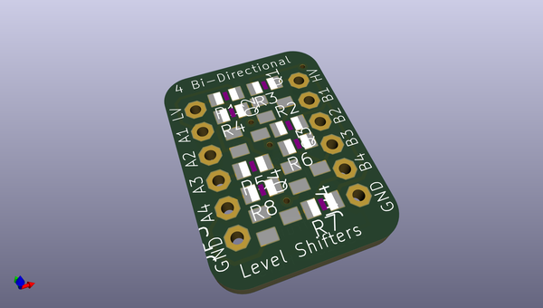
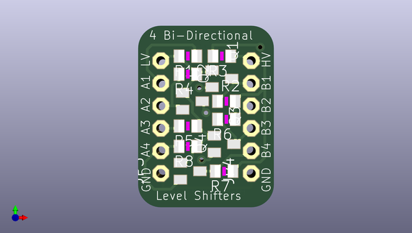
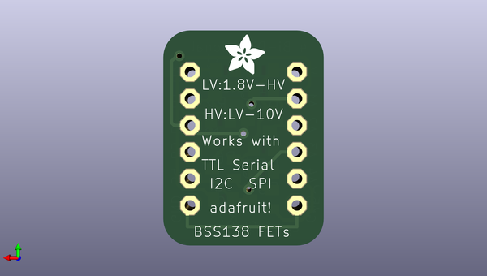

# 4_channel_level_shifter_pcb
 
## summary 
* id: adafruit_4_channel_level_shifter_pcb_adafruit_fet_4_channel_shifter
* user: adafruit
* name: 4_channel_level_shifter_pcb
* board: adafruit_fet_4_channel_shifter
* repo: https://github.com/adafruit/4-Channel-Level-Shifter-PCB

* src_file_repo_sch: 
* src_file_repo_sch_link: https://github.com/adafruit/4-Channel-Level-Shifter-PCB/tree/master/

## schematic  
  
[schematic (pdf)](working_schematic.pdf)  

## pcb  
 
  
  
  
[board (pdf)](working.pdf)  

## working_bom
| Id | Designator | Footprint | Quantity | Designation | Supplier and ref |  | None | 
| --- | --- | --- | --- | --- | --- | --- | --- | 
| 1 | R4,R8,R5,R2,R3,R1,R6,R7 | R0805 | 8 | 10K |  |  | [''] | 
| 2 | Q3,Q1,Q2,Q4 | SOT23 | 4 | BSS138 |  |  | [''] | 
| 3 | JP3,JP4 | 1X06-CLEANBIG | 2 |  |  |  | [''] | 
| 4 | U$1 | ADAFRUIT_3.5MM | 1 |  |  |  | [''] | 

## bom_schematic
no data

## positions
### top
| # Ref | Val | Package | PosX | PosY | Rot | Side | 
| --- | --- | --- | --- | --- | --- | --- | 
| JP3 | nan | 1X06-CLEANBIG | 143.4211 | -105.0671 | 90.0 | top | 
| JP4 | nan | 1X06-CLEANBIG | 153.5811 | -105.0671 | 90.0 | top | 
| Q1 | BSS138 | SOT23 | 150.2791 | -100.7491 | -90.0 | top | 
| Q2 | BSS138 | SOT23 | 146.9771 | -103.2891 | -90.0 | top | 
| Q3 | BSS138 | SOT23 | 150.5331 | -108.1151 | -90.0 | top | 
| Q4 | BSS138 | SOT23 | 146.7231 | -111.1631 | -90.0 | top | 
| R1 | 10K | R0805 | 146.4691 | -98.2091 | 180.0 | top | 
| R2 | 10K | R0805 | 150.7871 | -103.2891 | 0.0 | top | 
| R3 | 10K | R0805 | 150.2791 | -98.2091 | 180.0 | top | 
| R4 | 10K | R0805 | 146.4691 | -100.2411 | 180.0 | top | 
| R5 | 10K | R0805 | 146.4691 | -106.0831 | 180.0 | top | 
| R6 | 10K | R0805 | 150.7871 | -105.3211 | 180.0 | top | 
| R7 | 10K | R0805 | 150.5331 | -111.1631 | 180.0 | top | 
| R8 | 10K | R0805 | 146.4691 | -108.3691 | 180.0 | top | 

### bottom
| # Ref | Val | Package | PosX | PosY | Rot | Side | 
| --- | --- | --- | --- | --- | --- | --- | 
| U$1 | nan | ADAFRUIT_3.5MM | 150.2791 | -98.9711 | 180.0 | bottom | 

