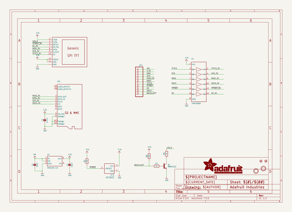
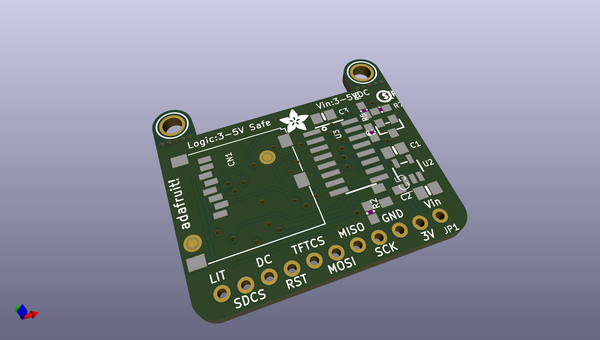
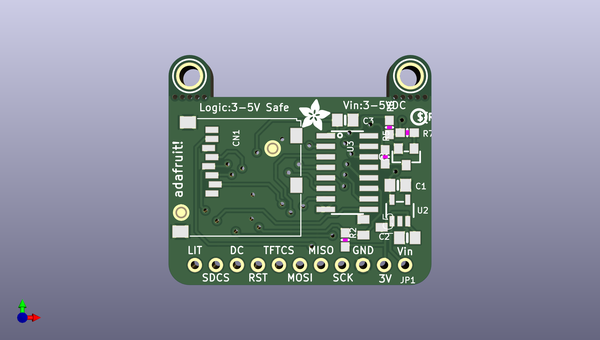
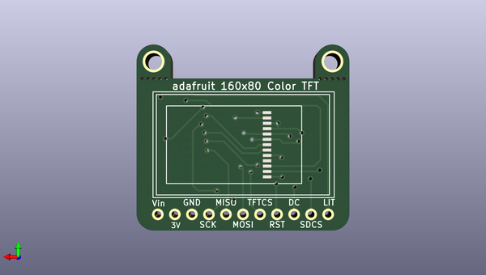

# adafruit_0_96_160x80_tft_display_breakout_pcb
 
## summary 
* id: adafruit_adafruit_0_96_160x80_tft_display_breakout_pcb_adafruit_0_96in_160x80_tft_display
* user: adafruit
* name: adafruit_0_96_160x80_tft_display_breakout_pcb
* board: adafruit_0_96in_160x80_tft_display
* repo: https://github.com/adafruit/Adafruit-0.96-160x80-TFT-Display-Breakout-PCB

* src_file_repo_sch: 
* src_file_repo_sch_link: https://github.com/adafruit/Adafruit-0.96-160x80-TFT-Display-Breakout-PCB/tree/master/

## schematic  
  
[schematic (pdf)](working_schematic.pdf)  

## pcb  
 
  
  
  
[board (pdf)](working.pdf)  

## working_bom
| Id | Designator | Footprint | Quantity | Designation | Supplier and ref |  | None | 
| --- | --- | --- | --- | --- | --- | --- | --- | 
| 1 | @HOLE5,@HOLE9,@HOLE3,@HOLE7,@HOLE8,@HOLE0,@HOLE2,@HOLE4,@HOLE1,@HOLE6 |  | 10 |  |  |  | [''] | 
| 2 | R8,R2 | 0603-NO | 2 | 10K |  |  | [''] | 
| 3 | U$4 | ADAFRUIT_3.5MM | 1 | MICROSD |  |  | [''] | 
| 4 | IC5 | SOT23 | 1 | APX803 |  |  | [''] | 
| 5 | Q1 | SOT23-WIDE | 1 | MMBT2222 |  |  | [''] | 
| 6 | U$6 | PCBFEAT-REV-040 | 1 |  |  |  | [''] | 
| 7 | FID1,FID2 | FIDUCIAL_1MM | 2 | FIDUCIAL_1MM |  |  | [''] | 
| 8 | CN1 | MICROSD | 1 |  |  |  | [''] | 
| 9 | C2,C1 | 0805-NO | 2 | 10µF |  |  | [''] | 
| 10 | U2 | SOT23-5 | 1 | MIC5225-3.3 |  |  | [''] | 
| 11 | U3 | SOIC16 | 1 | 74HC4050D |  |  | [''] | 
| 12 | JP1 | 1X11_ROUND | 1 |  |  |  | [''] | 
| 13 | R5 | 0603-NO | 1 | 22 |  |  | [''] | 
| 14 | C3 | 0805-NO | 1 | 0.1uF |  |  | [''] | 
| 15 | U$9,U$10 | MOUNTINGHOLE_2.5_PLATED | 2 | MOUNTINGHOLE2.5 |  |  | [''] | 
| 16 | R7 | 0603-NO | 1 | 1K |  |  | [''] | 
| 17 | U$2 | TFT_0.96IN_160X80 | 1 | DISP_LCD_0.9IN_160X80 |  |  | [''] | 

## bom_schematic
| Ref | Qnty | Value | Cmp name | Footprint | Description | Vendor | DNP | 
| --- | --- | --- | --- | --- | --- | --- | --- | 
| C1, C2 | 2 | 10µF | CAP_CERAMIC0805-NOOUTLINE | working:0805-NO |  |  |  | 
| C3 | 1 | 0.1uF | CAP_CERAMIC0805-NOOUTLINE | working:0805-NO |  |  |  | 
| CN1 | 1 | MICROSD | MICROSD | working:MICROSD |  |  |  | 
| FID1, FID2 | 2 | FIDUCIAL_1MM | FIDUCIAL_1MM | working:FIDUCIAL_1MM |  |  |  | 
| IC5 | 1 | APX803 | AXP083-SAG | working:SOT23 |  |  |  | 
| JP1 | 1 | HEADER-1X11 | HEADER-1X11 | working:1X11_ROUND |  |  |  | 
| Q1 | 1 | MMBT2222 | TRANSISTOR_NPNWIDE | working:SOT23-WIDE |  |  |  | 
| R2, R8 | 2 | 10K | RESISTOR_0603_NOOUT | working:0603-NO |  |  |  | 
| R5 | 1 | 22 | RESISTOR_0603_NOOUT | working:0603-NO |  |  |  | 
| R7 | 1 | 1K | RESISTOR_0603_NOOUT | working:0603-NO |  |  |  | 
| U2 | 1 | MIC5225-3.3 | VREG_SOT23-5 | working:SOT23-5 |  |  |  | 
| U3 | 1 | 74HC4050D | 74HC4050D | working:SOIC16 |  |  |  | 
| U$2 | 1 | DISP_LCD_0.9IN_160X80 | DISP_LCD_0.9IN_160X80 | working:TFT_0.96IN_160X80 |  |  |  | 
| U$9, U$10 | 2 | MOUNTINGHOLE2.5 | MOUNTINGHOLE2.5 | working:MOUNTINGHOLE_2.5_PLATED |  |  |  | 

## mounting_holes
| x | y | package | value | ref | size | 
| --- | --- | --- | --- | --- | --- | 
| 135.1661 | -93.6371 | MOUNTINGHOLE_2.5_PLATED | MOUNTINGHOLE2.5 | U$9 | m3 | 
| 161.8361 | -93.6371 | MOUNTINGHOLE_2.5_PLATED | MOUNTINGHOLE2.5 | U$10 | m3 | 

## positions
### top
| # Ref | Val | Package | PosX | PosY | Rot | Side | 
| --- | --- | --- | --- | --- | --- | --- | 
| @HOLE0 | nan | nan | 136.9441 | -96.1771 | 0.0 | top | 
| @HOLE1 | nan | nan | 136.0551 | -96.1771 | 0.0 | top | 
| @HOLE2 | nan | nan | 135.1661 | -96.1771 | 0.0 | top | 
| @HOLE3 | nan | nan | 134.2771 | -96.1771 | 0.0 | top | 
| @HOLE4 | nan | nan | 133.3881 | -96.1771 | 0.0 | top | 
| @HOLE5 | nan | nan | 163.6141 | -96.1771 | 0.0 | top | 
| @HOLE6 | nan | nan | 162.7251 | -96.1771 | 0.0 | top | 
| @HOLE7 | nan | nan | 161.8361 | -96.1771 | 0.0 | top | 
| @HOLE8 | nan | nan | 160.9471 | -96.1771 | 0.0 | top | 
| @HOLE9 | nan | nan | 160.0581 | -96.1771 | 0.0 | top | 
| C1 | 10µF | 0805-NO | 160.3121 | -106.8451 | 0.0 | top | 
| C2 | 10µF | 0805-NO | 161.4551 | -113.1951 | 180.0 | top | 
| C3 | 0.1uF | 0805-NO | 153.9621 | -98.9711 | 0.0 | top | 
| CN1 | nan | MICROSD | 148.5011 | -98.8441 | -90.0 | top | 
| FID1 | FIDUCIAL_1MM | FIDUCIAL_1MM | 134.1501 | -110.1471 | 0.0 | top | 
| FID2 | FIDUCIAL_1MM | FIDUCIAL_1MM | 145.1991 | -102.4001 | 0.0 | top | 
| IC5 | APX803 | SOT23 | 157.2641 | -111.9251 | -90.0 | top | 
| JP1 | nan | 1X11_ROUND | 148.5011 | -116.4971 | 180.0 | top | 
| Q1 | MMBT2222 | SOT23-WIDE | 161.3281 | -103.4161 | 180.0 | top | 
| R2 | 10K | 0603-NO | 153.9621 | -113.4491 | -90.0 | top | 
| R5 | 22 | 0603-NO | 158.7881 | -103.4161 | 90.0 | top | 
| R7 | 1K | 0603-NO | 161.4551 | -100.4951 | 0.0 | top | 
| R8 | 10K | 0603-NO | 159.2961 | -99.8601 | 90.0 | top | 
| U$4 | MICROSD | ADAFRUIT_3.5MM | 148.3741 | -100.2411 | 0.0 | top | 
| U$6 | nan | PCBFEAT-REV-040 | 162.8521 | -98.5901 | 0.0 | top | 
| U$9 | MOUNTINGHOLE2.5 | MOUNTINGHOLE_2.5_PLATED | 135.1661 | -93.6371 | 0.0 | top | 
| U$10 | MOUNTINGHOLE2.5 | MOUNTINGHOLE_2.5_PLATED | 161.8361 | -93.6371 | 0.0 | top | 
| U2 | MIC5225-3.3 | SOT23-5 | 160.5661 | -109.8931 | 0.0 | top | 
| U3 | 74HC4050D | SOIC16 | 154.2161 | -105.3211 | -90.0 | top | 

### bottom
| # Ref | Val | Package | PosX | PosY | Rot | Side | 
| --- | --- | --- | --- | --- | --- | --- | 
| U$2 | DISP_LCD_0.9IN_160X80 | TFT_0.96IN_160X80 | 134.9121 | -106.0831 | 90.0 | bottom | 

