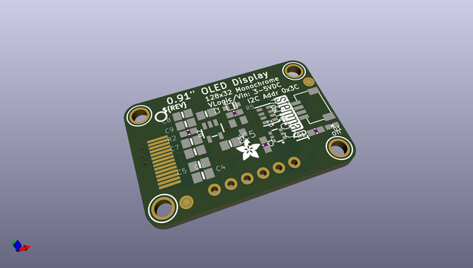

# adafruit_128x32_i2c_oled_breakout_pcb
 
## summary 
* id: adafruit_adafruit_128x32_i2c_oled_breakout_pcb_adafruit_oled_128x32_mono_i2c_stemma_qt_rev_b
* user: adafruit
* name: adafruit_128x32_i2c_oled_breakout_pcb
* board: adafruit_oled_128x32_mono_i2c_stemma_qt_rev_b
* repo: https://github.com/adafruit/Adafruit-128x32-I2C-OLED-Breakout-PCB

* src_file_repo_sch: 
* src_file_repo_sch_link: https://github.com/adafruit/Adafruit-128x32-I2C-OLED-Breakout-PCB/tree/master/

## schematic  
  
[schematic (pdf)](working_schematic.pdf)  

## pcb  
 
  
  
  
[board (pdf)](working.pdf)  

## working_bom
| Id | Designator | Footprint | Quantity | Designation | Supplier and ref |  | None | 
| --- | --- | --- | --- | --- | --- | --- | --- | 
| 1 | FID3,FID4 | FIDUCIAL_1MM | 2 | FIDUCIAL_1MM |  |  | [''] | 
| 2 | R3 | RESPACK_4X0603 | 1 | 10K |  |  | [''] | 
| 3 | C4,C6,C7,C5 | 0805-NO | 4 | 1uF |  |  | [''] | 
| 4 | U$17,U$21,U$19,U$1 | MOUNTINGHOLE_2.5_PLATED | 4 | MOUNTINGHOLE2.5 |  |  | [''] | 
| 5 | R2 | 0603-NO | 1 | 390K |  |  | [''] | 
| 6 | C2,C8,C9,C3 | 0805-NO | 4 | 10uF |  |  | [''] | 
| 7 | R5,R1 | 0603-NO | 2 | 10K |  |  | [''] | 
| 8 | D2 | SOD-323F | 1 | 1N4148 |  |  | [''] | 
| 9 | Q2 | SOT363 | 1 | BSS138 |  |  | [''] | 
| 10 | U$22 | ADAFRUIT_3.5MM | 1 |  |  |  | [''] | 
| 11 | U2 | SOT23-5 | 1 | AP2112K-3.3 |  |  | [''] | 
| 12 | IC5 | SOT23 | 1 | APX803 |  |  | [''] | 
| 13 | U$25 | PCBFEAT-REV-040 | 1 |  |  |  | [''] | 
| 14 | C1 | 0603-NO | 1 | 0.1uF |  |  | [''] | 
| 15 | U$31 | STEMMAQT | 1 |  |  |  | [''] | 
| 16 | CONN4 | JST_SH4 | 1 | STEMMA_I2C_QT |  |  | [''] | 
| 17 | D1 | CHIPLED_0603_NOOUTLINE | 1 | GREEN |  |  | [''] | 
| 18 | JP1 | 1X06_ROUND_70 | 1 |  |  |  | [''] | 
| 19 | LCD1 | UG-2832HSWEG02_WRAPUNDER | 1 |  |  |  | [''] | 

## bom_schematic
| Ref | Qnty | Value | Cmp name | Footprint | Description | Vendor | DNP | 
| --- | --- | --- | --- | --- | --- | --- | --- | 
| C1 | 1 | 0.1uF | CAP_CERAMIC0603_NO | working:0603-NO |  |  |  | 
| C2, C3, C8, C9 | 4 | 10uF | CAP_CERAMIC0805-NOOUTLINE | working:0805-NO |  |  |  | 
| C4, C5, C6, C7 | 4 | 1uF | CAP_CERAMIC0805-NOOUTLINE | working:0805-NO |  |  |  | 
| CONN4 | 1 | STEMMA_I2C_QT | STEMMA_I2C_QT | working:JST_SH4 |  |  |  | 
| D1 | 1 | GREEN | LED0603_NOOUTLINE | working:CHIPLED_0603_NOOUTLINE |  |  |  | 
| D2 | 1 | 1N4148 | DIODESOD-323F | working:SOD-323F |  |  |  | 
| FID3, FID4 | 2 | FIDUCIAL_1MM | FIDUCIAL_1MM | working:FIDUCIAL_1MM |  |  |  | 
| IC5 | 1 | APX803 | AXP083-SAG | working:SOT23 |  |  |  | 
| JP1 | 1 | HEADER-1X670MIL | HEADER-1X670MIL | working:1X06_ROUND_70 |  |  |  | 
| LCD1 | 1 | DISP_OLED_UG-2832HSWEG02 | DISP_OLED_UG-2832HSWEG02 | working:UG-2832HSWEG02_WRAPUNDER |  |  |  | 
| Q2 | 1 | BSS138 | MOSFET-N_DUAL | working:SOT363 |  |  |  | 
| R1, R5 | 2 | 10K | RESISTOR_0603_NOOUT | working:0603-NO |  |  |  | 
| R2 | 1 | 390K | RESISTOR_0603_NOOUT | working:0603-NO |  |  |  | 
| R3 | 1 | 10K | RESISTOR_4PACK | working:RESPACK_4X0603 |  |  |  | 
| U2 | 1 | AP2112K-3.3 | VREG_SOT23-5 | working:SOT23-5 |  |  |  | 
| U$1, U$17, U$19, U$21 | 4 | MOUNTINGHOLE2.5 | MOUNTINGHOLE2.5 | working:MOUNTINGHOLE_2.5_PLATED |  |  |  | 

## mounting_holes
| x | y | package | value | ref | size | 
| --- | --- | --- | --- | --- | --- | 
| 162.4711 | -113.2586 | MOUNTINGHOLE_2.5_PLATED | MOUNTINGHOLE2.5 | U$1 | m3 | 
| 134.5311 | -113.2586 | MOUNTINGHOLE_2.5_PLATED | MOUNTINGHOLE2.5 | U$17 | m3 | 
| 162.4711 | -96.7486 | MOUNTINGHOLE_2.5_PLATED | MOUNTINGHOLE2.5 | U$19 | m3 | 
| 134.5311 | -96.7486 | MOUNTINGHOLE_2.5_PLATED | MOUNTINGHOLE2.5 | U$21 | m3 | 

## positions
### top
| # Ref | Val | Package | PosX | PosY | Rot | Side | 
| --- | --- | --- | --- | --- | --- | --- | 
| C1 | 0.1uF | 0603-NO | 151.9301 | -108.8136 | -90.0 | top | 
| C2 | 10uF | 0805-NO | 144.9451 | -100.1776 | 0.0 | top | 
| C3 | 10uF | 0805-NO | 146.8501 | -106.7816 | 0.0 | top | 
| C4 | 1uF | 0805-NO | 141.2621 | -110.4646 | 0.0 | top | 
| C5 | 1uF | 0805-NO | 141.2621 | -108.5596 | 180.0 | top | 
| C6 | 1uF | 0805-NO | 141.2621 | -106.2736 | 180.0 | top | 
| C7 | 1uF | 0805-NO | 141.2621 | -104.3686 | 180.0 | top | 
| C8 | 10uF | 0805-NO | 141.2621 | -99.0346 | 180.0 | top | 
| C9 | 10uF | 0805-NO | 141.2621 | -100.9396 | 180.0 | top | 
| CONN4 | STEMMA_I2C_QT | JST_SH4 | 162.3441 | -104.7496 | 90.0 | top | 
| D1 | GREEN | CHIPLED_0603_NOOUTLINE | 163.3601 | -109.3216 | 90.0 | top | 
| D2 | 1N4148 | SOD-323F | 149.3901 | -100.1776 | 0.0 | top | 
| FID3 | FIDUCIAL_1MM | FIDUCIAL_1MM | 163.8681 | -99.8601 | 180.0 | top | 
| FID4 | FIDUCIAL_1MM | FIDUCIAL_1MM | 137.8331 | -113.5507 | 180.0 | top | 
| IC5 | APX803 | SOT23 | 149.3901 | -104.4956 | 180.0 | top | 
| Q2 | BSS138 | SOT363 | 154.3431 | -107.9246 | 90.0 | top | 
| R1 | 10K | 0603-NO | 160.4391 | -109.3216 | 180.0 | top | 
| R2 | 390K | 0603-NO | 141.2621 | -102.5906 | 180.0 | top | 
| R3 | 10K | RESPACK_4X0603 | 154.3431 | -103.7336 | -90.0 | top | 
| R5 | 10K | 0603-NO | 149.3901 | -101.7016 | 0.0 | top | 
| U$1 | MOUNTINGHOLE2.5 | MOUNTINGHOLE_2.5_PLATED | 162.4711 | -113.2586 | 180.0 | top | 
| U$17 | MOUNTINGHOLE2.5 | MOUNTINGHOLE_2.5_PLATED | 134.5311 | -113.2586 | 180.0 | top | 
| U$19 | MOUNTINGHOLE2.5 | MOUNTINGHOLE_2.5_PLATED | 162.4711 | -96.7486 | 180.0 | top | 
| U$21 | MOUNTINGHOLE2.5 | MOUNTINGHOLE_2.5_PLATED | 134.5311 | -96.7486 | 180.0 | top | 
| U$22 | nan | ADAFRUIT_3.5MM | 147.3581 | -110.5916 | 0.0 | top | 
| U$25 | nan | PCBFEAT-REV-040 | 137.8331 | -98.1456 | 180.0 | top | 
| U$31 | nan | STEMMAQT | 156.2481 | -101.0666 | -90.0 | top | 
| U2 | AP2112K-3.3 | SOT23-5 | 144.9451 | -103.6066 | 180.0 | top | 

### bottom
| # Ref | Val | Package | PosX | PosY | Rot | Side | 
| --- | --- | --- | --- | --- | --- | --- | 
| JP1 | nan | 1X06_ROUND_70 | 148.5011 | -113.1316 | 0.0 | bottom | 
| LCD1 | nan | UG-2832HSWEG02_WRAPUNDER | 134.2771 | -104.8726 | 180.0 | bottom | 

