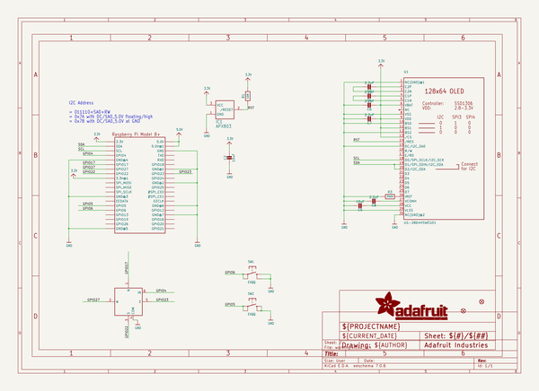
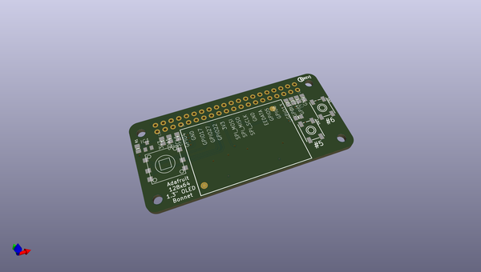
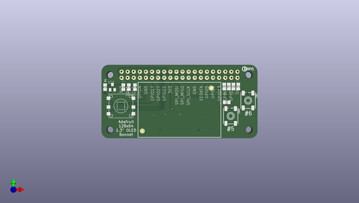
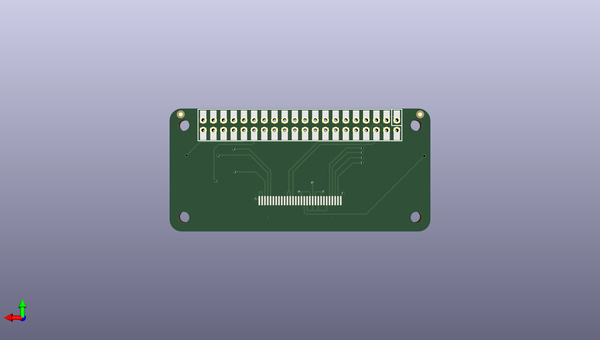

# adafruit_128x64_oled_bonnet_for_raspberry_pi_pcb
 
## summary 
* id: adafruit_adafruit_128x64_oled_bonnet_for_raspberry_pi_pcb_adafruit_128x64_oled_bonnet
* user: adafruit
* name: adafruit_128x64_oled_bonnet_for_raspberry_pi_pcb
* board: adafruit_128x64_oled_bonnet
* repo: https://github.com/adafruit/Adafruit-128x64-OLED-Bonnet-for-Raspberry-Pi-PCB

* src_file_repo_sch: 
* src_file_repo_sch_link: https://github.com/adafruit/Adafruit-128x64-OLED-Bonnet-for-Raspberry-Pi-PCB/tree/master/

## schematic  
  
[schematic (pdf)](working_schematic.pdf)  

## pcb  
 
  
  
  
[board (pdf)](working.pdf)  

## working_bom
| Id | Designator | Footprint | Quantity | Designation | Supplier and ref |  | None | 
| --- | --- | --- | --- | --- | --- | --- | --- | 
| 1 | RPI1 | PI_BONNET_THMSMT | 1 | RASPBERRYPI_BPLUS_BONNET_THMSMT |  |  | [''] | 
| 2 | C4,C3,C6,C7,C8 | 0805-NO | 5 | 2.2uF |  |  | [''] | 
| 3 | U1 | UG-2864HSWEG01_1.3_WRAPAROUND | 1 | UG-2864HSWEG01 |  |  | [''] | 
| 4 | SW1,SW2 | EVQ-Q2_SMALLER | 2 | EVQQ |  |  | [''] | 
| 5 | FID2,FID1 | FIDUCIAL_1MM | 2 | FIDUCIAL_1MM |  |  | [''] | 
| 6 | SW3 | SKQUBAE010 | 1 | NAVSWITCHSKQUABAUE010 |  |  | [''] | 
| 7 | C2,C5 | 0805-NO | 2 | 10uF |  |  | [''] | 
| 8 | IC1 | SOT23 | 1 | APX803 |  |  | [''] | 
| 9 | R3 | 0805-NO | 1 | 390K |  |  | [''] | 
| 10 | U$2 | PCBFEAT-REV-040 | 1 |  |  |  | [''] | 
| 11 | R1 | 0805-NO | 1 | 10K |  |  | [''] | 

## bom_schematic
| Ref | Qnty | Value | Cmp name | Footprint | Description | Vendor | DNP | 
| --- | --- | --- | --- | --- | --- | --- | --- | 
| C2, C5 | 2 | 10uF | CAP_CERAMIC0805-NOOUTLINE | working:0805-NO |  |  |  | 
| C3, C4, C6, C7, C8 | 5 | 2.2uF | CAP_CERAMIC0805-NOOUTLINE | working:0805-NO |  |  |  | 
| FID1, FID2 | 2 | FIDUCIAL_1MM | FIDUCIAL_1MM | working:FIDUCIAL_1MM |  |  |  | 
| IC1 | 1 | APX803 | AXP083-SAG | working:SOT23 |  |  |  | 
| R1 | 1 | 10K | RESISTOR0805_NOOUTLINE | working:0805-NO |  |  |  | 
| R3 | 1 | 390K | RESISTOR0805_NOOUTLINE | working:0805-NO |  |  |  | 
| RPI1 | 1 | RASPBERRYPI_BPLUS_BONNET_THMSMT | RASPBERRYPI_BPLUS_BONNET_THMSMT | working:PI_BONNET_THMSMT |  |  |  | 
| SW1, SW2 | 2 | EVQQ | SWITCH_TACT_SMT_EVQQ2_SMALL | working:EVQ-Q2_SMALLER |  |  |  | 
| SW3 | 1 | NAVSWITCHSKQUABAUE010 | NAVSWITCHSKQUABAUE010 | working:SKQUBAE010 |  |  |  | 
| U1 | 1 | UG-2864HSWEG01 | DISP_OLED_UG-2864HSWEG01 | working:UG-2864HSWEG01_1.3_WRAPAROUND |  |  |  | 

## positions
### top
| # Ref | Val | Package | PosX | PosY | Rot | Side | 
| --- | --- | --- | --- | --- | --- | --- | 
| C2 | 10uF | 0805-NO | 172.9987 | -98.7438 | 90.0 | top | 
| C3 | 2.2uF | 0805-NO | 127.4057 | -98.9978 | -90.0 | top | 
| C4 | 2.2uF | 0805-NO | 129.9457 | -98.9978 | -90.0 | top | 
| C5 | 10uF | 0805-NO | 168.1727 | -105.3478 | 180.0 | top | 
| C6 | 2.2uF | 0805-NO | 125.1197 | -98.9978 | 90.0 | top | 
| C7 | 2.2uF | 0805-NO | 170.9667 | -98.7438 | -90.0 | top | 
| C8 | 2.2uF | 0805-NO | 169.0617 | -98.7438 | -90.0 | top | 
| FID1 | FIDUCIAL_1MM | FIDUCIAL_1MM | 161.6957 | -99.3788 | 0.0 | top | 
| FID2 | FIDUCIAL_1MM | FIDUCIAL_1MM | 132.9965 | -117.3216 | 0.0 | top | 
| IC1 | APX803 | SOT23 | 120.5477 | -98.9978 | 0.0 | top | 
| R1 | 10K | 0805-NO | 117.4997 | -98.9978 | 90.0 | top | 
| R3 | 390K | 0805-NO | 167.1567 | -98.7438 | -90.0 | top | 
| RPI1 | RASPBERRYPI_BPLUS_BONNET_THMSMT | PI_BONNET_THMSMT | 116.0011 | -120.3338 | 0.0 | top | 
| SW1 | EVQQ | EVQ-Q2_SMALLER | 177.0627 | -104.5858 | -90.0 | top | 
| SW2 | EVQQ | EVQ-Q2_SMALLER | 169.8237 | -111.0628 | -90.0 | top | 
| SW3 | NAVSWITCHSKQUABAUE010 | SKQUBAE010 | 124.1037 | -106.8718 | 0.0 | top | 
| U$2 | nan | PCBFEAT-REV-040 | 175.5387 | -91.3778 | 0.0 | top | 
| U1 | UG-2864HSWEG01 | UG-2864HSWEG01_1.3_WRAPAROUND | 148.4877 | -112.4598 | 0.0 | top | 

### bottom
no data
