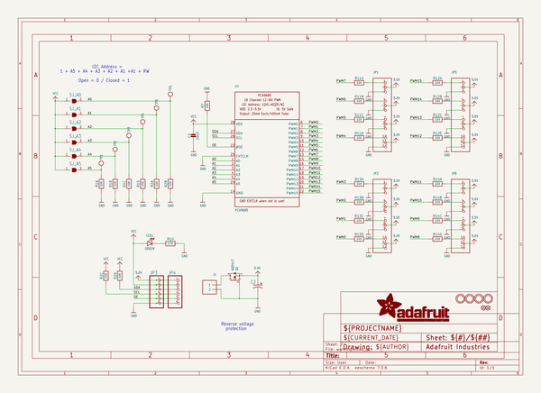
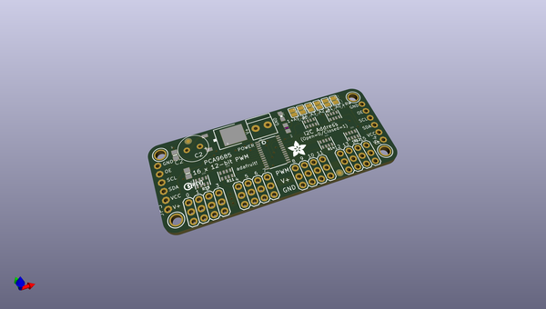
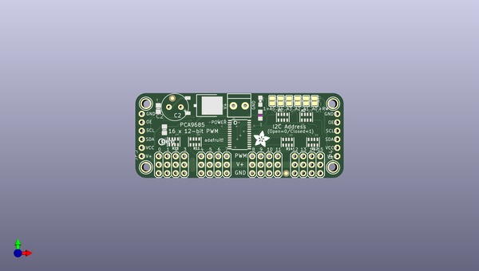
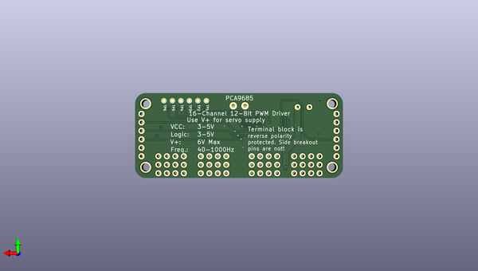

# adafruit_16_channel_pwm_servo_driver_pcb
 
## summary 
* id: adafruit_adafruit_16_channel_pwm_servo_driver_pcb_adafruit_pca9685_rev_c
* user: adafruit
* name: adafruit_16_channel_pwm_servo_driver_pcb
* board: adafruit_pca9685_rev_c
* repo: https://github.com/adafruit/Adafruit-16-Channel-PWM-Servo-Driver-PCB

* src_file_repo_sch: 
* src_file_repo_sch_link: https://github.com/adafruit/Adafruit-16-Channel-PWM-Servo-Driver-PCB/tree/master/

## schematic  
  
[schematic (pdf)](working_schematic.pdf)  

## pcb  
 
  
  
  
[board (pdf)](working.pdf)  

## working_bom
| Id | Designator | Footprint | Quantity | Designation | Supplier and ref |  | None | 
| --- | --- | --- | --- | --- | --- | --- | --- | 
| 1 | R2,R1 | RESPACK_4X0603 | 2 | 10K |  |  | [''] | 
| 2 | R14,R13,R11,R12 | RESPACK_4X0603 | 4 | 220 |  |  | [''] | 
| 3 | JP3,JP4 | 1X06-CLEANBIG | 2 |  |  |  | [''] | 
| 4 | Q1 | TO252 | 1 | AOD417 |  |  | [''] | 
| 5 | SJ_A3,SJ_A4,SJ_A5,SJ_A1,SJ_A0,SJ_A2 | SOLDERJUMPER_REFLOW_NOPASTE | 6 |  |  |  | [''] | 
| 6 | U$51 | ADAFRUIT_5MM | 1 |  |  |  | [''] | 
| 7 | U$47,U$48,U$49,U$50 | MOUNTINGHOLE_2.5_PLATED | 4 | MOUNTINGHOLE2.5 |  |  | [''] | 
| 8 | FID2,FID1 | FIDUCIAL_1MM | 2 | FIDUCIAL" |  |  | [''] | 
| 9 | U$54 | PCBFEAT-REV-040 | 1 |  |  |  | [''] | 
| 10 | JP5,JP2,JP1,JP6 | 3X04 | 4 |  |  |  | [''] | 
| 11 | C1 | 0805-NO | 1 | 10uF |  |  | [''] | 
| 12 | C2 | E3,5-8 | 1 |  |  |  | [''] | 
| 13 | R10 | _0805MP | 1 | 470 |  |  | [''] | 
| 14 | J1 | TERMBLOCK_1X2-3.5MM | 1 |  |  |  | [''] | 
| 15 | R7 | 0805-NO | 1 | 10K |  |  | [''] | 
| 16 | U1 | TSSOP28 | 1 | PCA9685 |  |  | [''] | 
| 17 | LED1 | CHIPLED_0805_NOOUTLINE | 1 | GREEN |  |  | [''] | 
| 18 | TP2,TP4,TP5,TP6,TP3,TP1 | TESTPOINT_ROUND_1MM | 6 |  |  |  | [''] | 

## bom_schematic
| Ref | Qnty | Value | Cmp name | Footprint | Description | Vendor | DNP | 
| --- | --- | --- | --- | --- | --- | --- | --- | 
| C1 | 1 | 10uF | CAP_CERAMIC0805-NOOUTLINE | working:0805-NO |  |  |  | 
| C2 | 1 | CPOL-USE3.5-8 | CPOL-USE3.5-8 | working:E3,5-8 |  |  |  | 
| FID1, FID2 | 2 | FIDUCIAL"" | FIDUCIAL{dblquote}{dblquote} | working:FIDUCIAL_1MM |  |  |  | 
| J1 | 1 | TERMBLOCK_1X2 | TERMBLOCK_1X2 | working:TERMBLOCK_1X2-3.5MM |  |  |  | 
| JP1, JP2, JP5, JP6 | 4 | HEADER-3X04 | HEADER-3X04 | working:3X04 |  |  |  | 
| JP3, JP4 | 2 | PINHD-1X6CB | PINHD-1X6CB | working:1X06-CLEANBIG |  |  |  | 
| LED1 | 1 | GREEN | LED0805_NOOUTLINE | working:CHIPLED_0805_NOOUTLINE |  |  |  | 
| Q1 | 1 | AOD417 | MOSFET-PTO252 | working:TO252 |  |  |  | 
| R1, R2 | 2 | 10K | RESISTOR_4PACK | working:RESPACK_4X0603 |  |  |  | 
| R7 | 1 | 10K | RESISTOR0805_NOOUTLINE | working:0805-NO |  |  |  | 
| R10 | 1 | 470 | RESISTOR_0805MP | working:_0805MP |  |  |  | 
| R11, R12, R13, R14 | 4 | 220 | RESISTOR_4PACK | working:RESPACK_4X0603 |  |  |  | 
| SJ_A0, SJ_A1, SJ_A2, SJ_A3, SJ_A4, SJ_A5 | 6 | SOLDERJUMPERREFLOW_NOPASTE | SOLDERJUMPERREFLOW_NOPASTE | working:SOLDERJUMPER_REFLOW_NOPASTE |  |  |  | 
| TP1, TP2, TP3, TP4, TP5, TP6 | 6 | TESTPOINTROUND1MM | TESTPOINTROUND1MM | working:TESTPOINT_ROUND_1MM |  |  |  | 
| U1 | 1 | PCA9685 | PCA9685 | working:TSSOP28 |  |  |  | 
| U$47, U$48, U$49, U$50 | 4 | MOUNTINGHOLE2.5 | MOUNTINGHOLE2.5 | working:MOUNTINGHOLE_2.5_PLATED |  |  |  | 

## mounting_holes
| x | y | package | value | ref | size | 
| --- | --- | --- | --- | --- | --- | 
| 120.5611 | -95.4786 | MOUNTINGHOLE_2.5_PLATED | MOUNTINGHOLE2.5 | U$47 | m3 | 
| 120.5611 | -114.5286 | MOUNTINGHOLE_2.5_PLATED | MOUNTINGHOLE2.5 | U$48 | m3 | 
| 176.4411 | -95.4786 | MOUNTINGHOLE_2.5_PLATED | MOUNTINGHOLE2.5 | U$49 | m3 | 
| 176.4411 | -114.5286 | MOUNTINGHOLE_2.5_PLATED | MOUNTINGHOLE2.5 | U$50 | m3 | 

## positions
### top
| # Ref | Val | Package | PosX | PosY | Rot | Side | 
| --- | --- | --- | --- | --- | --- | --- | 
| C1 | 10uF | 0805-NO | 126.0696 | -103.2891 | -90.0 | top | 
| C2 | nan | E3,5-8 | 129.1971 | -96.4946 | 180.0 | top | 
| FID1 | FIDUCIAL"" | FIDUCIAL_1MM | 162.4561 | -116.3386 | 0.0 | top | 
| FID2 | FIDUCIAL"" | FIDUCIAL_1MM | 128.4341 | -93.8546 | 0.0 | top | 
| J1 | nan | TERMBLOCK_1X2-3.5MM | 148.5011 | -96.1136 | 180.0 | top | 
| JP1 | nan | 3X04 | 140.8811 | -113.7666 | 180.0 | top | 
| JP2 | nan | 3X04 | 128.1811 | -113.7666 | 180.0 | top | 
| JP3 | nan | 1X06-CLEANBIG | 119.2911 | -104.8766 | 90.0 | top | 
| JP4 | nan | 1X06-CLEANBIG | 177.7111 | -104.8766 | 90.0 | top | 
| JP5 | nan | 3X04 | 168.8211 | -113.7666 | 180.0 | top | 
| JP6 | nan | 3X04 | 156.1211 | -113.7666 | 180.0 | top | 
| LED1 | GREEN | CHIPLED_0805_NOOUTLINE | 154.7241 | -94.7166 | 180.0 | top | 
| Q1 | AOD417 | TO252 | 137.8461 | -96.0486 | -90.0 | top | 
| R1 | 10K | RESPACK_4X0603 | 161.4551 | -99.5426 | 0.0 | top | 
| R2 | 10K | RESPACK_4X0603 | 168.4401 | -99.5426 | 0.0 | top | 
| R7 | 10K | 0805-NO | 124.2441 | -96.9391 | 90.0 | top | 
| R10 | 470 | _0805MP | 154.7241 | -98.9076 | -90.0 | top | 
| R11 | 220 | RESPACK_4X0603 | 135.1661 | -106.9086 | 180.0 | top | 
| R12 | 220 | RESPACK_4X0603 | 170.4721 | -107.0356 | 180.0 | top | 
| R13 | 220 | RESPACK_4X0603 | 128.8161 | -106.9086 | 180.0 | top | 
| R14 | 220 | RESPACK_4X0603 | 162.8521 | -107.0356 | 180.0 | top | 
| SJ_A0 | nan | SOLDERJUMPER_REFLOW_NOPASTE | 170.9801 | -94.6216 | -90.0 | top | 
| SJ_A1 | nan | SOLDERJUMPER_REFLOW_NOPASTE | 168.4401 | -94.6216 | -90.0 | top | 
| SJ_A2 | nan | SOLDERJUMPER_REFLOW_NOPASTE | 165.9001 | -94.6216 | -90.0 | top | 
| SJ_A3 | nan | SOLDERJUMPER_REFLOW_NOPASTE | 163.3601 | -94.6216 | -90.0 | top | 
| SJ_A4 | nan | SOLDERJUMPER_REFLOW_NOPASTE | 160.8201 | -94.6216 | -90.0 | top | 
| SJ_A5 | nan | SOLDERJUMPER_REFLOW_NOPASTE | 158.2801 | -94.6216 | -90.0 | top | 
| U$47 | MOUNTINGHOLE2.5 | MOUNTINGHOLE_2.5_PLATED | 120.5611 | -95.4786 | 0.0 | top | 
| U$48 | MOUNTINGHOLE2.5 | MOUNTINGHOLE_2.5_PLATED | 120.5611 | -114.5286 | 0.0 | top | 
| U$49 | MOUNTINGHOLE2.5 | MOUNTINGHOLE_2.5_PLATED | 176.4411 | -95.4786 | 0.0 | top | 
| U$50 | MOUNTINGHOLE2.5 | MOUNTINGHOLE_2.5_PLATED | 176.4411 | -114.5286 | 0.0 | top | 
| U$51 | nan | ADAFRUIT_5MM | 152.6921 | -108.4326 | 0.0 | top | 
| U$54 | nan | PCBFEAT-REV-040 | 125.2601 | -106.9086 | 0.0 | top | 
| U1 | PCA9685 | TSSOP28 | 148.5011 | -104.7496 | -90.0 | top | 

### bottom
| # Ref | Val | Package | PosX | PosY | Rot | Side | 
| --- | --- | --- | --- | --- | --- | --- | 
| TP1 | nan | TESTPOINT_ROUND_1MM | 158.2801 | -94.5896 | -90.0 | bottom | 
| TP2 | nan | TESTPOINT_ROUND_1MM | 160.8201 | -94.5896 | -90.0 | bottom | 
| TP3 | nan | TESTPOINT_ROUND_1MM | 163.3601 | -94.5896 | -90.0 | bottom | 
| TP4 | nan | TESTPOINT_ROUND_1MM | 165.9001 | -94.5896 | -90.0 | bottom | 
| TP5 | nan | TESTPOINT_ROUND_1MM | 168.4401 | -94.5896 | -90.0 | bottom | 
| TP6 | nan | TESTPOINT_ROUND_1MM | 170.9801 | -94.5896 | -90.0 | bottom | 

