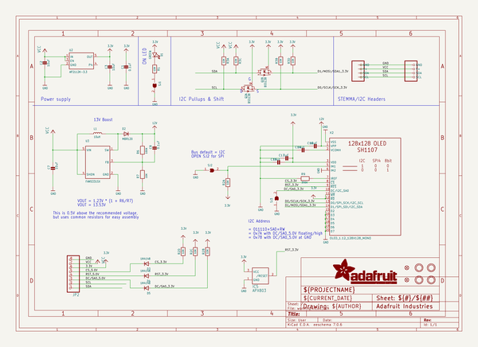
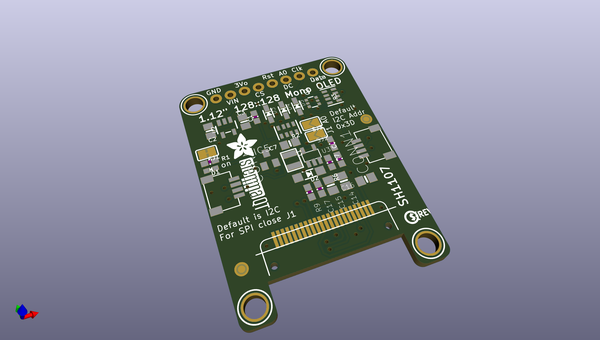
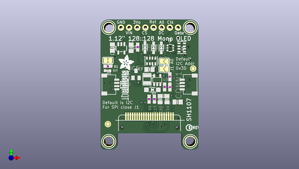
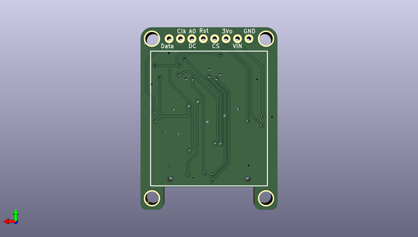

# adafruit_1_12in_128x128_oled_pcb
 
## summary 
* id: adafruit_adafruit_1_12in_128x128_oled_pcb_adafruit_monochrome_1_12in_128x128_oled
* user: adafruit
* name: adafruit_1_12in_128x128_oled_pcb
* board: adafruit_monochrome_1_12in_128x128_oled
* repo: https://github.com/adafruit/Adafruit-1.12in-128x128-OLED-PCB

* src_file_repo_sch: 
* src_file_repo_sch_link: https://github.com/adafruit/Adafruit-1.12in-128x128-OLED-PCB/tree/main/

## schematic  
  
[schematic (pdf)](working_schematic.pdf)  

## pcb  
 
  
  
  
[board (pdf)](working.pdf)  

## working_bom
| Id | Designator | Footprint | Quantity | Designation | Supplier and ref |  | None | 
| --- | --- | --- | --- | --- | --- | --- | --- | 
| 1 | R2,R3 | RESPACK_4X0603 | 2 | 10K |  |  | [''] | 
| 2 | D5,D4,D3 | SOD-323 | 3 | 1N4148 |  |  | [''] | 
| 3 | C14,C3,C15,C16,C2,C7 | 0805-NO | 6 | 10uF |  |  | [''] | 
| 4 | U$25 | PCBFEAT-REV-040 | 1 |  |  |  | [''] | 
| 5 | Q2 | SOT363 | 1 | BSS138 |  |  | [''] | 
| 6 | U$31 | STEMMAQT | 1 |  |  |  | [''] | 
| 7 | D1 | CHIPLED_0603_NOOUTLINE | 1 | GREEN |  |  | [''] | 
| 8 | U$21,U$19,U$1,U$17 | MOUNTINGHOLE_3.0_PLATEDTHIN | 4 | MOUNTINGHOLE3.0THIN |  |  | [''] | 
| 9 | D2 | SOD-123 | 1 | MBR120 |  |  | [''] | 
| 10 | FID4,FID3 | FIDUCIAL_1MM | 2 | FIDUCIAL_1MM |  |  | [''] | 
| 11 | R6 | 0603-NO | 1 | 100K |  |  | [''] | 
| 12 | C17 | 0603-NO | 1 | 1uF |  |  | [''] | 
| 13 | R1,R7 | 0603-NO | 2 | 10K |  |  | [''] | 
| 14 | CONN4,CONN1 | JST_SH4 | 2 | STEMMA_I2C_QT |  |  | [''] | 
| 15 | SJ3,SJ2 | SOLDERJUMPER_ARROW_NOPASTE | 2 |  |  |  | [''] | 
| 16 | JP2 | 1X08_ROUND_76 | 1 |  |  |  | [''] | 
| 17 | R9 | 0603-NO | 1 | 390K |  |  | [''] | 
| 18 | U3 | SOT23-5@1 | 1 | FAN5331SX |  |  | [''] | 
| 19 | L1 | INDUCTOR_1007 | 1 | 10uH |  |  | [''] | 
| 20 | C8,C1 | 0603-NO | 2 | 0.1uF |  |  | [''] | 
| 21 | U$8 | ADAFRUIT_5MM | 1 |  |  |  | [''] | 
| 22 | U2 | SOT23-5 | 1 | AP2112K-3.3 |  |  | [''] | 
| 23 | SJ1 | SOLDERJUMPER_CLOSEDWIRE | 1 |  |  |  | [''] | 
| 24 | IC5 | SOT23 | 1 | APX803 |  |  | [''] | 
| 25 | X2 | OLED_1.12IN_128X128MONO | 1 | OLED_1.12_128X128_MONO |  |  | [''] | 

## bom_schematic
| Ref | Qnty | Value | Cmp name | Footprint | Description | Vendor | DNP | 
| --- | --- | --- | --- | --- | --- | --- | --- | 
| C1, C8 | 2 | 0.1uF | CAP_CERAMIC0603_NO | working:0603-NO |  |  |  | 
| C2, C3, C7, C14, C15, C16 | 6 | 10uF | CAP_CERAMIC0805-NOOUTLINE | working:0805-NO |  |  |  | 
| C17 | 1 | 1uF | CAP_CERAMIC0603_NO | working:0603-NO |  |  |  | 
| CONN1, CONN4 | 2 | STEMMA_I2C_QT | STEMMA_I2C_QT | working:JST_SH4 |  |  |  | 
| D1 | 1 | GREEN | LED0603_NOOUTLINE | working:CHIPLED_0603_NOOUTLINE |  |  |  | 
| D2 | 1 | MBR120 | DIODESOD-123 | working:SOD-123 |  |  |  | 
| D3, D4, D5 | 3 | 1N4148 | DIODESOD-323 | working:SOD-323 |  |  |  | 
| FID3, FID4 | 2 | FIDUCIAL_1MM | FIDUCIAL_1MM | working:FIDUCIAL_1MM |  |  |  | 
| IC5 | 1 | APX803 | AXP083-SAG | working:SOT23 |  |  |  | 
| JP2 | 1 | HEADER-1X876MIL | HEADER-1X876MIL | working:1X08_ROUND_76 |  |  |  | 
| L1 | 1 | 10uH | INDUCTOR | working:INDUCTOR_1007 |  |  |  | 
| Q2 | 1 | BSS138 | MOSFET-N_DUAL | working:SOT363 |  |  |  | 
| R1, R7 | 2 | 10K | RESISTOR_0603_NOOUT | working:0603-NO |  |  |  | 
| R2, R3 | 2 | 10K | RESISTOR_4PACK | working:RESPACK_4X0603 |  |  |  | 
| R6 | 1 | 100K | RESISTOR_0603_NOOUT | working:0603-NO |  |  |  | 
| R9 | 1 | 390K | RESISTOR_0603_NOOUT | working:0603-NO |  |  |  | 
| SJ1 | 1 | SOLDERJUMPERCLOSED | SOLDERJUMPERCLOSED | working:SOLDERJUMPER_CLOSEDWIRE |  |  |  | 
| SJ2, SJ3 | 2 | SOLDERJUMPER | SOLDERJUMPER | working:SOLDERJUMPER_ARROW_NOPASTE |  |  |  | 
| U2 | 1 | AP2112K-3.3 | VREG_SOT23-5 | working:SOT23-5 |  |  |  | 
| U3 | 1 | FAN5331SX | FAN5331 | working:SOT23-5@1 |  |  |  | 
| U$1, U$17, U$19, U$21 | 4 | MOUNTINGHOLE3.0THIN | MOUNTINGHOLE3.0THIN | working:MOUNTINGHOLE_3.0_PLATEDTHIN |  |  |  | 
| X2 | 1 | OLED_1.12_128X128_MONO | OLED_1.12_128X128_MONO | working:OLED_1.12IN_128X128MONO |  |  |  | 

## mounting_holes
| x | y | package | value | ref | size | 
| --- | --- | --- | --- | --- | --- | 
| 135.8011 | -87.2236 | MOUNTINGHOLE_3.0_PLATEDTHIN | MOUNTINGHOLE3.0THIN | U$1 | m3 | 
| 161.2011 | -87.2236 | MOUNTINGHOLE_3.0_PLATEDTHIN | MOUNTINGHOLE3.0THIN | U$17 | m3 | 
| 135.8011 | -122.7836 | MOUNTINGHOLE_3.0_PLATEDTHIN | MOUNTINGHOLE3.0THIN | U$19 | m3 | 
| 161.2011 | -122.7836 | MOUNTINGHOLE_3.0_PLATEDTHIN | MOUNTINGHOLE3.0THIN | U$21 | m3 | 

## positions
### top
| # Ref | Val | Package | PosX | PosY | Rot | Side | 
| --- | --- | --- | --- | --- | --- | --- | 
| C1 | 0.1uF | 0603-NO | 144.8181 | -93.3196 | 90.0 | top | 
| C2 | 10uF | 0805-NO | 136.9441 | -93.4466 | -90.0 | top | 
| C3 | 10uF | 0805-NO | 142.7861 | -93.5736 | 90.0 | top | 
| C7 | 10uF | 0805-NO | 148.5011 | -100.3046 | 180.0 | top | 
| C8 | 0.1uF | 0603-NO | 154.8511 | -105.7656 | 90.0 | top | 
| C14 | 10uF | 0805-NO | 153.9621 | -109.5756 | -90.0 | top | 
| C15 | 10uF | 0805-NO | 151.8031 | -109.5756 | -90.0 | top | 
| C16 | 10uF | 0805-NO | 157.2641 | -110.4646 | 180.0 | top | 
| C17 | 1uF | 0603-NO | 150.0251 | -109.5756 | -90.0 | top | 
| CONN1 | STEMMA_I2C_QT | JST_SH4 | 161.2011 | -105.0036 | 90.0 | top | 
| CONN4 | STEMMA_I2C_QT | JST_SH4 | 135.8011 | -105.0036 | -90.0 | top | 
| D1 | GREEN | CHIPLED_0603_NOOUTLINE | 135.4201 | -100.6856 | 90.0 | top | 
| D2 | MBR120 | SOD-123 | 149.3901 | -106.6546 | 180.0 | top | 
| D3 | 1N4148 | SOD-323 | 147.1041 | -93.4212 | -90.0 | top | 
| D4 | 1N4148 | SOD-323 | 149.7711 | -93.5482 | -90.0 | top | 
| D5 | 1N4148 | SOD-323 | 152.1841 | -93.5482 | -90.0 | top | 
| FID3 | FIDUCIAL_1MM | FIDUCIAL_1MM | 135.5471 | -117.3861 | 0.0 | top | 
| FID4 | FIDUCIAL_1MM | FIDUCIAL_1MM | 162.0901 | -100.0125 | 0.0 | top | 
| IC5 | APX803 | SOT23 | 144.3101 | -101.8286 | 0.0 | top | 
| JP2 | nan | 1X08_ROUND_76 | 148.5011 | -87.2236 | 180.0 | top | 
| L1 | 10uH | INDUCTOR_1007 | 147.7391 | -103.3526 | -90.0 | top | 
| Q2 | BSS138 | SOT363 | 154.9781 | -93.5736 | 90.0 | top | 
| R1 | 10K | 0603-NO | 135.5471 | -99.2886 | 0.0 | top | 
| R2 | 10K | RESPACK_4X0603 | 149.0091 | -97.6376 | 180.0 | top | 
| R3 | 10K | RESPACK_4X0603 | 158.5341 | -93.4466 | 90.0 | top | 
| R6 | 100K | 0603-NO | 153.2001 | -105.7656 | -90.0 | top | 
| R7 | 10K | 0603-NO | 154.8511 | -102.5906 | -90.0 | top | 
| R9 | 390K | 0603-NO | 148.3741 | -109.5756 | -90.0 | top | 
| SJ1 | nan | SOLDERJUMPER_CLOSEDWIRE | 135.5471 | -97.5106 | 180.0 | top | 
| SJ2 | nan | SOLDERJUMPER_ARROW_NOPASTE | 153.0731 | -100.155 | 180.0 | top | 
| SJ3 | nan | SOLDERJUMPER_ARROW_NOPASTE | 153.0731 | -97.7646 | 180.0 | top | 
| U$1 | MOUNTINGHOLE3.0THIN | MOUNTINGHOLE_3.0_PLATEDTHIN | 135.8011 | -87.2236 | 0.0 | top | 
| U$8 | nan | ADAFRUIT_5MM | 138.8491 | -100.5586 | 0.0 | top | 
| U$17 | MOUNTINGHOLE3.0THIN | MOUNTINGHOLE_3.0_PLATEDTHIN | 161.2011 | -87.2236 | 0.0 | top | 
| U$19 | MOUNTINGHOLE3.0THIN | MOUNTINGHOLE_3.0_PLATEDTHIN | 135.8011 | -122.7836 | 0.0 | top | 
| U$21 | MOUNTINGHOLE3.0THIN | MOUNTINGHOLE_3.0_PLATEDTHIN | 161.2011 | -122.7836 | 0.0 | top | 
| U$25 | nan | PCBFEAT-REV-040 | 160.8201 | -118.4656 | 0.0 | top | 
| U$31 | nan | STEMMAQT | 139.3571 | -100.6856 | -90.0 | top | 
| U2 | AP2112K-3.3 | SOT23-5 | 139.7381 | -93.7006 | 180.0 | top | 
| U3 | FAN5331SX | SOT23-5@1 | 150.9141 | -103.6066 | 0.0 | top | 

### bottom
| # Ref | Val | Package | PosX | PosY | Rot | Side | 
| --- | --- | --- | --- | --- | --- | --- | 
| X2 | OLED_1.12_128X128_MONO | OLED_1.12IN_128X128MONO | 148.5011 | -105.0036 | 180.0 | bottom | 

