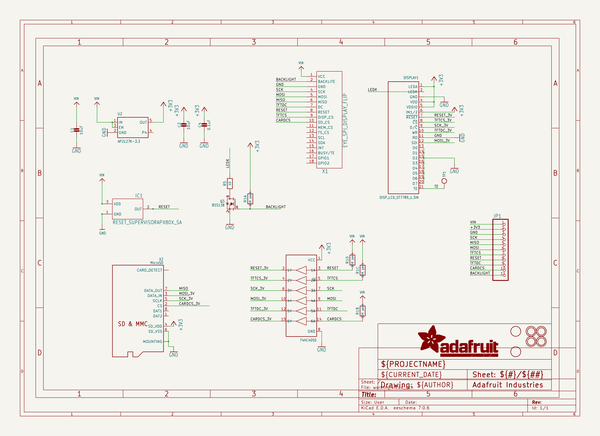
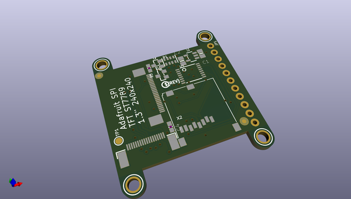
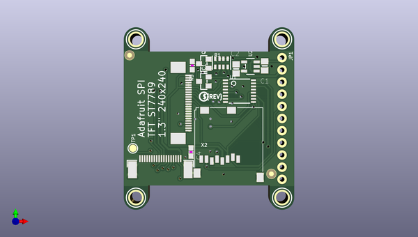
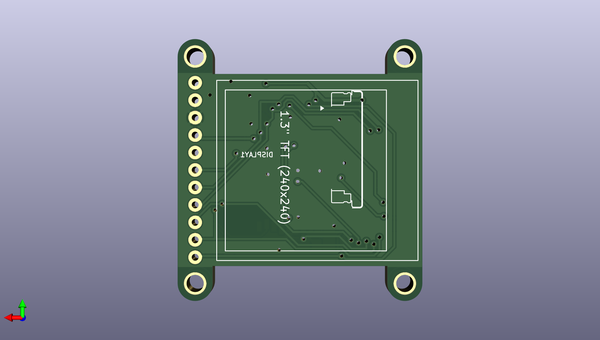

# adafruit_1_3_inch_240x240_tft_pcb
 
## summary 
* id: adafruit_adafruit_1_3_inch_240x240_tft_pcb_adafruit_1_3in_240x240_ips_tft_eyespi
* user: adafruit
* name: adafruit_1_3_inch_240x240_tft_pcb
* board: adafruit_1_3in_240x240_ips_tft_eyespi
* repo: https://github.com/adafruit/Adafruit-1.3-inch-240x240-TFT-PCB

* src_file_repo_sch: 
* src_file_repo_sch_link: https://github.com/adafruit/Adafruit-1.3-inch-240x240-TFT-PCB/tree/master/

## schematic  
  
[schematic (pdf)](working_schematic.pdf)  

## pcb  
 
  
  
  
[board (pdf)](working.pdf)  

## working_bom
| Id | Designator | Footprint | Quantity | Designation | Supplier and ref |  | None | 
| --- | --- | --- | --- | --- | --- | --- | --- | 
| 1 | Q3 | SOT23-WIDE | 1 | BSS138 |  |  | [''] | 
| 2 | U2 | SOT23-5 | 1 | AP2127K-3.3 |  |  | [''] | 
| 3 | U$7,U$10,U$9,U$8 | MOUNTINGHOLE_2.5_PLATED | 4 | MOUNTINGHOLE2.5 |  |  | [''] | 
| 4 | PLABEL1 | PLABEL1 | 1 |  |  |  | [''] | 
| 5 | U$5,U$4 | FIDUCIAL_1MM | 2 | FIDUCIAL |  |  | [''] | 
| 6 | C4 | 0603-NO | 1 | 0.1uF |  |  | [''] | 
| 7 | PLABEL8 | PLABEL8 | 1 |  |  |  | [''] | 
| 8 | DISPLAY1 | TFT_1.3IN_240X240_24P | 1 | DISP_LCD_ST7789_1.3IN |  |  | [''] | 
| 9 | PLABEL5 | PLABEL5 | 1 |  |  |  | [''] | 
| 10 | R1 | RESPACK_4X0603 | 1 | 10K pack |  |  | [''] | 
| 11 | IC1 | SOT23-WIDE | 1 | RESET_SUPERVISORAPX80X_SA |  |  | [''] | 
| 12 | TP1 | TESTPOINT_ROUND_1.5MM | 1 |  |  |  | [''] | 
| 13 | C1,C2 | 0805-NO | 2 | 10uF |  |  | [''] | 
| 14 | PLABEL0 | PLABEL0 | 1 |  |  |  | [''] | 
| 15 | PLABEL11 | PLABEL11 | 1 |  |  |  | [''] | 
| 16 | PLABEL3 | PLABEL3 | 1 |  |  |  | [''] | 
| 17 | X2 | MICROSD | 1 | MicroSD |  |  | [''] | 
| 18 | U1 | TSSOP16 | 1 | 74HC4050 |  |  | [''] | 
| 19 | PLABEL6 | PLABEL6 | 1 |  |  |  | [''] | 
| 20 | PLABEL13 | PLABEL13 | 1 |  |  |  | [''] | 
| 21 | JP1 | 1X11_ROUND_76 | 1 |  |  |  | [''] | 
| 22 | PLABEL9 | PLABEL9 | 1 |  |  |  | [''] | 
| 23 | PLABEL2 | PLABEL2 | 1 |  |  |  | [''] | 
| 24 | PLABEL10 | PLABEL10 | 1 |  |  |  | [''] | 
| 25 | X1 | EYE_SPI_DISPLAY_BOTCONTACT | 1 | EYE_SPI_DISPLAY_FLIP |  |  | [''] | 
| 26 | PLABEL4 | PLABEL4 | 1 |  |  |  | [''] | 
| 27 | PLABEL7 | PLABEL7 | 1 |  |  |  | [''] | 
| 28 | U$2 | PCBFEAT-REV-040 | 1 |  |  |  | [''] | 
| 29 | R5 | 0603-NO | 1 | 10 |  |  | [''] | 
| 30 | PLABEL20 | PLABEL20 | 1 |  |  |  | [''] | 
| 31 | PLABEL16 | PLABEL16 | 1 |  |  |  | [''] | 
| 32 | PLABEL22 | PLABEL22 | 1 |  |  |  | [''] | 
| 33 | PLABEL15 | PLABEL15 | 1 |  |  |  | [''] | 
| 34 | PLABEL19 | PLABEL19 | 1 |  |  |  | [''] | 
| 35 | PLABEL17 | PLABEL17 | 1 |  |  |  | [''] | 
| 36 | PLABEL18 | PLABEL18 | 1 |  |  |  | [''] | 
| 37 | PLABEL14 | PLABEL14 | 1 |  |  |  | [''] | 
| 38 | PLABEL23 | PLABEL23 | 1 |  |  |  | [''] | 
| 39 | PLABEL21 | PLABEL21 | 1 |  |  |  | [''] | 
| 40 | PLABEL24 | PLABEL24 | 1 |  |  |  | [''] | 

## bom_schematic
| Ref | Qnty | Value | Cmp name | Footprint | Description | Vendor | DNP | 
| --- | --- | --- | --- | --- | --- | --- | --- | 
| C1, C2 | 2 | 10uF | CAP_CERAMIC0805-NOOUTLINE | working:0805-NO |  |  |  | 
| C4 | 1 | 0.1uF | CAP_CERAMIC0603_NO | working:0603-NO |  |  |  | 
| DISPLAY1 | 1 | DISP_LCD_ST7789_1.3IN | DISP_LCD_ST7789_1.3IN | working:TFT_1.3IN_240X240_24P |  |  |  | 
| IC1 | 1 | RESET_SUPERVISORAPX80X_SA | RESET_SUPERVISORAPX80X_SA | working:SOT23-WIDE |  |  |  | 
| JP1 | 1 | HEADER-1X1176MIL | HEADER-1X1176MIL | working:1X11_ROUND_76 |  |  |  | 
| Q3 | 1 | BSS138 | MOSFET-NWIDE | working:SOT23-WIDE |  |  |  | 
| R1 | 1 | 10K pack | RESISTOR_4PACK | working:RESPACK_4X0603 |  |  |  | 
| R5 | 1 | 10 | RESISTOR_0603_NOOUT | working:0603-NO |  |  |  | 
| TP1 | 1 | TESTPOINTROUND1.5MM | TESTPOINTROUND1.5MM | working:TESTPOINT_ROUND_1.5MM |  |  |  | 
| U1 | 1 | 74HC4050 | 74HC4050DTSSOP | working:TSSOP16 |  |  |  | 
| U2 | 1 | AP2127K-3.3 | VREG_SOT23-5 | working:SOT23-5 |  |  |  | 
| U$4, U$5 | 2 | FIDUCIAL | FIDUCIAL | working:FIDUCIAL_1MM |  |  |  | 
| U$7, U$8, U$9, U$10 | 4 | MOUNTINGHOLE2.5 | MOUNTINGHOLE2.5 | working:MOUNTINGHOLE_2.5_PLATED |  |  |  | 
| X1 | 1 | EYE_SPI_DISPLAY_FLIP | EYE_SPI_DISPLAY_FLIP | working:EYE_SPI_DISPLAY_BOTCONTACT |  |  |  | 
| X2 | 1 | MicroSD | MICROSD | working:MICROSD |  |  |  | 

## mounting_holes
| x | y | package | value | ref | size | 
| --- | --- | --- | --- | --- | --- | 
| 133.2611 | -88.4936 | MOUNTINGHOLE_2.5_PLATED | MOUNTINGHOLE2.5 | U$7 | m3 | 
| 133.2611 | -121.5136 | MOUNTINGHOLE_2.5_PLATED | MOUNTINGHOLE2.5 | U$8 | m3 | 
| 163.7411 | -88.4936 | MOUNTINGHOLE_2.5_PLATED | MOUNTINGHOLE2.5 | U$9 | m3 | 
| 163.7411 | -121.5136 | MOUNTINGHOLE_2.5_PLATED | MOUNTINGHOLE2.5 | U$10 | m3 | 

## positions
### top
| # Ref | Val | Package | PosX | PosY | Rot | Side | 
| --- | --- | --- | --- | --- | --- | --- | 
| C1 | 10uF | 0805-NO | 160.1216 | -94.0181 | -90.0 | top | 
| C2 | 10uF | 0805-NO | 154.1526 | -94.6531 | 90.0 | top | 
| C4 | 0.1uF | 0603-NO | 144.7546 | -111.9886 | -90.0 | top | 
| DISPLAY1 | DISP_LCD_ST7789_1.3IN | TFT_1.3IN_240X240_24P | 143.6116 | -101.7651 | -90.0 | top | 
| IC1 | RESET_SUPERVISORAPX80X_SA | SOT23-WIDE | 147.4216 | -97.2566 | 90.0 | top | 
| JP1 | nan | 1X11_ROUND_76 | 163.7411 | -105.0036 | -90.0 | top | 
| PLABEL0 | nan | PLABEL0 | 160.5026 | -92.3036 | 0.0 | top | 
| PLABEL1 | nan | PLABEL1 | 160.0581 | -110.5281 | 0.0 | top | 
| PLABEL2 | nan | PLABEL2 | 159.8041 | -113.1951 | 0.0 | top | 
| PLABEL3 | nan | PLABEL3 | 159.9946 | -115.4811 | 0.0 | top | 
| PLABEL4 | nan | PLABEL4 | 159.9311 | -108.0516 | 0.0 | top | 
| PLABEL5 | nan | PLABEL5 | 162.4711 | -106.5911 | 90.0 | top | 
| PLABEL6 | nan | PLABEL6 | 159.9311 | -100.3681 | 0.0 | top | 
| PLABEL7 | nan | PLABEL7 | 159.9946 | -102.9716 | 0.0 | top | 
| PLABEL8 | nan | PLABEL8 | 160.6296 | -118.6561 | 0.0 | top | 
| PLABEL9 | nan | PLABEL9 | 159.6771 | -97.8281 | 0.0 | top | 
| PLABEL10 | nan | PLABEL10 | 162.4711 | -96.1136 | 90.0 | top | 
| PLABEL11 | nan | PLABEL11 | 132.3721 | -112.9411 | 0.0 | top | 
| PLABEL13 | nan | PLABEL13 | 136.6901 | -111.6711 | 0.0 | top | 
| Q3 | BSS138 | SOT23-WIDE | 147.4216 | -93.5736 | 90.0 | top | 
| R1 | 10K_pack | RESPACK_4X0603 | 151.1046 | -93.3831 | 0.0 | top | 
| R5 | 10 | 0603-NO | 145.0086 | -93.9546 | -90.0 | top | 
| TP1 | nan | TESTPOINT_ROUND_1.5MM | 132.6261 | -111.2266 | 90.0 | top | 
| U$2 | nan | PCBFEAT-REV-040 | 147.4216 | -100.4316 | 0.0 | top | 
| U$4 | FIDUCIAL | FIDUCIAL_1MM | 131.9276 | -91.7956 | 0.0 | top | 
| U$5 | FIDUCIAL | FIDUCIAL_1MM | 161.5186 | -116.5606 | 0.0 | top | 
| U$7 | MOUNTINGHOLE2.5 | MOUNTINGHOLE_2.5_PLATED | 133.2611 | -88.4936 | 0.0 | top | 
| U$8 | MOUNTINGHOLE2.5 | MOUNTINGHOLE_2.5_PLATED | 133.2611 | -121.5136 | 0.0 | top | 
| U$9 | MOUNTINGHOLE2.5 | MOUNTINGHOLE_2.5_PLATED | 163.7411 | -88.4936 | 0.0 | top | 
| U$10 | MOUNTINGHOLE2.5 | MOUNTINGHOLE_2.5_PLATED | 163.7411 | -121.5136 | 0.0 | top | 
| U1 | 74HC4050 | TSSOP16 | 154.8511 | -99.2886 | -90.0 | top | 
| U2 | AP2127K-3.3 | SOT23-5 | 157.1371 | -94.1451 | 90.0 | top | 
| X1 | EYE_SPI_DISPLAY_FLIP | EYE_SPI_DISPLAY_BOTCONTACT | 138.3411 | -114.5286 | 0.0 | top | 
| X2 | MicroSD | MICROSD | 152.8191 | -110.3376 | 0.0 | top | 

### bottom
| # Ref | Val | Package | PosX | PosY | Rot | Side | 
| --- | --- | --- | --- | --- | --- | --- | 
| PLABEL14 | nan | PLABEL14 | 165.4556 | -93.5736 | 90.0 | bottom | 
| PLABEL15 | nan | PLABEL15 | 162.2806 | -96.1771 | 90.0 | bottom | 
| PLABEL16 | nan | PLABEL16 | 165.4556 | -99.0346 | 90.0 | bottom | 
| PLABEL17 | nan | PLABEL17 | 162.0266 | -101.4476 | 90.0 | bottom | 
| PLABEL18 | nan | PLABEL18 | 165.4556 | -103.4161 | 90.0 | bottom | 
| PLABEL19 | nan | PLABEL19 | 161.9631 | -105.6386 | 90.0 | bottom | 
| PLABEL20 | nan | PLABEL20 | 165.4556 | -108.9406 | 90.0 | bottom | 
| PLABEL21 | nan | PLABEL21 | 162.0266 | -111.3536 | 90.0 | bottom | 
| PLABEL22 | nan | PLABEL22 | 165.5826 | -113.9571 | 90.0 | bottom | 
| PLABEL23 | nan | PLABEL23 | 161.8361 | -116.7511 | 90.0 | bottom | 
| PLABEL24 | nan | PLABEL24 | 165.5191 | -119.1006 | 90.0 | bottom | 

