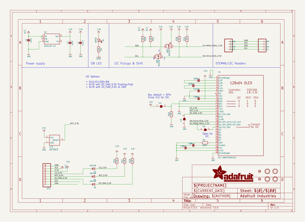
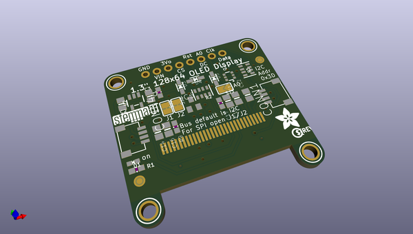
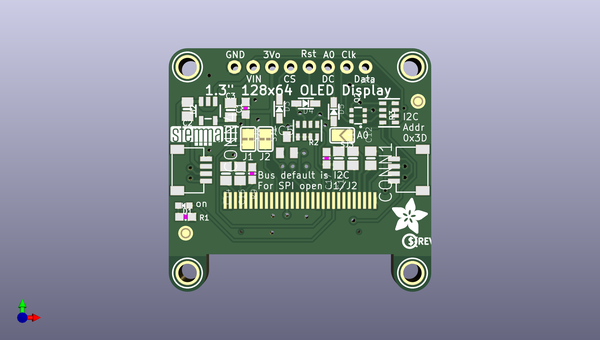
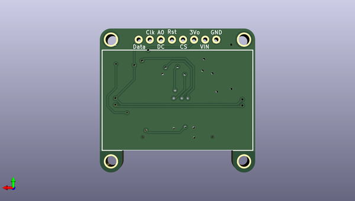

# adafruit_1_3inch_128x64_mono_oled_pcb
 
## summary 
* id: adafruit_adafruit_1_3inch_128x64_mono_oled_pcb_adafruit_1_3in_128x64_oled_stemma_qt
* user: adafruit
* name: adafruit_1_3inch_128x64_mono_oled_pcb
* board: adafruit_1_3in_128x64_oled_stemma_qt
* repo: https://github.com/adafruit/Adafruit-1.3inch-128x64-Mono-OLED-PCB

* src_file_repo_sch: 
* src_file_repo_sch_link: https://github.com/adafruit/Adafruit-1.3inch-128x64-Mono-OLED-PCB/tree/master/

## schematic  
  
[schematic (pdf)](working_schematic.pdf)  

## pcb  
 
  
  
  
[board (pdf)](working.pdf)  

## working_bom
| Id | Designator | Footprint | Quantity | Designation | Supplier and ref |  | None | 
| --- | --- | --- | --- | --- | --- | --- | --- | 
| 1 | U$31 | STEMMAQT | 1 |  |  |  | [''] | 
| 2 | C14,C15,C3,C2,C16 | 0805-NO | 5 | 10uF |  |  | [''] | 
| 3 | U$17,U$21,U$1,U$19 | MOUNTINGHOLE_2.5_PLATED | 4 | MOUNTINGHOLE2.5 |  |  | [''] | 
| 4 | C13,C12 | 0805-NO | 2 | 2.2uF |  |  | [''] | 
| 5 | SJ1,SJ2 | SOLDERJUMPER_CLOSEDWIRE | 2 |  |  |  | [''] | 
| 6 | U$25 | PCBFEAT-REV-040 | 1 |  |  |  | [''] | 
| 7 | IC5 | SOT23 | 1 | APX803 |  |  | [''] | 
| 8 | U$8 | ADAFRUIT_5MM | 1 |  |  |  | [''] | 
| 9 | D4,D3,D5 | SOD-323 | 3 | 1N4148 |  |  | [''] | 
| 10 | R3,R2 | RESPACK_4X0603 | 2 | 10K |  |  | [''] | 
| 11 | R1 | 0603-NO | 1 | 10K |  |  | [''] | 
| 12 | R9 | 0603-NO | 1 | 390K |  |  | [''] | 
| 13 | C17 | 0603-NO | 1 | 1uF |  |  | [''] | 
| 14 | D1 | CHIPLED_0603_NOOUTLINE | 1 | GREEN |  |  | [''] | 
| 15 | C1 | 0603-NO | 1 | 0.1uF |  |  | [''] | 
| 16 | CONN1,CONN4 | JST_SH4 | 2 | STEMMA_I2C_QT |  |  | [''] | 
| 17 | SJ3 | SOLDERJUMPER_ARROW_NOPASTE | 1 |  |  |  | [''] | 
| 18 | Q2 | SOT363 | 1 | BSS138 |  |  | [''] | 
| 19 | U2 | SOT23-5 | 1 | AP2112K-3.3 |  |  | [''] | 
| 20 | FID3,FID4 | FIDUCIAL_1MM | 2 | FIDUCIAL_1MM |  |  | [''] | 
| 21 | JP2 | 1X08_ROUND_70 | 1 |  |  |  | [''] | 
| 22 | U1 | UG-2864HSWEG01_1.3_WRAPAROUND | 1 | UG-2864HSWEG01 |  |  | [''] | 

## bom_schematic
| Ref | Qnty | Value | Cmp name | Footprint | Description | Vendor | DNP | 
| --- | --- | --- | --- | --- | --- | --- | --- | 
| C1 | 1 | 0.1uF | CAP_CERAMIC0603_NO | working:0603-NO |  |  |  | 
| C2, C3, C14, C15, C16 | 5 | 10uF | CAP_CERAMIC0805-NOOUTLINE | working:0805-NO |  |  |  | 
| C12, C13 | 2 | 2.2uF | CAP_CERAMIC0805-NOOUTLINE | working:0805-NO |  |  |  | 
| C17 | 1 | 1uF | CAP_CERAMIC0603_NO | working:0603-NO |  |  |  | 
| CONN1, CONN4 | 2 | STEMMA_I2C_QT | STEMMA_I2C_QT | working:JST_SH4 |  |  |  | 
| D1 | 1 | GREEN | LED0603_NOOUTLINE | working:CHIPLED_0603_NOOUTLINE |  |  |  | 
| D3, D4, D5 | 3 | 1N4148 | DIODESOD-323 | working:SOD-323 |  |  |  | 
| FID3, FID4 | 2 | FIDUCIAL_1MM | FIDUCIAL_1MM | working:FIDUCIAL_1MM |  |  |  | 
| IC5 | 1 | APX803 | AXP083-SAG | working:SOT23 |  |  |  | 
| JP2 | 1 | HEADER-1X870MIL | HEADER-1X870MIL | working:1X08_ROUND_70 |  |  |  | 
| Q2 | 1 | BSS138 | MOSFET-N_DUAL | working:SOT363 |  |  |  | 
| R1 | 1 | 10K | RESISTOR_0603_NOOUT | working:0603-NO |  |  |  | 
| R2, R3 | 2 | 10K | RESISTOR_4PACK | working:RESPACK_4X0603 |  |  |  | 
| R9 | 1 | 390K | RESISTOR_0603_NOOUT | working:0603-NO |  |  |  | 
| SJ1, SJ2 | 2 | SOLDERJUMPERCLOSED | SOLDERJUMPERCLOSED | working:SOLDERJUMPER_CLOSEDWIRE |  |  |  | 
| SJ3 | 1 | SOLDERJUMPER | SOLDERJUMPER | working:SOLDERJUMPER_ARROW_NOPASTE |  |  |  | 
| U1 | 1 | UG-2864HSWEG01 | DISP_OLED_UG-2864HSWEG01 | working:UG-2864HSWEG01_1.3_WRAPAROUND |  |  |  | 
| U2 | 1 | AP2112K-3.3 | VREG_SOT23-5 | working:SOT23-5 |  |  |  | 
| U$1, U$17, U$19, U$21 | 4 | MOUNTINGHOLE2.5 | MOUNTINGHOLE2.5 | working:MOUNTINGHOLE_2.5_PLATED |  |  |  | 

## mounting_holes
| x | y | package | value | ref | size | 
| --- | --- | --- | --- | --- | --- | 
| 133.2611 | -91.0336 | MOUNTINGHOLE_2.5_PLATED | MOUNTINGHOLE2.5 | U$1 | m3 | 
| 163.7411 | -91.0336 | MOUNTINGHOLE_2.5_PLATED | MOUNTINGHOLE2.5 | U$17 | m3 | 
| 133.2611 | -118.9736 | MOUNTINGHOLE_2.5_PLATED | MOUNTINGHOLE2.5 | U$19 | m3 | 
| 163.7411 | -118.9736 | MOUNTINGHOLE_2.5_PLATED | MOUNTINGHOLE2.5 | U$21 | m3 | 

## positions
### top
| # Ref | Val | Package | PosX | PosY | Rot | Side | 
| --- | --- | --- | --- | --- | --- | --- | 
| C1 | 0.1uF | 0603-NO | 141.1351 | -96.6216 | 90.0 | top | 
| C2 | 10uF | 0805-NO | 133.2611 | -96.7486 | -90.0 | top | 
| C3 | 10uF | 0805-NO | 139.1031 | -96.8756 | 90.0 | top | 
| C12 | 2.2uF | 0805-NO | 158.0825 | -103.4136 | 90.0 | top | 
| C13 | 2.2uF | 0805-NO | 155.6695 | -103.4136 | 90.0 | top | 
| C14 | 10uF | 0805-NO | 138.4681 | -105.4862 | -90.0 | top | 
| C15 | 10uF | 0805-NO | 153.7565 | -103.4136 | -90.0 | top | 
| C16 | 10uF | 0805-NO | 140.3731 | -105.4862 | -90.0 | top | 
| C17 | 1uF | 0603-NO | 152.1055 | -103.4136 | -90.0 | top | 
| CONN1 | STEMMA_I2C_QT | JST_SH4 | 163.7411 | -105.0036 | 90.0 | top | 
| CONN4 | STEMMA_I2C_QT | JST_SH4 | 133.2611 | -105.0036 | -90.0 | top | 
| D1 | GREEN | CHIPLED_0603_NOOUTLINE | 132.7531 | -109.8296 | 90.0 | top | 
| D3 | 1N4148 | SOD-323 | 145.7071 | -96.7232 | -90.0 | top | 
| D4 | 1N4148 | SOD-323 | 149.2885 | -95.9866 | 180.0 | top | 
| D5 | 1N4148 | SOD-323 | 153.0731 | -97.1042 | -90.0 | top | 
| FID3 | FIDUCIAL_1MM | FIDUCIAL_1MM | 133.0071 | -113.5761 | 0.0 | top | 
| FID4 | FIDUCIAL_1MM | FIDUCIAL_1MM | 164.5031 | -95.6945 | 0.0 | top | 
| IC5 | APX803 | SOT23 | 146.7231 | -101.5746 | 0.0 | top | 
| JP2 | nan | 1X08_ROUND_70 | 148.5011 | -91.0336 | 180.0 | top | 
| Q2 | BSS138 | SOT363 | 156.3751 | -97.6376 | 90.0 | top | 
| R1 | 10K | 0603-NO | 133.0071 | -111.3536 | 0.0 | top | 
| R2 | 10K | RESPACK_4X0603 | 149.5171 | -99.6696 | 180.0 | top | 
| R3 | 10K | RESPACK_4X0603 | 160.5661 | -97.2566 | 90.0 | top | 
| R9 | 390K | 0603-NO | 142.0241 | -105.4862 | -90.0 | top | 
| SJ1 | nan | SOLDERJUMPER_CLOSEDWIRE | 143.8087 | -100.8126 | -90.0 | top | 
| SJ2 | nan | SOLDERJUMPER_CLOSEDWIRE | 141.4935 | -100.8126 | -90.0 | top | 
| SJ3 | nan | SOLDERJUMPER_ARROW_NOPASTE | 154.2161 | -100.3046 | 180.0 | top | 
| U$1 | MOUNTINGHOLE2.5 | MOUNTINGHOLE_2.5_PLATED | 133.2611 | -91.0336 | 0.0 | top | 
| U$8 | nan | ADAFRUIT_5MM | 160.9471 | -113.6396 | 0.0 | top | 
| U$17 | MOUNTINGHOLE2.5 | MOUNTINGHOLE_2.5_PLATED | 163.7411 | -91.0336 | 0.0 | top | 
| U$19 | MOUNTINGHOLE2.5 | MOUNTINGHOLE_2.5_PLATED | 133.2611 | -118.9736 | 0.0 | top | 
| U$21 | MOUNTINGHOLE2.5 | MOUNTINGHOLE_2.5_PLATED | 163.7411 | -118.9736 | 0.0 | top | 
| U$25 | nan | PCBFEAT-REV-040 | 163.3601 | -114.6556 | 0.0 | top | 
| U$31 | nan | STEMMAQT | 130.9751 | -101.7016 | 0.0 | top | 
| U2 | AP2112K-3.3 | SOT23-5 | 136.0551 | -97.0026 | 180.0 | top | 

### bottom
| # Ref | Val | Package | PosX | PosY | Rot | Side | 
| --- | --- | --- | --- | --- | --- | --- | 
| U1 | UG-2864HSWEG01 | UG-2864HSWEG01_1.3_WRAPAROUND | 148.5011 | -108.9406 | 180.0 | bottom | 

