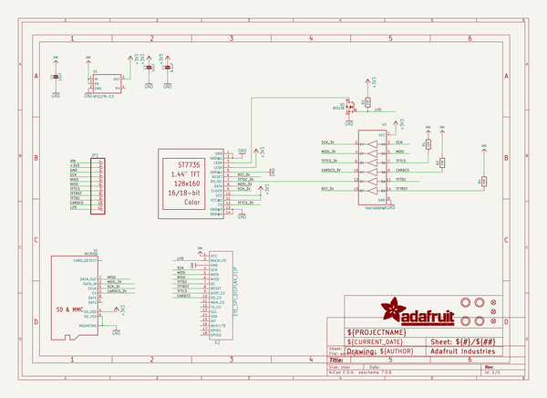
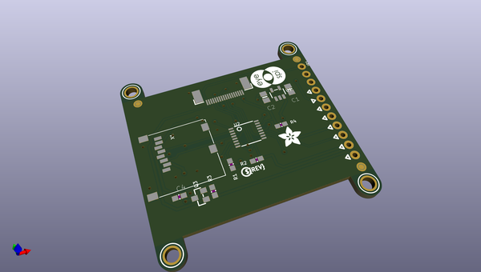
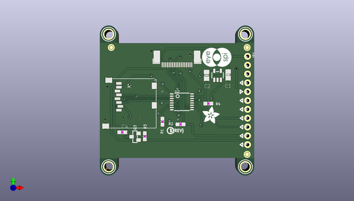
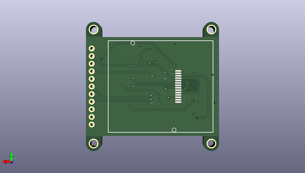

# adafruit_1_44_tft_breakout_pcb
 
## summary 
* id: adafruit_adafruit_1_44_tft_breakout_pcb_adafruit_tft144_breakout_rev_b
* user: adafruit
* name: adafruit_1_44_tft_breakout_pcb
* board: adafruit_tft144_breakout_rev_b
* repo: https://github.com/adafruit/Adafruit-1.44-TFT-Breakout-PCB

* src_file_repo_sch: 
* src_file_repo_sch_link: https://github.com/adafruit/Adafruit-1.44-TFT-Breakout-PCB/tree/master/

## schematic  
  
[schematic (pdf)](working_schematic.pdf)  

## pcb  
 
  
  
  
[board (pdf)](working.pdf)  

## working_bom
| Id | Designator | Footprint | Quantity | Designation | Supplier and ref |  | None | 
| --- | --- | --- | --- | --- | --- | --- | --- | 
| 1 | PLABEL1 | PLABEL1 | 1 |  |  |  | [''] | 
| 2 | U$9,U$8,U$10,U$7 | MOUNTINGHOLE_2.5_PLATED | 4 | MOUNTINGHOLE2.5 |  |  | [''] | 
| 3 | U$4,U$5,U$3 | FIDUCIAL_1MM | 3 | FIDUCIAL_1MM |  |  | [''] | 
| 4 | PLABEL7 | PLABEL7 | 1 |  |  |  | [''] | 
| 5 | PLABEL8 | PLABEL8 | 1 |  |  |  | [''] | 
| 6 | X1 | MICROSD | 1 | MICROSD |  |  | [''] | 
| 7 | C2,C1 | 0805-NO | 2 | 10uF |  |  | [''] | 
| 8 | PLABEL5 | PLABEL5 | 1 |  |  |  | [''] | 
| 9 | R4,R2,R3,R1 | 0603-NO | 4 | 10K |  |  | [''] | 
| 10 | PLABEL6 | PLABEL6 | 1 |  |  |  | [''] | 
| 11 | U$2 | PCBFEAT-REV-040 | 1 |  |  |  | [''] | 
| 12 | PLABEL3 | PLABEL3 | 1 |  |  |  | [''] | 
| 13 | U$17 | EYESPI_MINI_LOGO | 1 |  |  |  | [''] | 
| 14 | PLABEL4 | PLABEL4 | 1 |  |  |  | [''] | 
| 15 | Q3 | SOT23-WIDE | 1 | BSS138 |  |  | [''] | 
| 16 | PLABEL12 | PLABEL12 | 1 |  |  |  | [''] | 
| 17 | PLABEL10 | PLABEL10 | 1 |  |  |  | [''] | 
| 18 | PLABEL13 | PLABEL13 | 1 |  |  |  | [''] | 
| 19 | PLABEL2 | PLABEL2 | 1 |  |  |  | [''] | 
| 20 | C4 | 0603-NO | 1 | 0.1uF |  |  | [''] | 
| 21 | PLABEL0 | PLABEL0 | 1 |  |  |  | [''] | 
| 22 | X2 | EYE_SPI_DISPLAY_BOTCONTACT | 1 | EYE_SPI_DISPLAY_FLIP |  |  | [''] | 
| 23 | PLABEL9 | PLABEL9 | 1 |  |  |  | [''] | 
| 24 | PLABEL11 | PLABEL11 | 1 |  |  |  | [''] | 
| 25 | PLABEL14 | PLABEL14 | 1 |  |  |  | [''] | 
| 26 | JP1 | 1X11_ROUND_76 | 1 |  |  |  | [''] | 
| 27 | U2 | TSSOP16 | 1 | 74HC4050PWR |  |  | [''] | 
| 28 | U$1 | ADAFRUIT_5MM | 1 |  |  |  | [''] | 
| 29 | U1 | SOT23-5 | 1 | AP2127K-3.3 |  |  | [''] | 
| 30 | PLABEL15 | PLABEL15 | 1 |  |  |  | [''] | 
| 31 | PLABEL26 | PLABEL26 | 1 |  |  |  | [''] | 
| 32 | PLABEL19 | PLABEL19 | 1 |  |  |  | [''] | 
| 33 | PLABEL24 | PLABEL24 | 1 |  |  |  | [''] | 
| 34 | PLABEL17 | PLABEL17 | 1 |  |  |  | [''] | 
| 35 | PLABEL16 | PLABEL16 | 1 |  |  |  | [''] | 
| 36 | TFT2 | TFT_1.44IN_128_128 | 1 | DISP_LCD_ST7735_1.44IN |  |  | [''] | 
| 37 | PLABEL18 | PLABEL18 | 1 |  |  |  | [''] | 
| 38 | PLABEL22 | PLABEL22 | 1 |  |  |  | [''] | 
| 39 | PLABEL20 | PLABEL20 | 1 |  |  |  | [''] | 
| 40 | PLABEL25 | PLABEL25 | 1 |  |  |  | [''] | 
| 41 | PLABEL23 | PLABEL23 | 1 |  |  |  | [''] | 
| 42 | PLABEL21 | PLABEL21 | 1 |  |  |  | [''] | 

## bom_schematic
| Ref | Qnty | Value | Cmp name | Footprint | Description | Vendor | DNP | 
| --- | --- | --- | --- | --- | --- | --- | --- | 
| C1, C2 | 2 | 10uF | CAP_CERAMIC0805-NOOUTLINE | working:0805-NO |  |  |  | 
| C4 | 1 | 0.1uF | CAP_CERAMIC0603_NO | working:0603-NO |  |  |  | 
| JP1 | 1 | HEADER-1X1176MIL | HEADER-1X1176MIL | working:1X11_ROUND_76 |  |  |  | 
| Q3 | 1 | BSS138 | MOSFET-NWIDE | working:SOT23-WIDE |  |  |  | 
| R1, R2, R3, R4 | 4 | 10K | RESISTOR_0603_NOOUT | working:0603-NO |  |  |  | 
| TFT2 | 1 | DISP_LCD_ST7735_1.44IN | DISP_LCD_ST7735_1.44IN | working:TFT_1.44IN_128_128 |  |  |  | 
| U1 | 1 | AP2127K-3.3 | VREG_SOT23-5 | working:SOT23-5 |  |  |  | 
| U2 | 1 | 74HC4050PWR | 74HC4050DTSSOP | working:TSSOP16 |  |  |  | 
| U$3, U$4, U$5 | 3 | FIDUCIAL_1MM | FIDUCIAL_1MM | working:FIDUCIAL_1MM |  |  |  | 
| U$7, U$8, U$9, U$10 | 4 | MOUNTINGHOLE2.5 | MOUNTINGHOLE2.5 | working:MOUNTINGHOLE_2.5_PLATED |  |  |  | 
| X1 | 1 | MICROSD | MICROSD | working:MICROSD |  |  |  | 
| X2 | 1 | EYE_SPI_DISPLAY_FLIP | EYE_SPI_DISPLAY_FLIP | working:EYE_SPI_DISPLAY_BOTCONTACT |  |  |  | 

## mounting_holes
| x | y | package | value | ref | size | 
| --- | --- | --- | --- | --- | --- | 
| 128.8161 | -85.9536 | MOUNTINGHOLE_2.5_PLATED | MOUNTINGHOLE2.5 | U$7 | m3 | 
| 128.8161 | -124.0536 | MOUNTINGHOLE_2.5_PLATED | MOUNTINGHOLE2.5 | U$8 | m3 | 
| 168.1861 | -85.9536 | MOUNTINGHOLE_2.5_PLATED | MOUNTINGHOLE2.5 | U$9 | m3 | 
| 168.1861 | -124.0536 | MOUNTINGHOLE_2.5_PLATED | MOUNTINGHOLE2.5 | U$10 | m3 | 

## positions
### top
| # Ref | Val | Package | PosX | PosY | Rot | Side | 
| --- | --- | --- | --- | --- | --- | --- | 
| C1 | 10uF | 0805-NO | 163.2331 | -97.6376 | -90.0 | top | 
| C2 | 10uF | 0805-NO | 157.0101 | -97.7646 | -90.0 | top | 
| C4 | 0.1uF | 0603-NO | 132.7531 | -114.1476 | 0.0 | top | 
| JP1 | nan | 1X11_ROUND_76 | 168.8211 | -105.0036 | -90.0 | top | 
| PLABEL0 | nan | PLABEL0 | 165.6461 | -92.6846 | 0.0 | top | 
| PLABEL1 | nan | PLABEL1 | 162.0901 | -110.5916 | 0.0 | top | 
| PLABEL2 | nan | PLABEL2 | 163.9951 | -113.1316 | 0.0 | top | 
| PLABEL3 | nan | PLABEL3 | 159.9311 | -115.6716 | 0.0 | top | 
| PLABEL4 | nan | PLABEL4 | 161.2011 | -108.0516 | 0.0 | top | 
| PLABEL5 | nan | PLABEL5 | 162.8521 | -105.5116 | 0.0 | top | 
| PLABEL6 | nan | PLABEL6 | 163.6141 | -100.3046 | 0.0 | top | 
| PLABEL7 | nan | PLABEL7 | 162.8521 | -102.9716 | 0.0 | top | 
| PLABEL8 | nan | PLABEL8 | 163.4871 | -118.2116 | 0.0 | top | 
| PLABEL9 | nan | PLABEL9 | 128.9431 | -98.2726 | 0.0 | top | 
| PLABEL10 | nan | PLABEL10 | 143.2941 | -116.4336 | 0.0 | top | 
| PLABEL11 | nan | PLABEL11 | 143.2941 | -118.7196 | 0.0 | top | 
| PLABEL12 | nan | PLABEL12 | 127.0381 | -120.6246 | 0.0 | top | 
| PLABEL13 | nan | PLABEL13 | 143.1671 | -120.8786 | 0.0 | top | 
| PLABEL14 | nan | PLABEL14 | 165.1381 | -97.7646 | 0.0 | top | 
| PLABEL15 | nan | PLABEL15 | 164.8841 | -95.3516 | 0.0 | top | 
| Q3 | BSS138 | SOT23-WIDE | 136.4361 | -115.4176 | 90.0 | top | 
| R1 | 10K | 0603-NO | 144.3101 | -111.0996 | -90.0 | top | 
| R2 | 10K | 0603-NO | 149.5171 | -111.8616 | 180.0 | top | 
| R3 | 10K | 0603-NO | 139.2301 | -115.2906 | 90.0 | top | 
| R4 | 10K | 0603-NO | 157.5181 | -105.8926 | 0.0 | top | 
| U$1 | nan | ADAFRUIT_5MM | 155.8671 | -111.6076 | 0.0 | top | 
| U$2 | nan | PCBFEAT-REV-040 | 146.5961 | -113.6396 | 0.0 | top | 
| U$3 | FIDUCIAL_1MM | FIDUCIAL_1MM | 168.6941 | -120.4976 | 0.0 | top | 
| U$4 | FIDUCIAL_1MM | FIDUCIAL_1MM | 129.5781 | -89.7636 | 0.0 | top | 
| U$5 | FIDUCIAL_1MM | FIDUCIAL_1MM | 168.6941 | -89.7636 | 0.0 | top | 
| U$7 | MOUNTINGHOLE2.5 | MOUNTINGHOLE_2.5_PLATED | 128.8161 | -85.9536 | 0.0 | top | 
| U$8 | MOUNTINGHOLE2.5 | MOUNTINGHOLE_2.5_PLATED | 128.8161 | -124.0536 | 0.0 | top | 
| U$9 | MOUNTINGHOLE2.5 | MOUNTINGHOLE_2.5_PLATED | 168.1861 | -85.9536 | 0.0 | top | 
| U$10 | MOUNTINGHOLE2.5 | MOUNTINGHOLE_2.5_PLATED | 168.1861 | -124.0536 | 0.0 | top | 
| U$17 | nan | EYESPI_MINI_LOGO | 164.2491 | -95.3516 | 90.0 | top | 
| U1 | AP2127K-3.3 | SOT23-5 | 160.1851 | -97.7646 | 0.0 | top | 
| U2 | 74HC4050PWR | TSSOP16 | 149.8981 | -105.3846 | -90.0 | top | 
| X1 | MICROSD | MICROSD | 134.9121 | -106.0196 | -90.0 | top | 
| X2 | EYE_SPI_DISPLAY_FLIP | EYE_SPI_DISPLAY_BOTCONTACT | 148.5011 | -93.5736 | 180.0 | top | 

### bottom
| # Ref | Val | Package | PosX | PosY | Rot | Side | 
| --- | --- | --- | --- | --- | --- | --- | 
| PLABEL16 | nan | PLABEL16 | 167.4241 | -92.3036 | 180.0 | bottom | 
| PLABEL17 | nan | PLABEL17 | 167.4241 | -94.8436 | 180.0 | bottom | 
| PLABEL18 | nan | PLABEL18 | 167.4241 | -97.3836 | 180.0 | bottom | 
| PLABEL19 | nan | PLABEL19 | 167.4241 | -99.9236 | 180.0 | bottom | 
| PLABEL20 | nan | PLABEL20 | 167.4241 | -102.4636 | 180.0 | bottom | 
| PLABEL21 | nan | PLABEL21 | 167.4241 | -105.0036 | 180.0 | bottom | 
| PLABEL22 | nan | PLABEL22 | 167.4241 | -107.5436 | 180.0 | bottom | 
| PLABEL23 | nan | PLABEL23 | 167.4241 | -110.0836 | 180.0 | bottom | 
| PLABEL24 | nan | PLABEL24 | 167.4241 | -112.6236 | 180.0 | bottom | 
| PLABEL25 | nan | PLABEL25 | 167.4241 | -115.1636 | 180.0 | bottom | 
| PLABEL26 | nan | PLABEL26 | 167.4241 | -117.7036 | 180.0 | bottom | 
| TFT2 | DISP_LCD_ST7735_1.44IN | TFT_1.44IN_128_128 | 127.0381 | -105.0036 | 90.0 | bottom | 

