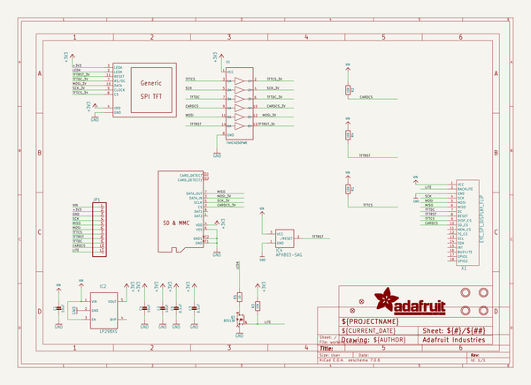
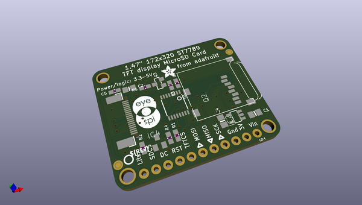
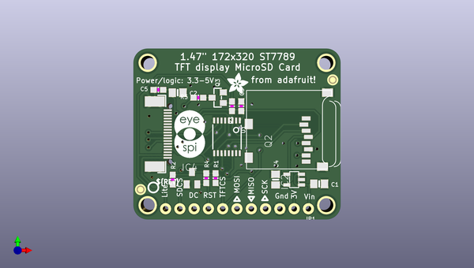
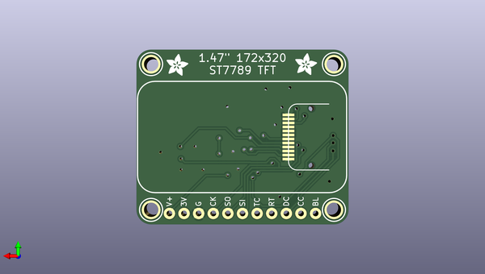

# adafruit_1_47in_320x172_round_rectangle_tft_pcb
 
## summary 
* id: adafruit_adafruit_1_47in_320x172_round_rectangle_tft_pcb_adafruit_1_47in_320x172_round_rectangle_tft
* user: adafruit
* name: adafruit_1_47in_320x172_round_rectangle_tft_pcb
* board: adafruit_1_47in_320x172_round_rectangle_tft
* repo: https://github.com/adafruit/Adafruit-1.47in-320x172-Round-Rectangle-TFT-PCB

* src_file_repo_sch: 
* src_file_repo_sch_link: https://github.com/adafruit/Adafruit-1.47in-320x172-Round-Rectangle-TFT-PCB/tree/main/

## schematic  
  
[schematic (pdf)](working_schematic.pdf)  

## pcb  
 
  
  
  
[board (pdf)](working.pdf)  

## working_bom
| Id | Designator | Footprint | Quantity | Designation | Supplier and ref |  | None | 
| --- | --- | --- | --- | --- | --- | --- | --- | 
| 1 | U$21,U$20,U$1 | ADAFRUIT_3.5MM | 3 |  |  |  | [''] | 
| 2 | R1,R2,R3,R4 | 0603-NO | 4 | 10K |  |  | [''] | 
| 3 | Q2 | MICROSD | 1 | MICROSD |  |  | [''] | 
| 4 | IC2 | SOT23-5L | 1 | AP2112 |  |  | [''] | 
| 5 | IC4 | SOT23 | 1 | APX803-SAG |  |  | [''] | 
| 6 | U$2 | PCBFEAT-REV-040 | 1 |  |  |  | [''] | 
| 7 | U$22 | EYESPI_MINI_LOGO | 1 |  |  |  | [''] | 
| 8 | U$5,U$4 | FIDUCIAL_1MM | 2 | FIDUCIAL_1MM |  |  | [''] | 
| 9 | C1,C2,C4 | 0805-NO | 3 | 10uF |  |  | [''] | 
| 10 | U1 | TSSOP16 | 1 | 74HC4050PWR |  |  | [''] | 
| 11 | X1 | EYE_SPI_DISPLAY_BOTCONTACT | 1 | EYE_SPI_DISPLAY_FLIP |  |  | [''] | 
| 12 | Q3 | SOT23-WIDE | 1 | BSS138 |  |  | [''] | 
| 13 | JP1 | 1X11_ROUND_76 | 1 |  |  |  | [''] | 
| 14 | R5 | 0603-NO | 1 | 10 |  |  | [''] | 
| 15 | C3,C5 | 0603-NO | 2 | 0.1uF |  |  | [''] | 
| 16 | U$7,U$10,U$9,U$8 | MOUNTINGHOLE_2.5_PLATED | 4 | MOUNTINGHOLE2.5 |  |  | [''] | 
| 17 | DISP1 | TFT_1.47IN_172X320_12P | 1 | DISP_LCD_GENERIC_SPI_1.47IN_172X320_12P_WRAPUNDER |  |  | [''] | 

## bom_schematic
| Ref | Qnty | Value | Cmp name | Footprint | Description | Vendor | DNP | 
| --- | --- | --- | --- | --- | --- | --- | --- | 
| C1, C2, C4 | 3 | 10uF | CAP_CERAMIC0805-NOOUTLINE | working:0805-NO |  |  |  | 
| C3, C5 | 2 | 0.1uF | CAP_CERAMIC0603_NO | working:0603-NO |  |  |  | 
| DISP1 | 1 | DISP_LCD_GENERIC_SPI_1.47IN_172X320_12P_WRAPUNDER | DISP_LCD_GENERIC_SPI_1.47IN_172X320_12P_WRAPUNDER | working:TFT_1.47IN_172X320_12P |  |  |  | 
| IC2 | 1 | LP298XS | LP298XS | working:SOT23-5L |  |  |  | 
| IC4 | 1 | APX803-SAG | AXP083-SAG | working:SOT23 |  |  |  | 
| JP1 | 1 | HEADER-1X1176MIL | HEADER-1X1176MIL | working:1X11_ROUND_76 |  |  |  | 
| Q2 | 1 | MICROSD | MICROSD | working:MICROSD |  |  |  | 
| Q3 | 1 | BSS138 | MOSFET-NWIDE | working:SOT23-WIDE |  |  |  | 
| R1, R2, R3, R4 | 4 | 10K | RESISTOR_0603_NOOUT | working:0603-NO |  |  |  | 
| R5 | 1 | 10 | RESISTOR_0603_NOOUT | working:0603-NO |  |  |  | 
| U1 | 1 | 74HC4050PWR | 74HC4050DTSSOP | working:TSSOP16 |  |  |  | 
| U$4, U$5 | 2 | FIDUCIAL_1MM | FIDUCIAL_1MM | working:FIDUCIAL_1MM |  |  |  | 
| U$7, U$8, U$9, U$10 | 4 | MOUNTINGHOLE2.5 | MOUNTINGHOLE2.5 | working:MOUNTINGHOLE_2.5_PLATED |  |  |  | 
| X1 | 1 | EYE_SPI_DISPLAY_FLIP | EYE_SPI_DISPLAY_FLIP | working:EYE_SPI_DISPLAY_BOTCONTACT |  |  |  | 

## positions
### top
| # Ref | Val | Package | PosX | PosY | Rot | Side | 
| --- | --- | --- | --- | --- | --- | --- | 
| C1 | 10uF | 0805-NO | 163.1061 | -113.8936 | 0.0 | top | 
| C2 | 10uF | 0805-NO | 137.9601 | -97.6376 | 0.0 | top | 
| C3 | 0.1uF | 0603-NO | 149.2631 | -100.0506 | 90.0 | top | 
| C4 | 10uF | 0805-NO | 155.3591 | -113.1316 | 90.0 | top | 
| C5 | 0.1uF | 0603-NO | 134.5311 | -97.1296 | 180.0 | top | 
| IC2 | AP2112 | SOT23-5L | 158.6611 | -113.1316 | 90.0 | top | 
| IC4 | APX803-SAG | SOT23 | 140.5001 | -112.8776 | 0.0 | top | 
| JP1 | nan | 1X11_ROUND_76 | 148.5011 | -118.3386 | 180.0 | top | 
| Q2 | MICROSD | MICROSD | 150.1521 | -111.2266 | 90.0 | top | 
| Q3 | BSS138 | SOT23-WIDE | 145.0721 | -98.5266 | 90.0 | top | 
| R1 | 10K | 0603-NO | 144.6911 | -112.8776 | 90.0 | top | 
| R2 | 10K | 0603-NO | 137.0711 | -113.1316 | 90.0 | top | 
| R3 | 10K | 0603-NO | 147.6121 | -100.0506 | -90.0 | top | 
| R4 | 10K | 0603-NO | 143.0401 | -112.8776 | 90.0 | top | 
| R5 | 10 | 0603-NO | 141.6431 | -98.5266 | 180.0 | top | 
| U$2 | nan | PCBFEAT-REV-040 | 133.6421 | -114.5286 | 180.0 | top | 
| U$4 | FIDUCIAL_1MM | FIDUCIAL_1MM | 165.5191 | -95.3516 | -90.0 | top | 
| U$5 | FIDUCIAL_1MM | FIDUCIAL_1MM | 131.3561 | -114.9096 | 0.0 | top | 
| U$21 | nan | ADAFRUIT_3.5MM | 146.7231 | -97.8916 | 0.0 | top | 
| U$22 | nan | EYESPI_MINI_LOGO | 137.3251 | -109.3216 | 0.0 | top | 
| U1 | 74HC4050PWR | TSSOP16 | 146.7231 | -105.5116 | 180.0 | top | 
| X1 | EYE_SPI_DISPLAY_FLIP | EYE_SPI_DISPLAY_BOTCONTACT | 133.5151 | -105.0036 | 90.0 | top | 

### bottom
| # Ref | Val | Package | PosX | PosY | Rot | Side | 
| --- | --- | --- | --- | --- | --- | --- | 
| DISP1 | DISP_LCD_GENERIC_SPI_1.47IN_172X320_12P_WRAPUNDER | TFT_1.47IN_172X320_12P | 149.5171 | -105.0036 | 90.0 | bottom | 
| U$1 | nan | ADAFRUIT_3.5MM | 139.3571 | -94.2086 | 180.0 | bottom | 
| U$7 | MOUNTINGHOLE2.5 | MOUNTINGHOLE_2.5_PLATED | 164.3761 | -92.3036 | -90.0 | bottom | 
| U$8 | MOUNTINGHOLE2.5 | MOUNTINGHOLE_2.5_PLATED | 132.6261 | -92.3036 | -90.0 | bottom | 
| U$9 | MOUNTINGHOLE2.5 | MOUNTINGHOLE_2.5_PLATED | 164.3761 | -117.7036 | -90.0 | bottom | 
| U$10 | MOUNTINGHOLE2.5 | MOUNTINGHOLE_2.5_PLATED | 132.6261 | -117.7036 | -90.0 | bottom | 
| U$20 | nan | ADAFRUIT_3.5MM | 161.7091 | -94.3356 | 180.0 | bottom | 

