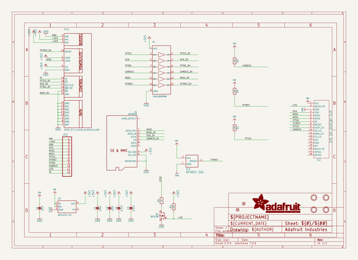
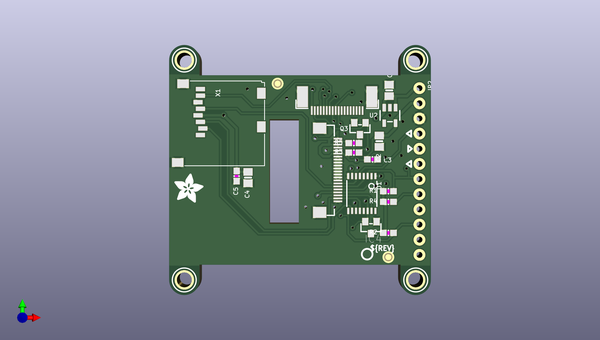
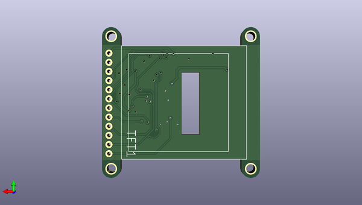

# adafruit_1_54_inch_240x240_tft_pcb
 
## summary 
* id: adafruit_adafruit_1_54_inch_240x240_tft_pcb_adafruit_1_54inch_240x240_rev_e
* user: adafruit
* name: adafruit_1_54_inch_240x240_tft_pcb
* board: adafruit_1_54inch_240x240_rev_e
* repo: https://github.com/adafruit/Adafruit-1.54-inch-240x240-TFT-PCB

* src_file_repo_sch: 
* src_file_repo_sch_link: https://github.com/adafruit/Adafruit-1.54-inch-240x240-TFT-PCB/tree/master/

## schematic  
  
[schematic (pdf)](working_schematic.pdf)  

## pcb  
 
  
  
  
[board (pdf)](working.pdf)  

## working_bom
| Id | Designator | Footprint | Quantity | Designation | Supplier and ref |  | None | 
| --- | --- | --- | --- | --- | --- | --- | --- | 
| 1 | U$2 | PCBFEAT-REV-040 | 1 |  |  |  | [''] | 
| 2 | U$10,U$9,U$8,U$7 | MOUNTINGHOLE_2.5_PLATED | 4 | MOUNTINGHOLE2.5 |  |  | [''] | 
| 3 | PLABEL15 | PLABEL15 | 1 |  |  |  | [''] | 
| 4 | PLABEL4 | PLABEL4 | 1 |  |  |  | [''] | 
| 5 | R3,R2,R1,R4 | 0603-NO | 4 | 10K |  |  | [''] | 
| 6 | PLABEL5 | PLABEL5 | 1 |  |  |  | [''] | 
| 7 | Q3 | SOT23-WIDE | 1 | BSS138 |  |  | [''] | 
| 8 | U2 | SOT23-5 | 1 | AP2127K-3.3 |  |  | [''] | 
| 9 | C4,C2,C1 | 0805-NO | 3 | 10uF |  |  | [''] | 
| 10 | C3,C5 | 0603-NO | 2 | 0.1uF |  |  | [''] | 
| 11 | PLABEL16 | PLABEL16 | 1 |  |  |  | [''] | 
| 12 | PLABEL7 | PLABEL7 | 1 |  |  |  | [''] | 
| 13 | X1 | MICROSD | 1 | MICROSD |  |  | [''] | 
| 14 | JP2 | 1X12_ROUND_76MIL | 1 |  |  |  | [''] | 
| 15 | U$4,U$5 | FIDUCIAL_1MM | 2 | FIDUCIAL_1MM |  |  | [''] | 
| 16 | PLABEL8 | PLABEL8 | 1 |  |  |  | [''] | 
| 17 | PLABEL2 | PLABEL2 | 1 |  |  |  | [''] | 
| 18 | IC4 | SOT23-WIDE | 1 | APX803-SAG |  |  | [''] | 
| 19 | PLABEL12 | PLABEL12 | 1 |  |  |  | [''] | 
| 20 | PLABEL9 | PLABEL9 | 1 |  |  |  | [''] | 
| 21 | PLABEL0 | PLABEL0 | 1 |  |  |  | [''] | 
| 22 | PLABEL13 | PLABEL13 | 1 |  |  |  | [''] | 
| 23 | PLABEL14 | PLABEL14 | 1 |  |  |  | [''] | 
| 24 | PLABEL1 | PLABEL1 | 1 |  |  |  | [''] | 
| 25 | PLABEL11 | PLABEL11 | 1 |  |  |  | [''] | 
| 26 | PLABEL6 | PLABEL6 | 1 |  |  |  | [''] | 
| 27 | PLABEL3 | PLABEL3 | 1 |  |  |  | [''] | 
| 28 | X2 | EYE_SPI_DISPLAY_BOTCONTACT | 1 | EYE_SPI_DISPLAY_FLIP |  |  | [''] | 
| 29 | U1 | TSSOP16 | 1 | 74HC4050PWR |  |  | [''] | 
| 30 | R5 | 0603-NO | 1 | 10 |  |  | [''] | 
| 31 | PLABEL10 | PLABEL10 | 1 |  |  |  | [''] | 
| 32 | U$1 | ADAFRUIT_5MM | 1 |  |  |  | [''] | 
| 33 | TFT1 | TFT_1.54IN_240X240_22PIN | 1 | DISP_TFT_1.54IN_240X240_22P |  |  | [''] | 
| 34 | PLABEL29 | PLABEL29 | 1 |  |  |  | [''] | 
| 35 | PLABEL23 | PLABEL23 | 1 |  |  |  | [''] | 
| 36 | PLABEL24 | PLABEL24 | 1 |  |  |  | [''] | 
| 37 | PLABEL25 | PLABEL25 | 1 |  |  |  | [''] | 
| 38 | PLABEL20 | PLABEL20 | 1 |  |  |  | [''] | 
| 39 | PLABEL27 | PLABEL27 | 1 |  |  |  | [''] | 
| 40 | PLABEL21 | PLABEL21 | 1 |  |  |  | [''] | 
| 41 | PLABEL26 | PLABEL26 | 1 |  |  |  | [''] | 
| 42 | PLABEL28 | PLABEL28 | 1 |  |  |  | [''] | 
| 43 | PLABEL19 | PLABEL19 | 1 |  |  |  | [''] | 
| 44 | PLABEL22 | PLABEL22 | 1 |  |  |  | [''] | 
| 45 | PLABEL17 | PLABEL17 | 1 |  |  |  | [''] | 
| 46 | PLABEL18 | PLABEL18 | 1 |  |  |  | [''] | 

## bom_schematic
| Ref | Qnty | Value | Cmp name | Footprint | Description | Vendor | DNP | 
| --- | --- | --- | --- | --- | --- | --- | --- | 
| C1, C2, C4 | 3 | 10uF | CAP_CERAMIC0805-NOOUTLINE | working:0805-NO |  |  |  | 
| C3, C5 | 2 | 0.1uF | CAP_CERAMIC0603_NO | working:0603-NO |  |  |  | 
| IC4 | 1 | APX803-SAG | APX083-SAG | working:SOT23-WIDE |  |  |  | 
| JP2 | 1 | HEADER-1X1276MIL | HEADER-1X1276MIL | working:1X12_ROUND_76MIL |  |  |  | 
| Q3 | 1 | BSS138 | MOSFET-NWIDE | working:SOT23-WIDE |  |  |  | 
| R1, R2, R3, R4 | 4 | 10K | RESISTOR_0603_NOOUT | working:0603-NO |  |  |  | 
| R5 | 1 | 10 | RESISTOR_0603_NOOUT | working:0603-NO |  |  |  | 
| TFT1 | 1 | DISP_TFT_1.54IN_240X240_22P | DISP_TFT_1.54IN_240X240_22P | working:TFT_1.54IN_240X240_22PIN |  |  |  | 
| U1 | 1 | 74HC4050PWR | 74HC4050DTSSOP | working:TSSOP16 |  |  |  | 
| U2 | 1 | AP2127K-3.3 | VREG_SOT23-5 | working:SOT23-5 |  |  |  | 
| U$4, U$5 | 2 | FIDUCIAL_1MM | FIDUCIAL_1MM | working:FIDUCIAL_1MM |  |  |  | 
| U$7, U$8, U$9, U$10 | 4 | MOUNTINGHOLE2.5 | MOUNTINGHOLE2.5 | working:MOUNTINGHOLE_2.5_PLATED |  |  |  | 
| X1 | 1 | MICROSD | MICROSD | working:MICROSD |  |  |  | 
| X2 | 1 | EYE_SPI_DISPLAY_FLIP | EYE_SPI_DISPLAY_FLIP | working:EYE_SPI_DISPLAY_BOTCONTACT |  |  |  | 

## mounting_holes
| x | y | package | value | ref | size | 
| --- | --- | --- | --- | --- | --- | 
| 129.1336 | -86.5886 | MOUNTINGHOLE_2.5_PLATED | MOUNTINGHOLE2.5 | U$7 | m3 | 
| 129.1336 | -123.4186 | MOUNTINGHOLE_2.5_PLATED | MOUNTINGHOLE2.5 | U$8 | m3 | 
| 167.8686 | -86.5886 | MOUNTINGHOLE_2.5_PLATED | MOUNTINGHOLE2.5 | U$9 | m3 | 
| 167.8686 | -123.4186 | MOUNTINGHOLE_2.5_PLATED | MOUNTINGHOLE2.5 | U$10 | m3 | 

## positions
### top
| # Ref | Val | Package | PosX | PosY | Rot | Side | 
| --- | --- | --- | --- | --- | --- | --- | 
| C1 | 10uF | 0805-NO | 163.4236 | -91.6686 | 90.0 | top | 
| C2 | 10uF | 0805-NO | 161.7726 | -100.1776 | -90.0 | top | 
| C3 | 0.1uF | 0603-NO | 160.6296 | -103.2256 | 0.0 | top | 
| C4 | 10uF | 0805-NO | 139.8016 | -106.2736 | -90.0 | top | 
| C5 | 0.1uF | 0603-NO | 137.8966 | -106.0196 | -90.0 | top | 
| IC4 | APX803-SAG | SOT23-WIDE | 160.3756 | -114.6556 | 180.0 | top | 
| JP2 | nan | 1X12_ROUND_76MIL | 168.5036 | -105.2576 | -90.0 | top | 
| PLABEL0 | nan | PLABEL0 | 165.2016 | -91.6686 | 0.0 | top | 
| PLABEL1 | nan | PLABEL1 | 164.9476 | -109.5756 | 0.0 | top | 
| PLABEL2 | nan | PLABEL2 | 165.2016 | -112.1156 | 0.0 | top | 
| PLABEL3 | nan | PLABEL3 | 167.2336 | -114.0206 | 0.0 | top | 
| PLABEL4 | nan | PLABEL4 | 167.3606 | -107.0356 | 0.0 | top | 
| PLABEL5 | nan | PLABEL5 | 162.2806 | -104.3686 | 0.0 | top | 
| PLABEL6 | nan | PLABEL6 | 163.2966 | -99.4156 | 0.0 | top | 
| PLABEL7 | nan | PLABEL7 | 162.6616 | -101.9556 | 0.0 | top | 
| PLABEL8 | nan | PLABEL8 | 164.9476 | -117.0686 | 0.0 | top | 
| PLABEL9 | nan | PLABEL9 | 127.3556 | -117.4496 | 0.0 | top | 
| PLABEL10 | nan | PLABEL10 | 127.3556 | -120.1166 | 0.0 | top | 
| PLABEL11 | nan | PLABEL11 | 127.3556 | -114.6556 | 0.0 | top | 
| PLABEL12 | nan | PLABEL12 | 127.3556 | -112.4966 | 0.0 | top | 
| PLABEL13 | nan | PLABEL13 | 132.9436 | -110.3376 | 0.0 | top | 
| PLABEL14 | nan | PLABEL14 | 167.2336 | -98.0186 | 90.0 | top | 
| PLABEL15 | nan | PLABEL15 | 164.6936 | -93.8276 | 0.0 | top | 
| PLABEL16 | nan | PLABEL16 | 165.8366 | -119.8626 | 0.0 | top | 
| Q3 | BSS138 | SOT23-WIDE | 158.5341 | -98.0821 | 180.0 | top | 
| R1 | 10K | 0603-NO | 163.2966 | -108.5596 | 180.0 | top | 
| R2 | 10K | 0603-NO | 163.2966 | -115.5446 | 180.0 | top | 
| R3 | 10K | 0603-NO | 157.5181 | -102.0826 | 180.0 | top | 
| R4 | 10K | 0603-NO | 163.2966 | -110.3376 | 180.0 | top | 
| R5 | 10 | 0603-NO | 157.5181 | -100.4951 | 180.0 | top | 
| U$1 | nan | ADAFRUIT_5MM | 127.4826 | -110.4646 | 0.0 | top | 
| U$2 | nan | PCBFEAT-REV-040 | 159.7406 | -119.1006 | 180.0 | top | 
| U$4 | FIDUCIAL_1MM | FIDUCIAL_1MM | 144.7546 | -90.5256 | 0.0 | top | 
| U$5 | FIDUCIAL_1MM | FIDUCIAL_1MM | 163.2966 | -119.6086 | 0.0 | top | 
| U$7 | MOUNTINGHOLE2.5 | MOUNTINGHOLE_2.5_PLATED | 129.1336 | -86.5886 | 0.0 | top | 
| U$8 | MOUNTINGHOLE2.5 | MOUNTINGHOLE_2.5_PLATED | 129.1336 | -123.4186 | 0.0 | top | 
| U$9 | MOUNTINGHOLE2.5 | MOUNTINGHOLE_2.5_PLATED | 167.8686 | -86.5886 | 0.0 | top | 
| U$10 | MOUNTINGHOLE2.5 | MOUNTINGHOLE_2.5_PLATED | 167.8686 | -123.4186 | 0.0 | top | 
| U1 | 74HC4050PWR | TSSOP16 | 158.8516 | -108.9406 | 180.0 | top | 
| U2 | AP2127K-3.3 | SOT23-5 | 163.5506 | -95.8596 | 180.0 | top | 
| X1 | MICROSD | MICROSD | 134.9756 | -97.3836 | -90.0 | top | 
| X2 | EYE_SPI_DISPLAY_FLIP | EYE_SPI_DISPLAY_BOTCONTACT | 154.7241 | -93.8911 | 180.0 | top | 

### bottom
| # Ref | Val | Package | PosX | PosY | Rot | Side | 
| --- | --- | --- | --- | --- | --- | --- | 
| PLABEL17 | nan | PLABEL17 | 167.4876 | -91.2876 | 180.0 | bottom | 
| PLABEL18 | nan | PLABEL18 | 167.4876 | -93.8276 | 180.0 | bottom | 
| PLABEL19 | nan | PLABEL19 | 167.4876 | -96.3676 | 180.0 | bottom | 
| PLABEL20 | nan | PLABEL20 | 167.4876 | -98.9076 | 180.0 | bottom | 
| PLABEL21 | nan | PLABEL21 | 167.4876 | -101.4476 | 180.0 | bottom | 
| PLABEL22 | nan | PLABEL22 | 167.4876 | -103.9876 | 180.0 | bottom | 
| PLABEL23 | nan | PLABEL23 | 167.4876 | -106.5276 | 180.0 | bottom | 
| PLABEL24 | nan | PLABEL24 | 167.4876 | -109.0676 | 180.0 | bottom | 
| PLABEL25 | nan | PLABEL25 | 167.4876 | -111.6076 | 180.0 | bottom | 
| PLABEL26 | nan | PLABEL26 | 167.4876 | -114.1476 | 180.0 | bottom | 
| PLABEL27 | nan | PLABEL27 | 167.4876 | -116.6876 | 180.0 | bottom | 
| PLABEL28 | nan | PLABEL28 | 128.2446 | -105.2576 | -90.0 | bottom | 
| PLABEL29 | nan | PLABEL29 | 167.4876 | -119.2276 | 180.0 | bottom | 
| TFT1 | DISP_TFT_1.54IN_240X240_22P | TFT_1.54IN_240X240_22PIN | 153.6446 | -105.0036 | 90.0 | bottom | 

