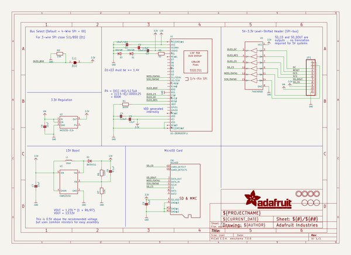
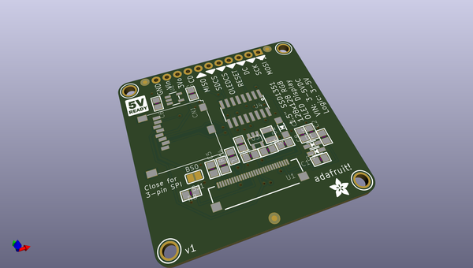
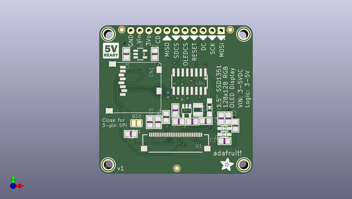
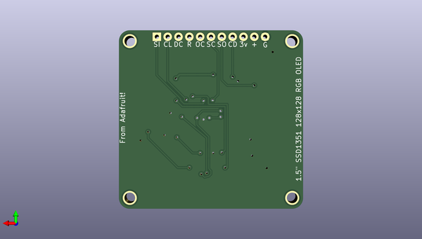

# adafruit_1_5inch_color_oled_pcb
 
## summary 
* id: adafruit_adafruit_1_5inch_color_oled_pcb_adafruit_1_5_128x128_rgb_oled
* user: adafruit
* name: adafruit_1_5inch_color_oled_pcb
* board: adafruit_1_5_128x128_rgb_oled
* repo: https://github.com/adafruit/Adafruit-1.5inch-Color-OLED-PCB

* src_file_repo_sch: 
* src_file_repo_sch_link: https://github.com/adafruit/Adafruit-1.5inch-Color-OLED-PCB/tree/master/

## schematic  
  
[schematic (pdf)](working_schematic.pdf)  

## pcb  
 
  
  
  
[board (pdf)](working.pdf)  

## working_bom
| Id | Designator | Footprint | Quantity | Designation | Supplier and ref |  | None | 
| --- | --- | --- | --- | --- | --- | --- | --- | 
| 1 | U2 | SOT23-5 | 1 | MIC5225-3.3v |  |  | [''] | 
| 2 | U3 | SOT23-5@1 | 1 | FAN5331SX |  |  | [''] | 
| 3 | D2 | SOD-123 | 1 | BAT54T1G |  |  | [''] | 
| 4 | U$29,U$26,U$27 | FIDUCIAL_1MM | 3 | FIDUCIAL |  |  | [''] | 
| 5 | CN1 | MICROSD | 1 | microSD |  |  | [''] | 
| 6 | R4 | 0805 | 1 | 600K |  |  | [''] | 
| 7 | U$30 | LOGIC_5VREADY_5MM | 1 |  |  |  | [''] | 
| 8 | C1,C2 | 0805 | 2 | 10uF/16V |  |  | [''] | 
| 9 | U1 | FPC_XF2M-3015-1A | 1 | UG-2828GDEDF11 |  |  | [''] | 
| 10 | U4 | SOIC16 | 1 | 74HC4050D |  |  | [''] | 
| 11 | U$24,U$23,U$25,U$22 | MOUNTINGHOLE_2.5_PLATED | 4 | MOUNTINGHOLE2.5 |  |  | [''] | 
| 12 | SJ1 | SOLDERJUMPER_REFLOW_NOPASTE | 1 | BS0 |  |  | [''] | 
| 13 | R5 | 0805 | 1 | 50 |  |  | [''] | 
| 14 | C7,C9,C5,C6 | 0805 | 4 | 10uF |  |  | [''] | 
| 15 | C4,C3 | 0805 | 2 | 1.0uF |  |  | [''] | 
| 16 | R8,R7 | 0805 | 2 | 10K |  |  | [''] | 
| 17 | JP1 | 1X11_ROUND_76 | 1 |  |  |  | [''] | 
| 18 | L1 | INDUCTOR_1007 | 1 | 10uH |  |  | [''] | 
| 19 | R6 | 0805 | 1 | 100K |  |  | [''] | 
| 20 | D1,D3 | SOD-323 | 2 | 1N4148 |  |  | [''] | 
| 21 | C8 | 0805 | 1 | 0.1uF |  |  | [''] | 
| 22 | U$28 | ADAFRUIT_3.5MM | 1 |  |  |  | [''] | 

## bom_schematic
| Ref | Qnty | Value | Cmp name | Footprint | Description | Vendor | DNP | 
| --- | --- | --- | --- | --- | --- | --- | --- | 
| C1, C2 | 2 | 10uF/16V | CAP_CERAMIC0805 | working:0805 |  |  |  | 
| C3, C4 | 2 | 1.0uF | CAP_CERAMIC0805 | working:0805 |  |  |  | 
| C5, C6, C7, C9 | 4 | 10uF | CAP_CERAMIC0805 | working:0805 |  |  |  | 
| C8 | 1 | 0.1uF | CAP_CERAMIC0805 | working:0805 |  |  |  | 
| CN1 | 1 | microSD | MICROSD | working:MICROSD |  |  |  | 
| D1, D3 | 2 | 1N4148 | DIODESOD-323 | working:SOD-323 |  |  |  | 
| D2 | 1 | BAT54T1G | DIODESOD-123 | working:SOD-123 |  |  |  | 
| JP1 | 1 | HEADER-1X1176MIL | HEADER-1X1176MIL | working:1X11_ROUND_76 |  |  |  | 
| L1 | 1 | 10uH | INDUCTOR | working:INDUCTOR_1007 |  |  |  | 
| R4 | 1 | 600K | RESISTOR0805 | working:0805 |  |  |  | 
| R5 | 1 | 50 | RESISTOR0805 | working:0805 |  |  |  | 
| R6 | 1 | 100K | RESISTOR0805 | working:0805 |  |  |  | 
| R7, R8 | 2 | 10K | RESISTOR0805 | working:0805 |  |  |  | 
| SJ1 | 1 | BS0 | SOLDERJUMPERREFLOW_NOPASTE | working:SOLDERJUMPER_REFLOW_NOPASTE |  |  |  | 
| U1 | 1 | UG-2828GDEDF11 | DISP_OLED_UG-2828GDEDF11TOP | working:FPC_XF2M-3015-1A |  |  |  | 
| U2 | 1 | MIC5225-3.3v | VREG_SOT23-5 | working:SOT23-5 |  |  |  | 
| U3 | 1 | FAN5331SX | FAN5331 | working:SOT23-5@1 |  |  |  | 
| U4 | 1 | 74HC4050D | 74HC4050D | working:SOIC16 |  |  |  | 
| U$22, U$23, U$24, U$25 | 4 | MOUNTINGHOLE2.5 | MOUNTINGHOLE2.5 | working:MOUNTINGHOLE_2.5_PLATED |  |  |  | 
| U$26, U$27, U$29 | 3 | FIDUCIAL | FIDUCIAL | working:FIDUCIAL_1MM |  |  |  | 

## mounting_holes
| x | y | package | value | ref | size | 
| --- | --- | --- | --- | --- | --- | 
| 129.4511 | -123.4186 | MOUNTINGHOLE_2.5_PLATED | MOUNTINGHOLE2.5 | U$22 | m3 | 
| 167.5511 | -123.4186 | MOUNTINGHOLE_2.5_PLATED | MOUNTINGHOLE2.5 | U$23 | m3 | 
| 167.5511 | -86.5886 | MOUNTINGHOLE_2.5_PLATED | MOUNTINGHOLE2.5 | U$24 | m3 | 
| 129.4511 | -86.5886 | MOUNTINGHOLE_2.5_PLATED | MOUNTINGHOLE2.5 | U$25 | m3 | 

## positions
### top
| # Ref | Val | Package | PosX | PosY | Rot | Side | 
| --- | --- | --- | --- | --- | --- | --- | 
| C1 | 10uF/16V | 0805 | 162.1271 | -116.7276 | 180.0 | top | 
| C2 | 10uF/16V | 0805 | 165.1751 | -112.3696 | 90.0 | top | 
| C3 | 1.0uF | 0805 | 161.1981 | -110.3376 | 90.0 | top | 
| C4 | 1.0uF | 0805 | 143.4521 | -111.3536 | 90.0 | top | 
| C5 | 10uF | 0805 | 141.1381 | -111.3536 | 90.0 | top | 
| C6 | 10uF | 0805 | 134.5311 | -92.1796 | -90.0 | top | 
| C7 | 10uF | 0805 | 149.2601 | -111.2266 | 180.0 | top | 
| C8 | 0.1uF | 0805 | 156.8461 | -111.0596 | 0.0 | top | 
| C9 | 10uF | 0805 | 142.5291 | -92.1766 | -90.0 | top | 
| CN1 | microSD | MICROSD | 144.1831 | -94.5926 | -90.0 | top | 
| D1 | 1N4148 | SOD-323 | 162.1271 | -113.1716 | 180.0 | top | 
| D2 | BAT54T1G | SOD-123 | 157.9361 | -107.2496 | 90.0 | top | 
| D3 | 1N4148 | SOD-323 | 162.1271 | -114.8696 | 0.0 | top | 
| JP1 | nan | 1X11_ROUND_76 | 148.5011 | -85.5726 | 180.0 | top | 
| L1 | 10uH | INDUCTOR_1007 | 154.6741 | -107.9246 | 90.0 | top | 
| R4 | 600K | 0805 | 145.7381 | -109.9566 | -90.0 | top | 
| R5 | 50 | 0805 | 163.2301 | -110.3376 | 90.0 | top | 
| R6 | 100K | 0805 | 153.0701 | -111.2266 | 0.0 | top | 
| R7 | 10K | 0805 | 148.3241 | -108.0516 | 90.0 | top | 
| R8 | 10K | 0805 | 135.8011 | -114.7296 | 0.0 | top | 
| SJ1 | BS0 | SOLDERJUMPER_REFLOW_NOPASTE | 137.3651 | -111.6976 | 0.0 | top | 
| U$22 | MOUNTINGHOLE2.5 | MOUNTINGHOLE_2.5_PLATED | 129.4511 | -123.4186 | 0.0 | top | 
| U$23 | MOUNTINGHOLE2.5 | MOUNTINGHOLE_2.5_PLATED | 167.5511 | -123.4186 | 0.0 | top | 
| U$24 | MOUNTINGHOLE2.5 | MOUNTINGHOLE_2.5_PLATED | 167.5511 | -86.5886 | 0.0 | top | 
| U$25 | MOUNTINGHOLE2.5 | MOUNTINGHOLE_2.5_PLATED | 129.4511 | -86.5886 | 0.0 | top | 
| U$26 | FIDUCIAL | FIDUCIAL_1MM | 148.7521 | -124.4346 | 0.0 | top | 
| U$27 | FIDUCIAL | FIDUCIAL_1MM | 163.7411 | -85.3186 | 0.0 | top | 
| U$28 | nan | ADAFRUIT_3.5MM | 160.9841 | -125.1966 | 0.0 | top | 
| U$29 | FIDUCIAL | FIDUCIAL_1MM | 133.2611 | -85.3186 | 0.0 | top | 
| U$30 | nan | LOGIC_5VREADY_5MM | 127.7101 | -93.7006 | 0.0 | top | 
| U1 | UG-2828GDEDF11 | FPC_XF2M-3015-1A | 148.4111 | -117.5766 | 180.0 | top | 
| U2 | MIC5225-3.3v | SOT23-5 | 138.4681 | -92.1736 | -90.0 | top | 
| U3 | FAN5331SX | SOT23-5@1 | 151.4991 | -108.1786 | 180.0 | top | 
| U4 | 74HC4050D | SOIC16 | 152.3111 | -99.9606 | 180.0 | top | 

### bottom
no data
