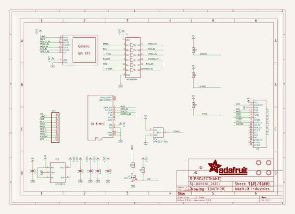
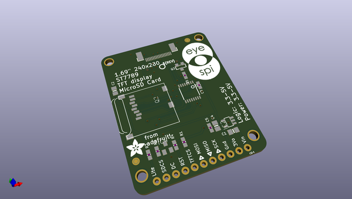
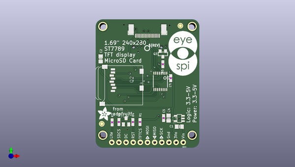
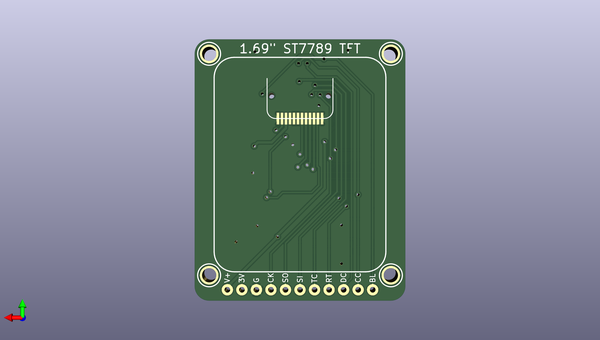

# adafruit_1_69in_280x240_round_rectangle_tft_pcb
 
## summary 
* id: adafruit_adafruit_1_69in_280x240_round_rectangle_tft_pcb_adafruit_1_69in_280x240_round_rectangle_tft
* user: adafruit
* name: adafruit_1_69in_280x240_round_rectangle_tft_pcb
* board: adafruit_1_69in_280x240_round_rectangle_tft
* repo: https://github.com/adafruit/Adafruit-1.69in-280x240-Round-Rectangle-TFT-PCB

* src_file_repo_sch: 
* src_file_repo_sch_link: https://github.com/adafruit/Adafruit-1.69in-280x240-Round-Rectangle-TFT-PCB/tree/main/

## schematic  
  
[schematic (pdf)](working_schematic.pdf)  

## pcb  
 
  
  
  
[board (pdf)](working.pdf)  

## working_bom
| Id | Designator | Footprint | Quantity | Designation | Supplier and ref |  | None | 
| --- | --- | --- | --- | --- | --- | --- | --- | 
| 1 | X1 | EYE_SPI_DISPLAY_BOTCONTACT | 1 | EYE_SPI_DISPLAY_FLIP |  |  | [''] | 
| 2 | R1,R3,R2,R4 | 0603-NO | 4 | 10K |  |  | [''] | 
| 3 | Q3 | SOT23-WIDE | 1 | BSS138 |  |  | [''] | 
| 4 | U$1 | ADAFRUIT_5MM | 1 |  |  |  | [''] | 
| 5 | C4,C2,C1 | 0805-NO | 3 | 10uF |  |  | [''] | 
| 6 | U$19 | EYESPI_LOGO | 1 |  |  |  | [''] | 
| 7 | IC4 | SOT23 | 1 | APX803-SAG |  |  | [''] | 
| 8 | IC2 | SOT23-5L | 1 | AP2112 |  |  | [''] | 
| 9 | U$2 | PCBFEAT-REV-040 | 1 |  |  |  | [''] | 
| 10 | U$4,U$5 | FIDUCIAL_1MM | 2 | FIDUCIAL_1MM |  |  | [''] | 
| 11 | U1 | TSSOP16 | 1 | 74HC4050PWR |  |  | [''] | 
| 12 | C3,C5 | 0603-NO | 2 | 0.1uF |  |  | [''] | 
| 13 | R5 | 0603-NO | 1 | 10 |  |  | [''] | 
| 14 | Q2 | MICROSD | 1 | MICROSD |  |  | [''] | 
| 15 | JP1 | 1X11_ROUND_76 | 1 |  |  |  | [''] | 
| 16 | U$8,U$10,U$9,U$7 | MOUNTINGHOLE_2.5_PLATED | 4 | MOUNTINGHOLE2.5 |  |  | [''] | 
| 17 | DISP1 | TFT_1.69IN_240X280_12P | 1 | DISP_LCD_GENERIC_SPI_1.69_WRAPUNDER |  |  | [''] | 

## bom_schematic
| Ref | Qnty | Value | Cmp name | Footprint | Description | Vendor | DNP | 
| --- | --- | --- | --- | --- | --- | --- | --- | 
| C1, C2, C4 | 3 | 10uF | CAP_CERAMIC0805-NOOUTLINE | working:0805-NO |  |  |  | 
| C3, C5 | 2 | 0.1uF | CAP_CERAMIC0603_NO | working:0603-NO |  |  |  | 
| DISP1 | 1 | DISP_LCD_GENERIC_SPI_1.69_WRAPUNDER | DISP_LCD_GENERIC_SPI_1.69_WRAPUNDER | working:TFT_1.69IN_240X280_12P |  |  |  | 
| IC2 | 1 | LP298XS | LP298XS | working:SOT23-5L |  |  |  | 
| IC4 | 1 | APX803-SAG | AXP083-SAG | working:SOT23 |  |  |  | 
| JP1 | 1 | HEADER-1X1176MIL | HEADER-1X1176MIL | working:1X11_ROUND_76 |  |  |  | 
| Q2 | 1 | MICROSD | MICROSD | working:MICROSD |  |  |  | 
| Q3 | 1 | BSS138 | MOSFET-NWIDE | working:SOT23-WIDE |  |  |  | 
| R1, R2, R3, R4 | 4 | 10K | RESISTOR_0603_NOOUT | working:0603-NO |  |  |  | 
| R5 | 1 | 10 | RESISTOR_0603_NOOUT | working:0603-NO |  |  |  | 
| U1 | 1 | 74HC4050PWR | 74HC4050DTSSOP | working:TSSOP16 |  |  |  | 
| U$4, U$5 | 2 | FIDUCIAL_1MM | FIDUCIAL_1MM | working:FIDUCIAL_1MM |  |  |  | 
| U$7, U$8, U$9, U$10 | 4 | MOUNTINGHOLE2.5 | MOUNTINGHOLE2.5 | working:MOUNTINGHOLE_2.5_PLATED |  |  |  | 
| X1 | 1 | EYE_SPI_DISPLAY_FLIP | EYE_SPI_DISPLAY_FLIP | working:EYE_SPI_DISPLAY_BOTCONTACT |  |  |  | 

## positions
### top
| # Ref | Val | Package | PosX | PosY | Rot | Side | 
| --- | --- | --- | --- | --- | --- | --- | 
| C1 | 10uF | 0805-NO | 159.8041 | -120.3706 | 180.0 | top | 
| C2 | 10uF | 0805-NO | 131.8641 | -96.2406 | 90.0 | top | 
| C3 | 0.1uF | 0603-NO | 156.7561 | -103.0986 | -90.0 | top | 
| C4 | 10uF | 0805-NO | 155.9941 | -117.3226 | 90.0 | top | 
| C5 | 0.1uF | 0603-NO | 154.2161 | -117.3226 | 90.0 | top | 
| IC2 | AP2112 | SOT23-5L | 159.8041 | -117.4496 | 90.0 | top | 
| IC4 | APX803-SAG | SOT23 | 140.8811 | -118.4656 | 0.0 | top | 
| JP1 | nan | 1X11_ROUND_76 | 148.5011 | -125.9586 | 180.0 | top | 
| Q2 | MICROSD | MICROSD | 146.8501 | -98.6536 | -90.0 | top | 
| Q3 | BSS138 | SOT23-WIDE | 153.9621 | -94.4626 | 180.0 | top | 
| R1 | 10K | 0603-NO | 145.8341 | -118.7196 | 90.0 | top | 
| R2 | 10K | 0603-NO | 138.3411 | -118.7196 | 90.0 | top | 
| R3 | 10K | 0603-NO | 135.9281 | -118.8466 | 90.0 | top | 
| R4 | 10K | 0603-NO | 143.2941 | -118.7196 | 90.0 | top | 
| R5 | 10 | 0603-NO | 153.9621 | -98.1456 | -90.0 | top | 
| U$1 | nan | ADAFRUIT_5MM | 130.8481 | -118.2116 | 0.0 | top | 
| U$2 | nan | PCBFEAT-REV-040 | 148.3741 | -92.4306 | 180.0 | top | 
| U$4 | FIDUCIAL_1MM | FIDUCIAL_1MM | 160.1851 | -84.4296 | -90.0 | top | 
| U$5 | FIDUCIAL_1MM | FIDUCIAL_1MM | 132.2451 | -119.3546 | 0.0 | top | 
| U$19 | nan | EYESPI_LOGO | 155.8671 | -102.4636 | 0.0 | top | 
| U1 | 74HC4050PWR | TSSOP16 | 153.0731 | -104.2416 | 180.0 | top | 
| X1 | EYE_SPI_DISPLAY_FLIP | EYE_SPI_DISPLAY_BOTCONTACT | 148.5011 | -85.3186 | 0.0 | top | 

### bottom
| # Ref | Val | Package | PosX | PosY | Rot | Side | 
| --- | --- | --- | --- | --- | --- | --- | 
| DISP1 | DISP_LCD_GENERIC_SPI_1.69_WRAPUNDER | TFT_1.69IN_240X280_12P | 148.5011 | -105.0036 | 0.0 | bottom | 
| U$7 | MOUNTINGHOLE2.5 | MOUNTINGHOLE_2.5_PLATED | 164.3761 | -84.6836 | -90.0 | bottom | 
| U$8 | MOUNTINGHOLE2.5 | MOUNTINGHOLE_2.5_PLATED | 132.6261 | -84.6836 | -90.0 | bottom | 
| U$9 | MOUNTINGHOLE2.5 | MOUNTINGHOLE_2.5_PLATED | 164.3761 | -123.4186 | -90.0 | bottom | 
| U$10 | MOUNTINGHOLE2.5 | MOUNTINGHOLE_2.5_PLATED | 132.6261 | -123.4186 | -90.0 | bottom | 

