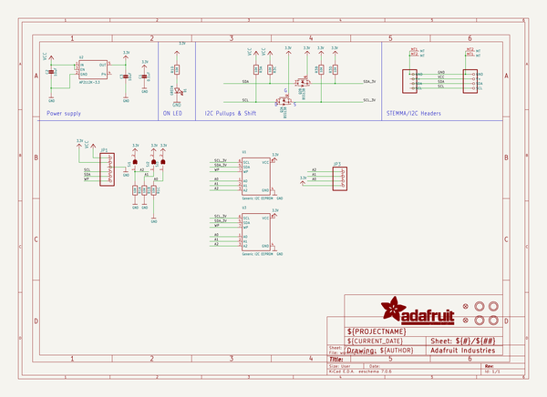
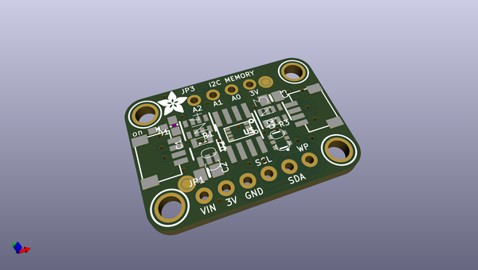
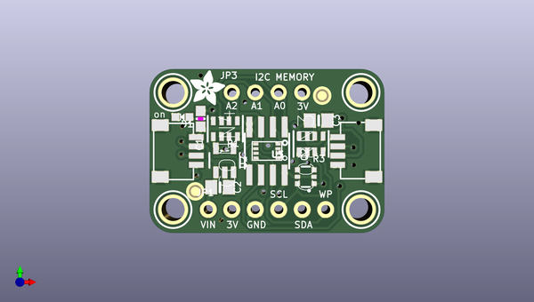
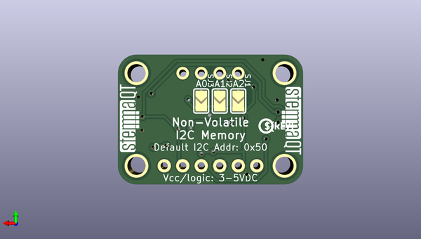

# adafruit_24lc32_pcb
 
## summary 
* id: adafruit_adafruit_24lc32_pcb_adafruit_24lc32_i2c_eeprom
* user: adafruit
* name: adafruit_24lc32_pcb
* board: adafruit_24lc32_i2c_eeprom
* repo: https://github.com/adafruit/Adafruit-24LC32-PCB

* src_file_repo_sch: 
* src_file_repo_sch_link: https://github.com/adafruit/Adafruit-24LC32-PCB/tree/main/

## schematic  
  
[schematic (pdf)](working_schematic.pdf)  

## pcb  
 
  
  
  
[board (pdf)](working.pdf)  

## working_bom
| Id | Designator | Footprint | Quantity | Designation | Supplier and ref |  | None | 
| --- | --- | --- | --- | --- | --- | --- | --- | 
| 1 | JP3 | 1X04_ROUND | 1 |  |  |  | [''] | 
| 2 | U1 | SOIC8_150MIL | 1 | Generic I2C EEPROM |  |  | [''] | 
| 3 | R1,R3 | RESPACK_4X0603 | 2 | 10K |  |  | [''] | 
| 4 | U$32 | ADAFRUIT_3.5MM | 1 |  |  |  | [''] | 
| 5 | U$17,U$19,U$1,U$21 | MOUNTINGHOLE_2.5_PLATED | 4 | MOUNTINGHOLE2.5 |  |  | [''] | 
| 6 | Q2 | SOT363 | 1 | BSS138 |  |  | [''] | 
| 7 | C1 | 0603-NO | 1 | 0.1uF |  |  | [''] | 
| 8 | CONN4,CONN3 | JST_SH4 | 2 | STEMMA_I2C_QT |  |  | [''] | 
| 9 | U3 | USON8 | 1 | Generic I2C EEPROM |  |  | [''] | 
| 10 | C3,C2 | 0805-NO | 2 | 10uF |  |  | [''] | 
| 11 | JP1 | 1X06_ROUND_70 | 1 |  |  |  | [''] | 
| 12 | D1 | CHIPLED_0603_NOOUTLINE | 1 | GREEN |  |  | [''] | 
| 13 | U2 | SOT23-5 | 1 | AP2112K-3.3 |  |  | [''] | 
| 14 | FID4,FID3 | FIDUCIAL_1MM | 2 | FIDUCIAL_1MM |  |  | [''] | 
| 15 | U$25 | PCBFEAT-REV-040 | 1 |  |  |  | [''] | 
| 16 | U$31,U$30 | STEMMAQT | 2 |  |  |  | [''] | 
| 17 | SJ2,SJ1,SJ3 | SOLDERJUMPER_ARROW_NOPASTE | 3 |  |  |  | [''] | 

## bom_schematic
| Ref | Qnty | Value | Cmp name | Footprint | Description | Vendor | DNP | 
| --- | --- | --- | --- | --- | --- | --- | --- | 
| C1 | 1 | 0.1uF | CAP_CERAMIC0603_NO | working:0603-NO |  |  |  | 
| C2, C3 | 2 | 10uF | CAP_CERAMIC0805-NOOUTLINE | working:0805-NO |  |  |  | 
| CONN3, CONN4 | 2 | STEMMA_I2C_QT | STEMMA_I2C_QT | working:JST_SH4 |  |  |  | 
| D1 | 1 | GREEN | LED0603_NOOUTLINE | working:CHIPLED_0603_NOOUTLINE |  |  |  | 
| FID3, FID4 | 2 | FIDUCIAL_1MM | FIDUCIAL_1MM | working:FIDUCIAL_1MM |  |  |  | 
| JP1 | 1 | HEADER-1X670MIL | HEADER-1X670MIL | working:1X06_ROUND_70 |  |  |  | 
| JP3 | 1 | HEADER-1X4ROUND | HEADER-1X4ROUND | working:1X04_ROUND |  |  |  | 
| Q2 | 1 | BSS138 | MOSFET-N_DUAL | working:SOT363 |  |  |  | 
| R1, R3 | 2 | 10K | RESISTOR_4PACK | working:RESPACK_4X0603 |  |  |  | 
| SJ1, SJ2, SJ3 | 3 | SOLDERJUMPER | SOLDERJUMPER | working:SOLDERJUMPER_ARROW_NOPASTE |  |  |  | 
| U1 | 1 | Generic I2C EEPROM | EEPROM_I2C_8PIN_GENERIC | working:SOIC8_150MIL |  |  |  | 
| U2 | 1 | AP2112K-3.3 | VREG_SOT23-5 | working:SOT23-5 |  |  |  | 
| U3 | 1 | Generic I2C EEPROM | EEPROM_I2C_8PIN_GENERIC_SON8 | working:USON8 |  |  |  | 
| U$1, U$17, U$19, U$21 | 4 | MOUNTINGHOLE2.5 | MOUNTINGHOLE2.5 | working:MOUNTINGHOLE_2.5_PLATED |  |  |  | 

## mounting_holes
| x | y | package | value | ref | size | 
| --- | --- | --- | --- | --- | --- | 
| 138.3411 | -98.6536 | MOUNTINGHOLE_2.5_PLATED | MOUNTINGHOLE2.5 | U$1 | m3 | 
| 158.6611 | -98.6536 | MOUNTINGHOLE_2.5_PLATED | MOUNTINGHOLE2.5 | U$17 | m3 | 
| 138.3411 | -111.3536 | MOUNTINGHOLE_2.5_PLATED | MOUNTINGHOLE2.5 | U$19 | m3 | 
| 158.6611 | -111.3536 | MOUNTINGHOLE_2.5_PLATED | MOUNTINGHOLE2.5 | U$21 | m3 | 

## positions
### top
| # Ref | Val | Package | PosX | PosY | Rot | Side | 
| --- | --- | --- | --- | --- | --- | --- | 
| C1 | 0.1uF | 0603-NO | 141.3256 | -101.5111 | -90.0 | top | 
| C2 | 10uF | 0805-NO | 143.4211 | -108.9406 | 0.0 | top | 
| C3 | 10uF | 0805-NO | 154.0891 | -101.7016 | 0.0 | top | 
| CONN3 | STEMMA_I2C_QT | JST_SH4 | 158.6611 | -105.0036 | 90.0 | top | 
| CONN4 | STEMMA_I2C_QT | JST_SH4 | 138.3411 | -105.0036 | -90.0 | top | 
| D1 | GREEN | CHIPLED_0603_NOOUTLINE | 139.3571 | -101.3206 | 90.0 | top | 
| FID3 | FIDUCIAL_1MM | FIDUCIAL_1MM | 140.7541 | -109.3851 | 0.0 | top | 
| FID4 | FIDUCIAL_1MM | FIDUCIAL_1MM | 154.4701 | -98.9965 | 0.0 | top | 
| JP1 | nan | 1X06_ROUND_70 | 148.5011 | -111.3536 | 0.0 | top | 
| JP3 | nan | 1X04_ROUND | 148.5011 | -98.6536 | 0.0 | top | 
| Q2 | BSS138 | SOT363 | 152.6921 | -107.7976 | 90.0 | top | 
| R1 | 10K | RESPACK_4X0603 | 143.9926 | -102.5906 | 180.0 | top | 
| R3 | 10K | RESPACK_4X0603 | 153.2636 | -104.2416 | 180.0 | top | 
| U$1 | MOUNTINGHOLE2.5 | MOUNTINGHOLE_2.5_PLATED | 138.3411 | -98.6536 | 0.0 | top | 
| U$17 | MOUNTINGHOLE2.5 | MOUNTINGHOLE_2.5_PLATED | 158.6611 | -98.6536 | 0.0 | top | 
| U$19 | MOUNTINGHOLE2.5 | MOUNTINGHOLE_2.5_PLATED | 138.3411 | -111.3536 | 0.0 | top | 
| U$21 | MOUNTINGHOLE2.5 | MOUNTINGHOLE_2.5_PLATED | 158.6611 | -111.3536 | 0.0 | top | 
| U$32 | nan | ADAFRUIT_3.5MM | 140.1826 | -100.0506 | 0.0 | top | 
| U1 | Generic_I2C_EEPROM | SOIC8_150MIL | 148.5011 | -105.0036 | 180.0 | top | 
| U2 | AP2112K-3.3 | SOT23-5 | 143.9291 | -106.0196 | 0.0 | top | 
| U3 | Generic_I2C_EEPROM | USON8 | 148.5011 | -105.0036 | 180.0 | top | 

### bottom
| # Ref | Val | Package | PosX | PosY | Rot | Side | 
| --- | --- | --- | --- | --- | --- | --- | 
| SJ1 | nan | SOLDERJUMPER_ARROW_NOPASTE | 144.6911 | -102.4636 | -90.0 | bottom | 
| SJ2 | nan | SOLDERJUMPER_ARROW_NOPASTE | 147.2311 | -102.4636 | -90.0 | bottom | 
| SJ3 | nan | SOLDERJUMPER_ARROW_NOPASTE | 149.7711 | -102.4636 | -90.0 | bottom | 
| U$25 | nan | PCBFEAT-REV-040 | 140.8811 | -105.8926 | 180.0 | bottom | 
| U$30 | nan | STEMMAQT | 158.2801 | -109.4486 | 90.0 | bottom | 
| U$31 | nan | STEMMAQT | 138.7221 | -100.5586 | -90.0 | bottom | 

