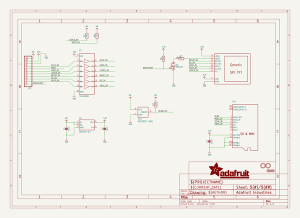
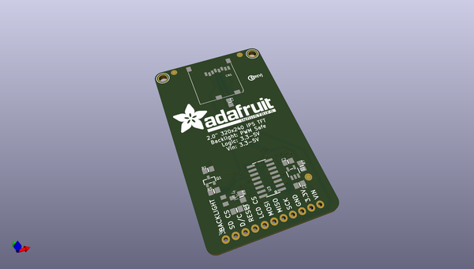
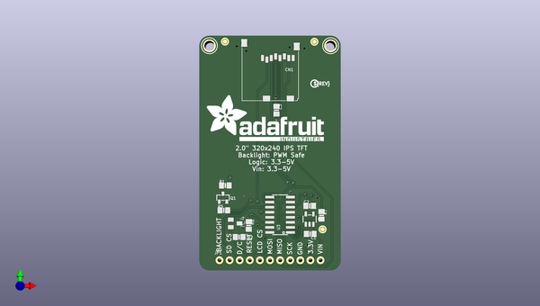
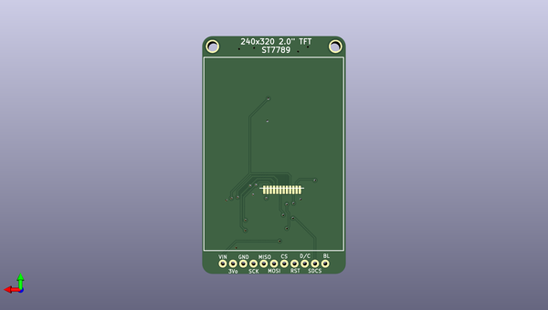

# adafruit_2_0_inch_240x320_tft_pcb
 
## summary 
* id: adafruit_adafruit_2_0_inch_240x320_tft_pcb_adafruit_eyespi_2_0_inch_240x320_ips_tft
* user: adafruit
* name: adafruit_2_0_inch_240x320_tft_pcb
* board: adafruit_eyespi_2_0_inch_240x320_ips_tft
* repo: https://github.com/adafruit/Adafruit-2.0-inch-240x320-TFT-PCB

* src_file_repo_sch: 
* src_file_repo_sch_link: https://github.com/adafruit/Adafruit-2.0-inch-240x320-TFT-PCB/tree/master/

## schematic  
  
[schematic (pdf)](working_schematic.pdf)  

## pcb  
 
  
  
  
[board (pdf)](working.pdf)  

## working_bom
| Id | Designator | Footprint | Quantity | Designation | Supplier and ref |  | None | 
| --- | --- | --- | --- | --- | --- | --- | --- | 
| 1 | JP1 | 1X11_ROUND_76 | 1 |  |  |  | [''] | 
| 2 | U3 | SOIC16 | 1 | 74HC4050D |  |  | [''] | 
| 3 | U2 | SOT23-5 | 1 | AP2112K-3.3 |  |  | [''] | 
| 4 | IC4 | SOT23 | 1 | APX803-SAG |  |  | [''] | 
| 5 | FID2,FID1,FID3 | FIDUCIAL_1MM | 3 | FIDUCIAL_1MM |  |  | [''] | 
| 6 | R5,R8,R7,R2 | 0805-NO | 4 | 10K |  |  | [''] | 
| 7 | C3,C2,C1 | 0805-NO | 3 | 10uF |  |  | [''] | 
| 8 | U$24 | PCBFEAT-REV-040 | 1 |  |  |  | [''] | 
| 9 | U$3,U$4 | MOUNTINGHOLE_2.5_PLATED | 2 | MOUNTINGHOLE2.5 |  |  | [''] | 
| 10 | Q1 | SOT23-R | 1 | BSS138 |  |  | [''] | 
| 11 | U$20 | ADAFRUIT_TEXT_30MM | 1 |  |  |  | [''] | 
| 12 | R1 | 0805-NO | 1 | 10 |  |  | [''] | 
| 13 | CN1 | MICROSD | 1 |  |  |  | [''] | 
| 14 | DISP1 | TFT_2.0IN_240X320_12P | 1 | DISP_LCD_GENERIC_SPI_2.0IN_240X320 |  |  | [''] | 

## bom_schematic
| Ref | Qnty | Value | Cmp name | Footprint | Description | Vendor | DNP | 
| --- | --- | --- | --- | --- | --- | --- | --- | 
| C1, C2, C3 | 3 | 10uF | CAP_CERAMIC0805-NOOUTLINE | working:0805-NO |  |  |  | 
| CN1 | 1 | MICROSD | MICROSD | working:MICROSD |  |  |  | 
| DISP1 | 1 | DISP_LCD_GENERIC_SPI_2.0IN_240X320 | DISP_LCD_GENERIC_SPI_2.0IN_240X320 | working:TFT_2.0IN_240X320_12P |  |  |  | 
| FID1, FID2, FID3 | 3 | FIDUCIAL_1MM | FIDUCIAL_1MM | working:FIDUCIAL_1MM |  |  |  | 
| IC4 | 1 | APX803-SAG | AXP083-SAG | working:SOT23 |  |  |  | 
| JP1 | 1 | HEADER-1X1176MIL | HEADER-1X1176MIL | working:1X11_ROUND_76 |  |  |  | 
| Q1 | 1 | BSS138 | MOSFET-NREFLOW | working:SOT23-R |  |  |  | 
| R1 | 1 | 10 | RESISTOR0805_NOOUTLINE | working:0805-NO |  |  |  | 
| R2, R5, R7, R8 | 4 | 10K | RESISTOR0805_NOOUTLINE | working:0805-NO |  |  |  | 
| U2 | 1 | AP2112K-3.3 | VREG_SOT23-5 | working:SOT23-5 |  |  |  | 
| U3 | 1 | 74HC4050D | 74HC4050D | working:SOIC16 |  |  |  | 
| U$3, U$4 | 2 | MOUNTINGHOLE2.5 | MOUNTINGHOLE2.5 | working:MOUNTINGHOLE_2.5_PLATED |  |  |  | 

## mounting_holes
| x | y | package | value | ref | size | 
| --- | --- | --- | --- | --- | --- | 
| 163.7411 | -78.0161 | MOUNTINGHOLE_2.5_PLATED | MOUNTINGHOLE2.5 | U$3 | m3 | 
| 133.2611 | -78.0161 | MOUNTINGHOLE_2.5_PLATED | MOUNTINGHOLE2.5 | U$4 | m3 | 

## positions
### top
| # Ref | Val | Package | PosX | PosY | Rot | Side | 
| --- | --- | --- | --- | --- | --- | --- | 
| C1 | 10uF | 0805-NO | 158.6151 | -125.3651 | 180.0 | top | 
| C2 | 10uF | 0805-NO | 158.4771 | -118.3081 | 0.0 | top | 
| C3 | 10uF | 0805-NO | 150.1301 | -94.2241 | -90.0 | top | 
| CN1 | nan | MICROSD | 155.6201 | -91.7341 | 180.0 | top | 
| FID1 | FIDUCIAL_1MM | FIDUCIAL_1MM | 161.7231 | -124.2241 | 0.0 | top | 
| FID2 | FIDUCIAL_1MM | FIDUCIAL_1MM | 137.1921 | -76.9641 | 0.0 | top | 
| FID3 | FIDUCIAL_1MM | FIDUCIAL_1MM | 159.6771 | -77.0001 | 0.0 | top | 
| IC4 | APX803-SAG | SOT23 | 139.7381 | -122.7201 | -90.0 | top | 
| JP1 | nan | 1X11_ROUND_76 | 148.5011 | -131.9911 | 0.0 | top | 
| Q1 | BSS138 | SOT23-R | 136.6901 | -116.2431 | 0.0 | top | 
| R1 | 10 | 0805-NO | 137.2711 | -113.1791 | 0.0 | top | 
| R2 | 10K | 0805-NO | 140.7541 | -126.1491 | 0.0 | top | 
| R5 | 10K | 0805-NO | 136.8991 | -119.4281 | 0.0 | top | 
| R7 | 10K | 0805-NO | 161.4551 | -120.6881 | -90.0 | top | 
| R8 | 10K | 0805-NO | 143.1671 | -123.2281 | -90.0 | top | 
| U$3 | MOUNTINGHOLE2.5 | MOUNTINGHOLE_2.5_PLATED | 163.7411 | -78.0161 | 0.0 | top | 
| U$4 | MOUNTINGHOLE2.5 | MOUNTINGHOLE_2.5_PLATED | 133.2611 | -78.0161 | 0.0 | top | 
| U$20 | nan | ADAFRUIT_TEXT_30MM | 132.3741 | -102.0041 | 0.0 | top | 
| U$24 | nan | PCBFEAT-REV-040 | 159.6771 | -87.5411 | 0.0 | top | 
| U2 | AP2112K-3.3 | SOT23-5 | 158.4531 | -121.6471 | 0.0 | top | 
| U3 | 74HC4050D | SOIC16 | 151.0421 | -120.5451 | 90.0 | top | 

### bottom
| # Ref | Val | Package | PosX | PosY | Rot | Side | 
| --- | --- | --- | --- | --- | --- | --- | 
| DISP1 | DISP_LCD_GENERIC_SPI_2.0IN_240X320 | TFT_2.0IN_240X320_12P | 147.8661 | -100.2411 | 180.0 | bottom | 

