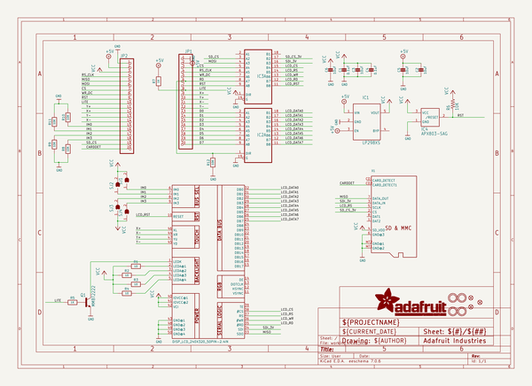
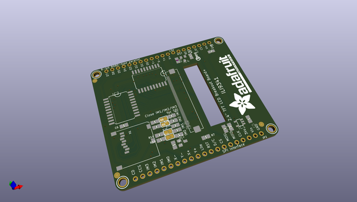
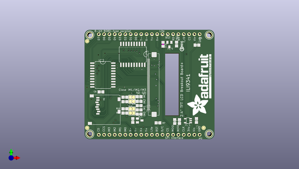
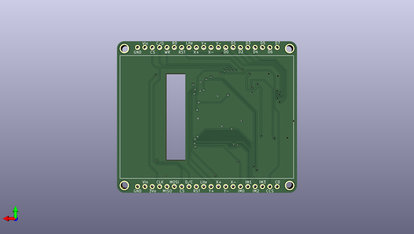

# adafruit_2_4_tft_breakout_pcb
 
## summary 
* id: adafruit_adafruit_2_4_tft_breakout_pcb_adafruit_2_4in_tft_breakout
* user: adafruit
* name: adafruit_2_4_tft_breakout_pcb
* board: adafruit_2_4in_tft_breakout
* repo: https://github.com/adafruit/Adafruit-2.4-TFT-Breakout-PCB

* src_file_repo_sch: 
* src_file_repo_sch_link: https://github.com/adafruit/Adafruit-2.4-TFT-Breakout-PCB/tree/master/

## schematic  
  
[schematic (pdf)](working_schematic.pdf)  

## pcb  
 
  
  
  
[board (pdf)](working.pdf)  

## working_bom
| Id | Designator | Footprint | Quantity | Designation | Supplier and ref |  | None | 
| --- | --- | --- | --- | --- | --- | --- | --- | 
| 1 | U$11,U$23,U$9 | FIDUCIAL_1MM | 3 | FIDUCIAL" |  |  | [''] | 
| 2 | R5,R7 | 0805-NO | 2 | 1K |  |  | [''] | 
| 3 | SJ3,SJ1,SJ4,SJ2 | SOLDERJUMPER_ARROW_NOPASTE | 4 |  |  |  | [''] | 
| 4 | R4,R2,R1,R3 | 0805-NO | 4 | 10 |  |  | [''] | 
| 5 | C1,C4 | 0805-NO | 2 | 0.1uF |  |  | [''] | 
| 6 | C6,C3,C5,C2 | 0805-NO | 4 | 10uF |  |  | [''] | 
| 7 | R6 | R0805 | 1 | 10K |  |  | [''] | 
| 8 | Q1 | SOT23-BEC | 1 | MMBT2222 |  |  | [''] | 
| 9 | U$15,U$7,U$16,U$17 | MOUNTINGHOLE_2.5_PLATED | 4 | MOUNTINGHOLE2.5 |  |  | [''] | 
| 10 | R9,R11,R8,R10,R12 | 0805-NO | 5 | 10K |  |  | [''] | 
| 11 | U$19 | ADAFRUIT_TEXT_30MM | 1 |  |  |  | [''] | 
| 12 | X1 | MICROSD | 1 |  |  |  | [''] | 
| 13 | U$26 | PCBFEAT-REV-040 | 1 |  |  |  | [''] | 
| 14 | JP1,JP2 | 1X20_ROUND | 2 |  |  |  | [''] | 
| 15 | IC2,IC3 | SO20W | 2 | 74LVC245 |  |  | [''] | 
| 16 | IC1 | SOT23-5L | 1 | MIC5225-3.3 |  |  | [''] | 
| 17 | IC4 | SOT23 | 1 | APX803-SAG |  |  | [''] | 
| 18 | U$10 | TFT_2.4IN_240X320_50PIN | 1 | DISP_LCD_240X320_50PIN-2.4IN |  |  | [''] | 

## bom_schematic
| Ref | Qnty | Value | Cmp name | Footprint | Description | Vendor | DNP | 
| --- | --- | --- | --- | --- | --- | --- | --- | 
| C1, C4 | 2 | 0.1uF | CAP_CERAMIC0805-NOOUTLINE | working:0805-NO |  |  |  | 
| C2, C3, C5, C6 | 4 | 10uF | CAP_CERAMIC0805-NOOUTLINE | working:0805-NO |  |  |  | 
| IC1 | 1 | LP298XS | LP298XS | working:SOT23-5L |  |  |  | 
| IC2, IC3 | 2 | 74245DW | 74245DW | working:SO20W |  |  |  | 
| IC4 | 1 | APX803-SAG | AXP083-SAG | working:SOT23 |  |  |  | 
| JP1, JP2 | 2 | HEADER-1X20ROUND | HEADER-1X20ROUND | working:1X20_ROUND |  |  |  | 
| Q1 | 1 | MMBT2222 | -NPN-SOT23-BEC | working:SOT23-BEC |  |  |  | 
| R1, R2, R3, R4 | 4 | 10 | RESISTOR0805_NOOUTLINE | working:0805-NO |  |  |  | 
| R5, R7 | 2 | 1K | RESISTOR0805_NOOUTLINE | working:0805-NO |  |  |  | 
| R6 | 1 | 10K | R-US_R0805 | working:R0805 |  |  |  | 
| R8, R9, R10, R11, R12 | 5 | 10K | RESISTOR0805_NOOUTLINE | working:0805-NO |  |  |  | 
| SJ1, SJ2, SJ3, SJ4 | 4 | SOLDERJUMPER | SOLDERJUMPER | working:SOLDERJUMPER_ARROW_NOPASTE |  |  |  | 
| U$7, U$15, U$16, U$17 | 4 | MOUNTINGHOLE2.5 | MOUNTINGHOLE2.5 | working:MOUNTINGHOLE_2.5_PLATED |  |  |  | 
| U$9, U$11, U$23 | 3 | FIDUCIAL"" | FIDUCIAL{dblquote}{dblquote} | working:FIDUCIAL_1MM |  |  |  | 
| U$10 | 1 | DISP_LCD_240X320_50PIN-2.4IN | DISP_LCD_240X320_50PIN-2.4IN | working:TFT_2.4IN_240X320_50PIN |  |  |  | 
| X1 | 1 | MICROSD | MICROSD | working:MICROSD |  |  |  | 

## mounting_holes
| x | y | package | value | ref | size | 
| --- | --- | --- | --- | --- | --- | 
| 119.9261 | -128.7526 | MOUNTINGHOLE_2.5_PLATED | MOUNTINGHOLE2.5 | U$7 | m3 | 
| 177.0761 | -128.7526 | MOUNTINGHOLE_2.5_PLATED | MOUNTINGHOLE2.5 | U$15 | m3 | 
| 119.9261 | -81.2546 | MOUNTINGHOLE_2.5_PLATED | MOUNTINGHOLE2.5 | U$16 | m3 | 
| 177.0761 | -81.2546 | MOUNTINGHOLE_2.5_PLATED | MOUNTINGHOLE2.5 | U$17 | m3 | 

## positions
### top
| # Ref | Val | Package | PosX | PosY | Rot | Side | 
| --- | --- | --- | --- | --- | --- | --- | 
| C1 | 0.1uF | 0805-NO | 160.5661 | -122.7836 | 90.0 | top | 
| C2 | 10uF | 0805-NO | 171.2341 | -86.0806 | 0.0 | top | 
| C3 | 10uF | 0805-NO | 162.8521 | -122.7836 | 90.0 | top | 
| C4 | 0.1uF | 0805-NO | 143.5481 | -110.8456 | 0.0 | top | 
| C5 | 10uF | 0805-NO | 170.9801 | -122.2756 | 90.0 | top | 
| C6 | 10uF | 0805-NO | 125.2601 | -108.5596 | 180.0 | top | 
| IC1 | MIC5225-3.3 | SOT23-5L | 166.9161 | -122.4026 | 90.0 | top | 
| IC2 | 74LVC245 | SO20W | 126.1491 | -100.4316 | -90.0 | top | 
| IC3 | 74LVC245 | SO20W | 140.5001 | -90.5256 | 180.0 | top | 
| IC4 | APX803-SAG | SOT23 | 158.0261 | -85.8266 | 180.0 | top | 
| JP1 | nan | 1X20_ROUND | 148.3741 | -80.8736 | 180.0 | top | 
| JP2 | nan | 1X20_ROUND | 148.3741 | -129.1336 | 180.0 | top | 
| Q1 | MMBT2222 | SOT23-BEC | 143.8021 | -122.2756 | -90.0 | top | 
| R1 | 10 | 0805-NO | 143.5481 | -119.2276 | 0.0 | top | 
| R2 | 10 | 0805-NO | 143.5481 | -117.1956 | 0.0 | top | 
| R3 | 10 | 0805-NO | 143.5481 | -115.1636 | 0.0 | top | 
| R4 | 10 | 0805-NO | 143.5481 | -113.1316 | 0.0 | top | 
| R5 | 1K | 0805-NO | 140.5001 | -122.2756 | 90.0 | top | 
| R6 | 10K | R0805 | 154.9781 | -85.6996 | -90.0 | top | 
| R7 | 1K | 0805-NO | 152.5651 | -123.4186 | 0.0 | top | 
| R8 | 10K | 0805-NO | 136.6901 | -111.0996 | 0.0 | top | 
| R9 | 10K | 0805-NO | 136.6901 | -113.2586 | 0.0 | top | 
| R10 | 10K | 0805-NO | 136.6901 | -118.7196 | 180.0 | top | 
| R11 | 10K | 0805-NO | 136.6901 | -116.6876 | 180.0 | top | 
| R12 | 10K | 0805-NO | 161.4551 | -85.5726 | 90.0 | top | 
| SJ1 | nan | SOLDERJUMPER_ARROW_NOPASTE | 140.1191 | -118.7196 | 0.0 | top | 
| SJ2 | nan | SOLDERJUMPER_ARROW_NOPASTE | 140.1191 | -116.6876 | 0.0 | top | 
| SJ3 | nan | SOLDERJUMPER_ARROW_NOPASTE | 140.1191 | -113.1316 | 180.0 | top | 
| SJ4 | nan | SOLDERJUMPER_ARROW_NOPASTE | 140.1191 | -111.0996 | 180.0 | top | 
| U$7 | MOUNTINGHOLE2.5 | MOUNTINGHOLE_2.5_PLATED | 119.9261 | -128.7526 | 0.0 | top | 
| U$9 | FIDUCIAL"" | FIDUCIAL_1MM | 174.4091 | -125.8316 | 0.0 | top | 
| U$11 | FIDUCIAL"" | FIDUCIAL_1MM | 118.6561 | -84.1756 | 0.0 | top | 
| U$15 | MOUNTINGHOLE2.5 | MOUNTINGHOLE_2.5_PLATED | 177.0761 | -128.7526 | 0.0 | top | 
| U$16 | MOUNTINGHOLE2.5 | MOUNTINGHOLE_2.5_PLATED | 119.9261 | -81.2546 | 0.0 | top | 
| U$17 | MOUNTINGHOLE2.5 | MOUNTINGHOLE_2.5_PLATED | 177.0761 | -81.2546 | 0.0 | top | 
| U$19 | nan | ADAFRUIT_TEXT_30MM | 178.0921 | -120.1166 | 90.0 | top | 
| U$23 | FIDUCIAL"" | FIDUCIAL_1MM | 118.6561 | -125.8316 | 0.0 | top | 
| U$26 | nan | PCBFEAT-REV-040 | 163.9951 | -87.9856 | 90.0 | top | 
| X1 | nan | MICROSD | 134.4041 | -110.0836 | -90.0 | top | 

### bottom
| # Ref | Val | Package | PosX | PosY | Rot | Side | 
| --- | --- | --- | --- | --- | --- | --- | 
| U$10 | DISP_LCD_240X320_50PIN-2.4IN | TFT_2.4IN_240X320_50PIN | 176.5681 | -105.0036 | -90.0 | bottom | 

