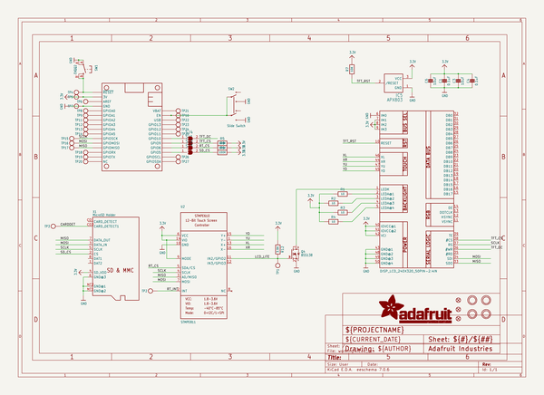
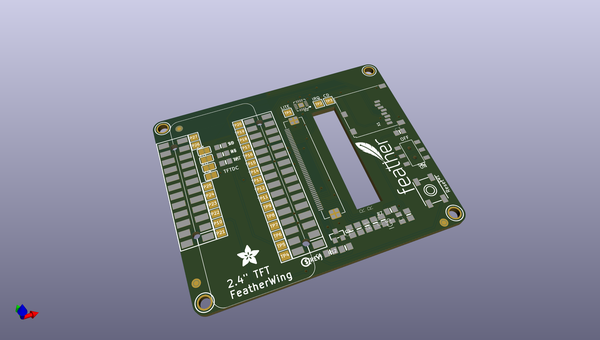
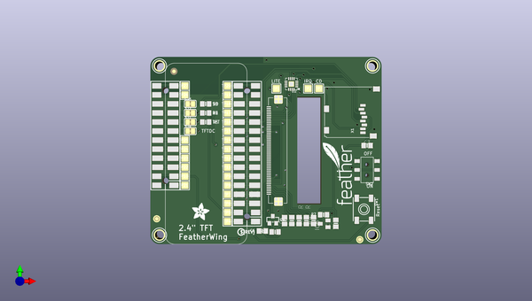
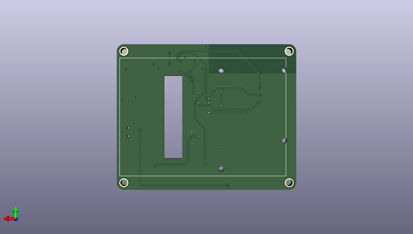

# adafruit_2_4_tft_featherwing_pcb
 
## summary 
* id: adafruit_adafruit_2_4_tft_featherwing_pcb_adafruit_2_4in_tft_featherwing
* user: adafruit
* name: adafruit_2_4_tft_featherwing_pcb
* board: adafruit_2_4in_tft_featherwing
* repo: https://github.com/adafruit/Adafruit-2.4-TFT-FeatherWing-PCB

* src_file_repo_sch: 
* src_file_repo_sch_link: https://github.com/adafruit/Adafruit-2.4-TFT-FeatherWing-PCB/tree/master/

## schematic  
  
[schematic (pdf)](working_schematic.pdf)  

## pcb  
 
  
  
  
[board (pdf)](working.pdf)  

## working_bom
| Id | Designator | Footprint | Quantity | Designation | Supplier and ref |  | None | 
| --- | --- | --- | --- | --- | --- | --- | --- | 
| 1 | R2,R4,R3,R1 | 0805-NO | 4 | 10 |  |  | [''] | 
| 2 | Q4 | SOT23-WIDE | 1 | BSS138 |  |  | [''] | 
| 3 | SJ4,SJ1,SJ3,SJ2 | SOLDERJUMPER_CLOSEDWIRE | 4 |  |  |  | [''] | 
| 4 | TP17,TP11,TP26,TP14,TP3,TP5,TP22,TP15,TP21,TP20,TP1,TP16,TP19,TP13,TP12,TP25,TP18,TP9,TP4,TP23,TP6,TP10,TP27,TP7,TP2,TP24,TP8 | TESTPOINT_PAD_2MM | 27 |  |  |  | [''] | 
| 5 | MS2 | FEATHERWING_SMT2 | 1 | FEATHERWING_SMTDUAL |  |  | [''] | 
| 6 | C1,C4 | 0805-NO | 2 | 0.1uF |  |  | [''] | 
| 7 | R5,R8,R6 | 0805-NO | 3 | 100K |  |  | [''] | 
| 8 | U$29 | FEATHERLOGO_MED | 1 |  |  |  | [''] | 
| 9 | FID2,FID1,FID3 | FIDUCIAL_1MM | 3 | FIDUCIAL" |  |  | [''] | 
| 10 | X1 | MICROSD | 1 | MicroSD Holder |  |  | [''] | 
| 11 | U$17,U$9,U$15,U$11 | MOUNTINGHOLE_2.5_PLATED | 4 | MOUNTINGHOLE2.5 |  |  | [''] | 
| 12 | U$30 | ADAFRUIT_5MM | 1 |  |  |  | [''] | 
| 13 | U$34 | PCBFEAT-REV-040 | 1 |  |  |  | [''] | 
| 14 | U2 | QFN16_3MM | 1 | STMPE811 |  |  | [''] | 
| 15 | IC5 | SOT23 | 1 | APX803 |  |  | [''] | 
| 16 | C6,C3 | 0805-NO | 2 | 10uF |  |  | [''] | 
| 17 | SW1 | EVQ-Q2_SMALLER | 1 | EVQQ2 |  |  | [''] | 
| 18 | R12 | 0805-NO | 1 | 3.9K |  |  | [''] | 
| 19 | R7 | 0805-NO | 1 | 10K |  |  | [''] | 
| 20 | SW2 | EG1390 | 1 | Slide Switch |  |  | [''] | 
| 21 | U$10 | TFT_2.4IN_240X320_50PIN | 1 | DISP_LCD_240X320_50PIN-2.4IN |  |  | [''] | 

## bom_schematic
| Ref | Qnty | Value | Cmp name | Footprint | Description | Vendor | DNP | 
| --- | --- | --- | --- | --- | --- | --- | --- | 
| C1, C4 | 2 | 0.1uF | CAP_CERAMIC0805-NOOUTLINE | working:0805-NO |  |  |  | 
| C3, C6 | 2 | 10uF | CAP_CERAMIC0805-NOOUTLINE | working:0805-NO |  |  |  | 
| FID1, FID2, FID3 | 3 | FIDUCIAL"" | FIDUCIAL{dblquote}{dblquote} | working:FIDUCIAL_1MM |  |  |  | 
| IC5 | 1 | APX803 | AXP083-SAG | working:SOT23 |  |  |  | 
| MS2 | 1 | FEATHERWING_SMTDUAL | FEATHERWING_SMTDUAL | working:FEATHERWING_SMT2 |  |  |  | 
| Q4 | 1 | BSS138 | MOSFET-NWIDE | working:SOT23-WIDE |  |  |  | 
| R1, R2, R3, R4 | 4 | 10 | RESISTOR0805_NOOUTLINE | working:0805-NO |  |  |  | 
| R5, R6, R8 | 3 | 100K | RESISTOR0805_NOOUTLINE | working:0805-NO |  |  |  | 
| R7 | 1 | 10K | RESISTOR0805_NOOUTLINE | working:0805-NO |  |  |  | 
| R12 | 1 | 3.9K | RESISTOR0805_NOOUTLINE | working:0805-NO |  |  |  | 
| SJ1, SJ2, SJ3, SJ4 | 4 | SOLDERJUMPER_CLOSED | SOLDERJUMPER_CLOSED | working:SOLDERJUMPER_CLOSEDWIRE |  |  |  | 
| SW1 | 1 | EVQQ2 | SWITCH_TACT_SMT_EVQQ2_SMALL | working:EVQ-Q2_SMALLER |  |  |  | 
| SW2 | 1 | Slide Switch | SWITCH_DPDTEG1390 | working:EG1390 |  |  |  | 
| TP1, TP2, TP3, TP4, TP5, TP6, TP7, TP8, TP9, TP10, TP11, TP12, TP13, TP14, TP15, TP16, TP17, TP18, TP19, TP20, TP21, TP22, TP23, TP24, TP25, TP26, TP27 | 27 | TESTPOINTPAD2MM | TESTPOINTPAD2MM | working:TESTPOINT_PAD_2MM |  |  |  | 
| U2 | 1 | STMPE811 | STMPE610 | working:QFN16_3MM |  |  |  | 
| U$9, U$11, U$15, U$17 | 4 | MOUNTINGHOLE2.5 | MOUNTINGHOLE2.5 | working:MOUNTINGHOLE_2.5_PLATED |  |  |  | 
| U$10 | 1 | DISP_LCD_240X320_50PIN-2.4IN | DISP_LCD_240X320_50PIN-2.4IN | working:TFT_2.4IN_240X320_50PIN |  |  |  | 
| X1 | 1 | MicroSD Holder | MICROSD | working:MICROSD |  |  |  | 

## mounting_holes
| x | y | package | value | ref | size | 
| --- | --- | --- | --- | --- | --- | 
| 118.6561 | -128.7526 | MOUNTINGHOLE_2.5_PLATED | MOUNTINGHOLE2.5 | U$9 | m3 | 
| 118.6561 | -81.2546 | MOUNTINGHOLE_2.5_PLATED | MOUNTINGHOLE2.5 | U$11 | m3 | 
| 178.3461 | -128.7526 | MOUNTINGHOLE_2.5_PLATED | MOUNTINGHOLE2.5 | U$15 | m3 | 
| 178.3461 | -81.2546 | MOUNTINGHOLE_2.5_PLATED | MOUNTINGHOLE2.5 | U$17 | m3 | 

## positions
### top
| # Ref | Val | Package | PosX | PosY | Rot | Side | 
| --- | --- | --- | --- | --- | --- | --- | 
| C1 | 0.1uF | 0805-NO | 168.0591 | -125.4506 | -90.0 | top | 
| C3 | 10uF | 0805-NO | 176.8221 | -103.6066 | 0.0 | top | 
| C4 | 0.1uF | 0805-NO | 153.7081 | -124.6886 | 90.0 | top | 
| C6 | 10uF | 0805-NO | 147.4851 | -127.6096 | 180.0 | top | 
| FID1 | FIDUCIAL"" | FIDUCIAL_1MM | 122.7201 | -82.7786 | 0.0 | top | 
| FID2 | FIDUCIAL"" | FIDUCIAL_1MM | 174.7901 | -130.0226 | 0.0 | top | 
| FID3 | FIDUCIAL"" | FIDUCIAL_1MM | 117.8941 | -124.1806 | 0.0 | top | 
| IC5 | APX803 | SOT23 | 164.7571 | -125.5776 | 90.0 | top | 
| MS2 | FEATHERWING_SMTDUAL | FEATHERWING_SMT2 | 143.1671 | -131.2926 | 90.0 | top | 
| Q4 | BSS138 | SOT23-WIDE | 150.4061 | -124.4346 | 0.0 | top | 
| R1 | 10 | 0805-NO | 155.7401 | -124.6886 | 90.0 | top | 
| R2 | 10 | 0805-NO | 157.7721 | -124.6886 | 90.0 | top | 
| R3 | 10 | 0805-NO | 159.8041 | -124.6886 | 90.0 | top | 
| R4 | 10 | 0805-NO | 161.8361 | -124.6886 | 90.0 | top | 
| R5 | 100K | 0805-NO | 131.6101 | -97.0026 | 0.0 | top | 
| R6 | 100K | 0805-NO | 131.6101 | -91.9226 | 0.0 | top | 
| R7 | 10K | 0805-NO | 164.6301 | -123.0376 | 180.0 | top | 
| R8 | 100K | 0805-NO | 131.6101 | -94.4626 | 0.0 | top | 
| R12 | 3.9K | 0805-NO | 151.0411 | -127.8636 | 180.0 | top | 
| SJ1 | nan | SOLDERJUMPER_CLOSEDWIRE | 127.2921 | -97.0026 | 0.0 | top | 
| SJ2 | nan | SOLDERJUMPER_CLOSEDWIRE | 127.2921 | -94.4626 | 0.0 | top | 
| SJ3 | nan | SOLDERJUMPER_CLOSEDWIRE | 127.2921 | -91.9226 | 0.0 | top | 
| SJ4 | nan | SOLDERJUMPER_CLOSEDWIRE | 127.2921 | -99.5426 | 0.0 | top | 
| SW1 | EVQQ2 | EVQ-Q2_SMALLER | 175.9331 | -121.5136 | -90.0 | top | 
| SW2 | Slide_Switch | EG1390 | 176.8221 | -110.4646 | 90.0 | top | 
| TP1 | nan | TESTPOINT_PAD_2MM | 151.4221 | -87.6046 | 0.0 | top | 
| TP2 | nan | TESTPOINT_PAD_2MM | 160.3121 | -87.6046 | 0.0 | top | 
| TP3 | nan | TESTPOINT_PAD_2MM | 163.3601 | -87.6046 | 0.0 | top | 
| TP4 | nan | TESTPOINT_PAD_2MM | 137.7061 | -124.9426 | 0.0 | top | 
| TP5 | nan | TESTPOINT_PAD_2MM | 137.7061 | -122.4026 | 0.0 | top | 
| TP6 | nan | TESTPOINT_PAD_2MM | 137.7061 | -119.8626 | 0.0 | top | 
| TP7 | nan | TESTPOINT_PAD_2MM | 137.7061 | -117.3226 | 180.0 | top | 
| TP8 | nan | TESTPOINT_PAD_2MM | 137.7061 | -114.7826 | 180.0 | top | 
| TP9 | nan | TESTPOINT_PAD_2MM | 137.7061 | -112.2426 | 180.0 | top | 
| TP10 | nan | TESTPOINT_PAD_2MM | 125.7681 | -112.2426 | 180.0 | top | 
| TP11 | nan | TESTPOINT_PAD_2MM | 137.7061 | -109.7026 | 180.0 | top | 
| TP12 | nan | TESTPOINT_PAD_2MM | 137.7061 | -107.1626 | 180.0 | top | 
| TP13 | nan | TESTPOINT_PAD_2MM | 137.7061 | -104.6226 | 180.0 | top | 
| TP14 | nan | TESTPOINT_PAD_2MM | 137.7061 | -102.0826 | 180.0 | top | 
| TP15 | nan | TESTPOINT_PAD_2MM | 137.7061 | -99.5426 | 180.0 | top | 
| TP16 | nan | TESTPOINT_PAD_2MM | 137.7061 | -97.0026 | 180.0 | top | 
| TP17 | nan | TESTPOINT_PAD_2MM | 137.7061 | -94.4626 | 180.0 | top | 
| TP18 | nan | TESTPOINT_PAD_2MM | 137.7061 | -91.9226 | 180.0 | top | 
| TP19 | nan | TESTPOINT_PAD_2MM | 137.7061 | -89.3826 | 180.0 | top | 
| TP20 | nan | TESTPOINT_PAD_2MM | 137.7061 | -86.8426 | 180.0 | top | 
| TP21 | nan | TESTPOINT_PAD_2MM | 125.7681 | -114.7826 | 180.0 | top | 
| TP22 | nan | TESTPOINT_PAD_2MM | 125.7681 | -109.7026 | 180.0 | top | 
| TP23 | nan | TESTPOINT_PAD_2MM | 125.7681 | -107.1626 | 180.0 | top | 
| TP24 | nan | TESTPOINT_PAD_2MM | 125.7681 | -104.6226 | 180.0 | top | 
| TP25 | nan | TESTPOINT_PAD_2MM | 125.7681 | -102.0826 | 180.0 | top | 
| TP26 | nan | TESTPOINT_PAD_2MM | 125.7681 | -89.3826 | 180.0 | top | 
| TP27 | nan | TESTPOINT_PAD_2MM | 125.7681 | -86.8426 | 180.0 | top | 
| U$9 | MOUNTINGHOLE2.5 | MOUNTINGHOLE_2.5_PLATED | 118.6561 | -128.7526 | 0.0 | top | 
| U$11 | MOUNTINGHOLE2.5 | MOUNTINGHOLE_2.5_PLATED | 118.6561 | -81.2546 | 0.0 | top | 
| U$15 | MOUNTINGHOLE2.5 | MOUNTINGHOLE_2.5_PLATED | 178.3461 | -128.7526 | 0.0 | top | 
| U$17 | MOUNTINGHOLE2.5 | MOUNTINGHOLE_2.5_PLATED | 178.3461 | -81.2546 | 0.0 | top | 
| U$29 | nan | FEATHERLOGO_MED | 172.6311 | -120.6246 | 90.0 | top | 
| U$30 | nan | ADAFRUIT_5MM | 127.8001 | -124.5616 | 0.0 | top | 
| U$34 | nan | PCBFEAT-REV-040 | 141.5161 | -127.8636 | 0.0 | top | 
| U2 | STMPE811 | QFN16_3MM | 155.6131 | -86.3346 | 180.0 | top | 
| X1 | MicroSD_Holder | MICROSD | 165.0111 | -101.3206 | 90.0 | top | 

### bottom
| # Ref | Val | Package | PosX | PosY | Rot | Side | 
| --- | --- | --- | --- | --- | --- | --- | 
| U$10 | DISP_LCD_240X320_50PIN-2.4IN | TFT_2.4IN_240X320_50PIN | 177.8381 | -105.0036 | -90.0 | bottom | 

