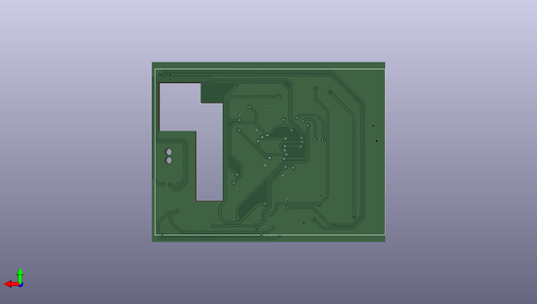

# adafruit_2_8_tft_shield_v2_pcb
 
## summary 
* id: adafruit_adafruit_2_8_tft_shield_v2_pcb_adafruit_tfttouchshield_v2_2
* user: adafruit
* name: adafruit_2_8_tft_shield_v2_pcb
* board: adafruit_tfttouchshield_v2_2
* repo: https://github.com/adafruit/Adafruit-2.8-TFT-Shield-v2-PCB

* src_file_repo_sch: 
* src_file_repo_sch_link: https://github.com/adafruit/Adafruit-2.8-TFT-Shield-v2-PCB/tree/master/

## schematic  
  
[schematic (pdf)](working_schematic.pdf)  

## pcb  
 
  
  
  
[board (pdf)](working.pdf)  

## working_bom
| Id | Designator | Footprint | Quantity | Designation | Supplier and ref |  | None | 
| --- | --- | --- | --- | --- | --- | --- | --- | 
| 1 | SJ1,D7,D5,SJ3,SJ2 | SOLDERJUMPER_ARROW_NOPASTE | 5 |  |  |  | [''] | 
| 2 | C1,C4,C5 | 0805-NO | 3 | 10uF |  |  | [''] | 
| 3 | U$20 | ADAFRUIT_TEXT_30MM | 1 |  |  |  | [''] | 
| 4 | R2,R4,R3 | 0805-NO | 3 | 68 ohm |  |  | [''] | 
| 5 | Q2,Q4,Q3 | SOT23-WIDE | 3 | BSS138 |  |  | [''] | 
| 6 | U3 | SOIC16 | 1 | 74HC4050 |  |  | [''] | 
| 7 | ICSP_SO0,ICSP_CLK0,ICSP_SI0 | SOLDERJUMPER_CLOSEDWIRE | 3 |  |  |  | [''] | 
| 8 | U$19,U$11,U$10 | FIDUCIAL_1MM | 3 | FIDUCIAL_1MM |  |  | [''] | 
| 9 | R13,R8,R15,R6,R14,R16 | 0805-NO | 6 | 10K |  |  | [''] | 
| 10 | C2,C3 | 0805-NO | 2 | 0.1uF |  |  | [''] | 
| 11 | R9 | 0805-NO | 1 | 2.2K |  |  | [''] | 
| 12 | IC5 | SOT23 | 1 | AXP803 |  |  | [''] | 
| 13 | R1 | 0805-NO | 1 | 68 |  |  | [''] | 
| 14 | IC4 | SOT23-5L | 1 | MIC5225-3.3 |  |  | [''] | 
| 15 | D1 | SOD-323F | 1 | 1N4148 |  |  | [''] | 
| 16 | SJ4 | SOLDERJUMPER_2WAY_OPEN_NOPASTE | 1 |  |  |  | [''] | 
| 17 | SCL_A5,SDA_A4 | SOLDERJUMPER_REFLOW_NOPASTE | 2 |  |  |  | [''] | 
| 18 | U$7 | PCBFEAT-REV-040 | 1 |  |  |  | [''] | 
| 19 | SW1 | EVQ-Q2 | 1 | SPST_TACT-EVQQ2 |  |  | [''] | 
| 20 | U$3 | MICROSD | 1 | MICROSD |  |  | [''] | 
| 21 | U$2 | TFT_2.83IN_240X320_50PIN | 1 | 2.8 TFT + CTP" |  |  | [''] | 
| 22 | U$17 | ARDUINOR3_ICSP_SMT | 1 | ARDUINO_R3_ICSPSMT |  |  | [''] | 

## bom_schematic
| Ref | Qnty | Value | Cmp name | Footprint | Description | Vendor | DNP | 
| --- | --- | --- | --- | --- | --- | --- | --- | 
| C1, C4, C5 | 3 | 10uF | CAP_CERAMIC0805-NOOUTLINE | working:0805-NO |  |  |  | 
| C2, C3 | 2 | 0.1uF | CAP_CERAMIC0805-NOOUTLINE | working:0805-NO |  |  |  | 
| D1 | 1 | 1N4148 | DIODESOD-323F | working:SOD-323F |  |  |  | 
| D5, D7 | 2 | SOLDERJUMPER | SOLDERJUMPER | working:SOLDERJUMPER_ARROW_NOPASTE |  |  |  | 
| IC4 | 1 | LP298XS | LP298XS | working:SOT23-5L |  |  |  | 
| IC5 | 1 | AXP803 | AXP083-SAG | working:SOT23 |  |  |  | 
| ICSP_CLK0 | 1 | SOLDERJUMPERCLOSED | SOLDERJUMPERCLOSED | working:SOLDERJUMPER_CLOSEDWIRE |  |  |  | 
| ICSP_SI0 | 1 | SOLDERJUMPERCLOSED | SOLDERJUMPERCLOSED | working:SOLDERJUMPER_CLOSEDWIRE |  |  |  | 
| ICSP_SO0 | 1 | SOLDERJUMPERCLOSED | SOLDERJUMPERCLOSED | working:SOLDERJUMPER_CLOSEDWIRE |  |  |  | 
| Q2, Q3, Q4 | 3 | BSS138 | MOSFET-NWIDE | working:SOT23-WIDE |  |  |  | 
| R1 | 1 | 68 | RESISTOR0805_NOOUTLINE | working:0805-NO |  |  |  | 
| R2, R3, R4 | 3 | 68 ohm | RESISTOR0805_NOOUTLINE | working:0805-NO |  |  |  | 
| R6, R8, R13, R14, R15, R16 | 6 | 10K | RESISTOR0805_NOOUTLINE | working:0805-NO |  |  |  | 
| R9 | 1 | 2.2K | RESISTOR0805_NOOUTLINE | working:0805-NO |  |  |  | 
| SCL_A5 | 1 | SOLDERJUMPERREFLOW_NOPASTE | SOLDERJUMPERREFLOW_NOPASTE | working:SOLDERJUMPER_REFLOW_NOPASTE |  |  |  | 
| SDA_A4 | 1 | SOLDERJUMPERREFLOW_NOPASTE | SOLDERJUMPERREFLOW_NOPASTE | working:SOLDERJUMPER_REFLOW_NOPASTE |  |  |  | 
| SJ1, SJ2, SJ3 | 3 | SOLDERJUMPER | SOLDERJUMPER | working:SOLDERJUMPER_ARROW_NOPASTE |  |  |  | 
| SJ4 | 1 | SOLDERJUMPER_2WAY | SOLDERJUMPER_2WAY | working:SOLDERJUMPER_2WAY_OPEN_NOPASTE |  |  |  | 
| SW1 | 1 | SPST_TACT-EVQQ2 | SPST_TACT-EVQQ2 | working:EVQ-Q2 |  |  |  | 
| U3 | 1 | 74HC4050 | 74HC4050D | working:SOIC16 |  |  |  | 
| U$2 | 1 | 2.8" TFT + CTP | DISP_LCD_CTP28_SAMPLE | working:TFT_2.83IN_240X320_50PIN |  |  |  | 
| U$3 | 1 | MICROSD | MICROSD | working:MICROSD |  |  |  | 
| U$10, U$11, U$19 | 3 | FIDUCIAL_1MM | FIDUCIAL_1MM | working:FIDUCIAL_1MM |  |  |  | 
| U$17 | 1 | ARDUINO_R3_ICSPSMT | ARDUINO_R3_ICSPSMT | working:ARDUINOR3_ICSP_SMT |  |  |  | 

## positions
### top
| # Ref | Val | Package | PosX | PosY | Rot | Side | 
| --- | --- | --- | --- | --- | --- | --- | 
| C1 | 10uF | 0805-NO | 151.6761 | -90.5256 | 180.0 | top | 
| C2 | 0.1uF | 0805-NO | 151.6761 | -92.3036 | 180.0 | top | 
| C3 | 0.1uF | 0805-NO | 151.9301 | -109.8296 | -90.0 | top | 
| C4 | 10uF | 0805-NO | 119.4181 | -90.5256 | 0.0 | top | 
| C5 | 10uF | 0805-NO | 154.9781 | -85.9536 | -90.0 | top | 
| D1 | 1N4148 | SOD-323F | 146.5961 | -86.4616 | 90.0 | top | 
| D5 | nan | SOLDERJUMPER_ARROW_NOPASTE | 168.4401 | -124.5616 | 180.0 | top | 
| D7 | nan | SOLDERJUMPER_ARROW_NOPASTE | 160.0581 | -124.8156 | 0.0 | top | 
| IC4 | MIC5225-3.3 | SOT23-5L | 151.6761 | -86.9696 | 180.0 | top | 
| IC5 | AXP803 | SOT23 | 147.3581 | -90.5256 | 180.0 | top | 
| ICSP_CLK0 | nan | SOLDERJUMPER_CLOSEDWIRE | 175.9331 | -112.7506 | 90.0 | top | 
| ICSP_SI0 | nan | SOLDERJUMPER_CLOSEDWIRE | 180.5051 | -112.7506 | 90.0 | top | 
| ICSP_SO0 | nan | SOLDERJUMPER_CLOSEDWIRE | 178.2191 | -112.7506 | 90.0 | top | 
| Q2 | BSS138 | SOT23-WIDE | 143.5481 | -123.4186 | 90.0 | top | 
| Q3 | BSS138 | SOT23-WIDE | 139.7381 | -123.4186 | 90.0 | top | 
| Q4 | BSS138 | SOT23-WIDE | 154.9781 | -122.7836 | -90.0 | top | 
| R1 | 68 | 0805-NO | 150.9141 | -119.2276 | 0.0 | top | 
| R2 | 68_ohm | 0805-NO | 150.9141 | -117.1956 | 0.0 | top | 
| R3 | 68_ohm | 0805-NO | 150.9141 | -115.1636 | 0.0 | top | 
| R4 | 68_ohm | 0805-NO | 150.9141 | -113.1316 | 0.0 | top | 
| R6 | 10K | 0805-NO | 144.0561 | -90.5256 | -90.0 | top | 
| R8 | 10K | 0805-NO | 164.6301 | -122.7836 | 180.0 | top | 
| R9 | 2.2K | 0805-NO | 147.8661 | -120.2436 | 90.0 | top | 
| R13 | 10K | 0805-NO | 132.3721 | -123.7996 | 0.0 | top | 
| R14 | 10K | 0805-NO | 136.0551 | -123.7996 | 180.0 | top | 
| R15 | 10K | 0805-NO | 147.1041 | -95.0976 | 0.0 | top | 
| R16 | 10K | 0805-NO | 144.4371 | -97.3836 | 180.0 | top | 
| SCL_A5 | nan | SOLDERJUMPER_REFLOW_NOPASTE | 179.8701 | -79.6036 | -90.0 | top | 
| SDA_A4 | nan | SOLDERJUMPER_REFLOW_NOPASTE | 182.4101 | -79.6036 | 90.0 | top | 
| SJ1 | nan | SOLDERJUMPER_ARROW_NOPASTE | 180.5051 | -118.7196 | 90.0 | top | 
| SJ2 | nan | SOLDERJUMPER_ARROW_NOPASTE | 178.2191 | -118.7196 | 90.0 | top | 
| SJ3 | nan | SOLDERJUMPER_ARROW_NOPASTE | 175.9331 | -118.7196 | 90.0 | top | 
| SJ4 | nan | SOLDERJUMPER_2WAY_OPEN_NOPASTE | 135.8011 | -81.5086 | 0.0 | top | 
| SW1 | SPST_TACT-EVQQ2 | EVQ-Q2 | 119.1641 | -128.8796 | 0.0 | top | 
| U$3 | MICROSD | MICROSD | 130.0861 | -93.5736 | -90.0 | top | 
| U$7 | nan | PCBFEAT-REV-040 | 141.3891 | -90.2716 | 0.0 | top | 
| U$10 | FIDUCIAL_1MM | FIDUCIAL_1MM | 167.0431 | -87.9856 | 180.0 | top | 
| U$11 | FIDUCIAL_1MM | FIDUCIAL_1MM | 119.1641 | -128.8796 | 180.0 | top | 
| U$19 | FIDUCIAL_1MM | FIDUCIAL_1MM | 115.8621 | -80.8736 | 0.0 | top | 
| U$20 | nan | ADAFRUIT_TEXT_30MM | 113.5761 | -119.3546 | 0.0 | top | 
| U3 | 74HC4050 | SOIC16 | 143.5481 | -103.9876 | -90.0 | top | 

### bottom
| # Ref | Val | Package | PosX | PosY | Rot | Side | 
| --- | --- | --- | --- | --- | --- | --- | 
| U$2 | 2.8"_TFT_+_CTP | TFT_2.83IN_240X320_50PIN | 145.3261 | -105.0036 | -90.0 | bottom | 
| U$17 | ARDUINO_R3_ICSPSMT | ARDUINOR3_ICSP_SMT | 113.8301 | -78.3336 | 0.0 | bottom | 

