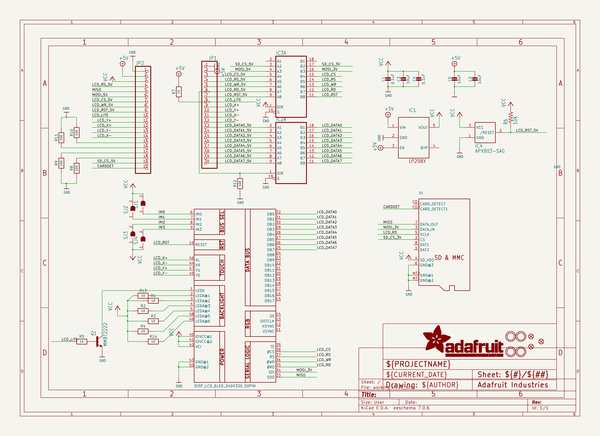
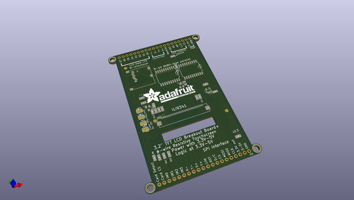
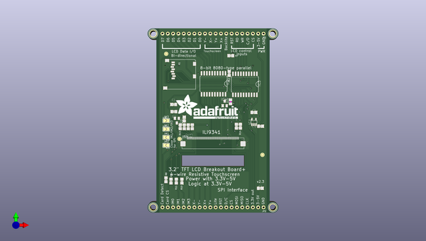
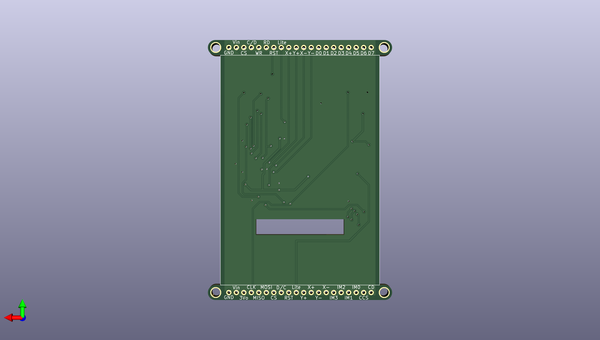

# adafruit_3_2_tft_breakout_pcb
 
## summary 
* id: adafruit_adafruit_3_2_tft_breakout_pcb_adafruit_3_2in_tft_320x240
* user: adafruit
* name: adafruit_3_2_tft_breakout_pcb
* board: adafruit_3_2in_tft_320x240
* repo: https://github.com/adafruit/Adafruit-3.2-TFT-Breakout-PCB

* src_file_repo_sch: 
* src_file_repo_sch_link: https://github.com/adafruit/Adafruit-3.2-TFT-Breakout-PCB/tree/main/

## schematic  
  
[schematic (pdf)](working_schematic.pdf)  

## pcb  
 
  
  
  
[board (pdf)](working.pdf)  

## working_bom
| Id | Designator | Footprint | Quantity | Designation | Supplier and ref |  | None | 
| --- | --- | --- | --- | --- | --- | --- | --- | 
| 1 | SJ2,SJ4,SJ3,SJ1 | SOLDERJUMPER_ARROW_NOPASTE | 4 |  |  |  | [''] | 
| 2 | R10,R11,R8,R9,R12 | 0805-NO | 5 | 10K |  |  | [''] | 
| 3 | R4,R13,R2,R14,R1,R3 | 0805-NO | 6 | 10 |  |  | [''] | 
| 4 | R5,R7 | 0805-NO | 2 | 1K |  |  | [''] | 
| 5 | X1 | MICROSD | 1 |  |  |  | [''] | 
| 6 | C2,C3,C5 | 0805-NO | 3 | 10uF |  |  | [''] | 
| 7 | JP1,JP2 | 1X20_ROUND | 2 |  |  |  | [''] | 
| 8 | IC2,IC3 | SO20W | 2 | 74LVC245 |  |  | [''] | 
| 9 | Q1 | SOT23-BEC | 1 | MMBT2222 |  |  | [''] | 
| 10 | IC1 | SOT23-5L | 1 | APA2112-3.3 |  |  | [''] | 
| 11 | U$16,U$17,U$7,U$15 | MOUNTINGHOLE_3.0_PLATEDTHIN | 4 | MOUNTINGHOLE3.0THIN |  |  | [''] | 
| 12 | U$23,U$9,U$11 | FIDUCIAL_1MM | 3 | FIDUCIAL" |  |  | [''] | 
| 13 | U$19 | ADAFRUIT_TEXT_30MM | 1 |  |  |  | [''] | 
| 14 | IC4 | SOT23 | 1 | APX803-SAG |  |  | [''] | 
| 15 | R6 | R0805 | 1 | 10K |  |  | [''] | 
| 16 | C1,C4 | 0805-NO | 2 | 0.1uF |  |  | [''] | 
| 17 | U$24 | TFT_3.2IN_240X320_50PIN | 1 | DISP_LCD_6LED_240X320_50PIN |  |  | [''] | 

## bom_schematic
| Ref | Qnty | Value | Cmp name | Footprint | Description | Vendor | DNP | 
| --- | --- | --- | --- | --- | --- | --- | --- | 
| C1, C4 | 2 | 0.1uF | CAP_CERAMIC0805-NOOUTLINE | working:0805-NO |  |  |  | 
| C2, C3, C5 | 3 | 10uF | CAP_CERAMIC0805-NOOUTLINE | working:0805-NO |  |  |  | 
| IC1 | 1 | LP298XS | LP298XS | working:SOT23-5L |  |  |  | 
| IC2, IC3 | 2 | 74245DW | 74245DW | working:SO20W |  |  |  | 
| IC4 | 1 | APX803-SAG | AXP083-SAG | working:SOT23 |  |  |  | 
| JP1, JP2 | 2 | HEADER-1X20ROUND | HEADER-1X20ROUND | working:1X20_ROUND |  |  |  | 
| Q1 | 1 | MMBT2222 | -NPN-SOT23-BEC | working:SOT23-BEC |  |  |  | 
| R1, R2, R3, R4, R13, R14 | 6 | 10 | RESISTOR0805_NOOUTLINE | working:0805-NO |  |  |  | 
| R5, R7 | 2 | 1K | RESISTOR0805_NOOUTLINE | working:0805-NO |  |  |  | 
| R6 | 1 | 10K | R-US_R0805 | working:R0805 |  |  |  | 
| R8, R9, R10, R11, R12 | 5 | 10K | RESISTOR0805_NOOUTLINE | working:0805-NO |  |  |  | 
| SJ1, SJ2, SJ3, SJ4 | 4 | SOLDERJUMPER | SOLDERJUMPER | working:SOLDERJUMPER_ARROW_NOPASTE |  |  |  | 
| U$7, U$15, U$16, U$17 | 4 | MOUNTINGHOLE3.0THIN | MOUNTINGHOLE3.0THIN | working:MOUNTINGHOLE_3.0_PLATEDTHIN |  |  |  | 
| U$9, U$11, U$23 | 3 | FIDUCIAL"" | FIDUCIAL{dblquote}{dblquote} | working:FIDUCIAL_1MM |  |  |  | 
| U$24 | 1 | DISP_LCD_6LED_240X320_50PIN | DISP_LCD_6LED_240X320_50PIN | working:TFT_3.2IN_240X320_50PIN |  |  |  | 
| X1 | 1 | MICROSD | MICROSD | working:MICROSD |  |  |  | 

## mounting_holes
| x | y | package | value | ref | size | 
| --- | --- | --- | --- | --- | --- | 
| 119.9261 | -146.5961 | MOUNTINGHOLE_3.0_PLATEDTHIN | MOUNTINGHOLE3.0THIN | U$7 | m3 | 
| 177.0761 | -146.5961 | MOUNTINGHOLE_3.0_PLATEDTHIN | MOUNTINGHOLE3.0THIN | U$15 | m3 | 
| 119.9261 | -63.4111 | MOUNTINGHOLE_3.0_PLATEDTHIN | MOUNTINGHOLE3.0THIN | U$16 | m3 | 
| 177.0761 | -63.4111 | MOUNTINGHOLE_3.0_PLATEDTHIN | MOUNTINGHOLE3.0THIN | U$17 | m3 | 

## positions
### top
| # Ref | Val | Package | PosX | PosY | Rot | Side | 
| --- | --- | --- | --- | --- | --- | --- | 
| C1 | 0.1uF | 0805-NO | 129.7051 | -97.3201 | 180.0 | top | 
| C2 | 10uF | 0805-NO | 171.1071 | -137.4521 | 0.0 | top | 
| C3 | 10uF | 0805-NO | 168.0591 | -101.1301 | 0.0 | top | 
| C4 | 0.1uF | 0805-NO | 134.7851 | -104.3051 | 90.0 | top | 
| C5 | 10uF | 0805-NO | 171.2341 | -107.7341 | 0.0 | top | 
| IC1 | APA2112-3.3 | SOT23-5L | 168.0591 | -105.7021 | 0.0 | top | 
| IC2 | 74LVC245 | SO20W | 148.7551 | -87.4141 | 180.0 | top | 
| IC3 | 74LVC245 | SO20W | 163.7411 | -87.6681 | 180.0 | top | 
| IC4 | APX803-SAG | SOT23 | 154.0891 | -96.8121 | 0.0 | top | 
| JP1 | nan | 1X20_ROUND | 148.5011 | -63.4111 | 180.0 | top | 
| JP2 | nan | 1X20_ROUND | 148.5011 | -146.5961 | 180.0 | top | 
| Q1 | MMBT2222 | SOT23-BEC | 131.2291 | -105.0671 | 180.0 | top | 
| R1 | 10 | 0805-NO | 134.7851 | -107.9881 | -90.0 | top | 
| R2 | 10 | 0805-NO | 136.6901 | -107.9881 | -90.0 | top | 
| R3 | 10 | 0805-NO | 138.5951 | -107.9881 | -90.0 | top | 
| R4 | 10 | 0805-NO | 159.6771 | -107.7341 | -90.0 | top | 
| R5 | 1K | 0805-NO | 129.8321 | -100.7491 | 0.0 | top | 
| R6 | 10K | R0805 | 156.8831 | -96.0501 | 90.0 | top | 
| R7 | 1K | 0805-NO | 157.0101 | -73.9521 | 0.0 | top | 
| R8 | 10K | 0805-NO | 126.0221 | -133.3881 | 90.0 | top | 
| R9 | 10K | 0805-NO | 128.4351 | -134.0231 | 90.0 | top | 
| R10 | 10K | 0805-NO | 133.6421 | -134.0231 | -90.0 | top | 
| R11 | 10K | 0805-NO | 130.9751 | -134.0231 | -90.0 | top | 
| R12 | 10K | 0805-NO | 156.2481 | -82.4611 | -90.0 | top | 
| R13 | 10 | 0805-NO | 132.8801 | -107.9881 | -90.0 | top | 
| R14 | 10 | 0805-NO | 161.5821 | -107.7341 | -90.0 | top | 
| SJ1 | nan | SOLDERJUMPER_ARROW_NOPASTE | 126.1491 | -116.8781 | 180.0 | top | 
| SJ2 | nan | SOLDERJUMPER_ARROW_NOPASTE | 126.1491 | -113.0681 | 180.0 | top | 
| SJ3 | nan | SOLDERJUMPER_ARROW_NOPASTE | 126.1491 | -109.1311 | 0.0 | top | 
| SJ4 | nan | SOLDERJUMPER_ARROW_NOPASTE | 126.1491 | -105.0671 | 0.0 | top | 
| U$7 | MOUNTINGHOLE3.0THIN | MOUNTINGHOLE_3.0_PLATEDTHIN | 119.9261 | -146.5961 | 0.0 | top | 
| U$9 | FIDUCIAL"" | FIDUCIAL_1MM | 172.1231 | -121.4501 | 0.0 | top | 
| U$11 | FIDUCIAL"" | FIDUCIAL_1MM | 126.1491 | -73.0631 | 0.0 | top | 
| U$15 | MOUNTINGHOLE3.0THIN | MOUNTINGHOLE_3.0_PLATEDTHIN | 177.0761 | -146.5961 | 0.0 | top | 
| U$16 | MOUNTINGHOLE3.0THIN | MOUNTINGHOLE_3.0_PLATEDTHIN | 119.9261 | -63.4111 | 0.0 | top | 
| U$17 | MOUNTINGHOLE3.0THIN | MOUNTINGHOLE_3.0_PLATEDTHIN | 177.0761 | -63.4111 | 0.0 | top | 
| U$19 | nan | ADAFRUIT_TEXT_30MM | 130.7211 | -104.1781 | 0.0 | top | 
| U$23 | FIDUCIAL"" | FIDUCIAL_1MM | 132.4991 | -113.8301 | 0.0 | top | 
| X1 | nan | MICROSD | 140.1191 | -75.8571 | -90.0 | top | 

### bottom
| # Ref | Val | Package | PosX | PosY | Rot | Side | 
| --- | --- | --- | --- | --- | --- | --- | 
| U$24 | DISP_LCD_6LED_240X320_50PIN | TFT_3.2IN_240X320_50PIN | 148.5011 | -104.0511 | 180.0 | bottom | 

