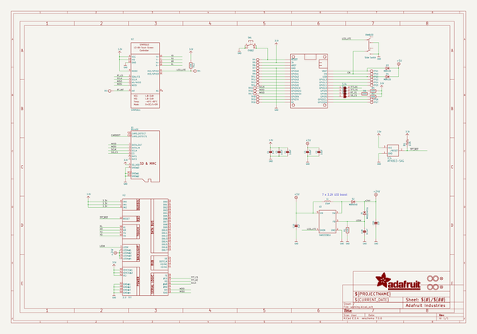
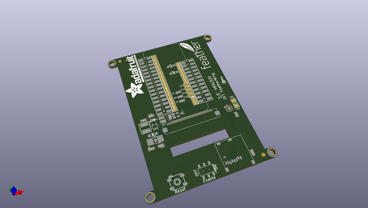
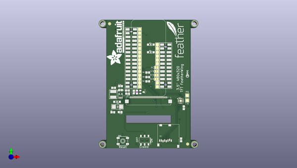
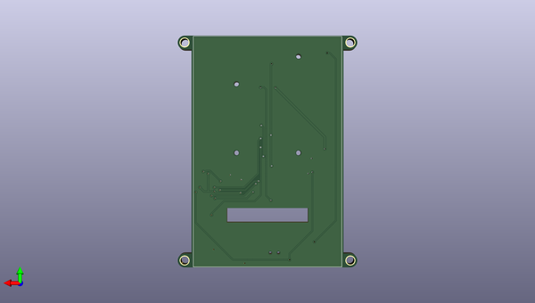

# adafruit_3_5in_tft_featherwing_pcb
 
## summary 
* id: adafruit_adafruit_3_5in_tft_featherwing_pcb_adafruit_3_5in_480x320_featherwing
* user: adafruit
* name: adafruit_3_5in_tft_featherwing_pcb
* board: adafruit_3_5in_480x320_featherwing
* repo: https://github.com/adafruit/Adafruit-3.5in-TFT-Featherwing-PCB

* src_file_repo_sch: 
* src_file_repo_sch_link: https://github.com/adafruit/Adafruit-3.5in-TFT-Featherwing-PCB/tree/master/

## schematic  
  
[schematic (pdf)](working_schematic.pdf)  

## pcb  
 
  
  
  
[board (pdf)](working.pdf)  

## working_bom
| Id | Designator | Footprint | Quantity | Designation | Supplier and ref |  | None | 
| --- | --- | --- | --- | --- | --- | --- | --- | 
| 1 | SJ1,SJ2,SJ3,SJ4 | SOLDERJUMPER_CLOSEDWIRE | 4 |  |  |  | [''] | 
| 2 | L1 | INDUCTOR_5X5MM_NR5040_NOTHERMALS | 1 | 15uH |  |  | [''] | 
| 3 | TP15,TP18,TP25,TP27,TP6,TP19,TP14,TP21,TP23,TP7,TP11,TP8,TP4,TP5,TP26,TP9,TP2,TP1,TP17,TP12,TP16,TP13,TP24,TP20,TP10,TP22 | TESTPOINT_PAD_2MM | 26 |  |  |  | [''] | 
| 4 | C5,C2,C3,C4 | 0805-NO | 4 | 10uF |  |  | [''] | 
| 5 | ENABLE0 | EG1390 | 1 | Slide Switch |  |  | [''] | 
| 6 | MS2 | FEATHERWING_SMT2 | 1 | FEATHERWING_SMTDUAL |  |  | [''] | 
| 7 | U$37 | PCBFEAT-REV-040 | 1 |  |  |  | [''] | 
| 8 | R12 | 0805-NO | 1 | 10K |  |  | [''] | 
| 9 | U$17,U$7,U$15,U$16 | MOUNTINGHOLE_3.0_PLATEDTHIN | 4 | MOUNTINGHOLE3.0THIN |  |  | [''] | 
| 10 | U3 | SOT23-5@1 | 1 | FAN5333BSX |  |  | [''] | 
| 11 | U$9,U$23 | FIDUCIAL_1MM | 2 | FIDUCIAL_1MM |  |  | [''] | 
| 12 | D3,D4 | SOD-123 | 2 | MBR120 |  |  | [''] | 
| 13 | X1 | MICROSD | 1 | MicroSD |  |  | [''] | 
| 14 | R1 | 0805-NO | 1 | 12Ω |  |  | [''] | 
| 15 | C18 | 0805-NO | 1 | 0.1uF |  |  | [''] | 
| 16 | U$19 | ADAFRUIT_TEXT_30MM | 1 |  |  |  | [''] | 
| 17 | IC4 | SOT23 | 1 | APX803-SAG |  |  | [''] | 
| 18 | C16,C1,C20 | 0805-NO | 3 | 1uF |  |  | [''] | 
| 19 | U$11 | FEATHERLOGO | 1 |  |  |  | [''] | 
| 20 | U2 | QFN16_3MM | 1 | STMPE811 |  |  | [''] | 
| 21 | D1 | SMADIODE | 1 | MM3Z24VT1G |  |  | [''] | 
| 22 | SW1 | EVQ-Q2_SMALLER | 1 | EVQQ2 |  |  | [''] | 
| 23 | R6 | R0805 | 1 | 10K |  |  | [''] | 
| 24 | R2,R5,R8 | 0805-NO | 3 | 100K |  |  | [''] | 
| 25 | D2 | SOD-123 | 1 | MBR0540 |  |  | [''] | 
| 26 | X2 | TFT_3.5IN_320X480_50PIN | 1 | 3.5 TFT" |  |  | [''] | 

## bom_schematic
| Ref | Qnty | Value | Cmp name | Footprint | Description | Vendor | DNP | 
| --- | --- | --- | --- | --- | --- | --- | --- | 
| C1, C16, C20 | 3 | 1uF | CAP_CERAMIC0805-NOOUTLINE | working:0805-NO |  |  |  | 
| C2, C3, C4, C5 | 4 | 10uF | CAP_CERAMIC0805-NOOUTLINE | working:0805-NO |  |  |  | 
| C18 | 1 | 0.1uF | CAP_CERAMIC0805-NOOUTLINE | working:0805-NO |  |  |  | 
| D1 | 1 | MM3Z24VT1G | DIODESMA | working:SMADIODE |  |  |  | 
| D2 | 1 | MBR0540 | DIODESOD-123 | working:SOD-123 |  |  |  | 
| D3, D4 | 2 | MBR120 | DIODESOD-123 | working:SOD-123 |  |  |  | 
| ENABLE0 | 1 | Slide Switch | SWITCH_DPDTEG1390 | working:EG1390 |  |  |  | 
| IC4 | 1 | APX803-SAG | AXP083-SAG | working:SOT23 |  |  |  | 
| L1 | 1 | 15uH | INDUCTORNR5040 | working:INDUCTOR_5X5MM_NR5040_NOTHERMALS |  |  |  | 
| MS2 | 1 | FEATHERWING_SMTDUAL | FEATHERWING_SMTDUAL | working:FEATHERWING_SMT2 |  |  |  | 
| R1 | 1 | 12Ω | RESISTOR0805_NOOUTLINE | working:0805-NO |  |  |  | 
| R2, R5, R8 | 3 | 100K | RESISTOR0805_NOOUTLINE | working:0805-NO |  |  |  | 
| R6 | 1 | 10K | R-US_R0805 | working:R0805 |  |  |  | 
| R12 | 1 | 10K | RESISTOR0805_NOOUTLINE | working:0805-NO |  |  |  | 
| SJ1, SJ2, SJ3, SJ4 | 4 | SOLDERJUMPER_CLOSED | SOLDERJUMPER_CLOSED | working:SOLDERJUMPER_CLOSEDWIRE |  |  |  | 
| SW1 | 1 | EVQQ2 | SWITCH_TACT_SMT_EVQQ2_SMALL | working:EVQ-Q2_SMALLER |  |  |  | 
| TP1, TP2, TP4, TP5, TP6, TP7, TP8, TP9, TP10, TP11, TP12, TP13, TP14, TP15, TP16, TP17, TP18, TP19, TP20, TP21, TP22, TP23, TP24, TP25, TP26, TP27 | 26 | TESTPOINTPAD2MM | TESTPOINTPAD2MM | working:TESTPOINT_PAD_2MM |  |  |  | 
| U2 | 1 | STMPE811 | STMPE610 | working:QFN16_3MM |  |  |  | 
| U3 | 1 | FAN5333BSX | FAN5331 | working:SOT23-5@1 |  |  |  | 
| U$7, U$15, U$16, U$17 | 4 | MOUNTINGHOLE3.0THIN | MOUNTINGHOLE3.0THIN | working:MOUNTINGHOLE_3.0_PLATEDTHIN |  |  |  | 
| U$9, U$23 | 2 | FIDUCIAL_1MM | FIDUCIAL_1MM | working:FIDUCIAL_1MM |  |  |  | 
| X1 | 1 | MicroSD | MICROSD | working:MICROSD |  |  |  | 
| X2 | 1 | 3.5" TFT | DISP_LCD_3.5IN_320X480_50PIN | working:TFT_3.5IN_320X480_50PIN |  |  |  | 

## mounting_holes
| x | y | package | value | ref | size | 
| --- | --- | --- | --- | --- | --- | 
| 118.0211 | -145.1356 | MOUNTINGHOLE_3.0_PLATEDTHIN | MOUNTINGHOLE3.0THIN | U$7 | m3 | 
| 178.9811 | -145.1356 | MOUNTINGHOLE_3.0_PLATEDTHIN | MOUNTINGHOLE3.0THIN | U$15 | m3 | 
| 118.0211 | -64.8716 | MOUNTINGHOLE_3.0_PLATEDTHIN | MOUNTINGHOLE3.0THIN | U$16 | m3 | 
| 178.9811 | -64.8716 | MOUNTINGHOLE_3.0_PLATEDTHIN | MOUNTINGHOLE3.0THIN | U$17 | m3 | 

## positions
### top
| # Ref | Val | Package | PosX | PosY | Rot | Side | 
| --- | --- | --- | --- | --- | --- | --- | 
| C1 | 1uF | 0805-NO | 138.7221 | -110.3376 | 90.0 | top | 
| C2 | 10uF | 0805-NO | 129.9591 | -109.0676 | 0.0 | top | 
| C3 | 10uF | 0805-NO | 171.8691 | -120.7516 | -90.0 | top | 
| C4 | 10uF | 0805-NO | 170.0911 | -142.0876 | 90.0 | top | 
| C5 | 10uF | 0805-NO | 125.3871 | -107.5436 | 180.0 | top | 
| C16 | 1uF | 0805-NO | 129.9591 | -106.4006 | 0.0 | top | 
| C18 | 0.1uF | 0805-NO | 134.6581 | -111.3536 | 180.0 | top | 
| C20 | 1uF | 0805-NO | 129.7051 | -123.6726 | 180.0 | top | 
| D1 | MM3Z24VT1G | SMADIODE | 127.9271 | -120.1166 | 180.0 | top | 
| D2 | MBR0540 | SOD-123 | 127.6731 | -116.8146 | 180.0 | top | 
| D3 | MBR120 | SOD-123 | 150.0251 | -78.8416 | 0.0 | top | 
| D4 | MBR120 | SOD-123 | 150.0251 | -83.9216 | 0.0 | top | 
| ENABLE0 | Slide_Switch | EG1390 | 145.9611 | -142.3416 | 180.0 | top | 
| IC4 | APX803-SAG | SOT23 | 144.1831 | -110.3376 | -90.0 | top | 
| L1 | 15uH | INDUCTOR_5X5MM_NR5040_NOTHERMALS | 125.1331 | -111.8616 | -90.0 | top | 
| MS2 | FEATHERWING_SMTDUAL | FEATHERWING_SMT2 | 137.0711 | -62.3316 | -90.0 | top | 
| R1 | 12Ω | 0805-NO | 124.8791 | -123.7996 | 0.0 | top | 
| R2 | 100K | 0805-NO | 147.9931 | -103.2256 | 180.0 | top | 
| R5 | 100K | 0805-NO | 147.9931 | -97.3836 | 180.0 | top | 
| R6 | 10K | R0805 | 140.8811 | -110.3376 | 90.0 | top | 
| R8 | 100K | 0805-NO | 147.9931 | -100.4316 | 180.0 | top | 
| R12 | 10K | 0805-NO | 134.5311 | -109.3216 | 180.0 | top | 
| SJ1 | nan | SOLDERJUMPER_CLOSEDWIRE | 153.8351 | -96.6216 | 180.0 | top | 
| SJ2 | nan | SOLDERJUMPER_CLOSEDWIRE | 153.8351 | -99.1616 | 180.0 | top | 
| SJ3 | nan | SOLDERJUMPER_CLOSEDWIRE | 153.8351 | -101.7016 | 180.0 | top | 
| SJ4 | nan | SOLDERJUMPER_CLOSEDWIRE | 153.8351 | -94.0816 | 180.0 | top | 
| SW1 | EVQQ2 | EVQ-Q2_SMALLER | 131.4831 | -142.8496 | 0.0 | top | 
| TP1 | nan | TESTPOINT_PAD_2MM | 174.1551 | -115.9256 | 0.0 | top | 
| TP2 | nan | TESTPOINT_PAD_2MM | 174.1551 | -112.6236 | 0.0 | top | 
| TP4 | nan | TESTPOINT_PAD_2MM | 142.6591 | -68.6816 | 90.0 | top | 
| TP5 | nan | TESTPOINT_PAD_2MM | 142.6591 | -71.2216 | 90.0 | top | 
| TP6 | nan | TESTPOINT_PAD_2MM | 142.6591 | -73.7616 | 90.0 | top | 
| TP7 | nan | TESTPOINT_PAD_2MM | 142.6591 | -76.3016 | 90.0 | top | 
| TP8 | nan | TESTPOINT_PAD_2MM | 142.6591 | -78.8416 | 90.0 | top | 
| TP9 | nan | TESTPOINT_PAD_2MM | 142.6591 | -81.3816 | 90.0 | top | 
| TP10 | nan | TESTPOINT_PAD_2MM | 154.3431 | -81.3816 | 90.0 | top | 
| TP11 | nan | TESTPOINT_PAD_2MM | 142.6591 | -83.9216 | 90.0 | top | 
| TP12 | nan | TESTPOINT_PAD_2MM | 142.6591 | -86.4616 | 90.0 | top | 
| TP13 | nan | TESTPOINT_PAD_2MM | 142.6591 | -89.0016 | 90.0 | top | 
| TP14 | nan | TESTPOINT_PAD_2MM | 142.6591 | -91.5416 | 90.0 | top | 
| TP15 | nan | TESTPOINT_PAD_2MM | 142.6591 | -94.0816 | 90.0 | top | 
| TP16 | nan | TESTPOINT_PAD_2MM | 142.6591 | -96.6216 | 90.0 | top | 
| TP17 | nan | TESTPOINT_PAD_2MM | 142.6591 | -99.1616 | 90.0 | top | 
| TP18 | nan | TESTPOINT_PAD_2MM | 142.6591 | -101.7016 | 90.0 | top | 
| TP19 | nan | TESTPOINT_PAD_2MM | 142.6591 | -104.2416 | 90.0 | top | 
| TP20 | nan | TESTPOINT_PAD_2MM | 142.6591 | -106.7816 | 90.0 | top | 
| TP21 | nan | TESTPOINT_PAD_2MM | 154.3431 | -78.8416 | 90.0 | top | 
| TP22 | nan | TESTPOINT_PAD_2MM | 154.3431 | -83.9216 | 90.0 | top | 
| TP23 | nan | TESTPOINT_PAD_2MM | 154.3431 | -86.4616 | 90.0 | top | 
| TP24 | nan | TESTPOINT_PAD_2MM | 154.3431 | -89.0016 | 90.0 | top | 
| TP25 | nan | TESTPOINT_PAD_2MM | 154.3431 | -91.5416 | 90.0 | top | 
| TP26 | nan | TESTPOINT_PAD_2MM | 154.3431 | -104.2416 | 90.0 | top | 
| TP27 | nan | TESTPOINT_PAD_2MM | 154.3431 | -106.7816 | 90.0 | top | 
| U$7 | MOUNTINGHOLE3.0THIN | MOUNTINGHOLE_3.0_PLATEDTHIN | 118.0211 | -145.1356 | 0.0 | top | 
| U$9 | FIDUCIAL_1MM | FIDUCIAL_1MM | 174.4091 | -144.8816 | 0.0 | top | 
| U$11 | nan | FEATHERLOGO | 171.8691 | -87.8586 | 90.0 | top | 
| U$15 | MOUNTINGHOLE3.0THIN | MOUNTINGHOLE_3.0_PLATEDTHIN | 178.9811 | -145.1356 | 0.0 | top | 
| U$16 | MOUNTINGHOLE3.0THIN | MOUNTINGHOLE_3.0_PLATEDTHIN | 118.0211 | -64.8716 | 0.0 | top | 
| U$17 | MOUNTINGHOLE3.0THIN | MOUNTINGHOLE_3.0_PLATEDTHIN | 178.9811 | -64.8716 | 0.0 | top | 
| U$19 | nan | ADAFRUIT_TEXT_30MM | 132.3721 | -92.6846 | 90.0 | top | 
| U$23 | FIDUCIAL_1MM | FIDUCIAL_1MM | 122.7201 | -64.9986 | 0.0 | top | 
| U$37 | nan | PCBFEAT-REV-040 | 174.2821 | -99.6696 | 90.0 | top | 
| U2 | STMPE811 | QFN16_3MM | 169.8371 | -116.1796 | 0.0 | top | 
| U3 | FAN5333BSX | SOT23-5@1 | 129.9591 | -112.8776 | 0.0 | top | 
| X1 | MicroSD | MICROSD | 154.5971 | -131.9276 | 0.0 | top | 

### bottom
| # Ref | Val | Package | PosX | PosY | Rot | Side | 
| --- | --- | --- | --- | --- | --- | --- | 
| X2 | 3.5"_TFT | TFT_3.5IN_320X480_50PIN | 148.5011 | -110.0836 | 180.0 | bottom | 

