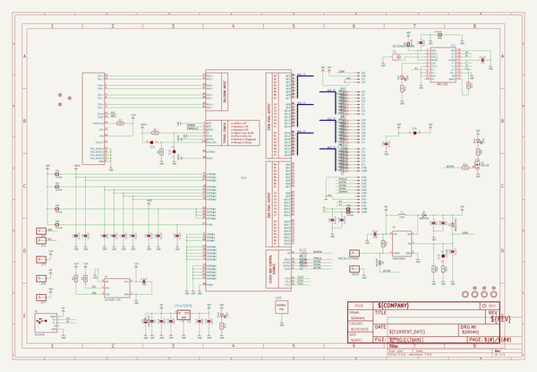
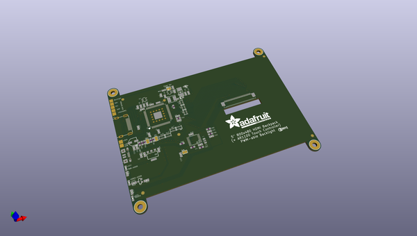
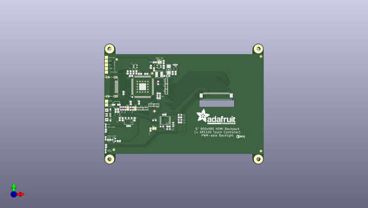
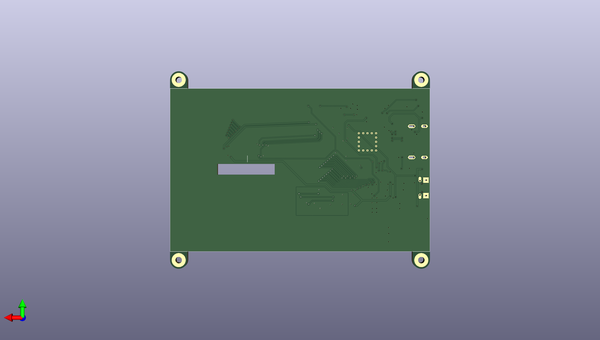

# adafruit_5_hdmi_backpack_pcb
 
## summary 
* id: adafruit_adafruit_5_hdmi_backpack_pcb_adafruit_5in_hdmi_backpack
* user: adafruit
* name: adafruit_5_hdmi_backpack_pcb
* board: adafruit_5in_hdmi_backpack
* repo: https://github.com/adafruit/Adafruit-5-HDMI-Backpack-PCB

* src_file_repo_sch: 
* src_file_repo_sch_link: https://github.com/adafruit/Adafruit-5-HDMI-Backpack-PCB/tree/master/

## schematic  
  
[schematic (pdf)](working_schematic.pdf)  

## pcb  
 
  
  
  
[board (pdf)](working.pdf)  

## working_bom
| Id | Designator | Footprint | Quantity | Designation | Supplier and ref |  | None | 
| --- | --- | --- | --- | --- | --- | --- | --- | 
| 1 | GND0,JP6,BACKLITEPWM0,JP3,JP4,JP7,JP5 | 1X01_SMD_MASKHELD_2X2MM | 7 |  |  |  | [''] | 
| 2 | LED3 | CHIPLED_0805_NOOUTLINE | 1 | Blue |  |  | [''] | 
| 3 | C13,C16,C14,C15,C12 | 0805-NO | 5 | 10uF |  |  | [''] | 
| 4 | FB3,FB7,FB2,FB8,FB1,FB5,FB4,FB6 | _0805MP | 8 | Ferrite |  |  | [''] | 
| 5 | R15,R16 | 0805-NO | 2 | 12 |  |  | [''] | 
| 6 | R21,R19,R20,R14 | 0805-NO | 4 | 1K |  |  | [''] | 
| 7 | R18,R1,R4,R13,R3 | 0805-NO | 5 | 10K |  |  | [''] | 
| 8 | C23,C3,C9,C10,C7,C1,C2,C8,C19,C11,C20 | 0805-NO | 11 | 0.1uF |  |  | [''] | 
| 9 | D1 | SOD-123 | 1 | MBR0540 |  |  | [''] | 
| 10 | SJ2,SJ1 | SOLDERJUMPER_ARROW_NOPASTE | 2 |  |  |  | [''] | 
| 11 | FID6,FID3,FID1,FID4,FID5,FID2 | FIDUCIAL_1MM | 6 | FIDUCIAL" |  |  | [''] | 
| 12 | C24 | PANASONIC_C | 1 | 100uF/6V |  |  | [''] | 
| 13 | R10,R6,R11,R9,R12,R7,R8 | RESPACK_4X0603 | 7 | 33 |  |  | [''] | 
| 14 | C4,C6 | _0805MP | 2 | 0.1uF |  |  | [''] | 
| 15 | LED1 | CHIPLED_0805_NOOUTLINE | 1 | Red |  |  | [''] | 
| 16 | U$32,U$33,U$34,U$31 | MOUNTINGHOLE_3.0_PLATED | 4 | MOUNTINGHOLE3.0 |  |  | [''] | 
| 17 | X2 | 4UCONN_20329 | 1 | MicroUSB |  |  | [''] | 
| 18 | Q1 | SOT23-WIDE | 1 | BSS138 |  |  | [''] | 
| 19 | SJ4 | SOLDERJUMPER_CLOSEDWIRE | 1 |  |  |  | [''] | 
| 20 | C5 | 0805-NO | 1 | 0.1u |  |  | [''] | 
| 21 | X1 | HDMI_MOLEX_47151-0001_DIMLAYER | 1 | 47151-0001 |  |  | [''] | 
| 22 | U4 | SOT23-5 | 1 | FAN5333BSX |  |  | [''] | 
| 23 | D2 | SMADIODE | 1 | MM3Z24VT1G |  |  | [''] | 
| 24 | C22,C21 | 0805-NO | 2 | 0.01uF |  |  | [''] | 
| 25 | U3 | SOT223-R | 1 | LT1117(3V3) |  |  | [''] | 
| 26 | LED2 | CHIPLED_0805_NOOUTLINE | 1 | Green |  |  | [''] | 
| 27 | U$75 | ADAFRUIT_TEXT_30MM | 1 |  |  |  | [''] | 
| 28 | D3 | SOD-323 | 1 | 1N4148 |  |  | [''] | 
| 29 | R2,R5 | _0805MP | 2 | 10K |  |  | [''] | 
| 30 | Y1 | RESONATOR-SMD | 1 | 12MHz |  |  | [''] | 
| 31 | L1 | INDUCTOR_5X5MM_NR5040_NOTHERMALS | 1 | 15uH |  |  | [''] | 
| 32 | U1 | S-PQFP-G100 | 1 | TFP401 |  |  | [''] | 
| 33 | C17,C25,C18 | 0805-NO | 3 | 1uF |  |  | [''] | 
| 34 | SJ3 | SOLDERJUMPER_CLOSEDWIRE | 1 | -25mA |  |  | [''] | 
| 35 | IC1 | TSSOP20-5.3MMBODY | 1 | AR1100 |  |  | [''] | 
| 36 | U$76 | PCBFEAT-REV-056 | 1 |  |  |  | [''] | 
| 37 | U2 | SOT23-5 | 1 | 24LC02BT-I/OT |  |  | [''] | 
| 38 | J1 | TFTLCD-KD50G21-40NT-A1 | 1 | TFTLCD-KD50G21-40NT-A1 |  |  | [''] | 

## bom_schematic
| Ref | Qnty | Value | Cmp name | Footprint | Description | Vendor | DNP | 
| --- | --- | --- | --- | --- | --- | --- | --- | 
| BACKLITEPWM0 | 1 | HEADER-1X1-SMD_MASKHELD_2X2MM | HEADER-1X1-SMD_MASKHELD_2X2MM | working:1X01_SMD_MASKHELD_2X2MM |  |  |  | 
| C1, C2, C3, C7, C8, C9, C10, C11, C19, C20, C23 | 11 | 0.1uF | CAP_CERAMIC0805-NOOUTLINE | working:0805-NO |  |  |  | 
| C4, C6 | 2 | 0.1uF | CAP_CERAMIC_0805MP | working:_0805MP |  |  |  | 
| C5 | 1 | 0.1u | CAP_CERAMIC0805-NOOUTLINE | working:0805-NO |  |  |  | 
| C12, C13, C14, C15, C16 | 5 | 10uF | CAP_CERAMIC0805-NOOUTLINE | working:0805-NO |  |  |  | 
| C17, C18, C25 | 3 | 1uF | CAP_CERAMIC0805-NOOUTLINE | working:0805-NO |  |  |  | 
| C21, C22 | 2 | 0.01uF | CAP_CERAMIC0805-NOOUTLINE | working:0805-NO |  |  |  | 
| C24 | 1 | 100uF/6V | CAP_ELECTROLYTICPANASONIC_C | working:PANASONIC_C |  |  |  | 
| D1 | 1 | MBR0540 | DIODESOD-123 | working:SOD-123 |  |  |  | 
| D2 | 1 | MM3Z24VT1G | DIODESMA | working:SMADIODE |  |  |  | 
| D3 | 1 | 1N4148 | DIODESOD-323 | working:SOD-323 |  |  |  | 
| FB1, FB2, FB3, FB4, FB5, FB6, FB7, FB8 | 8 | Ferrite | FERRITE_0805MP | working:_0805MP |  |  |  | 
| FID1, FID2, FID3, FID4, FID5, FID6 | 6 | FIDUCIAL"" | FIDUCIAL{dblquote}{dblquote} | working:FIDUCIAL_1MM |  |  |  | 
| GND0 | 1 | HEADER-1X1-SMD_MASKHELD_2X2MM | HEADER-1X1-SMD_MASKHELD_2X2MM | working:1X01_SMD_MASKHELD_2X2MM |  |  |  | 
| IC1 | 1 | AR1100_SSOP | AR1100_SSOP | working:TSSOP20-5.3MMBODY |  |  |  | 
| J1 | 1 | TFTLCD-KD50G21-40NT-A1 | TFTLCD-KD50G21-40NT-A1 | working:TFTLCD-KD50G21-40NT-A1 |  |  |  | 
| JP3, JP4, JP5, JP6, JP7 | 5 | HEADER-1X1-SMD_MASKHELD_2X2MM | HEADER-1X1-SMD_MASKHELD_2X2MM | working:1X01_SMD_MASKHELD_2X2MM |  |  |  | 
| L1 | 1 | 15uH | INDUCTORNR5040 | working:INDUCTOR_5X5MM_NR5040_NOTHERMALS |  |  |  | 
| LED1 | 1 | Red | LED0805_NOOUTLINE | working:CHIPLED_0805_NOOUTLINE |  |  |  | 
| LED2 | 1 | Green | LED0805_NOOUTLINE | working:CHIPLED_0805_NOOUTLINE |  |  |  | 
| LED3 | 1 | Blue | LED0805_NOOUTLINE | working:CHIPLED_0805_NOOUTLINE |  |  |  | 
| Q1 | 1 | BSS138 | MOSFET-NWIDE | working:SOT23-WIDE |  |  |  | 
| R1, R3, R4, R13, R18 | 5 | 10K | RESISTOR0805_NOOUTLINE | working:0805-NO |  |  |  | 
| R2, R5 | 2 | 10K | RESISTOR_0805MP | working:_0805MP |  |  |  | 
| R6, R7, R8, R9, R10, R11, R12 | 7 | 33 | RESISTOR_4PACK_US | working:RESPACK_4X0603 |  |  |  | 
| R14, R19, R20, R21 | 4 | 1K | RESISTOR0805_NOOUTLINE | working:0805-NO |  |  |  | 
| R15, R16 | 2 | 12 | RESISTOR0805_NOOUTLINE | working:0805-NO |  |  |  | 
| SJ1, SJ2 | 2 | SOLDERJUMPER | SOLDERJUMPER | working:SOLDERJUMPER_ARROW_NOPASTE |  |  |  | 
| SJ3 | 1 | -25mA | SOLDERJUMPERCLOSED | working:SOLDERJUMPER_CLOSEDWIRE |  |  |  | 
| SJ4 | 1 | SOLDERJUMPERCLOSED | SOLDERJUMPERCLOSED | working:SOLDERJUMPER_CLOSEDWIRE |  |  |  | 
| U1 | 1 | TFP401 | TFP401 | working:S-PQFP-G100 |  |  |  | 
| U2 | 1 | 24LC02BT-I/OT | EEPROM_I2C_MCP24AA32 | working:SOT23-5 |  |  |  | 
| U3 | 1 | LT1117(3V3) | VREG_SOT223 | working:SOT223-R |  |  |  | 
| U4 | 1 | FAN5333BSX | VREG_FAN5331 | working:SOT23-5 |  |  |  | 
| U$31, U$32, U$33, U$34 | 4 | MOUNTINGHOLE3.0 | MOUNTINGHOLE3.0 | working:MOUNTINGHOLE_3.0_PLATED |  |  |  | 
| X1 | 1 | 47151-0001 | HDMI_MOLEX_47151DIM | working:HDMI_MOLEX_47151-0001_DIMLAYER |  |  |  | 
| X2 | 1 | MicroUSB | USBMICRO_20329 | working:4UCONN_20329 |  |  |  | 
| Y1 | 1 | RESONATORSMD | RESONATORSMD | working:RESONATOR-SMD |  |  |  | 

## mounting_holes
| x | y | package | value | ref | size | 
| --- | --- | --- | --- | --- | --- | 
| 92.1511 | -63.1038 | MOUNTINGHOLE_3.0_PLATED | MOUNTINGHOLE3.0 | U$31 | m3 | 
| 204.8511 | -63.1038 | MOUNTINGHOLE_3.0_PLATED | MOUNTINGHOLE3.0 | U$32 | m3 | 
| 204.8511 | -146.9038 | MOUNTINGHOLE_3.0_PLATED | MOUNTINGHOLE3.0 | U$33 | m3 | 
| 92.1511 | -146.9038 | MOUNTINGHOLE_3.0_PLATED | MOUNTINGHOLE3.0 | U$34 | m3 | 

## positions
### top
| # Ref | Val | Package | PosX | PosY | Rot | Side | 
| --- | --- | --- | --- | --- | --- | --- | 
| BACKLITEPWM0 | nan | 1X01_SMD_MASKHELD_2X2MM | 89.7511 | -69.6038 | 0.0 | top | 
| C1 | 0.1uF | 0805-NO | 136.7921 | -122.0828 | 0.0 | top | 
| C2 | 0.1uF | 0805-NO | 114.4511 | -103.9038 | -90.0 | top | 
| C3 | 0.1uF | 0805-NO | 115.2011 | -82.1038 | 180.0 | top | 
| C4 | 0.1uF | _0805MP | 131.7121 | -122.0828 | 0.0 | top | 
| C5 | 0.1u | 0805-NO | 129.3511 | -97.0308 | 0.0 | top | 
| C6 | 0.1uF | _0805MP | 128.9511 | -88.9038 | 90.0 | top | 
| C7 | 0.1uF | 0805-NO | 119.9011 | -82.1038 | 180.0 | top | 
| C8 | 0.1uF | 0805-NO | 108.4011 | -83.6538 | 0.0 | top | 
| C9 | 0.1uF | 0805-NO | 98.6601 | -110.1318 | -90.0 | top | 
| C10 | 0.1uF | 0805-NO | 108.1511 | -104.1538 | -90.0 | top | 
| C11 | 0.1uF | 0805-NO | 102.6511 | -96.6538 | -90.0 | top | 
| C12 | 10uF | 0805-NO | 96.7601 | -110.1318 | -90.0 | top | 
| C13 | 10uF | 0805-NO | 102.0511 | -116.6038 | 90.0 | top | 
| C14 | 10uF | 0805-NO | 111.0511 | -116.6038 | 90.0 | top | 
| C15 | 10uF | 0805-NO | 129.3511 | -100.5038 | 180.0 | top | 
| C16 | 10uF | 0805-NO | 125.8011 | -78.7038 | -90.0 | top | 
| C17 | 1uF | 0805-NO | 142.1511 | -81.4038 | 90.0 | top | 
| C18 | 1uF | 0805-NO | 139.9511 | -81.4038 | 90.0 | top | 
| C19 | 0.1uF | 0805-NO | 133.1511 | -76.8038 | -90.0 | top | 
| C20 | 0.1uF | 0805-NO | 112.4511 | -81.0038 | -90.0 | top | 
| C21 | 0.01uF | 0805-NO | 145.4661 | -115.1688 | 180.0 | top | 
| C22 | 0.01uF | 0805-NO | 145.4661 | -118.9788 | 0.0 | top | 
| C23 | 0.1uF | 0805-NO | 123.1341 | -124.4308 | -90.0 | top | 
| C24 | 100uF/6V | PANASONIC_C | 97.1681 | -105.5658 | 180.0 | top | 
| C25 | 1uF | 0805-NO | 99.8351 | -116.4878 | 90.0 | top | 
| D1 | MBR0540 | SOD-123 | 135.4511 | -83.7038 | 180.0 | top | 
| D2 | MM3Z24VT1G | SMADIODE | 136.9511 | -78.8038 | 90.0 | top | 
| D3 | 1N4148 | SOD-323 | 141.8721 | -75.2128 | 180.0 | top | 
| FB1 | Ferrite | _0805MP | 104.0331 | -108.3538 | 90.0 | top | 
| FB2 | Ferrite | _0805MP | 129.3511 | -98.8308 | 180.0 | top | 
| FB3 | Ferrite | _0805MP | 100.6871 | -108.3538 | 90.0 | top | 
| FB4 | Ferrite | _0805MP | 102.3601 | -108.3538 | 90.0 | top | 
| FB5 | Ferrite | _0805MP | 145.4661 | -113.2638 | 0.0 | top | 
| FB6 | Ferrite | _0805MP | 145.4661 | -117.0738 | 0.0 | top | 
| FB7 | Ferrite | _0805MP | 136.7921 | -124.0608 | 180.0 | top | 
| FB8 | Ferrite | _0805MP | 126.1241 | -117.4108 | 0.0 | top | 
| FID1 | FIDUCIAL"" | FIDUCIAL_1MM | 124.4511 | -81.7038 | 0.0 | top | 
| FID2 | FIDUCIAL"" | FIDUCIAL_1MM | 126.1311 | -110.4538 | 0.0 | top | 
| FID3 | FIDUCIAL"" | FIDUCIAL_1MM | 206.7811 | -140.7498 | 0.0 | top | 
| FID4 | FIDUCIAL"" | FIDUCIAL_1MM | 97.5491 | -71.1488 | 0.0 | top | 
| FID5 | FIDUCIAL"" | FIDUCIAL_1MM | 95.3901 | -139.7288 | 0.0 | top | 
| FID6 | FIDUCIAL"" | FIDUCIAL_1MM | 206.7691 | -68.8628 | 0.0 | top | 
| GND0 | nan | 1X01_SMD_MASKHELD_2X2MM | 89.7511 | -78.0038 | 0.0 | top | 
| IC1 | AR1100 | TSSOP20-5.3MMBODY | 134.2521 | -117.5378 | 90.0 | top | 
| JP3 | nan | 1X01_SMD_MASKHELD_2X2MM | 89.7511 | -80.8038 | 0.0 | top | 
| JP4 | nan | 1X01_SMD_MASKHELD_2X2MM | 89.7511 | -75.2038 | 0.0 | top | 
| JP5 | nan | 1X01_SMD_MASKHELD_2X2MM | 89.7511 | -72.4038 | 0.0 | top | 
| JP6 | nan | 1X01_SMD_MASKHELD_2X2MM | 89.8511 | -105.7038 | 0.0 | top | 
| JP7 | nan | 1X01_SMD_MASKHELD_2X2MM | 89.8511 | -102.9038 | 0.0 | top | 
| L1 | 15uH | INDUCTOR_5X5MM_NR5040_NOTHERMALS | 129.6511 | -82.5038 | 0.0 | top | 
| LED1 | Red | CHIPLED_0805_NOOUTLINE | 89.1511 | -140.7588 | 0.0 | top | 
| LED2 | Green | CHIPLED_0805_NOOUTLINE | 89.2511 | -121.4038 | 180.0 | top | 
| LED3 | Blue | CHIPLED_0805_NOOUTLINE | 89.1511 | -131.0813 | 180.0 | top | 
| Q1 | BSS138 | SOT23-WIDE | 95.4191 | -132.2058 | 90.0 | top | 
| R1 | 10K | 0805-NO | 105.8511 | -81.0038 | -90.0 | top | 
| R2 | 10K | _0805MP | 108.0661 | -108.4928 | -90.0 | top | 
| R3 | 10K | 0805-NO | 108.0511 | -81.0038 | -90.0 | top | 
| R4 | 10K | 0805-NO | 110.2511 | -81.0038 | -90.0 | top | 
| R5 | 10K | _0805MP | 109.7701 | -108.4808 | 90.0 | top | 
| R6 | 33 | RESPACK_4X0603 | 135.1011 | -95.8038 | -90.0 | top | 
| R7 | 33 | RESPACK_4X0603 | 135.1011 | -91.7038 | -90.0 | top | 
| R8 | 33 | RESPACK_4X0603 | 123.5511 | -105.8538 | 180.0 | top | 
| R9 | 33 | RESPACK_4X0603 | 127.6511 | -105.8538 | 180.0 | top | 
| R10 | 33 | RESPACK_4X0603 | 115.3511 | -108.6038 | 180.0 | top | 
| R11 | 33 | RESPACK_4X0603 | 119.4511 | -108.6038 | 180.0 | top | 
| R12 | 33 | RESPACK_4X0603 | 135.1011 | -87.6038 | -90.0 | top | 
| R13 | 10K | 0805-NO | 133.5921 | -113.0928 | 180.0 | top | 
| R14 | 1K | 0805-NO | 89.3741 | -137.0218 | 90.0 | top | 
| R15 | 12 | 0805-NO | 126.3781 | -73.3078 | 180.0 | top | 
| R16 | 12 | 0805-NO | 133.1051 | -73.1758 | 90.0 | top | 
| R18 | 10K | 0805-NO | 123.4511 | -76.8038 | 90.0 | top | 
| R19 | 1K | 0805-NO | 89.2511 | -125.2038 | -90.0 | top | 
| R20 | 1K | 0805-NO | 91.8286 | -132.2058 | 0.0 | top | 
| R21 | 1K | 0805-NO | 99.1081 | -133.1328 | 180.0 | top | 
| SJ1 | nan | SOLDERJUMPER_ARROW_NOPASTE | 105.9891 | -108.4388 | 90.0 | top | 
| SJ2 | nan | SOLDERJUMPER_ARROW_NOPASTE | 111.6521 | -108.4078 | 90.0 | top | 
| SJ3 | -25mA | SOLDERJUMPER_CLOSEDWIRE | 130.0611 | -73.3078 | 0.0 | top | 
| SJ4 | nan | SOLDERJUMPER_CLOSEDWIRE | 125.9971 | -123.5998 | 0.0 | top | 
| U$31 | MOUNTINGHOLE3.0 | MOUNTINGHOLE_3.0_PLATED | 92.1511 | -63.1038 | 0.0 | top | 
| U$32 | MOUNTINGHOLE3.0 | MOUNTINGHOLE_3.0_PLATED | 204.8511 | -63.1038 | 0.0 | top | 
| U$33 | MOUNTINGHOLE3.0 | MOUNTINGHOLE_3.0_PLATED | 204.8511 | -146.9038 | 0.0 | top | 
| U$34 | MOUNTINGHOLE3.0 | MOUNTINGHOLE_3.0_PLATED | 92.1511 | -146.9038 | 0.0 | top | 
| U$75 | nan | ADAFRUIT_TEXT_30MM | 157.7471 | -120.2978 | 0.0 | top | 
| U$76 | nan | PCBFEAT-REV-056 | 189.2511 | -129.7038 | 0.0 | top | 
| U1 | TFP401 | S-PQFP-G100 | 117.1511 | -91.9038 | 0.0 | top | 
| U2 | 24LC02BT-I/OT | SOT23-5 | 111.6511 | -76.4038 | -90.0 | top | 
| U3 | LT1117(3V3) | SOT223-R | 106.5511 | -118.7038 | 180.0 | top | 
| U4 | FAN5333BSX | SOT23-5 | 129.5511 | -76.4038 | 90.0 | top | 
| X1 | 47151-0001 | HDMI_MOLEX_47151-0001_DIMLAYER | 97.4011 | -91.9038 | -90.0 | top | 
| X2 | MicroUSB | 4UCONN_20329 | 91.9011 | -113.3038 | -90.0 | top | 
| Y1 | 12MHz | RESONATOR-SMD | 140.3371 | -120.4958 | 90.0 | top | 

### bottom
| # Ref | Val | Package | PosX | PosY | Rot | Side | 
| --- | --- | --- | --- | --- | --- | --- | 
| J1 | TFTLCD-KD50G21-40NT-A1 | TFTLCD-KD50G21-40NT-A1 | 208.8511 | -142.9038 | 180.0 | bottom | 

