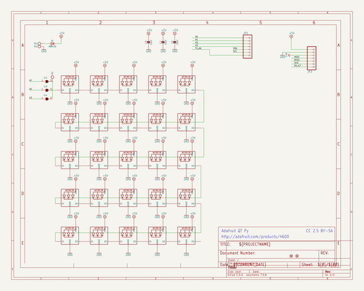
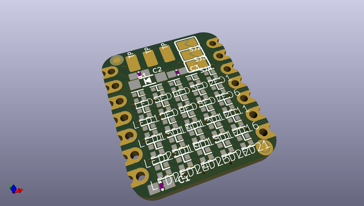
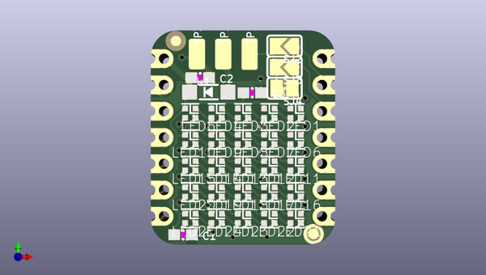
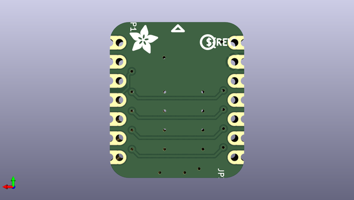

# adafruit_5x5_neopixel_grid_bff_pcb
 
## summary 
* id: adafruit_adafruit_5x5_neopixel_grid_bff_pcb_adafruit_5x5_neopixel_grid_bff
* user: adafruit
* name: adafruit_5x5_neopixel_grid_bff_pcb
* board: adafruit_5x5_neopixel_grid_bff
* repo: https://github.com/adafruit/Adafruit-5x5-NeoPixel-Grid-BFF-PCB

* src_file_repo_sch: 
* src_file_repo_sch_link: https://github.com/adafruit/Adafruit-5x5-NeoPixel-Grid-BFF-PCB/tree/main/

## schematic  
  
[schematic (pdf)](working_schematic.pdf)  

## pcb  
 
  
  
  
[board (pdf)](working.pdf)  

## working_bom
| Id | Designator | Footprint | Quantity | Designation | Supplier and ref |  | None | 
| --- | --- | --- | --- | --- | --- | --- | --- | 
| 1 | LED3,LED13,LED1,LED17,LED20,LED10,LED8,LED15,LED22,LED6,LED25,LED18,LED5,LED9,LED16,LED2,LED7,LED19,LED24,LED4,LED11,LED14,LED21,LED12,LED23 | SK6805_1515 | 25 | WS2812B_SK6805_1515 |  |  | [''] | 
| 2 | TP2 | TESTPOINT_PLUS_1X3MM | 1 |  |  |  | [''] | 
| 3 | C3,C1,C2 | 0603-NO | 3 | 10uF |  |  | [''] | 
| 4 | PLABEL3 | PLABEL3 | 1 |  |  |  | [''] | 
| 5 | TP1 | TESTPOINT_RECT_1X3MM | 1 |  |  |  | [''] | 
| 6 | U$8,U$6 | FIDUCIAL_1MM | 2 | FIDUCIAL_1MM |  |  | [''] | 
| 7 | PLABEL5 | PLABEL5 | 1 |  |  |  | [''] | 
| 8 | D1 | SOD-123 | 1 | MBR120 |  |  | [''] | 
| 9 | PLABEL4 | PLABEL4 | 1 |  |  |  | [''] | 
| 10 | SJ3,SJ2 | SOLDERJUMPER_ARROW_NOPASTE | 2 |  |  |  | [''] | 
| 11 | PLABEL0 | PLABEL0 | 1 |  |  |  | [''] | 
| 12 | SJ4 | SOLDERJUMPER_CLOSEDWIRE | 1 |  |  |  | [''] | 
| 13 | PLABEL2 | PLABEL2 | 1 |  |  |  | [''] | 
| 14 | TP3 | TESTPOINT_MINUS_1X3MM | 1 |  |  |  | [''] | 
| 15 | E$3 | ADAFRUIT_3.5MM | 1 |  |  |  | [''] | 
| 16 | JP3,JP1 | 1X07_CASTEL | 2 |  |  |  | [''] | 
| 17 | E$1 | PCBFEAT-REV-040 | 1 |  |  |  | [''] | 
| 18 | PLABEL8 | PLABEL8 | 1 |  |  |  | [''] | 
| 19 | PLABEL7 | PLABEL7 | 1 |  |  |  | [''] | 

## bom_schematic
| Ref | Qnty | Value | Cmp name | Footprint | Description | Vendor | DNP | 
| --- | --- | --- | --- | --- | --- | --- | --- | 
| C1, C2, C3 | 3 | 10uF | CAP_CERAMIC0603_NO | working:0603-NO |  |  |  | 
| D1 | 1 | MBR120 | DIODESOD-123 | working:SOD-123 |  |  |  | 
| JP1, JP3 | 2 | HEADER-1X7_CASTEL | HEADER-1X7_CASTEL | working:1X07_CASTEL |  |  |  | 
| LED1, LED2, LED3, LED4, LED5, LED6, LED7, LED8, LED9, LED10, LED11, LED12, LED13, LED14, LED15, LED16, LED17, LED18, LED19, LED20, LED21, LED22, LED23, LED24, LED25 | 25 | WS2812B_SK6805_1515 | WS2812B_SK6805_1515 | working:SK6805_1515 |  |  |  | 
| SJ2, SJ3 | 2 | SOLDERJUMPER | SOLDERJUMPER | working:SOLDERJUMPER_ARROW_NOPASTE |  |  |  | 
| SJ4 | 1 | SOLDERJUMPERCLOSED | SOLDERJUMPERCLOSED | working:SOLDERJUMPER_CLOSEDWIRE |  |  |  | 
| TP1 | 1 | TESTPOINT_1X3 | TESTPOINT_1X3 | working:TESTPOINT_RECT_1X3MM |  |  |  | 
| TP2 | 1 | TESTPOINT_PLUS13 | TESTPOINT_PLUS13 | working:TESTPOINT_PLUS_1X3MM |  |  |  | 
| TP3 | 1 | TESTPOINT_MINUS | TESTPOINT_MINUS | working:TESTPOINT_MINUS_1X3MM |  |  |  | 
| U$6, U$8 | 2 | FIDUCIAL_1MM | FIDUCIAL_1MM | working:FIDUCIAL_1MM |  |  |  | 

## positions
### top
| # Ref | Val | Package | PosX | PosY | Rot | Side | 
| --- | --- | --- | --- | --- | --- | --- | 
| C1 | 10uF | 0603-NO | 142.7226 | -114.4016 | 0.0 | top | 
| C2 | 10uF | 0603-NO | 144.3736 | -99.2251 | 0.0 | top | 
| C3 | 10uF | 0603-NO | 149.3901 | -100.6856 | 0.0 | top | 
| D1 | MBR120 | SOD-123 | 145.1991 | -100.6221 | 0.0 | top | 
| LED1 | WS2812B_SK6805_1515 | SK6805_1515 | 153.5811 | -102.6541 | 180.0 | top | 
| LED2 | WS2812B_SK6805_1515 | SK6805_1515 | 151.0411 | -102.6541 | 180.0 | top | 
| LED3 | WS2812B_SK6805_1515 | SK6805_1515 | 148.5011 | -102.6541 | 180.0 | top | 
| LED4 | WS2812B_SK6805_1515 | SK6805_1515 | 145.9611 | -102.6541 | 180.0 | top | 
| LED5 | WS2812B_SK6805_1515 | SK6805_1515 | 143.4211 | -102.6541 | 180.0 | top | 
| LED6 | WS2812B_SK6805_1515 | SK6805_1515 | 153.5811 | -105.1941 | 180.0 | top | 
| LED7 | WS2812B_SK6805_1515 | SK6805_1515 | 151.0411 | -105.1941 | 180.0 | top | 
| LED8 | WS2812B_SK6805_1515 | SK6805_1515 | 148.5011 | -105.1941 | 180.0 | top | 
| LED9 | WS2812B_SK6805_1515 | SK6805_1515 | 145.9611 | -105.1941 | 180.0 | top | 
| LED10 | WS2812B_SK6805_1515 | SK6805_1515 | 143.4211 | -105.1941 | 180.0 | top | 
| LED11 | WS2812B_SK6805_1515 | SK6805_1515 | 153.5811 | -107.7341 | 180.0 | top | 
| LED12 | WS2812B_SK6805_1515 | SK6805_1515 | 151.0411 | -107.7341 | 180.0 | top | 
| LED13 | WS2812B_SK6805_1515 | SK6805_1515 | 148.5011 | -107.7341 | 180.0 | top | 
| LED14 | WS2812B_SK6805_1515 | SK6805_1515 | 145.9611 | -107.7341 | 180.0 | top | 
| LED15 | WS2812B_SK6805_1515 | SK6805_1515 | 143.4211 | -107.7341 | 180.0 | top | 
| LED16 | WS2812B_SK6805_1515 | SK6805_1515 | 153.5811 | -110.2741 | 180.0 | top | 
| LED17 | WS2812B_SK6805_1515 | SK6805_1515 | 151.0411 | -110.2741 | 180.0 | top | 
| LED18 | WS2812B_SK6805_1515 | SK6805_1515 | 148.5011 | -110.2741 | 180.0 | top | 
| LED19 | WS2812B_SK6805_1515 | SK6805_1515 | 145.9611 | -110.2741 | 180.0 | top | 
| LED20 | WS2812B_SK6805_1515 | SK6805_1515 | 143.4211 | -110.2741 | 180.0 | top | 
| LED21 | WS2812B_SK6805_1515 | SK6805_1515 | 153.5811 | -112.8141 | 180.0 | top | 
| LED22 | WS2812B_SK6805_1515 | SK6805_1515 | 151.0411 | -112.8141 | 180.0 | top | 
| LED23 | WS2812B_SK6805_1515 | SK6805_1515 | 148.5011 | -112.8141 | 180.0 | top | 
| LED24 | WS2812B_SK6805_1515 | SK6805_1515 | 145.9611 | -112.8141 | 180.0 | top | 
| LED25 | WS2812B_SK6805_1515 | SK6805_1515 | 143.4211 | -112.8141 | 180.0 | top | 
| PLABEL0 | nan | PLABEL0 | 155.1686 | -100.8761 | 90.0 | top | 
| PLABEL2 | nan | PLABEL2 | 149.0091 | -99.1616 | 90.0 | top | 
| PLABEL3 | nan | PLABEL3 | 149.1996 | -114.4651 | 0.0 | top | 
| PLABEL4 | nan | PLABEL4 | 154.8511 | -95.8596 | 90.0 | top | 
| PLABEL5 | nan | PLABEL5 | 154.7241 | -98.0821 | 90.0 | top | 
| SJ2 | nan | SOLDERJUMPER_ARROW_NOPASTE | 152.5016 | -96.1771 | 180.0 | top | 
| SJ3 | nan | SOLDERJUMPER_ARROW_NOPASTE | 152.5016 | -98.2091 | 180.0 | top | 
| SJ4 | nan | SOLDERJUMPER_CLOSEDWIRE | 152.5016 | -100.2411 | 180.0 | top | 
| TP1 | nan | TESTPOINT_RECT_1X3MM | 149.1361 | -96.9391 | 90.0 | top | 
| TP2 | nan | TESTPOINT_PLUS_1X3MM | 146.5961 | -96.9391 | 90.0 | top | 
| TP3 | nan | TESTPOINT_MINUS_1X3MM | 144.0561 | -96.9391 | 90.0 | top | 
| U$6 | FIDUCIAL_1MM | FIDUCIAL_1MM | 155.3083 | -114.3381 | 0.0 | top | 
| U$8 | FIDUCIAL_1MM | FIDUCIAL_1MM | 142.0241 | -95.6691 | 0.0 | top | 

### bottom
| # Ref | Val | Package | PosX | PosY | Rot | Side | 
| --- | --- | --- | --- | --- | --- | --- | 
| E$1 | nan | PCBFEAT-REV-040 | 144.4371 | -97.3201 | 180.0 | bottom | 
| E$3 | nan | ADAFRUIT_3.5MM | 154.7876 | -98.8441 | 180.0 | bottom | 
| JP1 | nan | 1X07_CASTEL | 156.1211 | -105.0036 | -90.0 | bottom | 
| JP3 | nan | 1X07_CASTEL | 140.8811 | -105.0036 | 90.0 | bottom | 
| PLABEL7 | nan | PLABEL7 | 148.4376 | -97.5741 | 180.0 | bottom | 
| PLABEL8 | nan | PLABEL8 | 148.4376 | -105.0036 | 180.0 | bottom | 

