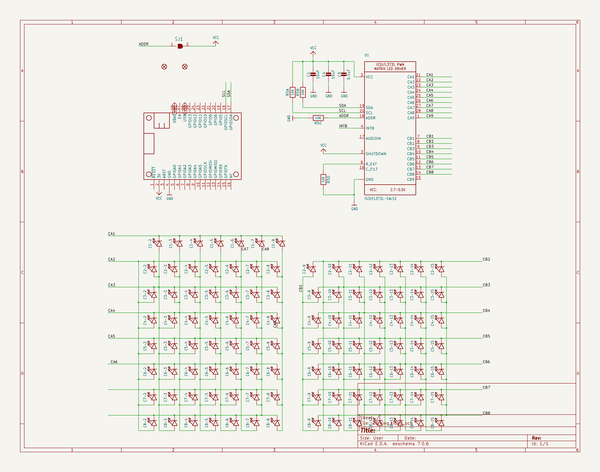
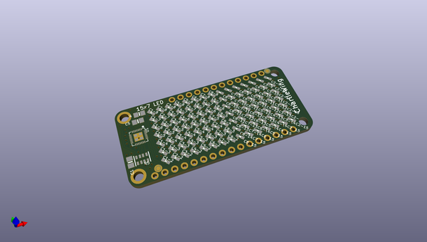
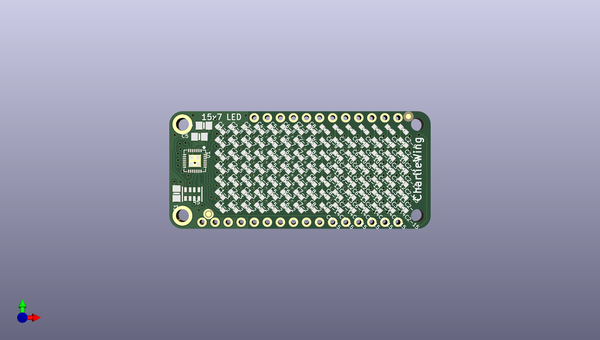
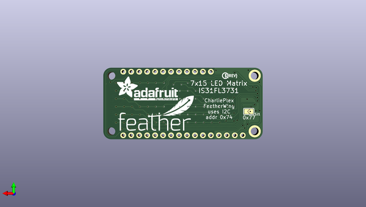

# adafruit_7x15_charlieplex_led_featherwing
 
## summary 
* id: adafruit_adafruit_7x15_charlieplex_led_featherwing_adafruit_charliewing
* user: adafruit
* name: adafruit_7x15_charlieplex_led_featherwing
* board: adafruit_charliewing
* repo: https://github.com/adafruit/Adafruit-7x15-CharliePlex-LED-FeatherWing

* src_file_repo_sch: 
* src_file_repo_sch_link: https://github.com/adafruit/Adafruit-7x15-CharliePlex-LED-FeatherWing/tree/master/

## schematic  
  
[schematic (pdf)](working_schematic.pdf)  

## pcb  
 
  
  
  
[board (pdf)](working.pdf)  

## working_bom
| Id | Designator | Footprint | Quantity | Designation | Supplier and ref |  | None | 
| --- | --- | --- | --- | --- | --- | --- | --- | 
| 1 | C8-11,C3-11,C2-3,C8-9,C6-15,C7-3,C5-5,C5-7,C1-2,C2-6,C2-15,C3-5,C7-2,C2-14,C5-8,C7-7,C7-8,C5-11,C2-8,C3-14,C5-3,C4-2,C1-5,C2-5,C3-9,C3-15,C4-13,C5-10,C6-6,C6-4,C4-6,C6-11,C6-5,C3-8,C4-10,C5-14,C8-5,C7-14,C7-13,C4-14,C8-8,C5-2,C2-7,C6-9,C5-9,C5-4,C6-2,C4-5,C8-10,C4-8,C2-10,C6-12,C3-10,C1-6,C8-3,C8-12,C3-12,C4-7,C6-3,C4-15,C4-3,C2-2,C4-4,C8-13,C7-10,C7-4,C7-15,C4-12,C3-13,C8-14,C8-6,C7-12,C8-15,C5-13,C8-4,C6-10,C2-13,C1-7,C4-11,C6-14,C7-11,C3-4,C7-9,C3-3,C2-11,C2-12,C5-6,C2-9,C3-2,C6-8,C1-8,C7-5,C6-13,C6-7,C4-9,C5-12,C1-4,C2-4,C3-7,C7-6,C8-7,C8-2,C1-3,C3-6,C5-15 | CHIPLED_0603_NOOUTLINE | 105 |  |  |  | [''] | 
| 2 | C1,C4 | 0805-NO | 2 | 10uF |  |  | [''] | 
| 3 | FID2,FID1 | FIDUCIAL_1MM | 2 | FIDUCIAL" |  |  | [''] | 
| 4 | R5 | RESPACK_4X0603 | 1 | 10K |  |  | [''] | 
| 5 | U1 | QFN28_4MM_0.4MM | 1 | IS31FL3731-SALS2 |  |  | [''] | 
| 6 | C5 | 0805-NO | 1 | 0.1uF |  |  | [''] | 
| 7 | MS1 | FEATHERWING | 1 | FEATHERWING |  |  | [''] | 
| 8 | SJ1 | SOLDERJUMPER_ARROW_NOPASTE | 1 |  |  |  | [''] | 
| 9 | U$6 | FEATHERLOGO | 1 |  |  |  | [''] | 
| 10 | U$2 | ADAFRUIT_TEXT_20MM | 1 |  |  |  | [''] | 
| 11 | U$1 | PCBFEAT-REV-040 | 1 |  |  |  | [''] | 

## bom_schematic
| Ref | Qnty | Value | Cmp name | Footprint | Description | Vendor | DNP | 
| --- | --- | --- | --- | --- | --- | --- | --- | 
| C1, C4 | 2 | 10uF | CAP_CERAMIC0805-NOOUTLINE | working:0805-NO |  |  |  | 
| C1-2, C1-3, C1-4, C1-5, C1-6, C1-7, C1-8 | 7 | LED0603_NOOUTLINE | LED0603_NOOUTLINE | working:CHIPLED_0603_NOOUTLINE |  |  |  | 
| C2-2, C2-3, C2-4, C2-5, C2-6, C2-7, C2-8, C2-9, C2-10, C2-11, C2-12, C2-13, C2-14, C2-15 | 14 | LED0603_NOOUTLINE | LED0603_NOOUTLINE | working:CHIPLED_0603_NOOUTLINE |  |  |  | 
| C3-2, C3-3, C3-4, C3-5, C3-6, C3-7, C3-8, C3-9, C3-10, C3-11, C3-12, C3-13, C3-14, C3-15 | 14 | LED0603_NOOUTLINE | LED0603_NOOUTLINE | working:CHIPLED_0603_NOOUTLINE |  |  |  | 
| C4-2, C4-3, C4-4, C4-5, C4-6, C4-7, C4-8, C4-9, C4-10, C4-11, C4-12, C4-13, C4-14, C4-15 | 14 | LED0603_NOOUTLINE | LED0603_NOOUTLINE | working:CHIPLED_0603_NOOUTLINE |  |  |  | 
| C5 | 1 | 0.1uF | CAP_CERAMIC0805-NOOUTLINE | working:0805-NO |  |  |  | 
| C5-2, C5-3, C5-4, C5-5, C5-6, C5-7, C5-8, C5-9, C5-10, C5-11, C5-12, C5-13, C5-14, C5-15 | 14 | LED0603_NOOUTLINE | LED0603_NOOUTLINE | working:CHIPLED_0603_NOOUTLINE |  |  |  | 
| C6-2, C6-3, C6-4, C6-5, C6-6, C6-7, C6-8, C6-9, C6-10, C6-11, C6-12, C6-13, C6-14, C6-15 | 14 | LED0603_NOOUTLINE | LED0603_NOOUTLINE | working:CHIPLED_0603_NOOUTLINE |  |  |  | 
| C7-2, C7-3, C7-4, C7-5, C7-6, C7-7, C7-8, C7-9, C7-10, C7-11, C7-12, C7-13, C7-14, C7-15 | 14 | LED0603_NOOUTLINE | LED0603_NOOUTLINE | working:CHIPLED_0603_NOOUTLINE |  |  |  | 
| C8-2, C8-3, C8-4, C8-5, C8-6, C8-7, C8-8, C8-9, C8-10, C8-11, C8-12, C8-13, C8-14, C8-15 | 14 | LED0603_NOOUTLINE | LED0603_NOOUTLINE | working:CHIPLED_0603_NOOUTLINE |  |  |  | 
| FID1, FID2 | 2 | FIDUCIAL"" | FIDUCIAL{dblquote}{dblquote} | working:FIDUCIAL_1MM |  |  |  | 
| MS1 | 1 | FEATHERWING | FEATHERWING | working:FEATHERWING |  |  |  | 
| R5 | 1 | 10K | RESISTOR_4PACK | working:RESPACK_4X0603 |  |  |  | 
| SJ1 | 1 | SOLDERJUMPER | SOLDERJUMPER | working:SOLDERJUMPER_ARROW_NOPASTE |  |  |  | 
| U1 | 1 | IS31FL3731-SALS2 | IS31FL3731QFN | working:QFN28_4MM_0.4MM |  |  |  | 

## positions
### top
| # Ref | Val | Package | PosX | PosY | Rot | Side | 
| --- | --- | --- | --- | --- | --- | --- | 
| C1 | 10uF | 0805-NO | 124.4981 | -109.5756 | -90.0 | top | 
| C1-2 | nan | CHIPLED_0603_NOOUTLINE | 133.0071 | -112.3696 | -135.0 | top | 
| C1-3 | nan | CHIPLED_0603_NOOUTLINE | 133.0071 | -109.8296 | -135.0 | top | 
| C1-4 | nan | CHIPLED_0603_NOOUTLINE | 133.0071 | -107.2896 | -135.0 | top | 
| C1-5 | nan | CHIPLED_0603_NOOUTLINE | 133.0071 | -104.7496 | -135.0 | top | 
| C1-6 | nan | CHIPLED_0603_NOOUTLINE | 133.0071 | -102.2096 | -135.0 | top | 
| C1-7 | nan | CHIPLED_0603_NOOUTLINE | 133.0071 | -99.6696 | -135.0 | top | 
| C1-8 | nan | CHIPLED_0603_NOOUTLINE | 133.0071 | -97.1296 | -135.0 | top | 
| C2-2 | nan | CHIPLED_0603_NOOUTLINE | 135.5471 | -112.3696 | -135.0 | top | 
| C2-3 | nan | CHIPLED_0603_NOOUTLINE | 135.5471 | -109.8296 | -135.0 | top | 
| C2-4 | nan | CHIPLED_0603_NOOUTLINE | 135.5471 | -107.2896 | -135.0 | top | 
| C2-5 | nan | CHIPLED_0603_NOOUTLINE | 135.5471 | -104.7496 | -135.0 | top | 
| C2-6 | nan | CHIPLED_0603_NOOUTLINE | 135.5471 | -102.2096 | -135.0 | top | 
| C2-7 | nan | CHIPLED_0603_NOOUTLINE | 135.5471 | -99.6696 | -135.0 | top | 
| C2-8 | nan | CHIPLED_0603_NOOUTLINE | 135.5471 | -97.1296 | -135.0 | top | 
| C2-9 | nan | CHIPLED_0603_NOOUTLINE | 168.5671 | -97.1296 | 45.0 | top | 
| C2-10 | nan | CHIPLED_0603_NOOUTLINE | 168.5671 | -99.6696 | 45.0 | top | 
| C2-11 | nan | CHIPLED_0603_NOOUTLINE | 168.5671 | -102.2096 | 45.0 | top | 
| C2-12 | nan | CHIPLED_0603_NOOUTLINE | 168.5671 | -104.7496 | 45.0 | top | 
| C2-13 | nan | CHIPLED_0603_NOOUTLINE | 168.5671 | -107.2896 | 45.0 | top | 
| C2-14 | nan | CHIPLED_0603_NOOUTLINE | 168.5671 | -109.8296 | 45.0 | top | 
| C2-15 | nan | CHIPLED_0603_NOOUTLINE | 168.5671 | -112.3696 | 45.0 | top | 
| C3-2 | nan | CHIPLED_0603_NOOUTLINE | 138.0871 | -112.3696 | -135.0 | top | 
| C3-3 | nan | CHIPLED_0603_NOOUTLINE | 138.0871 | -109.8296 | -135.0 | top | 
| C3-4 | nan | CHIPLED_0603_NOOUTLINE | 138.0871 | -107.2896 | -135.0 | top | 
| C3-5 | nan | CHIPLED_0603_NOOUTLINE | 138.0871 | -104.7496 | -135.0 | top | 
| C3-6 | nan | CHIPLED_0603_NOOUTLINE | 138.0871 | -102.2096 | -135.0 | top | 
| C3-7 | nan | CHIPLED_0603_NOOUTLINE | 138.0871 | -99.6696 | -135.0 | top | 
| C3-8 | nan | CHIPLED_0603_NOOUTLINE | 138.0871 | -97.1296 | -135.0 | top | 
| C3-9 | nan | CHIPLED_0603_NOOUTLINE | 166.0271 | -97.1296 | 45.0 | top | 
| C3-10 | nan | CHIPLED_0603_NOOUTLINE | 166.0271 | -99.6696 | 45.0 | top | 
| C3-11 | nan | CHIPLED_0603_NOOUTLINE | 166.0271 | -102.2096 | 45.0 | top | 
| C3-12 | nan | CHIPLED_0603_NOOUTLINE | 166.0271 | -104.7496 | 45.0 | top | 
| C3-13 | nan | CHIPLED_0603_NOOUTLINE | 166.0271 | -107.2896 | 45.0 | top | 
| C3-14 | nan | CHIPLED_0603_NOOUTLINE | 166.0271 | -109.8296 | 45.0 | top | 
| C3-15 | nan | CHIPLED_0603_NOOUTLINE | 166.0271 | -112.3696 | 45.0 | top | 
| C4 | 10uF | 0805-NO | 129.8321 | -96.3676 | 180.0 | top | 
| C4-2 | nan | CHIPLED_0603_NOOUTLINE | 140.6271 | -112.3696 | -135.0 | top | 
| C4-3 | nan | CHIPLED_0603_NOOUTLINE | 140.6271 | -109.8296 | -135.0 | top | 
| C4-4 | nan | CHIPLED_0603_NOOUTLINE | 140.6271 | -107.2896 | -135.0 | top | 
| C4-5 | nan | CHIPLED_0603_NOOUTLINE | 140.6271 | -104.7496 | -135.0 | top | 
| C4-6 | nan | CHIPLED_0603_NOOUTLINE | 140.6271 | -102.2096 | -135.0 | top | 
| C4-7 | nan | CHIPLED_0603_NOOUTLINE | 140.6271 | -99.6696 | -135.0 | top | 
| C4-8 | nan | CHIPLED_0603_NOOUTLINE | 140.6271 | -97.1296 | -135.0 | top | 
| C4-9 | nan | CHIPLED_0603_NOOUTLINE | 163.4871 | -97.1296 | 45.0 | top | 
| C4-10 | nan | CHIPLED_0603_NOOUTLINE | 163.4871 | -99.6696 | 45.0 | top | 
| C4-11 | nan | CHIPLED_0603_NOOUTLINE | 163.4871 | -102.2096 | 45.0 | top | 
| C4-12 | nan | CHIPLED_0603_NOOUTLINE | 163.4871 | -104.7496 | 45.0 | top | 
| C4-13 | nan | CHIPLED_0603_NOOUTLINE | 163.4871 | -107.2896 | 45.0 | top | 
| C4-14 | nan | CHIPLED_0603_NOOUTLINE | 163.4871 | -109.8296 | 45.0 | top | 
| C4-15 | nan | CHIPLED_0603_NOOUTLINE | 163.4871 | -112.3696 | 45.0 | top | 
| C5 | 0.1uF | 0805-NO | 128.9431 | -98.5266 | 180.0 | top | 
| C5-2 | nan | CHIPLED_0603_NOOUTLINE | 143.1671 | -112.3696 | -135.0 | top | 
| C5-3 | nan | CHIPLED_0603_NOOUTLINE | 143.1671 | -109.8296 | -135.0 | top | 
| C5-4 | nan | CHIPLED_0603_NOOUTLINE | 143.1671 | -107.2896 | -135.0 | top | 
| C5-5 | nan | CHIPLED_0603_NOOUTLINE | 143.1671 | -104.7496 | -135.0 | top | 
| C5-6 | nan | CHIPLED_0603_NOOUTLINE | 143.1671 | -102.2096 | -135.0 | top | 
| C5-7 | nan | CHIPLED_0603_NOOUTLINE | 143.1671 | -99.6696 | -135.0 | top | 
| C5-8 | nan | CHIPLED_0603_NOOUTLINE | 143.1671 | -97.1296 | -135.0 | top | 
| C5-9 | nan | CHIPLED_0603_NOOUTLINE | 160.9471 | -97.1296 | 45.0 | top | 
| C5-10 | nan | CHIPLED_0603_NOOUTLINE | 160.9471 | -99.6696 | 45.0 | top | 
| C5-11 | nan | CHIPLED_0603_NOOUTLINE | 160.9471 | -102.2096 | 45.0 | top | 
| C5-12 | nan | CHIPLED_0603_NOOUTLINE | 160.9471 | -104.7496 | 45.0 | top | 
| C5-13 | nan | CHIPLED_0603_NOOUTLINE | 160.9471 | -107.2896 | 45.0 | top | 
| C5-14 | nan | CHIPLED_0603_NOOUTLINE | 160.9471 | -109.8296 | 45.0 | top | 
| C5-15 | nan | CHIPLED_0603_NOOUTLINE | 160.9471 | -112.3696 | 45.0 | top | 
| C6-2 | nan | CHIPLED_0603_NOOUTLINE | 145.7071 | -112.3696 | -135.0 | top | 
| C6-3 | nan | CHIPLED_0603_NOOUTLINE | 145.7071 | -109.8296 | -135.0 | top | 
| C6-4 | nan | CHIPLED_0603_NOOUTLINE | 145.7071 | -107.2896 | -135.0 | top | 
| C6-5 | nan | CHIPLED_0603_NOOUTLINE | 145.7071 | -104.7496 | -135.0 | top | 
| C6-6 | nan | CHIPLED_0603_NOOUTLINE | 145.7071 | -102.2096 | -135.0 | top | 
| C6-7 | nan | CHIPLED_0603_NOOUTLINE | 145.7071 | -99.6696 | -135.0 | top | 
| C6-8 | nan | CHIPLED_0603_NOOUTLINE | 145.7071 | -97.1296 | -135.0 | top | 
| C6-9 | nan | CHIPLED_0603_NOOUTLINE | 158.4071 | -97.1296 | 45.0 | top | 
| C6-10 | nan | CHIPLED_0603_NOOUTLINE | 158.4071 | -99.6696 | 45.0 | top | 
| C6-11 | nan | CHIPLED_0603_NOOUTLINE | 158.4071 | -102.2096 | 45.0 | top | 
| C6-12 | nan | CHIPLED_0603_NOOUTLINE | 158.4071 | -104.7496 | 45.0 | top | 
| C6-13 | nan | CHIPLED_0603_NOOUTLINE | 158.4071 | -107.2896 | 45.0 | top | 
| C6-14 | nan | CHIPLED_0603_NOOUTLINE | 158.4071 | -109.8296 | 45.0 | top | 
| C6-15 | nan | CHIPLED_0603_NOOUTLINE | 158.4071 | -112.3696 | 45.0 | top | 
| C7-2 | nan | CHIPLED_0603_NOOUTLINE | 148.2471 | -112.3696 | -135.0 | top | 
| C7-3 | nan | CHIPLED_0603_NOOUTLINE | 148.2471 | -109.8296 | -135.0 | top | 
| C7-4 | nan | CHIPLED_0603_NOOUTLINE | 148.2471 | -107.2896 | -135.0 | top | 
| C7-5 | nan | CHIPLED_0603_NOOUTLINE | 148.2471 | -104.7496 | -135.0 | top | 
| C7-6 | nan | CHIPLED_0603_NOOUTLINE | 148.2471 | -102.2096 | -135.0 | top | 
| C7-7 | nan | CHIPLED_0603_NOOUTLINE | 148.2471 | -99.6696 | -135.0 | top | 
| C7-8 | nan | CHIPLED_0603_NOOUTLINE | 148.2471 | -97.1296 | -135.0 | top | 
| C7-9 | nan | CHIPLED_0603_NOOUTLINE | 155.8671 | -97.1296 | 45.0 | top | 
| C7-10 | nan | CHIPLED_0603_NOOUTLINE | 155.8671 | -99.6696 | 45.0 | top | 
| C7-11 | nan | CHIPLED_0603_NOOUTLINE | 155.8671 | -102.2096 | 45.0 | top | 
| C7-12 | nan | CHIPLED_0603_NOOUTLINE | 155.8671 | -104.7496 | 45.0 | top | 
| C7-13 | nan | CHIPLED_0603_NOOUTLINE | 155.8671 | -107.2896 | 45.0 | top | 
| C7-14 | nan | CHIPLED_0603_NOOUTLINE | 155.8671 | -109.8296 | 45.0 | top | 
| C7-15 | nan | CHIPLED_0603_NOOUTLINE | 155.8671 | -112.3696 | 45.0 | top | 
| C8-2 | nan | CHIPLED_0603_NOOUTLINE | 150.7871 | -112.3696 | -135.0 | top | 
| C8-3 | nan | CHIPLED_0603_NOOUTLINE | 150.7871 | -109.8296 | -135.0 | top | 
| C8-4 | nan | CHIPLED_0603_NOOUTLINE | 150.7871 | -107.2896 | -135.0 | top | 
| C8-5 | nan | CHIPLED_0603_NOOUTLINE | 150.7871 | -104.7496 | -135.0 | top | 
| C8-6 | nan | CHIPLED_0603_NOOUTLINE | 150.7871 | -102.2096 | -135.0 | top | 
| C8-7 | nan | CHIPLED_0603_NOOUTLINE | 150.7871 | -99.6696 | -135.0 | top | 
| C8-8 | nan | CHIPLED_0603_NOOUTLINE | 150.7871 | -97.1296 | -135.0 | top | 
| C8-9 | nan | CHIPLED_0603_NOOUTLINE | 153.3271 | -97.1296 | 45.0 | top | 
| C8-10 | nan | CHIPLED_0603_NOOUTLINE | 153.3271 | -99.6696 | 45.0 | top | 
| C8-11 | nan | CHIPLED_0603_NOOUTLINE | 153.3271 | -102.2096 | 45.0 | top | 
| C8-12 | nan | CHIPLED_0603_NOOUTLINE | 153.3271 | -104.7496 | 45.0 | top | 
| C8-13 | nan | CHIPLED_0603_NOOUTLINE | 153.3271 | -107.2896 | 45.0 | top | 
| C8-14 | nan | CHIPLED_0603_NOOUTLINE | 153.3271 | -109.8296 | 45.0 | top | 
| C8-15 | nan | CHIPLED_0603_NOOUTLINE | 153.3271 | -112.3696 | 45.0 | top | 
| FID1 | FIDUC | FIDUCIAL_1MM | 130.7211 | -113.5761 | 0.0 | top | 
| FID2 | FIDUC | FIDUCIAL_1MM | 169.5831 | -94.5896 | 0.0 | top | 
| MS1 | FEATH | FEATHERWING | 123.1011 | -116.4336 | 0.0 | top | 
| R5 | 10K | RESPACK_4X0603 | 127.5461 | -109.7026 | 180.0 | top | 
| U1 | IS31F | QFN28_4MM_0.4MM | 128.0541 | -103.2256 | -90.0 | top | 

### bottom
| # Ref | Val | Package | PosX | PosY | Rot | Side | 
| --- | --- | --- | --- | --- | --- | --- | 
| SJ1 | nan | SOLDERJUMPER_ARROW_NOPASTE | 127.5461 | -107.5436 | 0.0 | bottom | 
| U$1 | nan | PCBFEAT-REV-040 | 135.0391 | -96.1136 | 180.0 | bottom | 
| U$2 | nan | ADAFRUIT_TEXT_20MM | 169.7101 | -103.9876 | 180.0 | bottom | 
| U$6 | nan | FEATHERLOGO | 169.3291 | -113.7666 | 180.0 | bottom | 

