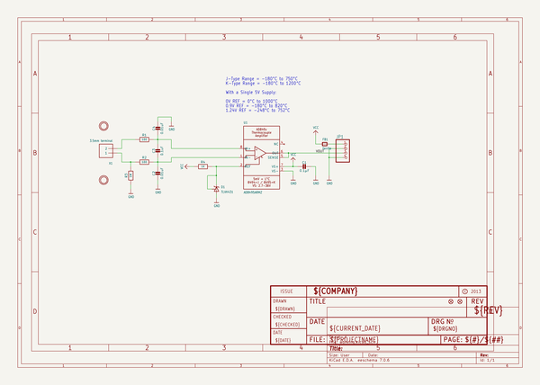
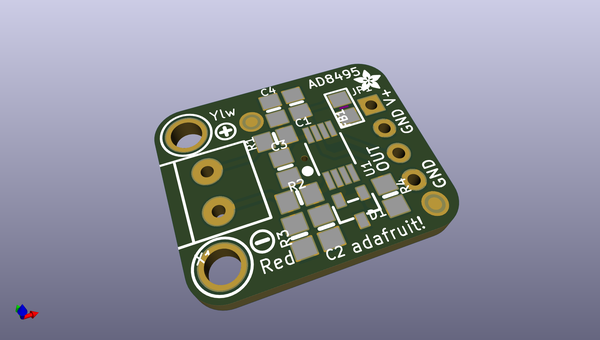
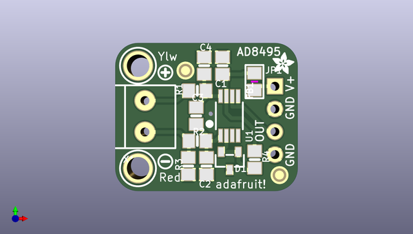
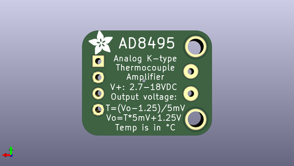

# adafruit_ad8495_breakout_pcb
 
## summary 
* id: adafruit_adafruit_ad8495_breakout_pcb_adafruit_ad849x_thermo
* user: adafruit
* name: adafruit_ad8495_breakout_pcb
* board: adafruit_ad849x_thermo
* repo: https://github.com/adafruit/Adafruit-AD8495-Breakout-PCB

* src_file_repo_sch: 
* src_file_repo_sch_link: https://github.com/adafruit/Adafruit-AD8495-Breakout-PCB/tree/master/

## schematic  
  
[schematic (pdf)](working_schematic.pdf)  

## pcb  
 
  
  
  
[board (pdf)](working.pdf)  

## working_bom
| Id | Designator | Footprint | Quantity | Designation | Supplier and ref |  | None | 
| --- | --- | --- | --- | --- | --- | --- | --- | 
| 1 | R4 | 0805-NO | 1 | 1K |  |  | [''] | 
| 2 | D1 | SOT23-R | 1 | TLVH431 |  |  | [''] | 
| 3 | U$12,U$11 | MOUNTINGHOLE_2.5_PLATED | 2 | MOUNTINGHOLE2.5 |  |  | [''] | 
| 4 | U$9 | SYMBOL_MINUS | 1 |  |  |  | [''] | 
| 5 | FB1 | 0805 | 1 | ferrite |  |  | [''] | 
| 6 | X1 | TERMBLOCK_1X2-3.5MM | 1 | 3.5mm terminal |  |  | [''] | 
| 7 | R3 | 0805-NO | 1 | 1M |  |  | [''] | 
| 8 | U1 | MSOP8_0.65MM | 1 | AD8495ARMZ  |  |  | [''] | 
| 9 | U$10 | ADAFRUIT_2.5MM | 1 |  |  |  | [''] | 
| 10 | R1,R2 | 0805-NO | 2 | 100 |  |  | [''] | 
| 11 | C1 | 0805-NO | 1 | 0.1µF |  |  | [''] | 
| 12 | C4,C2 | 0805-NO | 2 | 0.01uF |  |  | [''] | 
| 13 | FID2,FID1 | FIDUCIAL_1MM | 2 | FIDUCIAL" |  |  | [''] | 
| 14 | C3 | 0805-NO | 1 | 0.1uF |  |  | [''] | 
| 15 | JP1 | 1X04_ROUND | 1 |  |  |  | [''] | 
| 16 | U$8 | SYMBOL_PLUS | 1 |  |  |  | [''] | 
| 17 | U$13 | ADAFRUIT_3.5MM | 1 |  |  |  | [''] | 

## bom_schematic
| Ref | Qnty | Value | Cmp name | Footprint | Description | Vendor | DNP | 
| --- | --- | --- | --- | --- | --- | --- | --- | 
| C1 | 1 | 0.1µF | CAP_CERAMIC0805-NOOUTLINE | working:0805-NO |  |  |  | 
| C2, C4 | 2 | 0.01uF | CAP_CERAMIC0805-NOOUTLINE | working:0805-NO |  |  |  | 
| C3 | 1 | 0.1uF | CAP_CERAMIC0805-NOOUTLINE | working:0805-NO |  |  |  | 
| D1 | 1 | TLVH431 | SHUNT-VREF | working:SOT23-R |  |  |  | 
| FB1 | 1 | ferrite | FERRITE0805 | working:0805 |  |  |  | 
| FID1, FID2 | 2 | FIDUCIAL"" | FIDUCIAL{dblquote}{dblquote} | working:FIDUCIAL_1MM |  |  |  | 
| JP1 | 1 | HEADER-1X4ROUND | HEADER-1X4ROUND | working:1X04_ROUND |  |  |  | 
| R1, R2 | 2 | 100 | RESISTOR0805_NOOUTLINE | working:0805-NO |  |  |  | 
| R3 | 1 | 1M | RESISTOR0805_NOOUTLINE | working:0805-NO |  |  |  | 
| R4 | 1 | 1K | RESISTOR0805_NOOUTLINE | working:0805-NO |  |  |  | 
| U1 | 1 | AD8495ARMZ  | AD849X | working:MSOP8_0.65MM |  |  |  | 
| U$11, U$12 | 2 | MOUNTINGHOLE2.5 | MOUNTINGHOLE2.5 | working:MOUNTINGHOLE_2.5_PLATED |  |  |  | 
| X1 | 1 | 3.5mm terminal | TERMBLOCK_1X2 | working:TERMBLOCK_1X2-3.5MM |  |  |  | 

## mounting_holes
| x | y | package | value | ref | size | 
| --- | --- | --- | --- | --- | --- | 
| 140.8811 | -99.2886 | MOUNTINGHOLE_2.5_PLATED | MOUNTINGHOLE2.5 | U$11 | m3 | 
| 140.8811 | -110.7186 | MOUNTINGHOLE_2.5_PLATED | MOUNTINGHOLE2.5 | U$12 | m3 | 

## positions
### top
| # Ref | Val | Package | PosX | PosY | Rot | Side | 
| --- | --- | --- | --- | --- | --- | --- | 
| C1 | 0.1µF | 0805-NO | 150.2791 | -99.2886 | -90.0 | top | 
| C2 | 0.01uF | 0805-NO | 148.5011 | -110.4646 | -90.0 | top | 
| C3 | 0.1uF | 0805-NO | 147.3581 | -104.8766 | -90.0 | top | 
| C4 | 0.01uF | 0805-NO | 148.2471 | -99.2886 | -90.0 | top | 
| D1 | TLVH431 | SOT23-R | 151.0851 | -109.8826 | 180.0 | top | 
| FB1 | ferrite | 0805 | 153.8351 | -101.0666 | -90.0 | top | 
| FID1 | FIDUCIAL"" | FIDUCIAL_1MM | 156.6291 | -111.4806 | 0.0 | top | 
| FID2 | FIDUCIAL"" | FIDUCIAL_1MM | 146.1631 | -99.8286 | 0.0 | top | 
| JP1 | nan | 1X04_ROUND | 156.1211 | -105.3846 | -90.0 | top | 
| R1 | 100 | 0805-NO | 147.4851 | -102.0826 | 0.0 | top | 
| R2 | 100 | 0805-NO | 147.4851 | -107.6706 | 0.0 | top | 
| R3 | 1M | 0805-NO | 146.4691 | -110.4646 | 90.0 | top | 
| R4 | 1K | 0805-NO | 153.8611 | -109.7466 | -90.0 | top | 
| U$8 | nan | SYMBOL_PLUS | 143.9291 | -100.0506 | 0.0 | top | 
| U$9 | nan | SYMBOL_MINUS | 143.9291 | -109.9566 | 0.0 | top | 
| U$10 | nan | ADAFRUIT_2.5MM | 155.8391 | -100.2226 | 0.0 | top | 
| U$11 | MOUNTINGHOLE2.5 | MOUNTINGHOLE_2.5_PLATED | 140.8811 | -99.2886 | 0.0 | top | 
| U$12 | MOUNTINGHOLE2.5 | MOUNTINGHOLE_2.5_PLATED | 140.8811 | -110.7186 | 0.0 | top | 
| U1 | AD8495ARMZ_ | MSOP8_0.65MM | 151.0411 | -104.8766 | 0.0 | top | 
| X1 | 3.5mm_terminal | TERMBLOCK_1X2-3.5MM | 141.6431 | -104.8766 | -90.0 | top | 

### bottom
| # Ref | Val | Package | PosX | PosY | Rot | Side | 
| --- | --- | --- | --- | --- | --- | --- | 
| U$13 | nan | ADAFRUIT_3.5MM | 153.8351 | -100.5586 | 90.0 | bottom | 

