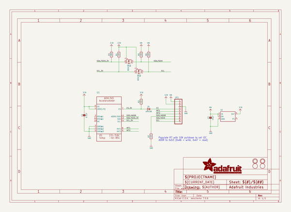
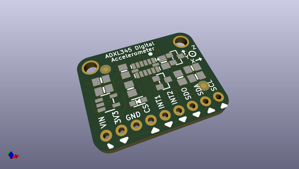
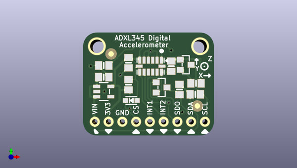
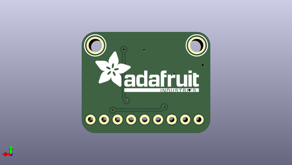

# adafruit_adxl345_pcb
 
## summary 
* id: adafruit_adafruit_adxl345_pcb_adafruit_adxl345_triple_axis_accelerometer
* user: adafruit
* name: adafruit_adxl345_pcb
* board: adafruit_adxl345_triple_axis_accelerometer
* repo: https://github.com/adafruit/Adafruit_ADXL345_PCB

* src_file_repo_sch: 
* src_file_repo_sch_link: https://github.com/adafruit/Adafruit_ADXL345_PCB/tree/master/
* full details link: https://github.com/oomlout/oomlout_oomp_project_bot_v_2/tree/main/projects/adafruit_adafruit_adxl345_pcb_adafruit_adxl345_triple_axis_accelerometer/current_version/working  

## schematic  
  
[schematic (pdf)](working_schematic.pdf)  

## pcb  
 
  
  
  
[board (pdf)](working.pdf)  

## working_bom
| Id | Designator | Footprint | Quantity | Designation | Supplier and ref |  | None | 
| --- | --- | --- | --- | --- | --- | --- | --- | 
| 1 | JP1 | 1X09_ROUND_70 | 1 |  |  |  | [''] | 
| 2 | R3,R6,R5,R7,R1,R2 | 0805-NO | 6 | 10K |  |  | [''] | 
| 3 | C1 | 0805-NO | 1 | 0.1uF |  |  | [''] | 
| 4 | U$1,U$3 | FIDUCIAL_1MM | 2 | FIDUCIAL |  |  | [''] | 
| 5 | C3 | 0805-NO | 1 | 10µF |  |  | [''] | 
| 6 | U1 | LGA14 | 1 |  |  |  | [''] | 
| 7 | Q1,Q2 | SOT23-WIDE | 2 | BSS138 |  |  | [''] | 
| 8 | U2 | SOT23-5 | 1 |  |  |  | [''] | 
| 9 | D1 | SOD-323_MINI | 1 | 1N4148 |  |  | [''] | 
| 10 | U$4,U$6 | MOUNTINGHOLE_2.5_PLATED | 2 | MOUNTINGHOLE2.5 |  |  | [''] | 
| 11 | U$7 | ADAFRUIT_TEXT_20MM | 1 |  |  |  | [''] | 

## bom_schematic
| Ref | Qnty | Value | Cmp name | Footprint | Description | Vendor | DNP | 
| --- | --- | --- | --- | --- | --- | --- | --- | 
| C1 | 1 | 0.1uF | CAP_CERAMIC0805-NOOUTLINE | working:0805-NO |  |  |  | 
| C3 | 1 | 10µF | CAP_CERAMIC0805-NOOUTLINE | working:0805-NO |  |  |  | 
| D1 | 1 | 1N4148 | DIODE_SOD323MINI | working:SOD-323_MINI |  |  |  | 
| JP1 | 1 | HEADER-1X970MIL | HEADER-1X970MIL | working:1X09_ROUND_70 |  |  |  | 
| Q1, Q2 | 2 | BSS138 | MOSFET-NWIDE | working:SOT23-WIDE |  |  |  | 
| R1, R2, R3, R5, R6, R7 | 6 | 10K | RESISTOR0805_NOOUTLINE | working:0805-NO |  |  |  | 
| U1 | 1 | ACCEL_ADXL345 | ACCEL_ADXL345 | working:LGA14 |  |  |  | 
| U2 | 1 | VREG_SOT23-5 | VREG_SOT23-5 | working:SOT23-5 |  |  |  | 
| U$1, U$3 | 2 | FIDUCIAL | FIDUCIAL | working:FIDUCIAL_1MM |  |  |  | 
| U$4, U$6 | 2 | MOUNTINGHOLE2.5 | MOUNTINGHOLE2.5 | working:MOUNTINGHOLE_2.5_PLATED |  |  |  | 

