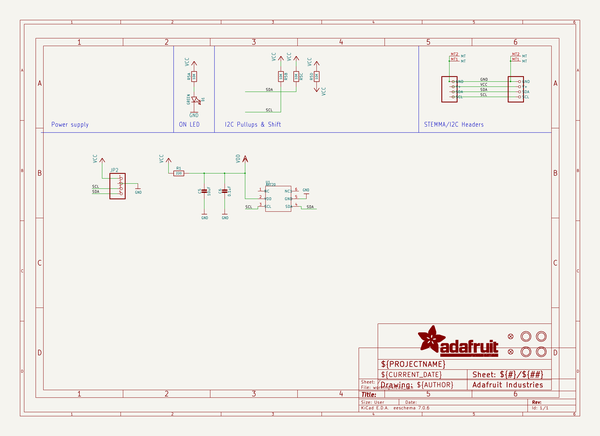
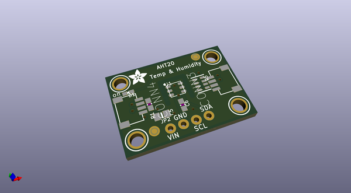
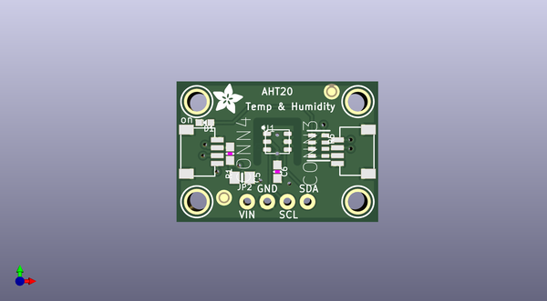
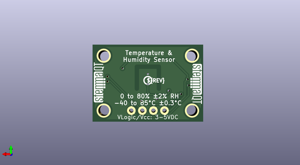

# adafruit_aht20_pcb
 
## summary 
* id: adafruit_adafruit_aht20_pcb_adafruit_aht20_temperature_&_humidity
* user: adafruit
* name: adafruit_aht20_pcb
* board: adafruit_aht20_temperature_&_humidity
* repo: https://github.com/adafruit/Adafruit-AHT20-PCB

* src_file_repo_sch: 
* src_file_repo_sch_link: https://github.com/adafruit/Adafruit-AHT20-PCB/tree/master/

## schematic  
  
[schematic (pdf)](working_schematic.pdf)  

## pcb  
 
  
  
  
[board (pdf)](working.pdf)  

## working_bom
| Id | Designator | Footprint | Quantity | Designation | Supplier and ref |  | None | 
| --- | --- | --- | --- | --- | --- | --- | --- | 
| 1 | CONN3,CONN4 | JST_SH4 | 2 | STEMMA_I2C_QT |  |  | [''] | 
| 2 | U$28 | ADAFRUIT_3.5MM | 1 |  |  |  | [''] | 
| 3 | R5 | RESPACK_4X0603 | 1 | 10K |  |  | [''] | 
| 4 | U$25,U$19,U$20,U$22 | MOUNTINGHOLE_2.5_PLATED | 4 | MOUNTINGHOLE2.5 |  |  | [''] | 
| 5 | C5 | 0805-NO | 1 | 10uF |  |  | [''] | 
| 6 | FID3,FID4 | FIDUCIAL_1MM | 2 | FIDUCIAL_1MM |  |  | [''] | 
| 7 | U1 | SNR6-1.0-3X3X1MM | 1 | AHT20 |  |  | [''] | 
| 8 | JP2 | 1X04_ROUND_76 | 1 |  |  |  | [''] | 
| 9 | C6 | 0603-NO | 1 | 0.1uF |  |  | [''] | 
| 10 | D1 | CHIPLED_0603_NOOUTLINE | 1 | GREEN |  |  | [''] | 
| 11 | R1 | 0603-NO | 1 | 220 |  |  | [''] | 
| 12 | U$31,U$30 | STEMMAQT | 2 |  |  |  | [''] | 
| 13 | U$29 | PCBFEAT-REV-040 | 1 |  |  |  | [''] | 

## bom_schematic
| Ref | Qnty | Value | Cmp name | Footprint | Description | Vendor | DNP | 
| --- | --- | --- | --- | --- | --- | --- | --- | 
| C5 | 1 | 10uF | CAP_CERAMIC0805-NOOUTLINE | working:0805-NO |  |  |  | 
| C6 | 1 | 0.1uF | CAP_CERAMIC0603_NO | working:0603-NO |  |  |  | 
| CONN3, CONN4 | 2 | STEMMA_I2C_QT | STEMMA_I2C_QT | working:JST_SH4 |  |  |  | 
| D1 | 1 | GREEN | LED0603_NOOUTLINE | working:CHIPLED_0603_NOOUTLINE |  |  |  | 
| FID3, FID4 | 2 | FIDUCIAL_1MM | FIDUCIAL_1MM | working:FIDUCIAL_1MM |  |  |  | 
| JP2 | 1 | HEADER-1X476MIL | HEADER-1X476MIL | working:1X04_ROUND_76 |  |  |  | 
| R1 | 1 | 220 | RESISTOR_0603_NOOUT | working:0603-NO |  |  |  | 
| R5 | 1 | 10K | RESISTOR_4PACK | working:RESPACK_4X0603 |  |  |  | 
| U1 | 1 | AHT20 | SENSOR-AHT20 | working:SNR6-1.0-3X3X1MM |  |  |  | 
| U$19, U$20, U$22, U$25 | 4 | MOUNTINGHOLE2.5 | MOUNTINGHOLE2.5 | working:MOUNTINGHOLE_2.5_PLATED |  |  |  | 

## mounting_holes
| x | y | package | value | ref | size | 
| --- | --- | --- | --- | --- | --- | 
| 138.3411 | -98.6536 | MOUNTINGHOLE_2.5_PLATED | MOUNTINGHOLE2.5 | U$19 | m3 | 
| 158.6611 | -98.6536 | MOUNTINGHOLE_2.5_PLATED | MOUNTINGHOLE2.5 | U$20 | m3 | 
| 138.3411 | -111.3536 | MOUNTINGHOLE_2.5_PLATED | MOUNTINGHOLE2.5 | U$22 | m3 | 
| 158.6611 | -111.3536 | MOUNTINGHOLE_2.5_PLATED | MOUNTINGHOLE2.5 | U$25 | m3 | 

## positions
### top
| # Ref | Val | Package | PosX | PosY | Rot | Side | 
| --- | --- | --- | --- | --- | --- | --- | 
| C5 | 10uF | 0805-NO | 144.0561 | -108.3056 | 0.0 | top | 
| C6 | 0.1uF | 0603-NO | 148.5011 | -107.5436 | -90.0 | top | 
| CONN3 | STEMMA_I2C_QT | JST_SH4 | 158.5976 | -105.0036 | 90.0 | top | 
| CONN4 | STEMMA_I2C_QT | JST_SH4 | 138.4046 | -105.0036 | -90.0 | top | 
| D1 | GREEN | CHIPLED_0603_NOOUTLINE | 139.3571 | -101.3206 | 90.0 | top | 
| FID3 | FIDUCIAL_1MM | FIDUCIAL_1MM | 141.7701 | -110.8456 | 0.0 | top | 
| FID4 | FIDUCIAL_1MM | FIDUCIAL_1MM | 155.3591 | -97.3836 | 0.0 | top | 
| JP2 | nan | 1X04_ROUND_76 | 148.5011 | -111.3536 | 0.0 | top | 
| R1 | 220 | 0603-NO | 142.5321 | -105.2576 | -90.0 | top | 
| R5 | 10K | RESPACK_4X0603 | 153.7081 | -104.2416 | -90.0 | top | 
| U$19 | MOUNTINGHOLE2.5 | MOUNTINGHOLE_2.5_PLATED | 138.3411 | -98.6536 | 0.0 | top | 
| U$20 | MOUNTINGHOLE2.5 | MOUNTINGHOLE_2.5_PLATED | 158.6611 | -98.6536 | 0.0 | top | 
| U$22 | MOUNTINGHOLE2.5 | MOUNTINGHOLE_2.5_PLATED | 138.3411 | -111.3536 | 0.0 | top | 
| U$25 | MOUNTINGHOLE2.5 | MOUNTINGHOLE_2.5_PLATED | 158.6611 | -111.3536 | 0.0 | top | 
| U$28 | nan | ADAFRUIT_3.5MM | 140.3731 | -100.1776 | 0.0 | top | 
| U1 | AHT20 | SNR6-1.0-3X3X1MM | 148.5011 | -103.7336 | 0.0 | top | 

### bottom
| # Ref | Val | Package | PosX | PosY | Rot | Side | 
| --- | --- | --- | --- | --- | --- | --- | 
| U$29 | nan | PCBFEAT-REV-040 | 148.5011 | -104.3686 | 180.0 | bottom | 
| U$30 | nan | STEMMAQT | 158.2801 | -109.4486 | 90.0 | bottom | 
| U$31 | nan | STEMMAQT | 138.7221 | -100.5586 | -90.0 | bottom | 

