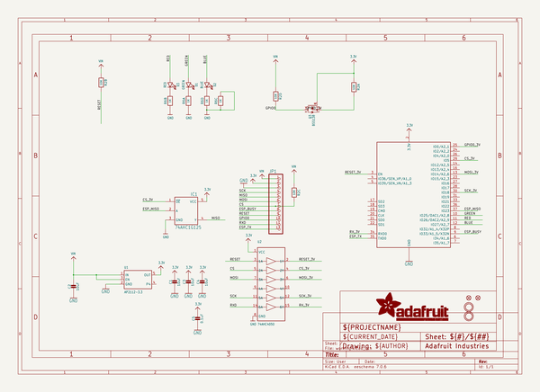
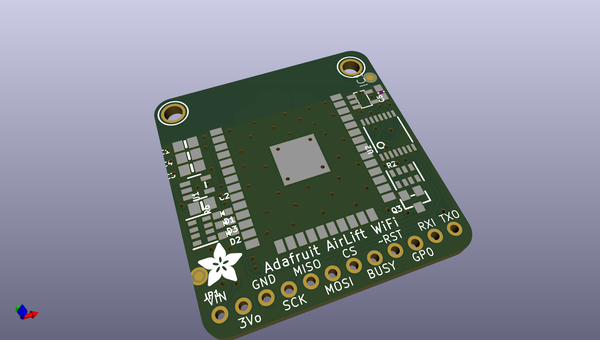
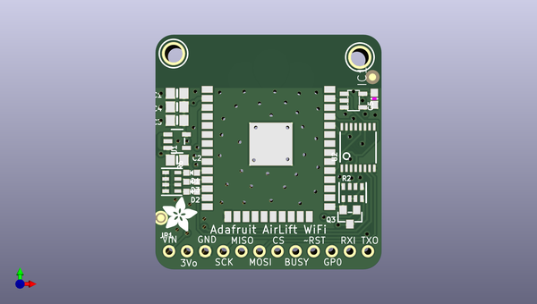
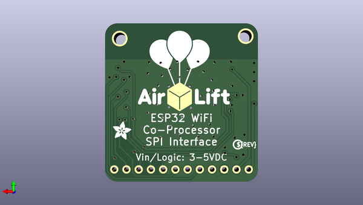

# adafruit_airlift_breakout_pcb
 
## summary 
* id: adafruit_adafruit_airlift_breakout_pcb_adafruit_airlift_breakout
* user: adafruit
* name: adafruit_airlift_breakout_pcb
* board: adafruit_airlift_breakout
* repo: https://github.com/adafruit/Adafruit-AirLift-Breakout-PCB

* src_file_repo_sch: 
* src_file_repo_sch_link: https://github.com/adafruit/Adafruit-AirLift-Breakout-PCB/tree/master/

## schematic  
  
[schematic (pdf)](working_schematic.pdf)  

## pcb  
 
  
  
  
[board (pdf)](working.pdf)  

## working_bom
| Id | Designator | Footprint | Quantity | Designation | Supplier and ref |  | None | 
| --- | --- | --- | --- | --- | --- | --- | --- | 
| 1 | FID3,FID1 | FIDUCIAL_1MM | 2 | FIDUCIAL_1MM |  |  | [''] | 
| 2 | C5 | 0603-NO | 1 | 0.1uF |  |  | [''] | 
| 3 | X1 | WROOM32 | 1 | ESP32_WROOM32 |  |  | [''] | 
| 4 | D3 | CHIPLED_0603_NOOUTLINE | 1 | RED |  |  | [''] | 
| 5 | C1,C2,C3,C4 | 0805-NO | 4 | 10uF |  |  | [''] | 
| 6 | D2 | CHIPLED_0603_NOOUTLINE | 1 | BLUE |  |  | [''] | 
| 7 | U$16,U$15 | MOUNTINGHOLE_2.5_PLATED | 2 | MOUNTINGHOLE2.5 |  |  | [''] | 
| 8 | IC1 | SOT23-5L | 1 | 74AHC1G125 |  |  | [''] | 
| 9 | U1 | SOT23-5 | 1 | AP2112-3.3 |  |  | [''] | 
| 10 | JP1 | 1X12_ROUND | 1 |  |  |  | [''] | 
| 11 | D1 | CHIPLED_0603_NOOUTLINE | 1 | GREEN |  |  | [''] | 
| 12 | R6 | RESPACK_4X0603 | 1 | 1K |  |  | [''] | 
| 13 | R2 | RESPACK_4X0603 | 1 | 10K |  |  | [''] | 
| 14 | U$21 | ADAFRUIT_5MM | 1 |  |  |  | [''] | 
| 15 | Q3 | SOT23-WIDE | 1 | BSS138 |  |  | [''] | 
| 16 | U2 | TSSOP16 | 1 | 74AHC4050 |  |  | [''] | 
| 17 | U$24 | AIRLIFT | 1 |  |  |  | [''] | 
| 18 | U$2 | ADAFRUIT_3.5MM | 1 |  |  |  | [''] | 
| 19 | U$13 | PCBFEAT-REV-040 | 1 |  |  |  | [''] | 

## bom_schematic
| Ref | Qnty | Value | Cmp name | Footprint | Description | Vendor | DNP | 
| --- | --- | --- | --- | --- | --- | --- | --- | 
| C1, C2, C3, C4 | 4 | 10uF | CAP_CERAMIC0805-NOOUTLINE | working:0805-NO |  |  |  | 
| C5 | 1 | 0.1uF | CAP_CERAMIC0603_NO | working:0603-NO |  |  |  | 
| D1 | 1 | GREEN | LED0603_NOOUTLINE | working:CHIPLED_0603_NOOUTLINE |  |  |  | 
| D2 | 1 | BLUE | LED0603_NOOUTLINE | working:CHIPLED_0603_NOOUTLINE |  |  |  | 
| D3 | 1 | RED | LED0603_NOOUTLINE | working:CHIPLED_0603_NOOUTLINE |  |  |  | 
| FID1, FID3 | 2 | FIDUCIAL_1MM | FIDUCIAL_1MM | working:FIDUCIAL_1MM |  |  |  | 
| IC1 | 1 | 74AHC1G125 | 74AHC1G125 | working:SOT23-5L |  |  |  | 
| JP1 | 1 | HEADER-1X12 | HEADER-1X12 | working:1X12_ROUND |  |  |  | 
| Q3 | 1 | BSS138 | MOSFET-NWIDE | working:SOT23-WIDE |  |  |  | 
| R2 | 1 | 10K | RESISTOR_4PACK | working:RESPACK_4X0603 |  |  |  | 
| R6 | 1 | 1K | RESISTOR_4PACK | working:RESPACK_4X0603 |  |  |  | 
| U1 | 1 | AP2112-3.3 | VREG_SOT23-5 | working:SOT23-5 |  |  |  | 
| U2 | 1 | 74AHC4050 | 74HC4050DTSSOP | working:TSSOP16 |  |  |  | 
| U$15, U$16 | 2 | MOUNTINGHOLE2.5 | MOUNTINGHOLE2.5 | working:MOUNTINGHOLE_2.5_PLATED |  |  |  | 
| X1 | 1 | ESP32_WROOM32 | ESP32_WROOM32 | working:WROOM32 |  |  |  | 

## mounting_holes
| x | y | package | value | ref | size | 
| --- | --- | --- | --- | --- | --- | 
| 135.1661 | -91.1606 | MOUNTINGHOLE_2.5_PLATED | MOUNTINGHOLE2.5 | U$15 | m3 | 
| 161.3281 | -91.6686 | MOUNTINGHOLE_2.5_PLATED | MOUNTINGHOLE2.5 | U$16 | m3 | 

## positions
### top
| # Ref | Val | Package | PosX | PosY | Rot | Side | 
| --- | --- | --- | --- | --- | --- | --- | 
| C1 | 10uF | 0805-NO | 135.6741 | -96.7486 | 180.0 | top | 
| C2 | 10uF | 0805-NO | 135.6741 | -106.1466 | 0.0 | top | 
| C3 | 10uF | 0805-NO | 135.6741 | -100.5586 | 180.0 | top | 
| C4 | 10uF | 0805-NO | 135.6741 | -98.6536 | 180.0 | top | 
| C5 | 0.1uF | 0603-NO | 163.3601 | -97.5106 | -90.0 | top | 
| D1 | GREEN | CHIPLED_0603_NOOUTLINE | 137.7061 | -107.9246 | 90.0 | top | 
| D2 | BLUE | CHIPLED_0603_NOOUTLINE | 137.7061 | -110.5916 | 90.0 | top | 
| D3 | RED | CHIPLED_0603_NOOUTLINE | 137.7061 | -109.1946 | 90.0 | top | 
| FID1 | FIDUCIAL_1MM | FIDUCIAL_1MM | 133.3881 | -114.2746 | 0.0 | top | 
| FID3 | FIDUCIAL_1MM | FIDUCIAL_1MM | 163.1061 | -94.4626 | 0.0 | top | 
| IC1 | 74AHC1G125 | SOT23-5L | 160.4391 | -97.7646 | -90.0 | top | 
| JP1 | nan | 1X12_ROUND | 148.5011 | -118.9736 | 0.0 | top | 
| Q3 | BSS138 | SOT23-WIDE | 159.9311 | -114.1476 | 180.0 | top | 
| R2 | 10K | RESPACK_4X0603 | 160.3121 | -110.7186 | 0.0 | top | 
| R6 | 1K | RESPACK_4X0603 | 134.9121 | -109.1946 | -90.0 | top | 
| U$15 | MOUNTINGHOLE2.5 | MOUNTINGHOLE_2.5_PLATED | 135.1661 | -91.1606 | 0.0 | top | 
| U$16 | MOUNTINGHOLE2.5 | MOUNTINGHOLE_2.5_PLATED | 161.3281 | -91.6686 | 0.0 | top | 
| U$21 | nan | ADAFRUIT_5MM | 133.6421 | -116.1796 | 0.0 | top | 
| U1 | AP2112-3.3 | SOT23-5 | 135.6741 | -103.4796 | -90.0 | top | 
| U2 | 74AHC4050 | TSSOP16 | 161.0741 | -104.3686 | 0.0 | top | 
| X1 | ESP32_WROOM32 | WROOM32 | 148.5011 | -101.1936 | 0.0 | top | 

### bottom
| # Ref | Val | Package | PosX | PosY | Rot | Side | 
| --- | --- | --- | --- | --- | --- | --- | 
| U$2 | nan | ADAFRUIT_3.5MM | 162.7251 | -112.7506 | 180.0 | bottom | 
| U$13 | nan | PCBFEAT-REV-040 | 136.8171 | -113.7666 | 180.0 | bottom | 
| U$24 | nan | AIRLIFT | 157.5181 | -106.7816 | 180.0 | bottom | 

