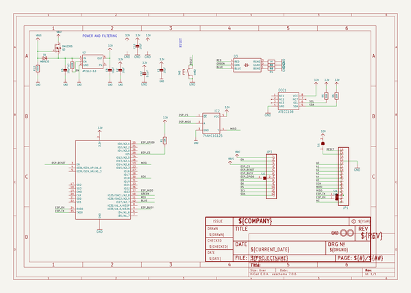
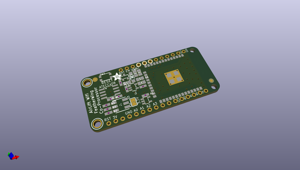
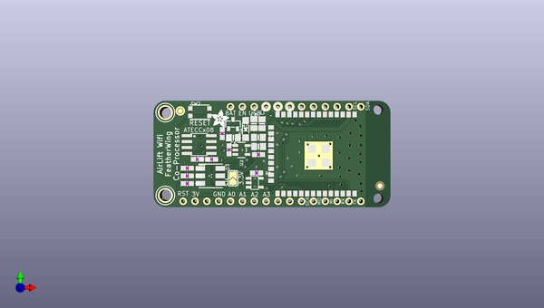
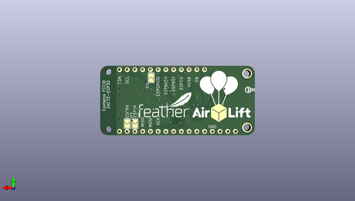

# adafruit_airlift_featherwing_pcb
 
## summary 
* id: adafruit_adafruit_airlift_featherwing_pcb_adafruit_airlift_featherwing
* user: adafruit
* name: adafruit_airlift_featherwing_pcb
* board: adafruit_airlift_featherwing
* repo: https://github.com/adafruit/Adafruit-AirLift-FeatherWing-PCB

* src_file_repo_sch: 
* src_file_repo_sch_link: https://github.com/adafruit/Adafruit-AirLift-FeatherWing-PCB/tree/master/

## schematic  
  
[schematic (pdf)](working_schematic.pdf)  

## pcb  
 
  
  
  
[board (pdf)](working.pdf)  

## working_bom
| Id | Designator | Footprint | Quantity | Designation | Supplier and ref |  | None | 
| --- | --- | --- | --- | --- | --- | --- | --- | 
| 1 | R1,R5,R6 | 0603-NO | 3 | 10K |  |  | [''] | 
| 2 | U$34,U$35 | FIDUCIAL_1MM | 2 | FIDUCIAL_1MM |  |  | [''] | 
| 3 | SW2 | BTN_KMR2_4.6X2.8 | 1 | KMR2 |  |  | [''] | 
| 4 | U$31,U$32 | MOUNTINGHOLE_2.5_PLATED | 2 | MOUNTINGHOLE2.5 |  |  | [''] | 
| 5 | Q3 | SOT23-R | 1 | DMG2305 |  |  | [''] | 
| 6 | @HOLE0,@HOLE1 |  | 2 |  |  |  | [''] | 
| 7 | D4 | SOD-123 | 1 | MBR120 |  |  | [''] | 
| 8 | JP3 | 1X12_ROUND_MIN | 1 |  |  |  | [''] | 
| 9 | X3 | WROOM32_SKINNY | 1 | ESP32_WROOM32_SKINNY |  |  | [''] | 
| 10 | C1,C10,C2 | 0805-NO | 3 | 10uF |  |  | [''] | 
| 11 | U2 | SOT23-5 | 1 | AP2112-3.3 |  |  | [''] | 
| 12 | R3,R4,R2 | 0603-NO | 3 | 1K |  |  | [''] | 
| 13 | U$15 | ADAFRUIT_3.5MM | 1 |  |  |  | [''] | 
| 14 | R12,R7 | 0603-NO | 2 | 100K |  |  | [''] | 
| 15 | C12 | 0603-NO | 1 | 0.1uF |  |  | [''] | 
| 16 | D3 | RGBLED_PLCC6 | 1 |  |  |  | [''] | 
| 17 | SJ1,SJ3,SJ4,SJ2 | SOLDERJUMPER_ARROW_NOPASTE | 4 |  |  |  | [''] | 
| 18 | JP1 | 1X16_ROUND_MIN | 1 |  |  |  | [''] | 
| 19 | IC2 | SOT23-5L | 1 | 74AHC1G125 |  |  | [''] | 
| 20 | C6,C8 | 0805-NO | 2 | 10µF |  |  | [''] | 
| 21 | ECC1 | SOIC8 | 1 | ATECCx08 |  |  | [''] | 
| 22 | U$6 | AIRLIFT | 1 |  |  |  | [''] | 
| 23 | U$7 | FEATHERLOGO_MED | 1 |  |  |  | [''] | 
| 24 | U$13 | PCBFEAT-REV-040 | 1 |  |  |  | [''] | 

## bom_schematic
| Ref | Qnty | Value | Cmp name | Footprint | Description | Vendor | DNP | 
| --- | --- | --- | --- | --- | --- | --- | --- | 
| C1, C2, C10 | 3 | 10uF | CAP_CERAMIC0805-NOOUTLINE | working:0805-NO |  |  |  | 
| C6, C8 | 2 | 10µF | CAP_CERAMIC0805-NOOUTLINE | working:0805-NO |  |  |  | 
| C12 | 1 | 0.1uF | CAP_CERAMIC0603_NO | working:0603-NO |  |  |  | 
| D3 | 1 | LED_RGB_PLCC6CREE-CLV6A | LED_RGB_PLCC6CREE-CLV6A | working:RGBLED_PLCC6 |  |  |  | 
| D4 | 1 | MBR120 | DIODE-SCHOTTKYSOD-123 | working:SOD-123 |  |  |  | 
| ECC1 | 1 | ATECC108 | ATECC108 | working:SOIC8 |  |  |  | 
| IC2 | 1 | 74AHC1G125 | 74AHC1G125 | working:SOT23-5L |  |  |  | 
| JP1 | 1 | HEADER-1X16_MIN | HEADER-1X16_MIN | working:1X16_ROUND_MIN |  |  |  | 
| JP3 | 1 | HEADER-1X12_MIN | HEADER-1X12_MIN | working:1X12_ROUND_MIN |  |  |  | 
| Q3 | 1 | DMG2305 | MOSFET-P | working:SOT23-R |  |  |  | 
| R1, R5, R6 | 3 | 10K | RESISTOR_0603_NOOUT | working:0603-NO |  |  |  | 
| R2, R3, R4 | 3 | 1K | RESISTOR_0603_NOOUT | working:0603-NO |  |  |  | 
| R7, R12 | 2 | 100K | RESISTOR_0603_NOOUT | working:0603-NO |  |  |  | 
| SJ1, SJ2, SJ3, SJ4 | 4 | SOLDERJUMPER | SOLDERJUMPER | working:SOLDERJUMPER_ARROW_NOPASTE |  |  |  | 
| SW2 | 1 | KMR2 | SWITCH_TACT_SMT4.6X2.8 | working:BTN_KMR2_4.6X2.8 |  |  |  | 
| U2 | 1 | AP2112-3.3 | VREG_SOT23-5 | working:SOT23-5 |  |  |  | 
| U$31, U$32 | 2 | MOUNTINGHOLE2.5 | MOUNTINGHOLE2.5 | working:MOUNTINGHOLE_2.5_PLATED |  |  |  | 
| U$34, U$35 | 2 | FIDUCIAL_1MM | FIDUCIAL_1MM | working:FIDUCIAL_1MM |  |  |  | 
| X3 | 1 | ESP32_WROOM32_SKINNY | ESP32_WROOM32_SKINNY | working:WROOM32_SKINNY |  |  |  | 

## mounting_holes
| x | y | package | value | ref | size | 
| --- | --- | --- | --- | --- | --- | 
| 125.6411 | -96.1136 | MOUNTINGHOLE_2.5_PLATED | MOUNTINGHOLE2.5 | U$31 | m3 | 
| 125.6411 | -113.8936 | MOUNTINGHOLE_2.5_PLATED | MOUNTINGHOLE2.5 | U$32 | m3 | 

## positions
### top
| # Ref | Val | Package | PosX | PosY | Rot | Side | 
| --- | --- | --- | --- | --- | --- | --- | 
| @HOLE0 | nan | nan | 171.3611 | -114.5921 | 0.0 | top | 
| @HOLE1 | nan | nan | 171.3611 | -95.4786 | 0.0 | top | 
| C1 | 10uF | 0805-NO | 145.5801 | -101.4476 | 0.0 | top | 
| C2 | 10uF | 0805-NO | 146.3675 | -98.5139 | 90.0 | top | 
| C6 | 10µF | 0805-NO | 140.2157 | -101.513 | 180.0 | top | 
| C8 | 10µF | 0805-NO | 144.6253 | -98.492 | 90.0 | top | 
| C10 | 10uF | 0805-NO | 145.6309 | -103.4034 | 0.0 | top | 
| C12 | 0.1uF | 0603-NO | 145.6055 | -105.1306 | 0.0 | top | 
| D3 | nan | RGBLED_PLCC6 | 135.2931 | -109.7026 | -90.0 | top | 
| D4 | MBR120 | SOD-123 | 142.8623 | -99.6442 | 90.0 | top | 
| ECC1 | ATECCx08 | SOIC8 | 132.8801 | -102.9716 | -90.0 | top | 
| IC2 | 74AHC1G125 | SOT23-5L | 144.7927 | -111.1758 | -90.0 | top | 
| JP1 | nan | 1X16_ROUND_MIN | 148.5011 | -115.1636 | 180.0 | top | 
| JP3 | nan | 1X12_ROUND_MIN | 153.5811 | -94.8436 | 0.0 | top | 
| Q3 | DMG2305 | SOT23-R | 140.1445 | -98.5774 | 0.0 | top | 
| R1 | 10K | 0603-NO | 145.1991 | -109.0676 | 0.0 | top | 
| R2 | 1K | 0603-NO | 130.3401 | -111.3536 | 0.0 | top | 
| R3 | 1K | 0603-NO | 130.3401 | -109.7026 | 0.0 | top | 
| R4 | 1K | 0603-NO | 130.3401 | -108.0516 | 0.0 | top | 
| R5 | 10K | 0603-NO | 132.4991 | -106.1466 | 0.0 | top | 
| R6 | 10K | 0603-NO | 135.5471 | -106.1466 | 180.0 | top | 
| R7 | 100K | 0603-NO | 139.2936 | -104.1146 | 90.0 | top | 
| R12 | 100K | 0603-NO | 137.8331 | -100.6094 | 90.0 | top | 
| SJ1 | nan | SOLDERJUMPER_ARROW_NOPASTE | 140.1191 | -110.2106 | 90.0 | top | 
| SW2 | KMR2 | BTN_KMR2_4.6X2.8 | 133.0325 | -96.012 | 0.0 | top | 
| U$15 | nan | ADAFRUIT_3.5MM | 135.5471 | -99.2886 | 0.0 | top | 
| U$31 | MOUNTINGHOLE2.5 | MOUNTINGHOLE_2.5_PLATED | 125.6411 | -96.1136 | -90.0 | top | 
| U$32 | MOUNTINGHOLE2.5 | MOUNTINGHOLE_2.5_PLATED | 125.6411 | -113.8936 | -90.0 | top | 
| U$34 | FIDUCIAL_1MM | FIDUCIAL_1MM | 128.8415 | -95.758 | -90.0 | top | 
| U$35 | FIDUCIAL_1MM | FIDUCIAL_1MM | 171.6623 | -111.8546 | -90.0 | top | 
| U2 | AP2112-3.3 | SOT23-5 | 141.9479 | -104.14 | -90.0 | top | 
| X3 | ESP32_WROOM32_SKINNY | WROOM32_SKINNY | 161.2011 | -105.0036 | -90.0 | top | 

### bottom
| # Ref | Val | Package | PosX | PosY | Rot | Side | 
| --- | --- | --- | --- | --- | --- | --- | 
| SJ2 | nan | SOLDERJUMPER_ARROW_NOPASTE | 157.1371 | -97.5106 | 90.0 | bottom | 
| SJ3 | nan | SOLDERJUMPER_ARROW_NOPASTE | 165.0111 | -112.6236 | -90.0 | bottom | 
| SJ4 | nan | SOLDERJUMPER_ARROW_NOPASTE | 162.4711 | -112.6236 | -90.0 | bottom | 
| U$6 | nan | AIRLIFT | 143.5481 | -111.9886 | 180.0 | bottom | 
| U$7 | nan | FEATHERLOGO_MED | 161.7091 | -110.5916 | 180.0 | bottom | 
| U$13 | nan | PCBFEAT-REV-040 | 125.3236 | -101.5111 | 180.0 | bottom | 

