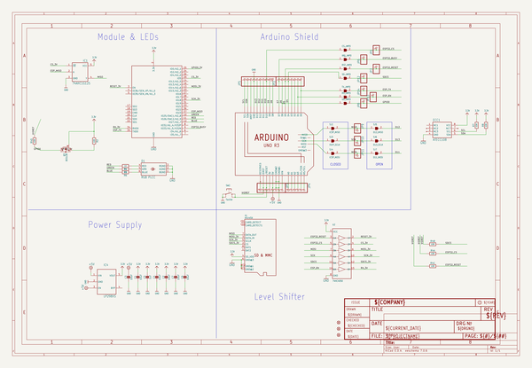
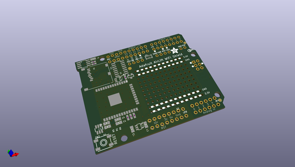
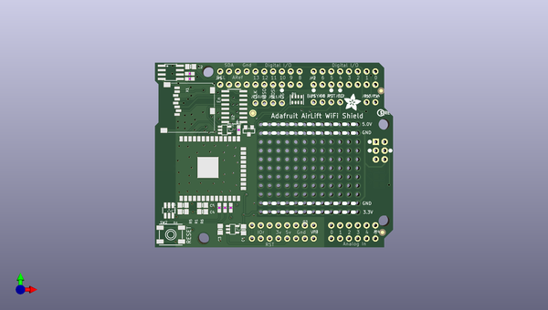
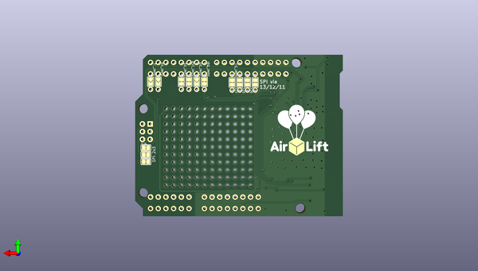

# adafruit_airlift_shield_pcb
 
## summary 
* id: adafruit_adafruit_airlift_shield_pcb_adafruit_airlift_shield
* user: adafruit
* name: adafruit_airlift_shield_pcb
* board: adafruit_airlift_shield
* repo: https://github.com/adafruit/Adafruit-Airlift-Shield-PCB

* src_file_repo_sch: 
* src_file_repo_sch_link: https://github.com/adafruit/Adafruit-Airlift-Shield-PCB/tree/master/

## schematic  
  
[schematic (pdf)](working_schematic.pdf)  

## pcb  
 
  
  
  
[board (pdf)](working.pdf)  

## working_bom
| Id | Designator | Footprint | Quantity | Designation | Supplier and ref |  | None | 
| --- | --- | --- | --- | --- | --- | --- | --- | 
| 1 | JP2,JP3 | 1X08_ROUND_70 | 2 |  |  |  | [''] | 
| 2 | JP5 | 1X10_ROUND70 | 1 |  |  |  | [''] | 
| 3 | JP13,JP10,JP8,JP9,JP14,JP1,JP12,JP6,JP11,JP7 | 1X01_ROUND | 10 |  |  |  | [''] | 
| 4 | R7,R8,R2 | 0603-NO | 3 | 10K |  |  | [''] | 
| 5 | @HOLE1,@HOLE2,@HOLE0,@HOLE3 |  | 4 |  |  |  | [''] | 
| 6 | U$9 | ADAFRUIT_5MM | 1 |  |  |  | [''] | 
| 7 | C4,C7,C6,C1,C2,C3 | 0805-NO | 6 | 10uF |  |  | [''] | 
| 8 | X2 | WROOM32 | 1 | ESP32_WROOM32 |  |  | [''] | 
| 9 | IC1 | SOT23-5L | 1 | 74AHC1G125 |  |  | [''] | 
| 10 | IC4 | SOT23-5L | 1 | AP2112-3.3 |  |  | [''] | 
| 11 | U$21 | PCBFEAT-REV-040 | 1 |  |  |  | [''] | 
| 12 | R5,R1,R6 | 0603-NO | 3 | 1K |  |  | [''] | 
| 13 | FID1,FID3,FID2 | FIDUCIAL_1MM | 3 | FIDUCIAL_1MM |  |  | [''] | 
| 14 | ECC1 | SOIC8 | 1 | ATECC108 |  |  | [''] | 
| 15 | C5 | 0805-NO | 1 | 1uF |  |  | [''] | 
| 16 | U2 | SOIC16 | 1 | 74HC4050 |  |  | [''] | 
| 17 | D1 | RGBLED_3535_PLCC6 | 1 | RGB PLCC |  |  | [''] | 
| 18 | JP4 | 1X06_ROUND_70 | 1 |  |  |  | [''] | 
| 19 | R4 | RESPACK_4X0603 | 1 | 10K |  |  | [''] | 
| 20 | X1 | MICROSD | 1 | microSd |  |  | [''] | 
| 21 | M1 | ARDUINOR3_ICSP_NODIM | 1 | ARDUINO_R3_ICSP_NODIM |  |  | [''] | 
| 22 | Q3 | SOT23-WIDE | 1 | BSS138 |  |  | [''] | 
| 23 | SW2 | EVQ-Q2_SMALLER | 1 | Tactile |  |  | [''] | 
| 24 | IRQ_JMP0,SD_JMP0,RST_JMP0,CS_JMP0 | SOLDERJUMPER_CLOSEDWIRE | 4 |  |  |  | [''] | 
| 25 | TX_JMP0,RX_JMP0,G0_JMP0 | SOLDERJUMPER_ARROW_NOPASTE | 3 |  |  |  | [''] | 
| 26 | U$23 | AIRLIFT | 1 |  |  |  | [''] | 
| 27 | SJ7 | SOLDERJUMPER_REFLOW_NOPASTE | 1 | D11_MOSI |  |  | [''] | 
| 28 | SJ4 | SOLDERJUMPER_CLOSEDWIRE | 1 | ICSP_MOSI |  |  | [''] | 
| 29 | SJ3 | SOLDERJUMPER_CLOSEDWIRE | 1 | ISCP_SCLK |  |  | [''] | 
| 30 | SJ5 | SOLDERJUMPER_REFLOW_NOPASTE | 1 | D12_MISO |  |  | [''] | 
| 31 | SJ6 | SOLDERJUMPER_REFLOW_NOPASTE | 1 | D13_SCLK |  |  | [''] | 
| 32 | SJ2 | SOLDERJUMPER_CLOSEDWIRE | 1 | ICSP_MISO |  |  | [''] | 

## bom_schematic
| Ref | Qnty | Value | Cmp name | Footprint | Description | Vendor | DNP | 
| --- | --- | --- | --- | --- | --- | --- | --- | 
| C1, C2, C3, C4, C6, C7 | 6 | 10uF | CAP_CERAMIC0805-NOOUTLINE | working:0805-NO |  |  |  | 
| C5 | 1 | 1uF | CAP_CERAMIC0805-NOOUTLINE | working:0805-NO |  |  |  | 
| CS_JMP0 | 1 | SOLDERJUMPERCLOSED | SOLDERJUMPERCLOSED | working:SOLDERJUMPER_CLOSEDWIRE |  |  |  | 
| D1 | 1 | RGB PLCC | LED_RGB_PLCC6_3535 | working:RGBLED_3535_PLCC6 |  |  |  | 
| ECC1 | 1 | ATECC108 | ATECC108 | working:SOIC8 |  |  |  | 
| FID1, FID2, FID3 | 3 | FIDUCIAL_1MM | FIDUCIAL_1MM | working:FIDUCIAL_1MM |  |  |  | 
| G0_JMP0 | 1 | SOLDERJUMPER | SOLDERJUMPER | working:SOLDERJUMPER_ARROW_NOPASTE |  |  |  | 
| IC1 | 1 | 74AHC1G125 | 74AHC1G125 | working:SOT23-5L |  |  |  | 
| IC4 | 1 | LP298XS | LP298XS | working:SOT23-5L |  |  |  | 
| IRQ_JMP0 | 1 | SOLDERJUMPERCLOSED | SOLDERJUMPERCLOSED | working:SOLDERJUMPER_CLOSEDWIRE |  |  |  | 
| JP1, JP6, JP7, JP8, JP9, JP10, JP11, JP12, JP13, JP14 | 10 | HEADER-1X1ROUND | HEADER-1X1ROUND | working:1X01_ROUND |  |  |  | 
| JP2, JP3 | 2 | HEADER-1X870MIL | HEADER-1X870MIL | working:1X08_ROUND_70 |  |  |  | 
| JP4 | 1 | HEADER-1X670MIL | HEADER-1X670MIL | working:1X06_ROUND_70 |  |  |  | 
| JP5 | 1 | HEADER-1X1070MIL | HEADER-1X1070MIL | working:1X10_ROUND70 |  |  |  | 
| M1 | 1 | ARDUINO_R3_ICSP_NODIM | ARDUINO_R3_ICSP_NODIM | working:ARDUINOR3_ICSP_NODIM |  |  |  | 
| Q3 | 1 | BSS138 | MOSFET-NWIDE | working:SOT23-WIDE |  |  |  | 
| R1, R5, R6 | 3 | 1K | RESISTOR_0603_NOOUT | working:0603-NO |  |  |  | 
| R2, R7, R8 | 3 | 10K | RESISTOR_0603_NOOUT | working:0603-NO |  |  |  | 
| R4 | 1 | 10K | RESISTOR_4PACK | working:RESPACK_4X0603 |  |  |  | 
| RST_JMP0 | 1 | SOLDERJUMPERCLOSED | SOLDERJUMPERCLOSED | working:SOLDERJUMPER_CLOSEDWIRE |  |  |  | 
| RX_JMP0 | 1 | SOLDERJUMPER | SOLDERJUMPER | working:SOLDERJUMPER_ARROW_NOPASTE |  |  |  | 
| SD_JMP0 | 1 | SOLDERJUMPERCLOSED | SOLDERJUMPERCLOSED | working:SOLDERJUMPER_CLOSEDWIRE |  |  |  | 
| SJ2 | 1 | ICSP_MISO | SOLDERJUMPERCLOSED | working:SOLDERJUMPER_CLOSEDWIRE |  |  |  | 
| SJ3 | 1 | ISCP_SCLK | SOLDERJUMPERCLOSED | working:SOLDERJUMPER_CLOSEDWIRE |  |  |  | 
| SJ4 | 1 | ICSP_MOSI | SOLDERJUMPERCLOSED | working:SOLDERJUMPER_CLOSEDWIRE |  |  |  | 
| SJ5 | 1 | D12_MISO | SOLDERJUMPERREFLOW_NOPASTE | working:SOLDERJUMPER_REFLOW_NOPASTE |  |  |  | 
| SJ6 | 1 | D13_SCLK | SOLDERJUMPERREFLOW_NOPASTE | working:SOLDERJUMPER_REFLOW_NOPASTE |  |  |  | 
| SJ7 | 1 | D11_MOSI | SOLDERJUMPERREFLOW_NOPASTE | working:SOLDERJUMPER_REFLOW_NOPASTE |  |  |  | 
| SW2 | 1 | Tactile | SWITCH_TACT_SMT_EVQQ2_SMALL | working:EVQ-Q2_SMALLER |  |  |  | 
| TX_JMP0 | 1 | SOLDERJUMPER | SOLDERJUMPER | working:SOLDERJUMPER_ARROW_NOPASTE |  |  |  | 
| U2 | 1 | 74HC4050 | 74HC4050D | working:SOIC16 |  |  |  | 
| X1 | 1 | microSd | MICROSD | working:MICROSD |  |  |  | 
| X2 | 1 | ESP32_WROOM32 | ESP32_WROOM32 | working:WROOM32 |  |  |  | 

## positions
### top
| # Ref | Val | Package | PosX | PosY | Rot | Side | 
| --- | --- | --- | --- | --- | --- | --- | 
| @HOLE0 | nan | nan | 128.1811 | -129.1336 | 0.0 | top | 
| @HOLE1 | nan | nan | 180.2511 | -96.1136 | 0.0 | top | 
| @HOLE2 | nan | nan | 180.2511 | -124.0536 | 0.0 | top | 
| @HOLE3 | nan | nan | 129.4511 | -80.8736 | 0.0 | top | 
| C1 | 10uF | 0805-NO | 139.7381 | -126.5936 | -90.0 | top | 
| C2 | 10uF | 0805-NO | 124.4981 | -79.4766 | 0.0 | top | 
| C3 | 10uF | 0805-NO | 133.0071 | -126.4666 | -90.0 | top | 
| C4 | 10uF | 0805-NO | 127.9271 | -121.3866 | 0.0 | top | 
| C5 | 1uF | 0805-NO | 127.9271 | -119.4816 | 0.0 | top | 
| C6 | 10uF | 0805-NO | 122.3391 | -119.4816 | 180.0 | top | 
| C7 | 10uF | 0805-NO | 122.3391 | -121.3866 | 180.0 | top | 
| D1 | RGB_PLCC | RGBLED_3535_PLCC6 | 118.2751 | -121.0056 | 180.0 | top | 
| ECC1 | ATECC108 | SOIC8 | 118.7831 | -81.1276 | -90.0 | top | 
| FID1 | FIDUCIAL_1MM | FIDUCIAL_1MM | 179.3621 | -86.4616 | 0.0 | top | 
| FID2 | FIDUCIAL_1MM | FIDUCIAL_1MM | 179.7431 | -127.3556 | 0.0 | top | 
| FID3 | FIDUCIAL_1MM | FIDUCIAL_1MM | 142.4051 | -92.9386 | 0.0 | top | 
| IC1 | 74AHC1G125 | SOT23-5L | 134.2771 | -97.7646 | -90.0 | top | 
| IC4 | AP2112-3.3 | SOT23-5L | 136.5631 | -126.4666 | -90.0 | top | 
| JP1 | nan | 1X01_ROUND | 150.7871 | -90.0176 | 0.0 | top | 
| JP2 | nan | 1X08_ROUND_70 | 168.8211 | -84.6836 | 0.0 | top | 
| JP3 | nan | 1X08_ROUND_70 | 151.0411 | -125.3236 | 180.0 | top | 
| JP4 | nan | 1X06_ROUND_70 | 171.3611 | -125.3236 | 180.0 | top | 
| JP5 | nan | 1X10_ROUND70 | 144.4371 | -84.6836 | 0.0 | top | 
| JP6 | nan | 1X01_ROUND | 159.9311 | -89.7636 | 0.0 | top | 
| JP7 | nan | 1X01_ROUND | 165.0111 | -89.7636 | 0.0 | top | 
| JP8 | nan | 1X01_ROUND | 162.4711 | -89.7636 | 0.0 | top | 
| JP9 | nan | 1X01_ROUND | 145.7071 | -90.0176 | 0.0 | top | 
| JP10 | nan | 1X01_ROUND | 143.1671 | -90.0176 | 0.0 | top | 
| JP11 | nan | 1X01_ROUND | 148.2471 | -90.0176 | 0.0 | top | 
| JP12 | nan | 1X01_ROUND | 167.5511 | -89.7636 | 0.0 | top | 
| JP13 | nan | 1X01_ROUND | 175.1711 | -89.7636 | 0.0 | top | 
| JP14 | nan | 1X01_ROUND | 177.7111 | -89.7636 | 0.0 | top | 
| M1 | ARDUINO_R3_ICSP_NODIM | ARDUINOR3_ICSP_NODIM | 114.2111 | -131.6736 | 0.0 | top | 
| Q3 | BSS138 | SOT23-WIDE | 141.2621 | -98.0186 | 180.0 | top | 
| R1 | 1K | 0603-NO | 134.4041 | -120.2436 | 90.0 | top | 
| R2 | 10K | 0603-NO | 138.3411 | -97.7646 | -90.0 | top | 
| R4 | 10K | RESPACK_4X0603 | 155.1051 | -89.0016 | 0.0 | top | 
| R5 | 1K | 0603-NO | 132.7531 | -120.2436 | 90.0 | top | 
| R6 | 1K | 0603-NO | 136.0551 | -120.2436 | 90.0 | top | 
| R7 | 10K | 0603-NO | 124.2441 | -81.5086 | 0.0 | top | 
| R8 | 10K | 0603-NO | 124.2441 | -83.0326 | 0.0 | top | 
| SW2 | Tactile | EVQ-Q2_SMALLER | 118.7831 | -127.9906 | 0.0 | top | 
| U$9 | nan | ADAFRUIT_5MM | 168.6941 | -92.1766 | 0.0 | top | 
| U$21 | nan | PCBFEAT-REV-040 | 179.2351 | -92.8116 | 0.0 | top | 
| U2 | 74HC4050 | SOIC16 | 137.0711 | -91.0336 | 90.0 | top | 
| X1 | microSd | MICROSD | 131.2291 | -84.3026 | -90.0 | top | 
| X2 | ESP32_WROOM32 | WROOM32 | 126.7841 | -108.9406 | 90.0 | top | 

### bottom
| # Ref | Val | Package | PosX | PosY | Rot | Side | 
| --- | --- | --- | --- | --- | --- | --- | 
| CS_JMP0 | nan | SOLDERJUMPER_CLOSEDWIRE | 150.7871 | -87.4776 | -90.0 | bottom | 
| G0_JMP0 | nan | SOLDERJUMPER_ARROW_NOPASTE | 162.4711 | -87.2236 | -90.0 | bottom | 
| IRQ_JMP0 | nan | SOLDERJUMPER_CLOSEDWIRE | 159.9311 | -87.2236 | -90.0 | bottom | 
| RST_JMP0 | nan | SOLDERJUMPER_CLOSEDWIRE | 165.0111 | -87.2236 | -90.0 | bottom | 
| RX_JMP0 | nan | SOLDERJUMPER_ARROW_NOPASTE | 175.1711 | -87.2236 | -90.0 | bottom | 
| SD_JMP0 | nan | SOLDERJUMPER_CLOSEDWIRE | 167.5511 | -87.2236 | -90.0 | bottom | 
| SJ2 | ICSP_MISO | SOLDERJUMPER_CLOSEDWIRE | 179.2351 | -113.6396 | 180.0 | bottom | 
| SJ3 | ISCP_SCLK | SOLDERJUMPER_CLOSEDWIRE | 179.2351 | -111.3536 | 180.0 | bottom | 
| SJ4 | ICSP_MOSI | SOLDERJUMPER_CLOSEDWIRE | 179.2351 | -109.0676 | 180.0 | bottom | 
| SJ5 | D12_MISO | SOLDERJUMPER_REFLOW_NOPASTE | 145.7071 | -87.4776 | 90.0 | bottom | 
| SJ6 | D13_SCLK | SOLDERJUMPER_REFLOW_NOPASTE | 143.1671 | -87.4776 | 90.0 | bottom | 
| SJ7 | D11_MOSI | SOLDERJUMPER_REFLOW_NOPASTE | 148.2471 | -87.4776 | 90.0 | bottom | 
| TX_JMP0 | nan | SOLDERJUMPER_ARROW_NOPASTE | 177.7111 | -87.2236 | -90.0 | bottom | 
| U$23 | nan | AIRLIFT | 138.0871 | -111.6076 | 180.0 | bottom | 

