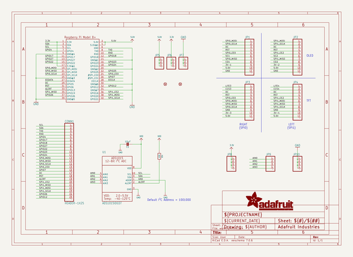
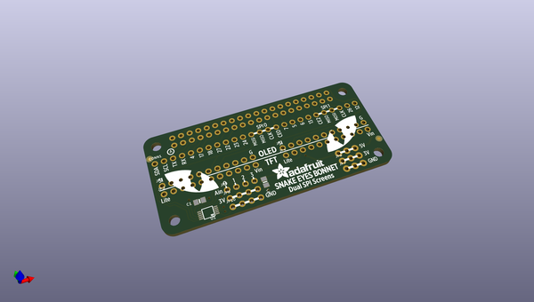
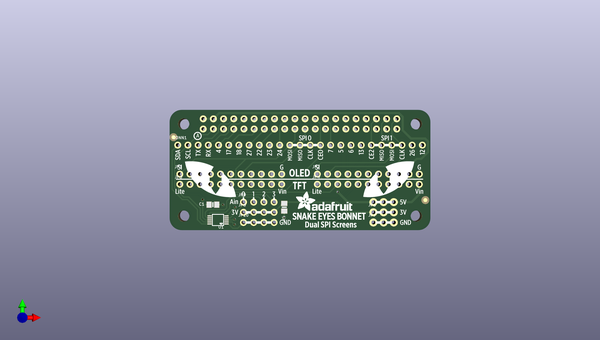
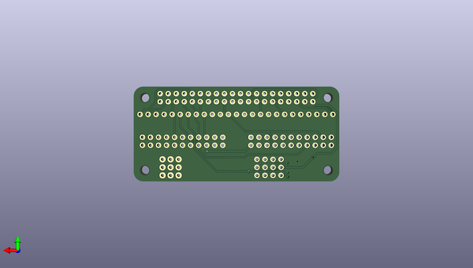

# adafruit_animated_eyes_bonnet_pcb
 
## summary 
* id: adafruit_adafruit_animated_eyes_bonnet_pcb_adafruit_eyes_bonnet
* user: adafruit
* name: adafruit_animated_eyes_bonnet_pcb
* board: adafruit_eyes_bonnet
* repo: https://github.com/adafruit/Adafruit-Animated-Eyes-Bonnet-PCB

* src_file_repo_sch: 
* src_file_repo_sch_link: https://github.com/adafruit/Adafruit-Animated-Eyes-Bonnet-PCB/tree/master/

## schematic  
  
[schematic (pdf)](working_schematic.pdf)  

## pcb  
 
  
  
  
[board (pdf)](working.pdf)  

## working_bom
| Id | Designator | Footprint | Quantity | Designation | Supplier and ref |  | None | 
| --- | --- | --- | --- | --- | --- | --- | --- | 
| 1 | U$8 | BONNET_EYES_REVA | 1 |  |  |  | [''] | 
| 2 | CONN1 | 1X25_ROUND_70MIL | 1 | HEADER-1X25 |  |  | [''] | 
| 3 | JP2,JP4,JP3,JP1 | 1X11_ROUND | 4 |  |  |  | [''] | 
| 4 | C1 | 0805-NO | 1 | 10µF |  |  | [''] | 
| 5 | JP10,JP8,JP9 | 1X04_ROUND | 3 |  |  |  | [''] | 
| 6 | JP5,JP6,JP7 | 1X03_ROUND_76 | 3 |  |  |  | [''] | 
| 7 | FID2,FID1 | FIDUCIAL_1MM | 2 | FIDUCIAL" |  |  | [''] | 
| 8 | U1 | MSOP10 | 1 | ADS1015IDGST |  |  | [''] | 
| 9 | R4 | 0805-NO | 1 | 10K |  |  | [''] | 
| 10 | RPI1 | PI_BONNET | 1 | RASPBERRYPI_BPLUS_PHAT |  |  | [''] | 

## bom_schematic
| Ref | Qnty | Value | Cmp name | Footprint | Description | Vendor | DNP | 
| --- | --- | --- | --- | --- | --- | --- | --- | 
| C1 | 1 | 10µF | CAP_CERAMIC0805-NOOUTLINE | working:0805-NO |  |  |  | 
| CONN1 | 1 | HEADER-1X25 | HEADER-1X25 | working:1X25_ROUND_70MIL |  |  |  | 
| FID1, FID2 | 2 | FIDUCIAL"" | FIDUCIAL{dblquote}{dblquote} | working:FIDUCIAL_1MM |  |  |  | 
| JP1, JP2, JP3, JP4 | 4 | HEADER-1X11 | HEADER-1X11 | working:1X11_ROUND |  |  |  | 
| JP5, JP6, JP7 | 3 | HEADER-1X376MIL | HEADER-1X376MIL | working:1X03_ROUND_76 |  |  |  | 
| JP8, JP9, JP10 | 3 | HEADER-1X4ROUND | HEADER-1X4ROUND | working:1X04_ROUND |  |  |  | 
| R4 | 1 | 10K | RESISTOR0805_NOOUTLINE | working:0805-NO |  |  |  | 
| RPI1 | 1 | RASPBERRYPI_BPLUS_PHAT | RASPBERRYPI_BPLUS_PHAT | working:PI_BONNET |  |  |  | 
| U1 | 1 | ADS1015IDGST | ADC_ADS1015 | working:MSOP10 |  |  |  | 

## positions
### top
| # Ref | Val | Package | PosX | PosY | Rot | Side | 
| --- | --- | --- | --- | --- | --- | --- | 
| C1 | 10µF | 0805-NO | 126.7961 | -113.6536 | 180.0 | top | 
| CONN1 | HEADER-1X25 | 1X25_ROUND_70MIL | 148.5131 | -98.7946 | 0.0 | top | 
| FID1 | FIDUCIAL"" | FIDUCIAL_1MM | 116.9536 | -96.8261 | 0.0 | top | 
| FID2 | FIDUCIAL"" | FIDUCIAL_1MM | 179.7551 | -112.5106 | 0.0 | top | 
| JP1 | nan | 1X11_ROUND | 131.2411 | -106.0336 | 0.0 | top | 
| JP2 | nan | 1X11_ROUND | 165.5311 | -106.0336 | 0.0 | top | 
| JP3 | nan | 1X11_ROUND | 131.2411 | -108.5736 | 0.0 | top | 
| JP4 | nan | 1X11_ROUND | 165.5311 | -108.5736 | 0.0 | top | 
| JP5 | nan | 1X03_ROUND_76 | 169.3411 | -113.0186 | 0.0 | top | 
| JP6 | nan | 1X03_ROUND_76 | 169.3411 | -115.5586 | 0.0 | top | 
| JP7 | nan | 1X03_ROUND_76 | 169.3411 | -118.0986 | 0.0 | top | 
| JP8 | nan | 1X04_ROUND | 138.2261 | -115.5586 | 0.0 | top | 
| JP9 | nan | 1X04_ROUND | 138.2261 | -113.0186 | 0.0 | top | 
| JP10 | nan | 1X04_ROUND | 138.2261 | -118.0986 | 0.0 | top | 
| R4 | 10K | 0805-NO | 144.5761 | -114.2886 | -90.0 | top | 
| RPI1 | RASPBERRYPI_BPLUS_PHAT | PI_BONNET | 116.0011 | -120.0036 | 0.0 | top | 
| U$8 | nan | BONNET_EYES_REVA | 116.0011 | -120.0036 | 0.0 | top | 
| U1 | ADS1015IDGST | MSOP10 | 128.0661 | -117.4636 | 90.0 | top | 

### bottom
no data
