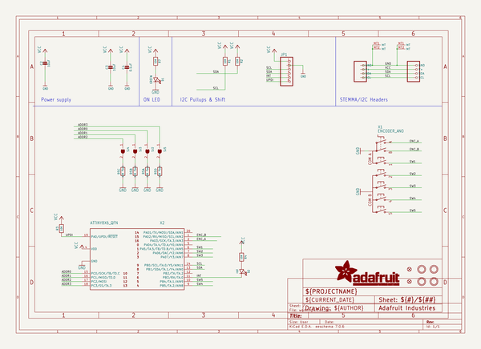
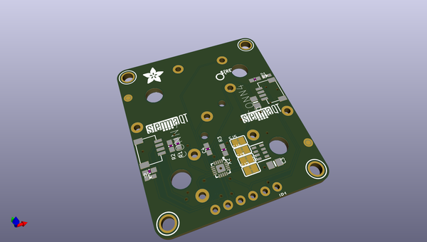
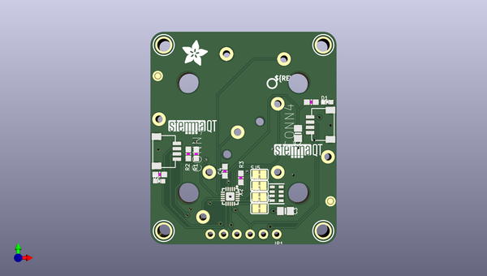
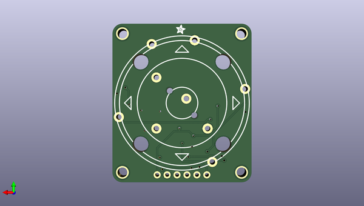

# adafruit_ano_rotary_navigation_encoder_to_i2c
 
## summary 
* id: adafruit_adafruit_ano_rotary_navigation_encoder_to_i2c_adafruit_ano_rotary_encoder_to_i2c
* user: adafruit
* name: adafruit_ano_rotary_navigation_encoder_to_i2c
* board: adafruit_ano_rotary_encoder_to_i2c
* repo: https://github.com/adafruit/Adafruit-ANO-Rotary-Navigation-Encoder-to-I2C

* src_file_repo_sch: 
* src_file_repo_sch_link: https://github.com/adafruit/Adafruit-ANO-Rotary-Navigation-Encoder-to-I2C/tree/main/

## schematic  
  
[schematic (pdf)](working_schematic.pdf)  

## pcb  
 
  
  
  
[board (pdf)](working.pdf)  

## working_bom
| Id | Designator | Footprint | Quantity | Designation | Supplier and ref |  | None | 
| --- | --- | --- | --- | --- | --- | --- | --- | 
| 1 | U$35,U$34 | STEMMAQT | 2 |  |  |  | [''] | 
| 2 | PLABEL10 | PLABEL10 | 1 |  |  |  | [''] | 
| 3 | FID3,FID4 | FIDUCIAL_1MM | 2 | FIDUCIAL_1MM |  |  | [''] | 
| 4 | U$30,U$29,U$25,U$27 | MOUNTINGHOLE_2.5_PLATED | 4 | MOUNTINGHOLE2.5 |  |  | [''] | 
| 5 | R4,R3,R1,R2,R7 | 0603-NO | 5 | 10K |  |  | [''] | 
| 6 | PLABEL4 | PLABEL4 | 1 |  |  |  | [''] | 
| 7 | PLABEL2 | PLABEL2 | 1 |  |  |  | [''] | 
| 8 | CONN4,CONN3 | JST_SH4 | 2 | STEMMA_I2C_QT |  |  | [''] | 
| 9 | U$2 | ADAFRUIT_5MM | 1 |  |  |  | [''] | 
| 10 | PLABEL9 | PLABEL9 | 1 |  |  |  | [''] | 
| 11 | X2 | QFN20_3MM | 1 | ATTINY8X6_QFN |  |  | [''] | 
| 12 | D1 | CHIPLED_0603_NOOUTLINE | 1 | GREEN |  |  | [''] | 
| 13 | SJ3,SJ2,SJ5,SJ4 | SOLDERJUMPER_CLOSEDWIRE | 4 |  |  |  | [''] | 
| 14 | C3,C2 | 0805-NO | 2 | 10uF |  |  | [''] | 
| 15 | D2 | CHIPLED_0603_NOOUTLINE | 1 | red |  |  | [''] | 
| 16 | PLABEL6 | PLABEL6 | 1 |  |  |  | [''] | 
| 17 | U$33 | PCBFEAT-REV-040 | 1 |  |  |  | [''] | 
| 18 | JP1 | 1X06_ROUND_70 | 1 |  |  |  | [''] | 
| 19 | PLABEL1 | PLABEL1 | 1 |  |  |  | [''] | 
| 20 | PLABEL0 | PLABEL0 | 1 |  |  |  | [''] | 
| 21 | R5 | RESPACK_4X0603 | 1 | 10K Pack |  |  | [''] | 
| 22 | PLABEL11 | PLABEL11 | 1 |  |  |  | [''] | 
| 23 | PLABEL3 | PLABEL3 | 1 |  |  |  | [''] | 
| 24 | PLABEL8 | PLABEL8 | 1 |  |  |  | [''] | 
| 25 | PLABEL5 | PLABEL5 | 1 |  |  |  | [''] | 
| 26 | PLABEL7 | PLABEL7 | 1 |  |  |  | [''] | 
| 27 | C4 | 0603-NO | 1 | 0.1uF |  |  | [''] | 
| 28 | E$2 | ADAFRUIT_2.5MM | 1 |  |  |  | [''] | 
| 29 | X1 | ENCODER_ANO | 1 | ENCODER_ANO |  |  | [''] | 

## bom_schematic
| Ref | Qnty | Value | Cmp name | Footprint | Description | Vendor | DNP | 
| --- | --- | --- | --- | --- | --- | --- | --- | 
| C2, C3 | 2 | 10uF | CAP_CERAMIC0805-NOOUTLINE | working:0805-NO |  |  |  | 
| C4 | 1 | 0.1uF | CAP_CERAMIC0603_NO | working:0603-NO |  |  |  | 
| CONN3, CONN4 | 2 | STEMMA_I2C_QT | STEMMA_I2C_QT | working:JST_SH4 |  |  |  | 
| D1 | 1 | GREEN | LED0603_NOOUTLINE | working:CHIPLED_0603_NOOUTLINE |  |  |  | 
| D2 | 1 | red | LED0603_NOOUTLINE | working:CHIPLED_0603_NOOUTLINE |  |  |  | 
| FID3, FID4 | 2 | FIDUCIAL_1MM | FIDUCIAL_1MM | working:FIDUCIAL_1MM |  |  |  | 
| JP1 | 1 | HEADER-1X670MIL | HEADER-1X670MIL | working:1X06_ROUND_70 |  |  |  | 
| R1, R2, R3, R4, R7 | 5 | 10K | RESISTOR_0603_NOOUT | working:0603-NO |  |  |  | 
| R5 | 1 | 10K Pack | RESISTOR_4PACK | working:RESPACK_4X0603 |  |  |  | 
| SJ2, SJ3, SJ4, SJ5 | 4 | SOLDERJUMPERCLOSED | SOLDERJUMPERCLOSED | working:SOLDERJUMPER_CLOSEDWIRE |  |  |  | 
| U$25, U$27, U$29, U$30 | 4 | MOUNTINGHOLE2.5 | MOUNTINGHOLE2.5 | working:MOUNTINGHOLE_2.5_PLATED |  |  |  | 
| X1 | 1 | ENCODER_ANO | ENCODER_ANO | working:ENCODER_ANO |  |  |  | 
| X2 | 1 | ATTINY8X6_QFN | ATTINY8X6_QFN | working:QFN20_3MM |  |  |  | 

## mounting_holes
| x | y | package | value | ref | size | 
| --- | --- | --- | --- | --- | --- | 
| 163.7411 | -122.7836 | MOUNTINGHOLE_2.5_PLATED | MOUNTINGHOLE2.5 | U$25 | m3 | 
| 133.2611 | -122.7836 | MOUNTINGHOLE_2.5_PLATED | MOUNTINGHOLE2.5 | U$27 | m3 | 
| 163.7411 | -87.2236 | MOUNTINGHOLE_2.5_PLATED | MOUNTINGHOLE2.5 | U$29 | m3 | 
| 133.2611 | -87.2236 | MOUNTINGHOLE_2.5_PLATED | MOUNTINGHOLE2.5 | U$30 | m3 | 

## positions
### top
| # Ref | Val | Package | PosX | PosY | Rot | Side | 
| --- | --- | --- | --- | --- | --- | --- | 
| C2 | 10uF | 0805-NO | 158.9151 | -104.1146 | -90.0 | top | 
| C3 | 10uF | 0805-NO | 156.5021 | -118.9736 | 0.0 | top | 
| C4 | 0.1uF | 0603-NO | 144.9451 | -111.3536 | 90.0 | top | 
| CONN3 | STEMMA_I2C_QT | JST_SH4 | 133.7691 | -107.5436 | -90.0 | top | 
| CONN4 | STEMMA_I2C_QT | JST_SH4 | 163.2331 | -102.4636 | 90.0 | top | 
| D1 | GREEN | CHIPLED_0603_NOOUTLINE | 164.5031 | -98.1456 | -90.0 | top | 
| D2 | red | CHIPLED_0603_NOOUTLINE | 132.3721 | -113.2586 | -90.0 | top | 
| FID3 | FIDUCIAL_1MM | FIDUCIAL_1MM | 132.1181 | -93.1291 | 180.0 | top | 
| FID4 | FIDUCIAL_1MM | FIDUCIAL_1MM | 165.1381 | -117.1067 | 180.0 | top | 
| JP1 | nan | 1X06_ROUND_70 | 148.5011 | -123.4186 | 180.0 | top | 
| PLABEL0 | nan | PLABEL0 | 149.2123 | -118.3132 | 90.0 | top | 
| PLABEL1 | nan | PLABEL1 | 149.2123 | -116.0526 | 90.0 | top | 
| PLABEL2 | nan | PLABEL2 | 154.8511 | -121.0056 | 90.0 | top | 
| PLABEL3 | nan | PLABEL3 | 139.6111 | -123.4186 | 0.0 | top | 
| PLABEL4 | nan | PLABEL4 | 152.1841 | -121.0056 | 90.0 | top | 
| PLABEL5 | nan | PLABEL5 | 149.7711 | -120.8786 | 90.0 | top | 
| PLABEL6 | nan | PLABEL6 | 147.2311 | -121.0056 | 90.0 | top | 
| PLABEL7 | nan | PLABEL7 | 144.6911 | -121.1326 | 90.0 | top | 
| PLABEL8 | nan | PLABEL8 | 145.8341 | -95.4786 | 0.0 | top | 
| PLABEL9 | nan | PLABEL9 | 163.8681 | -97.2566 | 0.0 | top | 
| PLABEL10 | nan | PLABEL10 | 149.2123 | -113.8936 | 90.0 | top | 
| PLABEL11 | nan | PLABEL11 | 149.1869 | -111.6076 | 90.0 | top | 
| R1 | 10K | 0603-NO | 139.4841 | -108.0516 | -90.0 | top | 
| R2 | 10K | 0603-NO | 137.9601 | -108.0516 | -90.0 | top | 
| R3 | 10K | 0603-NO | 147.9931 | -112.6236 | 90.0 | top | 
| R4 | 10K | 0603-NO | 132.4991 | -111.9886 | 180.0 | top | 
| R5 | 10K_Pack | RESPACK_4X0603 | 154.8511 | -115.6716 | 90.0 | top | 
| R7 | 10K | 0603-NO | 161.4551 | -98.1456 | 0.0 | top | 
| SJ2 | nan | SOLDERJUMPER_CLOSEDWIRE | 151.5491 | -118.4656 | 0.0 | top | 
| SJ3 | nan | SOLDERJUMPER_CLOSEDWIRE | 151.5491 | -116.3066 | 0.0 | top | 
| SJ4 | nan | SOLDERJUMPER_CLOSEDWIRE | 151.5491 | -114.1476 | 0.0 | top | 
| SJ5 | nan | SOLDERJUMPER_CLOSEDWIRE | 151.5491 | -111.9886 | 0.0 | top | 
| U$2 | nan | ADAFRUIT_5MM | 136.8171 | -91.1606 | 0.0 | top | 
| U$25 | MOUNTINGHOLE2.5 | MOUNTINGHOLE_2.5_PLATED | 163.7411 | -122.7836 | 180.0 | top | 
| U$27 | MOUNTINGHOLE2.5 | MOUNTINGHOLE_2.5_PLATED | 133.2611 | -122.7836 | 180.0 | top | 
| U$29 | MOUNTINGHOLE2.5 | MOUNTINGHOLE_2.5_PLATED | 163.7411 | -87.2236 | 180.0 | top | 
| U$30 | MOUNTINGHOLE2.5 | MOUNTINGHOLE_2.5_PLATED | 133.2611 | -87.2236 | 180.0 | top | 
| U$33 | nan | PCBFEAT-REV-040 | 153.9621 | -94.5896 | 180.0 | top | 
| U$34 | nan | STEMMAQT | 134.1501 | -104.2416 | 0.0 | top | 
| U$35 | nan | STEMMAQT | 154.3431 | -108.8136 | 0.0 | top | 
| X2 | ATTINY8X6_QFN | QFN20_3MM | 145.9611 | -116.1796 | -90.0 | top | 

### bottom
| # Ref | Val | Package | PosX | PosY | Rot | Side | 
| --- | --- | --- | --- | --- | --- | --- | 
| E$2 | nan | ADAFRUIT_2.5MM | 150.0251 | -87.3506 | 180.0 | bottom | 
| X1 | ENCODER_ANO | ENCODER_ANO | 148.5011 | -105.0036 | -45.0 | bottom | 

