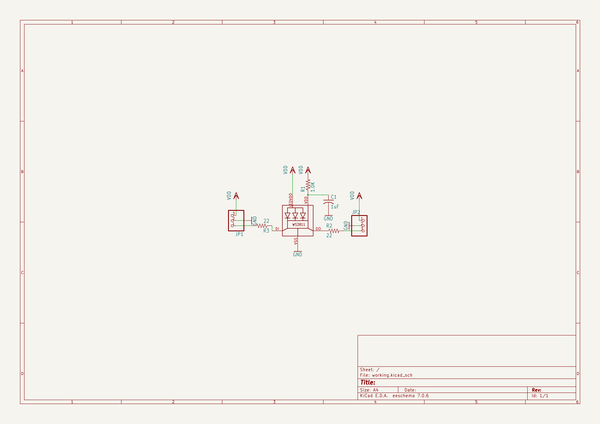
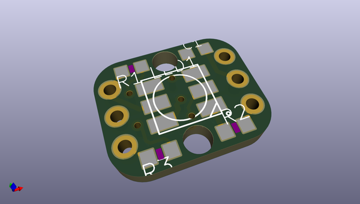
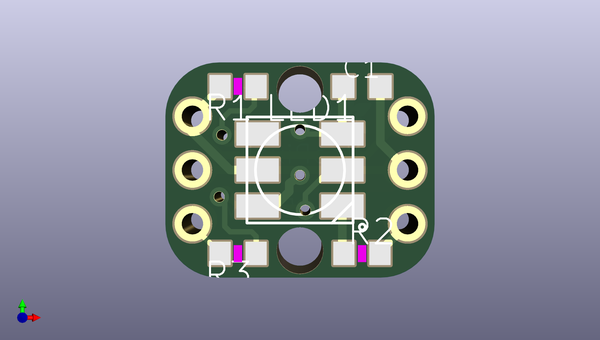
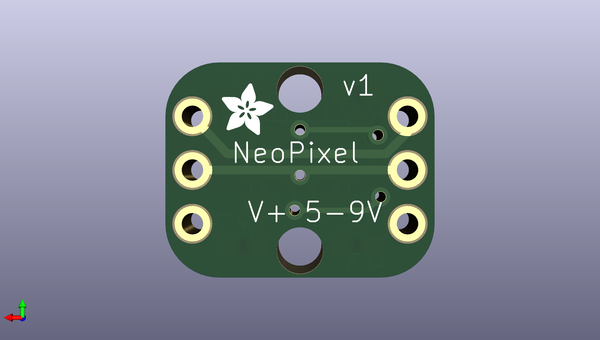

# adafruit_breadboard_neopixel_pcb
 
## summary 
* id: adafruit_adafruit_breadboard_neopixel_pcb_adafruit_breadboard_neopixel
* user: adafruit
* name: adafruit_breadboard_neopixel_pcb
* board: adafruit_breadboard_neopixel
* repo: https://github.com/adafruit/Adafruit_Breadboard_NeoPixel_PCB

* src_file_repo_sch: 
* src_file_repo_sch_link: https://github.com/adafruit/Adafruit_Breadboard_NeoPixel_PCB/tree/master/
* full details link: https://github.com/oomlout/oomlout_oomp_project_bot_v_2/tree/main/projects/adafruit_adafruit_breadboard_neopixel_pcb_adafruit_breadboard_neopixel/current_version/working  

## schematic  
  
[schematic (pdf)](working_schematic.pdf)  

## pcb  
 
  
  
  
[board (pdf)](working.pdf)  

## working_bom
| Id | Designator | Footprint | Quantity | Designation | Supplier and ref |  | None | 
| --- | --- | --- | --- | --- | --- | --- | --- | 
| 1 | @HOLE1,@HOLE0 |  | 2 |  |  |  | [''] | 
| 2 | JP2,JP1 | 1X03-CLEANBIG | 2 |  |  |  | [''] | 
| 3 | LED1 | WS28115050 | 1 | WS28115050 |  |  | [''] | 
| 4 | R1 | R0603 | 1 | 1.0K |  |  | [''] | 
| 5 | R3,R2 | R0603 | 2 | 22 |  |  | [''] | 
| 6 | C1 | C0603K | 1 | 1uF |  |  | [''] | 
| 7 | U$1 | ADAFRUIT_2.5MM | 1 |  |  |  | [''] | 

## bom_schematic
| Ref | Qnty | Value | Cmp name | Footprint | Description | Vendor | DNP | 
| --- | --- | --- | --- | --- | --- | --- | --- | 
| C1 | 1 | 1uF | C-USC0603K | working:C0603K |  |  |  | 
| JP1, JP2 | 2 | PINHD-1X3CB | PINHD-1X3CB | working:1X03-CLEANBIG |  |  |  | 
| LED1 | 1 | WS28115050 | WS28115050 | working:WS28115050 |  |  |  | 
| R1 | 1 | 1.0K | R-US_R0603 | working:R0603 |  |  |  | 
| R2, R3 | 2 | 22 | R-US_R0603 | working:R0603 |  |  |  | 

