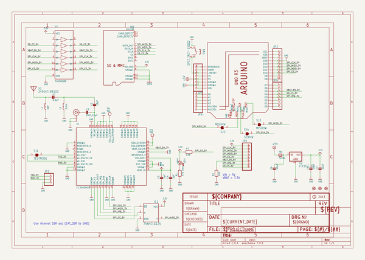
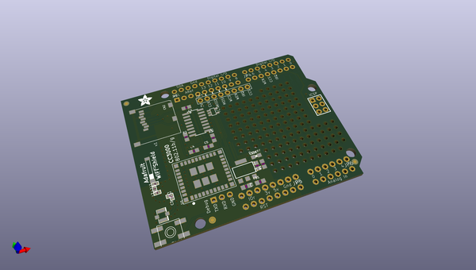
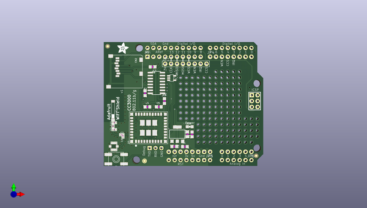
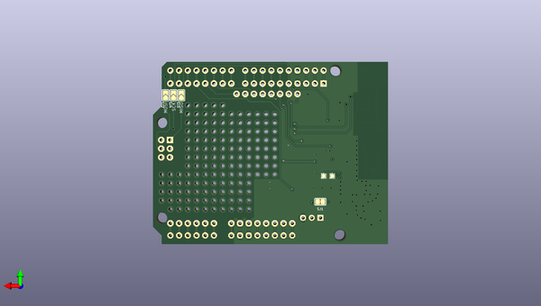

# adafruit_cc3000_shield_pcb
 
## summary 
* id: adafruit_adafruit_cc3000_shield_pcb_adafruit_cc3000_shield_rev_b
* user: adafruit
* name: adafruit_cc3000_shield_pcb
* board: adafruit_cc3000_shield_rev_b
* repo: https://github.com/adafruit/Adafruit_CC3000_Shield_PCB

* src_file_repo_sch: 
* src_file_repo_sch_link: https://github.com/adafruit/Adafruit_CC3000_Shield_PCB/tree/master/
* full details link: https://github.com/oomlout/oomlout_oomp_project_bot_v_2/tree/main/projects/adafruit_adafruit_cc3000_shield_pcb_adafruit_cc3000_shield_rev_b/current_version/working  

## schematic  
  
[schematic (pdf)](working_schematic.pdf)  

## pcb  
 
  
  
  
[board (pdf)](working.pdf)  

## working_bom
| Id | Designator | Footprint | Quantity | Designation | Supplier and ref |  | None | 
| --- | --- | --- | --- | --- | --- | --- | --- | 
| 1 | C1 | _0402 | 1 | 2.2pF |  |  | [''] | 
| 2 | @HOLE0,@HOLE1,@HOLE3,@HOLE2 |  | 4 |  |  |  | [''] | 
| 3 | C2 | _0402 | 1 | 10pF |  |  | [''] | 
| 4 | FID1,FID2,FID3 | FIDUCIAL_1MM | 3 | FIDUCIAL" |  |  | [''] | 
| 5 | LED1 | CHIPLED_0805_NOOUTLINE | 1 | green |  |  | [''] | 
| 6 | C4,C5 | _0805MP | 2 | 1µF |  |  | [''] | 
| 7 | C8,C7,C6 | _0805MP | 3 | 10µF |  |  | [''] | 
| 8 | R2,R3 | _0805MP | 2 | 10K |  |  | [''] | 
| 9 | U1 | CC3000MOD | 1 | CC3000MOD |  |  | [''] | 
| 10 | SW1 | EVQ-Q2 | 1 | SPST_TACT-EVQQ2 |  |  | [''] | 
| 11 | CN2 | MICROSD | 1 | microSD |  |  | [''] | 
| 12 | JP3 | 1X10_ROUND70 | 1 |  |  |  | [''] | 
| 13 | U3 | SOIC16 | 1 | 74HC4050D |  |  | [''] | 
| 14 | X1 | ANT_2500AT44M0400 | 1 | 2450AT18B100 |  |  | [''] | 
| 15 | C3 | _0402 | 1 | DNC_10pF |  |  | [''] | 
| 16 | JP2 | 1X03_ROUND | 1 |  |  |  | [''] | 
| 17 | L1 | _0402 | 1 | DNP |  |  | [''] | 
| 18 | JP5,JP4 | 1X08-CLEANBIG | 2 |  |  |  | [''] | 
| 19 | FB1 | _0805MP | 1 | Ferrite |  |  | [''] | 
| 20 | JP6 | 1X06-CLEANBIG | 1 |  |  |  | [''] | 
| 21 | R1 | _0805MP | 1 | 470 ohm |  |  | [''] | 
| 22 | U$35 | U.FL | 1 | U.FL |  |  | [''] | 
| 23 | U$36 | ARDUINOR3_ICSP | 1 | ARDUINO_R3_ICSP |  |  | [''] | 
| 24 | IC1 | SOT23-5L | 1 | 74AHC1G125 |  |  | [''] | 
| 25 | U2 | SOT223-R | 1 | LT1117-3v |  |  | [''] | 
| 26 | JP1 | 1X08-BIG | 1 |  |  |  | [''] | 
| 27 | L2 | _0402 | 1 | 2.2nH |  |  | [''] | 
| 28 | U$8 | ADAFRUIT_5MM | 1 |  |  |  | [''] | 
| 29 | SJ2 | SOLDERJUMPER_ARROW_NOPASTE | 1 | MOSIHW |  |  | [''] | 
| 30 | SJ1 | SOLDERJUMPER_CLOSEDWIRE | 1 | TESTMODE |  |  | [''] | 
| 31 | SJ3 | SOLDERJUMPER_ARROW_NOPASTE | 1 | MISOHW |  |  | [''] | 
| 32 | TP2 | TESTPOINT_PAD_1MM | 1 | SDA |  |  | [''] | 
| 33 | TP1 | TESTPOINT_PAD_1MM | 1 | SCL |  |  | [''] | 
| 34 | SJ4 | SOLDERJUMPER_ARROW_NOPASTE | 1 | SCKHW |  |  | [''] | 

## bom_schematic
| Ref | Qnty | Value | Cmp name | Footprint | Description | Vendor | DNP | 
| --- | --- | --- | --- | --- | --- | --- | --- | 
| C1 | 1 | 2.2pF | CAP_CERAMIC_0402 | working:_0402 |  |  |  | 
| C2 | 1 | 10pF | CAP_CERAMIC_0402 | working:_0402 |  |  |  | 
| C3 | 1 | DNC_10pF | CAP_CERAMIC_0402 | working:_0402 |  |  |  | 
| C4, C5 | 2 | 1µF | CAP_CERAMIC_0805MP | working:_0805MP |  |  |  | 
| C6, C7, C8 | 3 | 10µF | CAP_CERAMIC_0805MP | working:_0805MP |  |  |  | 
| CN2 | 1 | microSD | MICROSD | working:MICROSD |  |  |  | 
| FB1 | 1 | Ferrite | FERRITE_0805MP | working:_0805MP |  |  |  | 
| FID1, FID2, FID3 | 3 | FIDUCIAL"" | FIDUCIAL{dblquote}{dblquote} | working:FIDUCIAL_1MM |  |  |  | 
| IC1 | 1 | 74AHC1G125 | 74AHC1G125 | working:SOT23-5L |  |  |  | 
| JP1 | 1 | PINHD-1X8BIG | PINHD-1X8BIG | working:1X08-BIG |  |  |  | 
| JP2 | 1 | HEADER-1X3ROUND | HEADER-1X3ROUND | working:1X03_ROUND |  |  |  | 
| JP3 | 1 | HEADER-1X1070MIL | HEADER-1X1070MIL | working:1X10_ROUND70 |  |  |  | 
| JP4, JP5 | 2 | PINHD-1X8CLEANBIG | PINHD-1X8CLEANBIG | working:1X08-CLEANBIG |  |  |  | 
| JP6 | 1 | PINHD-1X6CB | PINHD-1X6CB | working:1X06-CLEANBIG |  |  |  | 
| L1 | 1 | DNP | INDUCTOR_0402 | working:_0402 |  |  |  | 
| L2 | 1 | 2.2nH | INDUCTOR_0402 | working:_0402 |  |  |  | 
| LED1 | 1 | green | LED0805_NOOUTLINE | working:CHIPLED_0805_NOOUTLINE |  |  |  | 
| R1 | 1 | 470 ohm | RESISTOR_0805MP | working:_0805MP |  |  |  | 
| R2, R3 | 2 | 10K | RESISTOR_0805MP | working:_0805MP |  |  |  | 
| SJ1 | 1 | TESTMODE | SOLDERJUMPER_CLOSED | working:SOLDERJUMPER_CLOSEDWIRE |  |  |  | 
| SJ2 | 1 | MOSIHW | SOLDERJUMPER | working:SOLDERJUMPER_ARROW_NOPASTE |  |  |  | 
| SJ3 | 1 | MISOHW | SOLDERJUMPER | working:SOLDERJUMPER_ARROW_NOPASTE |  |  |  | 
| SJ4 | 1 | SCKHW | SOLDERJUMPER | working:SOLDERJUMPER_ARROW_NOPASTE |  |  |  | 
| SW1 | 1 | SPST_TACT-EVQQ2 | SPST_TACT-EVQQ2 | working:EVQ-Q2 |  |  |  | 
| TP1 | 1 | SCL | TESTPOINTPAD1MM | working:TESTPOINT_PAD_1MM |  |  |  | 
| TP2 | 1 | SDA | TESTPOINTPAD1MM | working:TESTPOINT_PAD_1MM |  |  |  | 
| U1 | 1 | CC3000MOD | CC3000MOD | working:CC3000MOD |  |  |  | 
| U2 | 1 | LT1117-3v | VREG_SOT223 | working:SOT223-R |  |  |  | 
| U3 | 1 | 74HC4050D | 74HC4050D | working:SOIC16 |  |  |  | 
| U$35 | 1 | U.FL | U.FL | working:U.FL |  |  |  | 
| U$36 | 1 | ARDUINO_R3_ICSP | ARDUINO_R3_ICSP | working:ARDUINOR3_ICSP |  |  |  | 
| X1 | 1 | 2450AT18B100 | ANTENNA_JOHANSON_2500AT44M0400 | working:ANT_2500AT44M0400 |  |  |  | 

