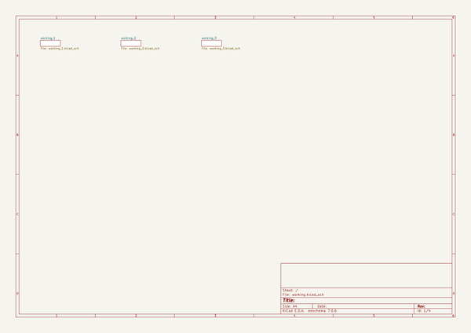
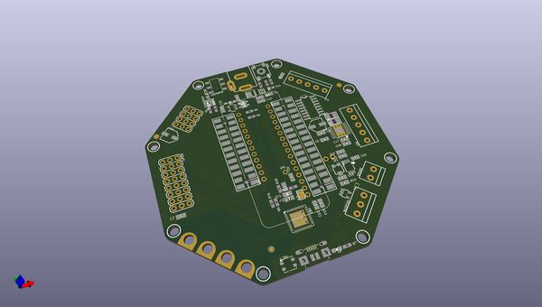

# adafruit_crickit_pcbs
 
## summary 
* id: adafruit_adafruit_crickit_pcbs_adafruit_crickit_featherwing
* user: adafruit
* name: adafruit_crickit_pcbs
* board: adafruit_crickit_featherwing
* repo: https://github.com/adafruit/Adafruit_Crickit_PCBs

* src_file_repo_sch: 
* src_file_repo_sch_link: https://github.com/adafruit/Adafruit_Crickit_PCBs/tree/master/
* full details link: https://github.com/oomlout/oomlout_oomp_project_bot_v_2/tree/main/projects/adafruit_adafruit_crickit_pcbs_adafruit_crickit_featherwing/current_version/working  

## schematic  
  
[schematic (pdf)](working_schematic.pdf) 

## pcb  
 
  
  
  
[board (pdf)](working.pdf)  

## working_bom
| Id | Designator | Footprint | Quantity | Designation | Supplier and ref |  | None | 
| --- | --- | --- | --- | --- | --- | --- | --- | 
| 1 | C11,C18,C6,C12,C20,C22 | 0805-NO | 6 | 0.1uF |  |  | [''] | 
| 2 | U$74 | CRICKIT_WING_TOP | 1 |  |  |  | [''] | 
| 3 | JP4 | 1X12_ROUND | 1 |  |  |  | [''] | 
| 4 | C17,C19,C7,C15,C21,C2,C16 | 0805-NO | 7 | 10uF |  |  | [''] | 
| 5 | R17,R8,R11,R16,R1 | 0603-NO | 5 | 264K |  |  | [''] | 
| 6 | L0 | CHIPLED_0805_NOOUTLINE | 1 | yellow |  |  | [''] | 
| 7 | C8 | 0603-NO | 1 | DNP |  |  | [''] | 
| 8 | U$51,U$41,U$43,U$50,U$52,U$42,U$49,U$44 | MOUNTINGHOLE_3.0_NPH | 8 | MOUNTINGHOLE3.0_NPH |  |  | [''] | 
| 9 | TP32,TP29,TP30,TP31 | PCB_ALLI | 4 | SEWTAPPCB_ALLIGATOR |  |  | [''] | 
| 10 | R2,R18,R6,R15,R5,R7 | 0603-NO | 6 | 2.2K |  |  | [''] | 
| 11 | JP2 | TERMBLOC_1X5-3.5MM | 1 | 3.5mm |  |  | [''] | 
| 12 | SPKR0 | TERMBLOCK_1X2-3.5MM | 1 | 3.5mm |  |  | [''] | 
| 13 | R10,R9 | 0603-NO | 2 | 1Mohm |  |  | [''] | 
| 14 | MS2 | FEATHERWING_SMT2 | 1 | FEATHERWING_SMTDUAL |  |  | [''] | 
| 15 | LED1 | LED3535 | 1 | WS2812B3535 |  |  | [''] | 
| 16 | C5 | 0805-NO | 1 | 10µF |  |  | [''] | 
| 17 | JP8 | TERMBLOC_1X5-3.5MM | 1 | 5pin 3.5mm |  |  | [''] | 
| 18 | R4,R3 | _1206 | 2 | 0.2Ω |  |  | [''] | 
| 19 | FID2,FID3,FID1 | FIDUCIAL_1MM | 3 | FIDUCIAL_1MM |  |  | [''] | 
| 20 | U2 | HTSSOP16 | 1 | DRV8833PWPR |  |  | [''] | 
| 21 | GPIO0 | 3X08 | 1 | 3x8 FEMALE |  |  | [''] | 
| 22 | C1,C4 | 0805-NO | 2 | 10µF/16V |  |  | [''] | 
| 23 | C14,C13 | 0805-NO | 2 | 1uF |  |  | [''] | 
| 24 | D1,D2 | SOD-323 | 2 | 1N4148 |  |  | [''] | 
| 25 | C10 | PANASONIC_C | 1 | 47uF+/16v |  |  | [''] | 
| 26 | C3 | 0805_10MGAP | 1 | 1uF |  |  | [''] | 
| 27 | SERVO0 | 3X04 | 1 | 3x4 Male |  |  | [''] | 
| 28 | NEOPIX0 | TERMBLOCK_1X3-3.5MM | 1 | 3.5mm |  |  | [''] | 
| 29 | SJ1 | SOLDERJUMPER_CLOSEDWIRE | 1 |  |  |  | [''] | 
| 30 | SW1 | EVQ-Q2_SMALLER | 1 | EVQQ2 |  |  | [''] | 
| 31 | ON/OFF0 | EG1390 | 1 | MSS-22C01G2 |  |  | [''] | 
| 32 | IC2 | SO16 | 1 | ULN2003AD |  |  | [''] | 
| 33 | R13,R12 | 0805-NO | 2 | 100 |  |  | [''] | 
| 34 | C9 | PANASONIC_C | 1 | 47uF/16v |  |  | [''] | 
| 35 | VR2 | TRIMPOT_BOURNS_3303W | 1 | 10K trim |  |  | [''] | 
| 36 | JP5 | 1X01_ROUND | 1 |  |  |  | [''] | 
| 37 | FB1 | 0805-NO | 1 | Ferrite |  |  | [''] | 
| 38 | U5 | MSOP8_0.65MM | 1 | PAM8302AASCR |  |  | [''] | 
| 39 | POWERFAIL0 | CHIPLED_0805_NOOUTLINE | 1 | red |  |  | [''] | 
| 40 | JP1 | 1X02_ROUND | 1 |  |  |  | [''] | 
| 41 | R14 | 0603-NO | 1 | 510 |  |  | [''] | 
| 42 | CN1 | 4UCONN_20329_V2 | 1 | 4U#20329 |  |  | [''] | 
| 43 | U1 | SOT23-5 | 1 | mic5225-3.3 |  |  | [''] | 
| 44 | JP3 | 1X16_ROUND | 1 |  |  |  | [''] | 
| 45 | IC4 | WSON8 | 1 | TPS259573 |  |  | [''] | 
| 46 | Q2 | POWERDI3333 | 1 | AON7401 |  |  | [''] | 
| 47 | X2 | DCJACK_2MM_PTH | 1 | 2.1mm DC |  |  | [''] | 
| 48 | IC3 | SOT23-5 | 1 | 74AHCT1G125DBV |  |  | [''] | 
| 49 | POWEROK0 | CHIPLED_0805_NOOUTLINE | 1 | green |  |  | [''] | 
| 50 | U$4 | TQFN48_7MM | 1 | ATSAMD21G_QFN |  |  | [''] | 
| 51 | SJ7 | SOLDERJUMPER_ARROW_NOPASTE | 1 | ISENSEA |  |  | [''] | 
| 52 | TP1,TP2,TP3 | TP15R | 3 | TPTP15R |  |  | [''] | 
| 53 | U$76 | PCBFEAT-REV-040 | 1 |  |  |  | [''] | 
| 54 | SJ8 | SOLDERJUMPER_ARROW_NOPASTE | 1 | ISENSEB |  |  | [''] | 
| 55 | U$72 | CRICKIT_WING_BOT | 1 |  |  |  | [''] | 

## bom_schematic
no data

## mounting_holes
| x | y | package | value | ref | size | 
| --- | --- | --- | --- | --- | --- | 
| 21.59 | 0.0 | MOUNTINGHOLE_3.0_NPH | MOUNTINGHOLE3.0_NPH | U$41 | m3 | 
| 53.85 | 0.0 | MOUNTINGHOLE_3.0_NPH | MOUNTINGHOLE3.0_NPH | U$42 | m3 | 
| 0.0 | 21.59 | MOUNTINGHOLE_3.0_NPH | MOUNTINGHOLE3.0_NPH | U$43 | m3 | 
| 75.44 | 21.59 | MOUNTINGHOLE_3.0_NPH | MOUNTINGHOLE3.0_NPH | U$44 | m3 | 
| 75.44 | 53.85 | MOUNTINGHOLE_3.0_NPH | MOUNTINGHOLE3.0_NPH | U$49 | m3 | 
| 0.0 | 53.85 | MOUNTINGHOLE_3.0_NPH | MOUNTINGHOLE3.0_NPH | U$50 | m3 | 
| 21.59 | 75.44 | MOUNTINGHOLE_3.0_NPH | MOUNTINGHOLE3.0_NPH | U$51 | m3 | 
| 53.85 | 75.44 | MOUNTINGHOLE_3.0_NPH | MOUNTINGHOLE3.0_NPH | U$52 | m3 | 

