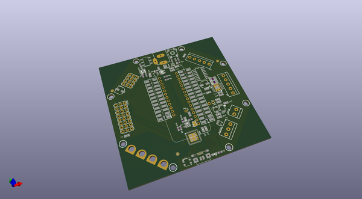
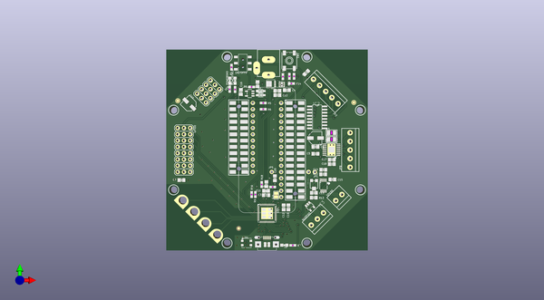
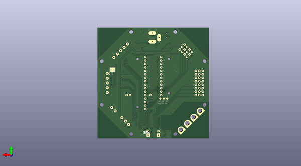

# adafruit_crickit_pcbs
 
## summary 
* id: adafruit_adafruit_crickit_pcbs_adafruit_crickit_for_microbit
* user: adafruit
* name: adafruit_crickit_pcbs
* board: adafruit_crickit_for_microbit
* repo: https://github.com/adafruit/Adafruit_Crickit_PCBs

* src_file_repo_sch: 
* src_file_repo_sch_link: https://github.com/adafruit/Adafruit_Crickit_PCBs/tree/master/
* full details link: https://github.com/oomlout/oomlout_oomp_project_bot_v_2/tree/main/projects/adafruit_adafruit_crickit_pcbs_adafruit_crickit_for_microbit/current_version/working  

## schematic  
  
[schematic (pdf)](working_schematic.pdf)  

## pcb  
 
  
  
  
[board (pdf)](working.pdf)  

## working_bom
| Id | Designator | Footprint | Quantity | Designation | Supplier and ref |  | None | 
| --- | --- | --- | --- | --- | --- | --- | --- | 
| 1 | R4,R3 | _1206 | 2 | 0.2Ω |  |  | [''] | 
| 2 | TP29,TP30,TP32,TP31 | PCB_ALLI | 4 | SEWTAPPCB_ALLIGATOR |  |  | [''] | 
| 3 | U5 | MSOP8_0.65MM | 1 | PAM8302AASCR |  |  | [''] | 
| 4 | R6,R5,R7,R18,R15,R2 | 0603-NO | 6 | 2.2K |  |  | [''] | 
| 5 | L0 | CHIPLED_0805_NOOUTLINE | 1 | yellow |  |  | [''] | 
| 6 | U$52,U$49,U$43,U$44,U$50,U$41,U$42,U$51 | MOUNTINGHOLE_3.0_NPH | 8 | MOUNTINGHOLE3.0_NPH |  |  | [''] | 
| 7 | R14 | 0603-NO | 1 | 510 |  |  | [''] | 
| 8 | R12,R13 | 0805-NO | 2 | 100 |  |  | [''] | 
| 9 | C10 | PANASONIC_C | 1 | 47uF+/16v |  |  | [''] | 
| 10 | C17,C15,C16,C2,C21,C7,C19 | 0805-NO | 7 | 10uF |  |  | [''] | 
| 11 | C5 | 0805-NO | 1 | 10µF |  |  | [''] | 
| 12 | POWERFAIL0 | CHIPLED_0805_NOOUTLINE | 1 | red |  |  | [''] | 
| 13 | NEOPIX0 | TERMBLOCK_1X3-3.5MM | 1 | 3.5mm |  |  | [''] | 
| 14 | ON/OFF0 | EG1390 | 1 | MSS-22C01G2 |  |  | [''] | 
| 15 | SERVO0 | 3X04 | 1 | 3x4 Male |  |  | [''] | 
| 16 | FID2,FID3,FID1 | FIDUCIAL_1MM | 3 | FIDUCIAL_1MM |  |  | [''] | 
| 17 | JP3 | 1X16_ROUND | 1 |  |  |  | [''] | 
| 18 | LED1 | LED3535 | 1 | WS2812B3535 |  |  | [''] | 
| 19 | IC4 | WSON8 | 1 | TPS259573 |  |  | [''] | 
| 20 | MS2 | FEATHERWING_SMT2 | 1 | FEATHERWING_SMTDUAL |  |  | [''] | 
| 21 | C9 | PANASONIC_C | 1 | 47uF/16v |  |  | [''] | 
| 22 | U2 | HTSSOP16 | 1 | DRV8833PWPR |  |  | [''] | 
| 23 | R11,R17,R8,R1,R16 | 0603-NO | 5 | 264K |  |  | [''] | 
| 24 | C20,C11,C12,C18,C22,C6 | 0805-NO | 6 | 0.1uF |  |  | [''] | 
| 25 | D1,D2 | SOD-323 | 2 | 1N4148 |  |  | [''] | 
| 26 | IC2 | SO16 | 1 | ULN2003AD |  |  | [''] | 
| 27 | U$74 | CRICKIT_WING_TOP | 1 |  |  |  | [''] | 
| 28 | C1,C4 | 0805-NO | 2 | 10µF/16V |  |  | [''] | 
| 29 | CN1 | 4UCONN_20329_V2 | 1 | 4U#20329 |  |  | [''] | 
| 30 | X2 | DCJACK_2MM_PTH | 1 | 2.1mm DC |  |  | [''] | 
| 31 | JP5 | 1X01_ROUND | 1 |  |  |  | [''] | 
| 32 | POWEROK0 | CHIPLED_0805_NOOUTLINE | 1 | green |  |  | [''] | 
| 33 | JP8 | TERMBLOC_1X5-3.5MM | 1 | 5pin 3.5mm |  |  | [''] | 
| 34 | SPKR0 | TERMBLOCK_1X2-3.5MM | 1 | 3.5mm |  |  | [''] | 
| 35 | R9,R10 | 0603-NO | 2 | 1Mohm |  |  | [''] | 
| 36 | Q2 | POWERDI3333 | 1 | AON7401 |  |  | [''] | 
| 37 | U1 | SOT23-5 | 1 | mic5225-3.3 |  |  | [''] | 
| 38 | C14,C13 | 0805-NO | 2 | 1uF |  |  | [''] | 
| 39 | SW1 | EVQ-Q2_SMALLER | 1 | EVQQ2 |  |  | [''] | 
| 40 | IC3 | SOT23-5 | 1 | 74AHCT1G125DBV |  |  | [''] | 
| 41 | JP4 | 1X12_ROUND | 1 |  |  |  | [''] | 
| 42 | GPIO0 | 3X08 | 1 | 3x8 FEMALE |  |  | [''] | 
| 43 | C8 | 0603-NO | 1 | DNP |  |  | [''] | 
| 44 | VR2 | TRIMPOT_BOURNS_3303W | 1 | 10K trim |  |  | [''] | 
| 45 | SJ1 | SOLDERJUMPER_CLOSEDWIRE | 1 |  |  |  | [''] | 
| 46 | FB1 | 0805-NO | 1 | Ferrite |  |  | [''] | 
| 47 | JP2 | TERMBLOC_1X5-3.5MM | 1 | 3.5mm |  |  | [''] | 
| 48 | U$4 | TQFN48_7MM | 1 | ATSAMD21G_QFN |  |  | [''] | 
| 49 | JP1 | 1X02_ROUND | 1 |  |  |  | [''] | 
| 50 | C3 | 0805_10MGAP | 1 | 1uF |  |  | [''] | 
| 51 | U$76 | PCBFEAT-REV-040 | 1 |  |  |  | [''] | 
| 52 | TP1,TP3,TP2 | TP15R | 3 | TPTP15R |  |  | [''] | 
| 53 | SJ8 | SOLDERJUMPER_ARROW_NOPASTE | 1 | ISENSEB |  |  | [''] | 
| 54 | SJ7 | SOLDERJUMPER_ARROW_NOPASTE | 1 | ISENSEA |  |  | [''] | 
| 55 | U$72 | CRICKIT_WING_BOT | 1 |  |  |  | [''] | 

## bom_schematic
no data

## mounting_holes
| x | y | package | value | ref | size | 
| --- | --- | --- | --- | --- | --- | 
| 21.58999999999999 | 0.0 | MOUNTINGHOLE_3.0_NPH | MOUNTINGHOLE3.0_NPH | U$41 | m3 | 
| 53.848 | 0.0 | MOUNTINGHOLE_3.0_NPH | MOUNTINGHOLE3.0_NPH | U$42 | m3 | 
| 0.0 | 21.590000000000003 | MOUNTINGHOLE_3.0_NPH | MOUNTINGHOLE3.0_NPH | U$43 | m3 | 
| 75.438 | 21.590000000000003 | MOUNTINGHOLE_3.0_NPH | MOUNTINGHOLE3.0_NPH | U$44 | m3 | 
| 75.438 | 53.848 | MOUNTINGHOLE_3.0_NPH | MOUNTINGHOLE3.0_NPH | U$49 | m3 | 
| 0.0 | 53.848 | MOUNTINGHOLE_3.0_NPH | MOUNTINGHOLE3.0_NPH | U$50 | m3 | 
| 21.58999999999999 | 75.438 | MOUNTINGHOLE_3.0_NPH | MOUNTINGHOLE3.0_NPH | U$51 | m3 | 
| 53.848 | 75.438 | MOUNTINGHOLE_3.0_NPH | MOUNTINGHOLE3.0_NPH | U$52 | m3 | 

