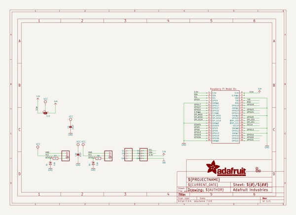
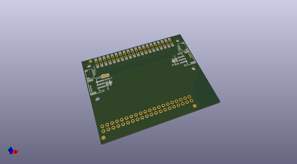
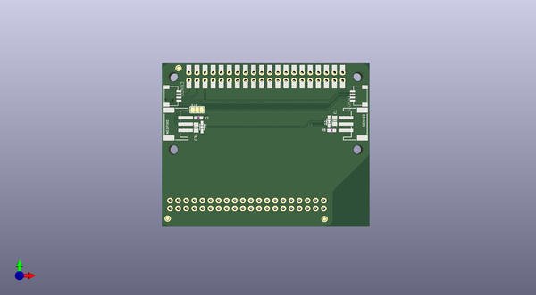

# adafruit_cyberdeck_pcb
 
## summary 
* id: adafruit_adafruit_cyberdeck_pcb_adafruit_cyberdeck_hat
* user: adafruit
* name: adafruit_cyberdeck_pcb
* board: adafruit_cyberdeck_hat
* repo: https://github.com/adafruit/Adafruit-CYBERDECK-PCB

* src_file_repo_sch: 
* src_file_repo_sch_link: https://github.com/adafruit/Adafruit-CYBERDECK-PCB/tree/main/
* full details link: https://github.com/oomlout/oomlout_oomp_project_bot_v_2/tree/main/projects/adafruit_adafruit_cyberdeck_pcb_adafruit_cyberdeck_hat/current_version/working  

## schematic  
  
[schematic (pdf)](working_schematic.pdf) 

## pcb  
 
  
  
  
[board (pdf)](working.pdf)  

## working_bom
| Id | Designator | Footprint | Quantity | Designation | Supplier and ref |  | None | 
| --- | --- | --- | --- | --- | --- | --- | --- | 
| 1 | D2,D1 | SOD-323 | 2 | 3.6V |  |  | [''] | 
| 2 | CONN3,CONN1 | JST_SH4 | 2 | STEMMA_I2C_QT |  |  | [''] | 
| 3 | @HOLE2,@HOLE3,@HOLE0,@HOLE1 |  | 4 |  |  |  | [''] | 
| 4 | SJ1 | SOLDERJUMPER_2WAY_OPEN_NOPASTE | 1 |  |  |  | [''] | 
| 5 | RPI2 | RASPI_2X20_THMSMT_TOP | 1 | RASPBERRYPI_BPLUS_2X20_THMSMT_TOP |  |  | [''] | 
| 6 | R8,R7 | 0603-NO | 2 | 1K |  |  | [''] | 
| 7 | FID3,FID2,FID1 | FIDUCIAL_1MM | 3 | FIDUCIAL_1MM |  |  | [''] | 
| 8 | C1,C34 | 0805-NO | 2 | 10uF |  |  | [''] | 
| 9 | SENSE0,NEOPIX0 | JSTPH3 | 2 | JST PH 3 |  |  | [''] | 
| 10 | U$2 | CYBERDECK_BONNET_TOP | 1 |  |  |  | [''] | 
| 11 | RPI1 | 2X20 | 1 | RASPBERRYPI_BPLUS_IDC |  |  | [''] | 
| 12 | U$1 | CYBERDECK_BONNET_BOT | 1 |  |  |  | [''] | 

## bom_schematic
| Ref | Qnty | Value | Cmp name | Footprint | Description | Vendor | DNP | 
| --- | --- | --- | --- | --- | --- | --- | --- | 
| C1, C34 | 2 | 10uF | CAP_CERAMIC0805-NOOUTLINE | working:0805-NO |  |  |  | 
| CONN1, CONN3 | 2 | STEMMA_I2C_QT | STEMMA_I2C_QT | working:JST_SH4 |  |  |  | 
| D1, D2 | 2 | 3.6V | DIODE-ZENERSOD323 | working:SOD-323 |  |  |  | 
| FID1, FID2, FID3 | 3 | FIDUCIAL_1MM | FIDUCIAL_1MM | working:FIDUCIAL_1MM |  |  |  | 
| NEOPIX0 | 1 | JST PH 3 | CON_JST_PH_3PIN | working:JSTPH3 |  |  |  | 
| R7, R8 | 2 | 1K | RESISTOR_0603_NOOUT | working:0603-NO |  |  |  | 
| RPI1 | 1 | RASPBERRYPI_BPLUS_IDC | RASPBERRYPI_BPLUS_IDC | working:2X20 |  |  |  | 
| RPI2 | 1 | RASPBERRYPI_BPLUS_2X20_THMSMT_TOP | RASPBERRYPI_BPLUS_2X20_THMSMT_TOP | working:RASPI_2X20_THMSMT_TOP |  |  |  | 
| SENSE0 | 1 | JST PH 3 | CON_JST_PH_3PIN | working:JSTPH3 |  |  |  | 
| SJ1 | 1 | SOLDERJUMPER_2WAY | SOLDERJUMPER_2WAY | working:SOLDERJUMPER_2WAY_OPEN_NOPASTE |  |  |  | 

