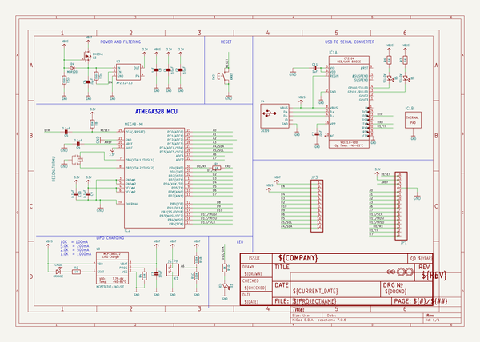
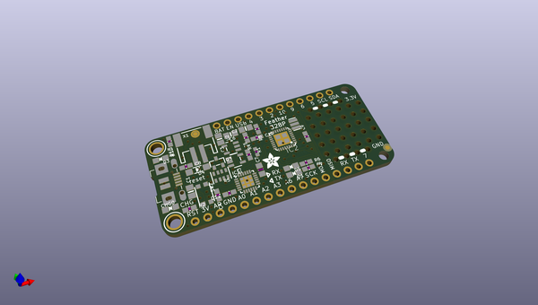
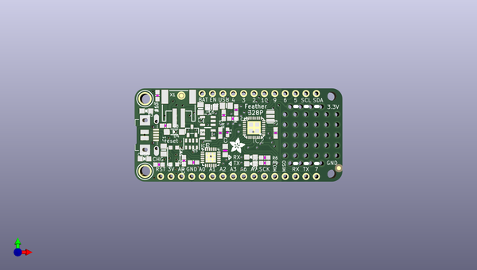
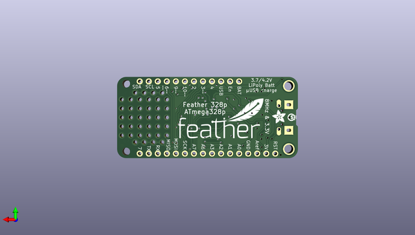

# adafruit_feather_328p_pcb
 
## summary 
* id: adafruit_adafruit_feather_328p_pcb_adafruit_feather_328p
* user: adafruit
* name: adafruit_feather_328p_pcb
* board: adafruit_feather_328p
* repo: https://github.com/adafruit/Adafruit-Feather-328P-PCB

* src_file_repo_sch: 
* src_file_repo_sch_link: https://github.com/adafruit/Adafruit-Feather-328P-PCB/tree/master/
* full details link: https://github.com/oomlout/oomlout_oomp_project_bot_v_2/tree/main/projects/adafruit_adafruit_feather_328p_pcb_adafruit_feather_328p/current_version/working  

## schematic  
  
[schematic (pdf)](working_schematic.pdf)  

## pcb  
 
  
  
  
[board (pdf)](working.pdf)  

## working_bom
| Id | Designator | Footprint | Quantity | Designation | Supplier and ref |  | None | 
| --- | --- | --- | --- | --- | --- | --- | --- | 
| 1 | D3 | CHIPLED_0805_NOOUTLINE | 1 | RED |  |  | [''] | 
| 2 | U$32,U$31 | MOUNTINGHOLE_2.5_PLATED | 2 | MOUNTINGHOLE2.5 |  |  | [''] | 
| 3 | U2 | SOT23-5 | 1 | AP2112-3.3 |  |  | [''] | 
| 4 | Y2 | RESONATOR | 1 | CSTNE8M00xx 8MHZ |  |  | [''] | 
| 5 | C11,C8 | 0603-NO | 2 | 1uF |  |  | [''] | 
| 6 | U3 | SOT23-5 | 1 | MCP73831T-2ACI/OT |  |  | [''] | 
| 7 | C5,C9,C10,C4 | 0603-NO | 4 | 0.1uF |  |  | [''] | 
| 8 | U$34,U$35 | FIDUCIAL_1MM | 2 | FIDUCIAL_1MM |  |  | [''] | 
| 9 | D5,D1 | CHIPLED_0805_NOOUTLINE | 2 | YELLOW |  |  | [''] | 
| 10 | R10,R6,R7,R2 | 0603-NO | 4 | 1K |  |  | [''] | 
| 11 | U$15,U$44 | ADAFRUIT_3.5MM | 2 |  |  |  | [''] | 
| 12 | @HOLE0,@HOLE1 |  | 2 |  |  |  | [''] | 
| 13 | R5 | RESPACK_4X0603 | 1 | 100K |  |  | [''] | 
| 14 | SW2 | BTN_KMR2_4.6X2.8 | 1 | KMR2 |  |  | [''] | 
| 15 | R4,R8 | 0603-NO | 2 | 10K |  |  | [''] | 
| 16 | D4 | SOD-123 | 1 | MBR120 |  |  | [''] | 
| 17 | IC2 | MLF32-TH | 1 | ATMEGA328P |  |  | [''] | 
| 18 | X1 | JSTPH2 | 1 | JSTPH |  |  | [''] | 
| 19 | C3,C6 | 0805-NO | 2 | 10µF |  |  | [''] | 
| 20 | C2,C1 | 0805-NO | 2 | 10uF |  |  | [''] | 
| 21 | CHG0 | CHIPLED_0805_NOOUTLINE | 1 | ORANGE |  |  | [''] | 
| 22 | C7 | _0805MP | 1 | 10uF |  |  | [''] | 
| 23 | R1 | _0603MP | 1 | 1K |  |  | [''] | 
| 24 | IC1 | QFN24_4MM_SMSC | 1 | CP2104 |  |  | [''] | 
| 25 | Q3 | SOT23-R | 1 | DMG341 |  |  | [''] | 
| 26 | X4 | 4UCONN_20329_V2 | 1 | 20329 |  |  | [''] | 
| 27 | JP1 | 1X16_ROUND | 1 |  |  |  | [''] | 
| 28 | JP3 | 1X12_ROUND | 1 |  |  |  | [''] | 
| 29 | U$9 | FEATHERLOGO | 1 |  |  |  | [''] | 
| 30 | U$13 | PCBFEAT-REV-040 | 1 |  |  |  | [''] | 

## bom_schematic
| Ref | Qnty | Value | Cmp name | Footprint | Description | Vendor | DNP | 
| --- | --- | --- | --- | --- | --- | --- | --- | 
| C1, C2 | 2 | 10uF | CAP_CERAMIC0805-NOOUTLINE | working:0805-NO |  |  |  | 
| C3, C6 | 2 | 10µF | CAP_CERAMIC0805-NOOUTLINE | working:0805-NO |  |  |  | 
| C4, C5, C9, C10 | 4 | 0.1uF | CAP_CERAMIC0603_NO | working:0603-NO |  |  |  | 
| C7 | 1 | 10uF | CAP_CERAMIC_0805MP | working:_0805MP |  |  |  | 
| C8, C11 | 2 | 1uF | CAP_CERAMIC0603_NO | working:0603-NO |  |  |  | 
| CHG0 | 1 | ORANGE | LED0805_NOOUTLINE | working:CHIPLED_0805_NOOUTLINE |  |  |  | 
| D1, D5 | 2 | YELLOW | LED0805_NOOUTLINE | working:CHIPLED_0805_NOOUTLINE |  |  |  | 
| D3 | 1 | RED | LED0805_NOOUTLINE | working:CHIPLED_0805_NOOUTLINE |  |  |  | 
| D4 | 1 | MBR120 | DIODE-SCHOTTKYSOD-123 | working:SOD-123 |  |  |  | 
| IC1 | 1 | CP2104 | CP2104 | working:QFN24_4MM_SMSC |  |  |  | 
| IC2 | 1 | MEGA8-MI | MEGA8-MI | working:MLF32-TH |  |  |  | 
| JP1 | 1 | HEADER-1X16ROUND | HEADER-1X16ROUND | working:1X16_ROUND |  |  |  | 
| JP3 | 1 | HEADER-1X12 | HEADER-1X12 | working:1X12_ROUND |  |  |  | 
| Q3 | 1 | DMG341 | MOSFET-P | working:SOT23-R |  |  |  | 
| R1 | 1 | 1K | RESISTOR_0603MP | working:_0603MP |  |  |  | 
| R2, R6, R7, R10 | 4 | 1K | RESISTOR_0603_NOOUT | working:0603-NO |  |  |  | 
| R4, R8 | 2 | 10K | RESISTOR_0603_NOOUT | working:0603-NO |  |  |  | 
| R5 | 1 | 100K | RESISTOR_4PACK | working:RESPACK_4X0603 |  |  |  | 
| SW2 | 1 | KMR2 | SWITCH_TACT_SMT4.6X2.8 | working:BTN_KMR2_4.6X2.8 |  |  |  | 
| U2 | 1 | AP2112-3.3 | VREG_SOT23-5 | working:SOT23-5 |  |  |  | 
| U3 | 1 | MCP73831T-2ACI/OT | MCP73831/2 | working:SOT23-5 |  |  |  | 
| U$31, U$32 | 2 | MOUNTINGHOLE2.5 | MOUNTINGHOLE2.5 | working:MOUNTINGHOLE_2.5_PLATED |  |  |  | 
| U$34, U$35 | 2 | FIDUCIAL_1MM | FIDUCIAL_1MM | working:FIDUCIAL_1MM |  |  |  | 
| X1 | 1 | JSTPH | CON_JST_PH_2PIN | working:JSTPH2 |  |  |  | 
| X4 | 1 | 20329 | USB_MICRO_20329_V2 | working:4UCONN_20329_V2 |  |  |  | 
| Y2 | 1 | RESONATORMU | RESONATORMU | working:RESONATOR |  |  |  | 

## mounting_holes
| x | y | package | value | ref | size | 
| --- | --- | --- | --- | --- | --- | 
| 0.0 | 17.78 | MOUNTINGHOLE_2.5_PLATED | MOUNTINGHOLE2.5 | U$31 | m3 | 
| 0.0 | 0.0 | MOUNTINGHOLE_2.5_PLATED | MOUNTINGHOLE2.5 | U$32 | m3 | 

