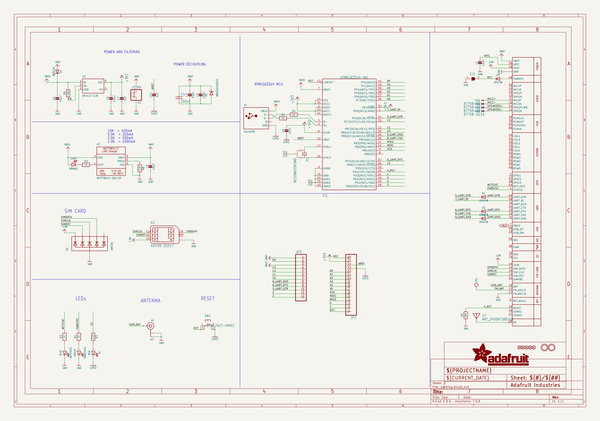
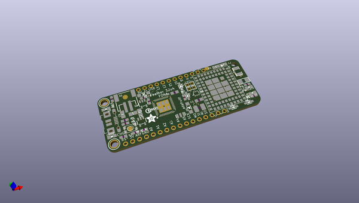
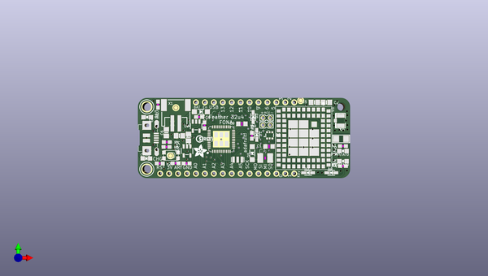
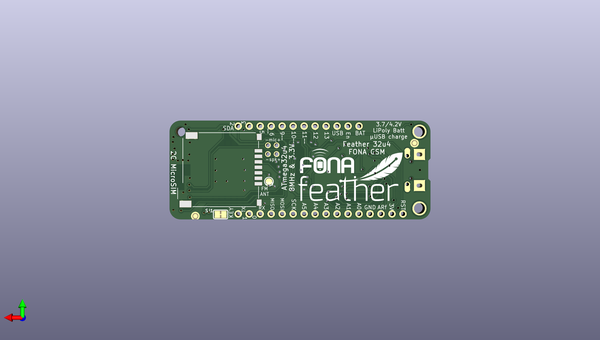

# adafruit_feather_32u4_fona_pcb
 
## summary 
* id: adafruit_adafruit_feather_32u4_fona_pcb_adafruit_feather_32u4_fona
* user: adafruit
* name: adafruit_feather_32u4_fona_pcb
* board: adafruit_feather_32u4_fona
* repo: https://github.com/adafruit/Adafruit-Feather-32u4-FONA-PCB

* src_file_repo_sch: 
* src_file_repo_sch_link: https://github.com/adafruit/Adafruit-Feather-32u4-FONA-PCB/tree/master/
* full details link: https://github.com/oomlout/oomlout_oomp_project_bot_v_2/tree/main/projects/adafruit_adafruit_feather_32u4_fona_pcb_adafruit_feather_32u4_fona/current_version/working  

## schematic  
  
[schematic (pdf)](working_schematic.pdf) 

## pcb  
 
  
  
  
[board (pdf)](working.pdf)  

## working_bom
| Id | Designator | Footprint | Quantity | Designation | Supplier and ref |  | None | 
| --- | --- | --- | --- | --- | --- | --- | --- | 
| 1 | JP1 | 1X16_ROUND | 1 |  |  |  | [''] | 
| 2 | D5 | SOD-123 | 1 | MMSZ5231BT1G |  |  | [''] | 
| 3 | L0 | CHIPLED_0805_NOOUTLINE | 1 | RED |  |  | [''] | 
| 4 | X6,X5 | 87758-0216 | 2 | 1x2 |  |  | [''] | 
| 5 | CHG0 | CHIPLED_0805_NOOUTLINE | 1 | ORANGE |  |  | [''] | 
| 6 | R5,R4 | 0603-NO | 2 | 22 |  |  | [''] | 
| 7 | C7,C14 | 0603-NO | 2 | 1uF |  |  | [''] | 
| 8 | C4 | C1210 | 1 | 100uF |  |  | [''] | 
| 9 | D9,D3,D7,D1 | SOD-323 | 4 | 1N4148 |  |  | [''] | 
| 10 | IC1 | TQFN44_7MM | 1 | ATMEGA32U4-MU |  |  | [''] | 
| 11 | C9,C1 | _0805MP | 2 | 10uF |  |  | [''] | 
| 12 | R1,R2,R3 | 0603-NO | 3 | 1K |  |  | [''] | 
| 13 | R7,R8 | 0603-NO | 2 | 2.2K |  |  | [''] | 
| 14 | JP3 | 1X12_ROUND | 1 |  |  |  | [''] | 
| 15 | X7 | ANT_2450AT18B100 | 1 | ANT_2450AT18B100 |  |  | [''] | 
| 16 | @HOLE0 |  | 1 |  |  |  | [''] | 
| 17 | U2 | SOT23-5 | 1 | AP2112-3.3K |  |  | [''] | 
| 18 | U$35,U$34,U$18,U$23,U$42 | FIDUCIAL_1MM | 5 | FIDUCIAL" |  |  | [''] | 
| 19 | NETSTAT0 | CHIPLED_0805_NOOUTLINE | 1 | BLUE |  |  | [''] | 
| 20 | D4 | SOD-123 | 1 | MBR120 |  |  | [''] | 
| 21 | Y1 | RESONATOR-SMD | 1 | 8MHz |  |  | [''] | 
| 22 | SW1 | KMR2 | 1 | SPST_TACT-KMR2 |  |  | [''] | 
| 23 | C2 | 0805-NO | 1 | 33pF |  |  | [''] | 
| 24 | R6 | 0603-NO | 1 | 100k |  |  | [''] | 
| 25 | C6,C3,C8 | 0805-NO | 3 | 10µF |  |  | [''] | 
| 26 | U$44 | PCBFEAT-REV-040 | 1 |  |  |  | [''] | 
| 27 | U3 | SOT23-5 | 1 | MCP73831T-2ACI/OT |  |  | [''] | 
| 28 | U$31,U$32 | MOUNTINGHOLE_2.5_PLATED | 2 | MOUNTINGHOLE2.5 |  |  | [''] | 
| 29 | D2 | SOT363 | 1 | SMF05C |  |  | [''] | 
| 30 | C5 | 0805-NO | 1 | 10pF |  |  | [''] | 
| 31 | PWRSTAT0 | CHIPLED_0805_NOOUTLINE | 1 | GREEN |  |  | [''] | 
| 32 | U$7 | ADAFRUIT_3.5MM | 1 |  |  |  | [''] | 
| 33 | X4 | U.FL | 1 | uFL |  |  | [''] | 
| 34 | R9 | 0603-NO | 1 | DNP |  |  | [''] | 
| 35 | X3 | 4UCONN_20329_V2 | 1 | microUSB |  |  | [''] | 
| 36 | U1 | SIM800L | 1 | SIM800H/L |  |  | [''] | 
| 37 | X1 | JSTPH2 | 1 | JSTPH |  |  | [''] | 
| 38 | TP1 | TESTPOINT_ROUND_1.5MM | 1 |  |  |  | [''] | 
| 39 | X2 | 4UCONN_20217 | 1 | 4UCON 20217 |  |  | [''] | 
| 40 | SJ1 | SOLDERJUMPER_CLOSEDWIRE | 1 |  |  |  | [''] | 
| 41 | U$43 | FONA_LOGO_SMALL | 1 |  |  |  | [''] | 
| 42 | U$25 | FEATHERLOGO | 1 |  |  |  | [''] | 

## bom_schematic
| Ref | Qnty | Value | Cmp name | Footprint | Description | Vendor | DNP | 
| --- | --- | --- | --- | --- | --- | --- | --- | 
| C1, C9 | 2 | 10uF | CAP_CERAMIC_0805MP | working:_0805MP |  |  |  | 
| C2 | 1 | 33pF | CAP_CERAMIC0805-NOOUTLINE | working:0805-NO |  |  |  | 
| C3, C6, C8 | 3 | 10µF | CAP_CERAMIC0805-NOOUTLINE | working:0805-NO |  |  |  | 
| C4 | 1 | 100uF | C-USC1210 | working:C1210 |  |  |  | 
| C5 | 1 | 10pF | CAP_CERAMIC0805-NOOUTLINE | working:0805-NO |  |  |  | 
| C7, C14 | 2 | 1uF | CAP_CERAMIC0603_NO | working:0603-NO |  |  |  | 
| CHG0 | 1 | ORANGE | LED0805_NOOUTLINE | working:CHIPLED_0805_NOOUTLINE |  |  |  | 
| D1, D3, D7, D9 | 4 | 1N4148 | DIODESOD-323 | working:SOD-323 |  |  |  | 
| D2 | 1 | SMF05C | TVSARRAY_5LANE | working:SOT363 |  |  |  | 
| D4 | 1 | MBR120 | DIODE-SCHOTTKYSOD-123 | working:SOD-123 |  |  |  | 
| D5 | 1 | MMSZ5231BT1G | DIODE-ZENERSOD123 | working:SOD-123 |  |  |  | 
| IC1 | 1 | ATMEGA32U4-MU | ATMEGA32U4-MU | working:TQFN44_7MM |  |  |  | 
| JP1 | 1 | HEADER-1X16ROUND | HEADER-1X16ROUND | working:1X16_ROUND |  |  |  | 
| JP3 | 1 | HEADER-1X12 | HEADER-1X12 | working:1X12_ROUND |  |  |  | 
| L0 | 1 | RED | LED0805_NOOUTLINE | working:CHIPLED_0805_NOOUTLINE |  |  |  | 
| NETSTAT0 | 1 | BLUE | LED0805_NOOUTLINE | working:CHIPLED_0805_NOOUTLINE |  |  |  | 
| PWRSTAT0 | 1 | GREEN | LED0805_NOOUTLINE | working:CHIPLED_0805_NOOUTLINE |  |  |  | 
| R1, R2, R3 | 3 | 1K | RESISTOR_0603_NOOUT | working:0603-NO |  |  |  | 
| R4, R5 | 2 | 22 | RESISTOR_0603_NOOUT | working:0603-NO |  |  |  | 
| R6 | 1 | 100k | RESISTOR_0603_NOOUT | working:0603-NO |  |  |  | 
| R7, R8 | 2 | 2.2K | RESISTOR_0603_NOOUT | working:0603-NO |  |  |  | 
| R9 | 1 | DNP | RESISTOR_0603_NOOUT | working:0603-NO |  |  |  | 
| SJ1 | 1 | SOLDERJUMPER_CLOSED | SOLDERJUMPER_CLOSED | working:SOLDERJUMPER_CLOSEDWIRE |  |  |  | 
| SW1 | 1 | SPST_TACT-KMR2 | SPST_TACT-KMR2 | working:KMR2 |  |  |  | 
| TP1 | 1 | TESTPOINTROUND1.5MM | TESTPOINTROUND1.5MM | working:TESTPOINT_ROUND_1.5MM |  |  |  | 
| U1 | 1 | SIM800H/L | GSM_SIM800L | working:SIM800L |  |  |  | 
| U2 | 1 | AP2112-3.3K | VREG_SOT23-5 | working:SOT23-5 |  |  |  | 
| U3 | 1 | MCP73831T-2ACI/OT | MCP73831/2 | working:SOT23-5 |  |  |  | 
| U$18, U$23, U$34, U$35, U$42 | 5 | FIDUCIAL"" | FIDUCIAL{dblquote}{dblquote} | working:FIDUCIAL_1MM |  |  |  | 
| U$31, U$32 | 2 | MOUNTINGHOLE2.5 | MOUNTINGHOLE2.5 | working:MOUNTINGHOLE_2.5_PLATED |  |  |  | 
| X1 | 1 | JSTPH | CON_JST_PH_2PIN | working:JSTPH2 |  |  |  | 
| X2 | 1 | 4UCON 20217 | SIM_MICRO | working:4UCONN_20217 |  |  |  | 
| X3 | 1 | microUSB | USB_MICRO_20329_V2 | working:4UCONN_20329_V2 |  |  |  | 
| X4 | 1 | uFL | ANTENNA_U.FL | working:U.FL |  |  |  | 
| X5, X6 | 2 | 87758-0216 | 87758-0216 | working:87758-0216 |  |  |  | 
| X7 | 1 | ANT_2450AT18B100 | ANTENNA_JOHANSON_2450AT18B100 | working:ANT_2450AT18B100 |  |  |  | 
| Y1 | 1 | RESONATORSMD | RESONATORSMD | working:RESONATOR-SMD |  |  |  | 

## mounting_holes
| x | y | package | value | ref | size | 
| --- | --- | --- | --- | --- | --- | 
| 0.0 | 17.78 | MOUNTINGHOLE_2.5_PLATED | MOUNTINGHOLE2.5 | U$31 | m3 | 
| 0.0 | 0.0 | MOUNTINGHOLE_2.5_PLATED | MOUNTINGHOLE2.5 | U$32 | m3 | 

