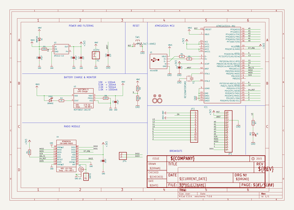
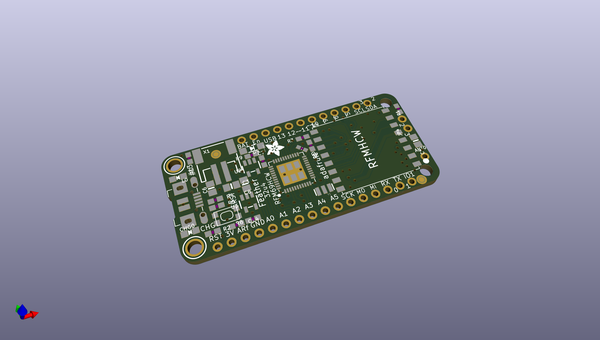
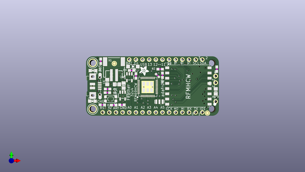
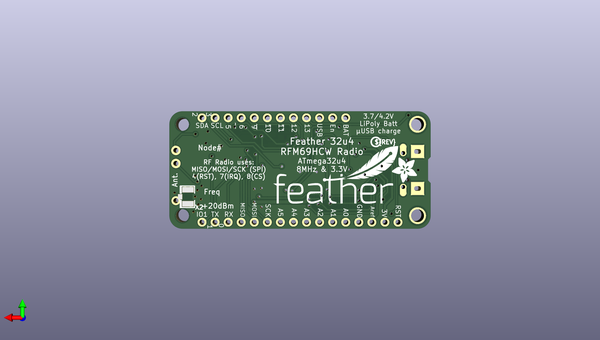

# adafruit_feather_32u4_rfm_lora_pcb
 
## summary 
* id: adafruit_adafruit_feather_32u4_rfm_lora_pcb_adafruit_feather_32u4_rfmxx
* user: adafruit
* name: adafruit_feather_32u4_rfm_lora_pcb
* board: adafruit_feather_32u4_rfmxx
* repo: https://github.com/adafruit/Adafruit-Feather-32u4-RFM-LoRa-PCB

* src_file_repo_sch: 
* src_file_repo_sch_link: https://github.com/adafruit/Adafruit-Feather-32u4-RFM-LoRa-PCB/tree/master/
* full details link: https://github.com/oomlout/oomlout_oomp_project_bot_v_2/tree/main/projects/adafruit_adafruit_feather_32u4_rfm_lora_pcb_adafruit_feather_32u4_rfmxx/current_version/working  

## schematic  
  
[schematic (pdf)](working_schematic.pdf)  

## pcb  
 
  
  
  
[board (pdf)](working.pdf)  

## working_bom
| Id | Designator | Footprint | Quantity | Designation | Supplier and ref |  | None | 
| --- | --- | --- | --- | --- | --- | --- | --- | 
| 1 | @HOLE1,@HOLE0 |  | 2 |  |  |  | [''] | 
| 2 | JP4 | 1X02_ROUND | 1 |  |  |  | [''] | 
| 3 | U$35,U$34 | FIDUCIAL_1MM | 2 | FIDUCIAL" |  |  | [''] | 
| 4 | IC1 | TQFN44_7MM | 1 | ATMEGA32U4-MU |  |  | [''] | 
| 5 | U4 | RFMHCW_SMT | 1 |  |  |  | [''] | 
| 6 | U$32,U$31 | MOUNTINGHOLE_2.5_PLATED | 2 | MOUNTINGHOLE2.5 |  |  | [''] | 
| 7 | Y1 | RESONATOR-SMD | 1 | 8MHz |  |  | [''] | 
| 8 | C6,C8,C3 | 0805-NO | 3 | 10µF |  |  | [''] | 
| 9 | U2 | SOT23-5 | 1 | AP2112-3.3 |  |  | [''] | 
| 10 | JP3 | 1X12_ROUND | 1 |  |  |  | [''] | 
| 11 | CHG0 | CHIPLED_0805_NOOUTLINE | 1 | ORANGE |  |  | [''] | 
| 12 | R8 | 0603-NO | 1 | 10K\ |  |  | [''] | 
| 13 | U$7 | ADAFRUIT_3.5MM | 1 |  |  |  | [''] | 
| 14 | R7 | 0603-NO | 1 | 2.2K |  |  | [''] | 
| 15 | SW1 | KMR2 | 1 | SPST_TACT-KMR2 |  |  | [''] | 
| 16 | R5,R4 | 0603-NO | 2 | 22 |  |  | [''] | 
| 17 | C7,C14 | 0603-NO | 2 | 1uF |  |  | [''] | 
| 18 | JP1 | 1X16_ROUND | 1 |  |  |  | [''] | 
| 19 | C1 | 0805-NO | 1 | 10uF |  |  | [''] | 
| 20 | U3 | SOT23-5 | 1 | MCP73831T-2ACI/OT |  |  | [''] | 
| 21 | R2 | 0603-NO | 1 | 1K |  |  | [''] | 
| 22 | R6 | 0603-NO | 1 | 100K |  |  | [''] | 
| 23 | L0 | CHIPLED_0805_NOOUTLINE | 1 | RED |  |  | [''] | 
| 24 | R3,R1,R9 | 0603-NO | 3 | 100k |  |  | [''] | 
| 25 | X3 | 4UCONN_20329_V2 | 1 | microUSB |  |  | [''] | 
| 26 | C9 | _0603MP | 1 | 1uF |  |  | [''] | 
| 27 | D4 | SOD-123 | 1 | MBR120 |  |  | [''] | 
| 28 | ANT0 | 1X01_ROUND | 1 |  |  |  | [''] | 
| 29 | X1 | JSTPH2 | 1 | JSTPH |  |  | [''] | 
| 30 | U$4 | ADAFRUIT_5MM | 1 |  |  |  | [''] | 
| 31 | X2 | U.FL | 1 | uFL |  |  | [''] | 
| 32 | U$5 | FEATHERLOGO | 1 |  |  |  | [''] | 
| 33 | U$6 | PCBFEAT-REV-040 | 1 |  |  |  | [''] | 

## bom_schematic
| Ref | Qnty | Value | Cmp name | Footprint | Description | Vendor | DNP | 
| --- | --- | --- | --- | --- | --- | --- | --- | 
| ANT0 | 1 | HEADER-1X1ROUND | HEADER-1X1ROUND | working:1X01_ROUND |  |  |  | 
| C1 | 1 | 10uF | CAP_CERAMIC0805-NOOUTLINE | working:0805-NO |  |  |  | 
| C3, C6, C8 | 3 | 10µF | CAP_CERAMIC0805-NOOUTLINE | working:0805-NO |  |  |  | 
| C7, C14 | 2 | 1uF | CAP_CERAMIC0603_NO | working:0603-NO |  |  |  | 
| C9 | 1 | 1uF | CAP_CERAMIC_0603MP | working:_0603MP |  |  |  | 
| CHG0 | 1 | ORANGE | LED0805_NOOUTLINE | working:CHIPLED_0805_NOOUTLINE |  |  |  | 
| D4 | 1 | MBR120 | DIODE-SCHOTTKYSOD-123 | working:SOD-123 |  |  |  | 
| IC1 | 1 | ATMEGA32U4-MU | ATMEGA32U4-MU | working:TQFN44_7MM |  |  |  | 
| JP1 | 1 | HEADER-1X16ROUND | HEADER-1X16ROUND | working:1X16_ROUND |  |  |  | 
| JP3 | 1 | HEADER-1X12 | HEADER-1X12 | working:1X12_ROUND |  |  |  | 
| JP4 | 1 | HEADER-1X2ROUND | HEADER-1X2ROUND | working:1X02_ROUND |  |  |  | 
| L0 | 1 | RED | LED0805_NOOUTLINE | working:CHIPLED_0805_NOOUTLINE |  |  |  | 
| R1, R3, R9 | 3 | 100k | RESISTOR_0603_NOOUT | working:0603-NO |  |  |  | 
| R2 | 1 | 1K | RESISTOR_0603_NOOUT | working:0603-NO |  |  |  | 
| R4, R5 | 2 | 22 | RESISTOR_0603_NOOUT | working:0603-NO |  |  |  | 
| R6 | 1 | 100K | RESISTOR_0603_NOOUT | working:0603-NO |  |  |  | 
| R7 | 1 | 2.2K | RESISTOR_0603_NOOUT | working:0603-NO |  |  |  | 
| R8 | 1 | 10K\ | RESISTOR_0603_NOOUT | working:0603-NO |  |  |  | 
| SW1 | 1 | SPST_TACT-KMR2 | SPST_TACT-KMR2 | working:KMR2 |  |  |  | 
| U2 | 1 | AP2112-3.3 | VREG_SOT23-5 | working:SOT23-5 |  |  |  | 
| U3 | 1 | MCP73831T-2ACI/OT | MCP73831/2 | working:SOT23-5 |  |  |  | 
| U4 | 1 | RFM69HCW_SMT | RFM69HCW_SMT | working:RFMHCW_SMT |  |  |  | 
| U$31, U$32 | 2 | MOUNTINGHOLE2.5 | MOUNTINGHOLE2.5 | working:MOUNTINGHOLE_2.5_PLATED |  |  |  | 
| U$34, U$35 | 2 | FIDUCIAL"" | FIDUCIAL{dblquote}{dblquote} | working:FIDUCIAL_1MM |  |  |  | 
| X1 | 1 | JSTPH | CON_JST_PH_2PIN | working:JSTPH2 |  |  |  | 
| X2 | 1 | uFL | ANTENNA_U.FL | working:U.FL |  |  |  | 
| X3 | 1 | microUSB | USB_MICRO_20329_V2 | working:4UCONN_20329_V2 |  |  |  | 
| Y1 | 1 | RESONATORSMD | RESONATORSMD | working:RESONATOR-SMD |  |  |  | 

## mounting_holes
| x | y | package | value | ref | size | 
| --- | --- | --- | --- | --- | --- | 
| 0.0 | 17.78 | MOUNTINGHOLE_2.5_PLATED | MOUNTINGHOLE2.5 | U$31 | m3 | 
| 0.0 | 0.0 | MOUNTINGHOLE_2.5_PLATED | MOUNTINGHOLE2.5 | U$32 | m3 | 

