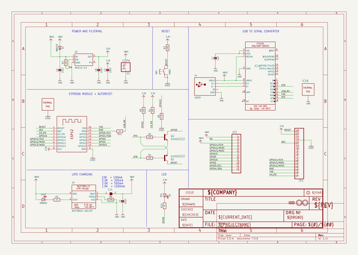
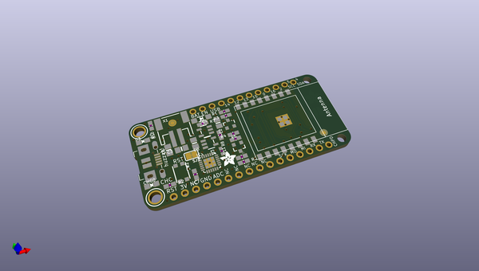
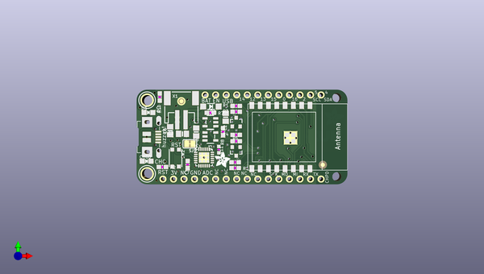
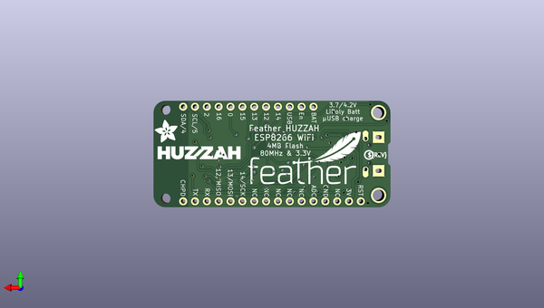

# adafruit_feather_esp8266_huzzah_pcb
 
## summary 
* id: adafruit_adafruit_feather_esp8266_huzzah_pcb_adafruit_esp8266_feather_rev_g
* user: adafruit
* name: adafruit_feather_esp8266_huzzah_pcb
* board: adafruit_esp8266_feather_rev_g
* repo: https://github.com/adafruit/Adafruit-Feather-ESP8266-HUZZAH-PCB

* src_file_repo_sch: 
* src_file_repo_sch_link: https://github.com/adafruit/Adafruit-Feather-ESP8266-HUZZAH-PCB/tree/master/
* full details link: https://github.com/oomlout/oomlout_oomp_project_bot_v_2/tree/main/projects/adafruit_adafruit_feather_esp8266_huzzah_pcb_adafruit_esp8266_feather_rev_g/current_version/working  

## schematic  
  
[schematic (pdf)](working_schematic.pdf) 

## pcb  
 
  
  
  
[board (pdf)](working.pdf)  

## working_bom
| Id | Designator | Footprint | Quantity | Designation | Supplier and ref |  | None | 
| --- | --- | --- | --- | --- | --- | --- | --- | 
| 1 | SW2 | BTN_KMR2_4.6X2.8 | 1 | KMR2 |  |  | [''] | 
| 2 | R8 | 0603-NO | 1 | 10K\ |  |  | [''] | 
| 3 | U$15 | ADAFRUIT_3.5MM | 1 |  |  |  | [''] | 
| 4 | U$31,U$32 | MOUNTINGHOLE_2.5_PLATED | 2 | MOUNTINGHOLE2.5 |  |  | [''] | 
| 5 | U2 | SOT23-5 | 1 | AP2112-3.3 |  |  | [''] | 
| 6 | Q2,Q1 | SOT23-3 | 2 | mmbt2222 |  |  | [''] | 
| 7 | C8,C6,C3 | 0805-NO | 3 | 10µF |  |  | [''] | 
| 8 | R3,R1,R5,R7,R4,R9 | 0603-NO | 6 | 10K |  |  | [''] | 
| 9 | U$34,U$35 | FIDUCIAL_1MM | 2 | FIDUCIAL_1MM |  |  | [''] | 
| 10 | X4 | 4UCONN_20329_V2 | 1 | 20329 |  |  | [''] | 
| 11 | SJ1 | SOLDERJUMPER_CLOSEDWIRE | 1 |  |  |  | [''] | 
| 12 | R10,R2 | 0603-NO | 2 | 1K |  |  | [''] | 
| 13 | CHG0 | CHIPLED_0805_NOOUTLINE | 1 | ORANGE |  |  | [''] | 
| 14 | @HOLE1,@HOLE0 |  | 2 |  |  |  | [''] | 
| 15 | D3 | CHIPLED_0805_NOOUTLINE | 1 | RED |  |  | [''] | 
| 16 | JP1 | 1X16_ROUND | 1 |  |  |  | [''] | 
| 17 | R11 | _0603MP | 1 | 1K |  |  | [''] | 
| 18 | U3 | SOT23-5 | 1 | MCP73831T-2ACI/OT |  |  | [''] | 
| 19 | IC1 | QFN24_4MM_SMSC | 1 | CP2104 |  |  | [''] | 
| 20 | JP3 | 1X12_ROUND | 1 |  |  |  | [''] | 
| 21 | D4 | SOD-123 | 1 | MBR120 |  |  | [''] | 
| 22 | C7 | 0603-NO | 1 | 1uF |  |  | [''] | 
| 23 | R6 | 0603-NO | 1 | 4.7K |  |  | [''] | 
| 24 | X1 | JSTPH2 | 1 | JSTPH |  |  | [''] | 
| 25 | X2 | ESP-12S | 1 | ESP-12 |  |  | [''] | 
| 26 | C2 | 0805-NO | 1 | 10uF |  |  | [''] | 
| 27 | U$13 | PCBFEAT-REV-040 | 1 |  |  |  | [''] | 
| 28 | U$23 | HUZZAHLOGO | 1 |  |  |  | [''] | 
| 29 | U$7 | ADAFRUIT_5MM | 1 |  |  |  | [''] | 
| 30 | U$9 | FEATHERLOGO | 1 |  |  |  | [''] | 

## bom_schematic
| Ref | Qnty | Value | Cmp name | Footprint | Description | Vendor | DNP | 
| --- | --- | --- | --- | --- | --- | --- | --- | 
| C2 | 1 | 10uF | CAP_CERAMIC0805-NOOUTLINE | working:0805-NO |  |  |  | 
| C3, C6, C8 | 3 | 10µF | CAP_CERAMIC0805-NOOUTLINE | working:0805-NO |  |  |  | 
| C7 | 1 | 1uF | CAP_CERAMIC0603_NO | working:0603-NO |  |  |  | 
| CHG0 | 1 | ORANGE | LED0805_NOOUTLINE | working:CHIPLED_0805_NOOUTLINE |  |  |  | 
| D3 | 1 | RED | LED0805_NOOUTLINE | working:CHIPLED_0805_NOOUTLINE |  |  |  | 
| D4 | 1 | MBR120 | DIODE-SCHOTTKYSOD-123 | working:SOD-123 |  |  |  | 
| IC1 | 1 | CP2104 | CP2104 | working:QFN24_4MM_SMSC |  |  |  | 
| JP1 | 1 | HEADER-1X16ROUND | HEADER-1X16ROUND | working:1X16_ROUND |  |  |  | 
| JP3 | 1 | HEADER-1X12 | HEADER-1X12 | working:1X12_ROUND |  |  |  | 
| Q1, Q2 | 2 | mmbt2222 | TRANSISTOR_NPNSOT23-3 | working:SOT23-3 |  |  |  | 
| R1, R3, R4, R5, R7, R9 | 6 | 10K | RESISTOR_0603_NOOUT | working:0603-NO |  |  |  | 
| R2, R10 | 2 | 1K | RESISTOR_0603_NOOUT | working:0603-NO |  |  |  | 
| R6 | 1 | 4.7K | RESISTOR_0603_NOOUT | working:0603-NO |  |  |  | 
| R8 | 1 | 10K\ | RESISTOR_0603_NOOUT | working:0603-NO |  |  |  | 
| R11 | 1 | 1K | RESISTOR_0603MP | working:_0603MP |  |  |  | 
| SJ1 | 1 | SOLDERJUMPER_CLOSED | SOLDERJUMPER_CLOSED | working:SOLDERJUMPER_CLOSEDWIRE |  |  |  | 
| SW2 | 1 | KMR2 | SWITCH_TACT_SMT4.6X2.8 | working:BTN_KMR2_4.6X2.8 |  |  |  | 
| U2 | 1 | AP2112-3.3 | VREG_SOT23-5 | working:SOT23-5 |  |  |  | 
| U3 | 1 | MCP73831T-2ACI/OT | MCP73831/2 | working:SOT23-5 |  |  |  | 
| U$31, U$32 | 2 | MOUNTINGHOLE2.5 | MOUNTINGHOLE2.5 | working:MOUNTINGHOLE_2.5_PLATED |  |  |  | 
| U$34, U$35 | 2 | FIDUCIAL_1MM | FIDUCIAL_1MM | working:FIDUCIAL_1MM |  |  |  | 
| X1 | 1 | JSTPH | CON_JST_PH_2PIN | working:JSTPH2 |  |  |  | 
| X2 | 1 | ESP-12S | ESP-12S | working:ESP-12S |  |  |  | 
| X4 | 1 | 20329 | USB_MICRO_20329_V2 | working:4UCONN_20329_V2 |  |  |  | 

## mounting_holes
| x | y | package | value | ref | size | 
| --- | --- | --- | --- | --- | --- | 
| 0.0 | 17.78 | MOUNTINGHOLE_2.5_PLATED | MOUNTINGHOLE2.5 | U$31 | m3 | 
| 0.0 | 0.0 | MOUNTINGHOLE_2.5_PLATED | MOUNTINGHOLE2.5 | U$32 | m3 | 

