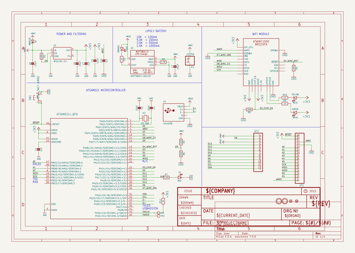
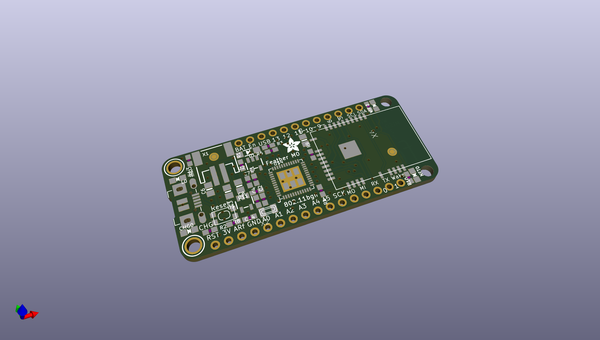
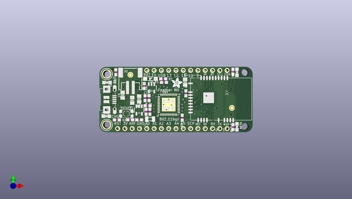
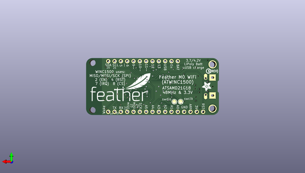

# adafruit_feather_m0_wifi_winc1500_pcb
 
## summary 
* id: adafruit_adafruit_feather_m0_wifi_winc1500_pcb_adafruit_feather_m0_wifi
* user: adafruit
* name: adafruit_feather_m0_wifi_winc1500_pcb
* board: adafruit_feather_m0_wifi
* repo: https://github.com/adafruit/Adafruit-Feather-M0-WiFi-WINC1500-PCB

* src_file_repo_sch: 
* src_file_repo_sch_link: https://github.com/adafruit/Adafruit-Feather-M0-WiFi-WINC1500-PCB/tree/master/
* full details link: https://github.com/oomlout/oomlout_oomp_project_bot_v_2/tree/main/projects/adafruit_adafruit_feather_m0_wifi_winc1500_pcb_adafruit_feather_m0_wifi/current_version/working  

## schematic  
  
[schematic (pdf)](working_schematic.pdf) 

## pcb  
 
  
  
  
[board (pdf)](working.pdf)  

## working_bom
| Id | Designator | Footprint | Quantity | Designation | Supplier and ref |  | None | 
| --- | --- | --- | --- | --- | --- | --- | --- | 
| 1 | X1 | JSTPH2 | 1 | JSTPH |  |  | [''] | 
| 2 | R2,R11 | 0603-NO | 2 | 1K |  |  | [''] | 
| 3 | R10,R5 | 0603-NO | 2 | 1k |  |  | [''] | 
| 4 | R6 | 0603-NO | 1 | 100K |  |  | [''] | 
| 5 | U$32,U$31 | MOUNTINGHOLE_2.5_PLATED | 2 | MOUNTINGHOLE2.5 |  |  | [''] | 
| 6 | @HOLE1,@HOLE0 |  | 2 |  |  |  | [''] | 
| 7 | R3,R9,R1,R4 | 0603-NO | 4 | 100k |  |  | [''] | 
| 8 | NET0 | CHIPLED_0805_NOOUTLINE | 1 | YELLOW |  |  | [''] | 
| 9 | C2,C4 | 0603-NO | 2 | 22pF |  |  | [''] | 
| 10 | X3 | 4UCONN_20329_V2 | 1 | microUSB |  |  | [''] | 
| 11 | C14,C7,C1 | 0603-NO | 3 | 1uF |  |  | [''] | 
| 12 | U$7,U$12 | ADAFRUIT_3.5MM | 2 |  |  |  | [''] | 
| 13 | C8,C3,C6 | 0805-NO | 3 | 10µF |  |  | [''] | 
| 14 | U$35,U$34 | FIDUCIAL_1MM | 2 | FIDUCIAL" |  |  | [''] | 
| 15 | U2 | SOT23-5 | 1 | AP2112K-3.3 |  |  | [''] | 
| 16 | JP1 | 1X16_ROUND | 1 |  |  |  | [''] | 
| 17 | WIFI0 | CHIPLED_0805_NOOUTLINE | 1 | GREEN |  |  | [''] | 
| 18 | C5 | 0805-NO | 1 | 10uF |  |  | [''] | 
| 19 | U3 | SOT23-5 | 1 | MCP73831T-2ACI/OT |  |  | [''] | 
| 20 | L0 | CHIPLED_0805_NOOUTLINE | 1 | RED |  |  | [''] | 
| 21 | X2 | XTAL3215 | 1 | 32.768 |  |  | [''] | 
| 22 | CHG0 | CHIPLED_0805_NOOUTLINE | 1 | ORANGE |  |  | [''] | 
| 23 | X4 | ATWINC1500_MR210PA | 1 | ATWINC1500_MR210PA |  |  | [''] | 
| 24 | R7 | 0603-NO | 1 | 2.2K |  |  | [''] | 
| 25 | U$4 | TQFN48_7MM | 1 | ATSAMD21G18_QFN |  |  | [''] | 
| 26 | D1 | SOD-123 | 1 | MBR120 |  |  | [''] | 
| 27 | JP3 | 1X12_ROUND | 1 |  |  |  | [''] | 
| 28 | SW1 | KMR2 | 1 | SPST_TACT-KMR2 |  |  | [''] | 
| 29 | R8 | 0603-NO | 1 | 4.7K |  |  | [''] | 
| 30 | TP1,TP2 | TESTPOINT_ROUND_1.5MM | 2 |  |  |  | [''] | 
| 31 | U$9 | FEATHERLOGO | 1 |  |  |  | [''] | 
| 32 | U$13 | PCBFEAT-REV-040 | 1 |  |  |  | [''] | 

## bom_schematic
| Ref | Qnty | Value | Cmp name | Footprint | Description | Vendor | DNP | 
| --- | --- | --- | --- | --- | --- | --- | --- | 
| C1, C7, C14 | 3 | 1uF | CAP_CERAMIC0603_NO | working:0603-NO |  |  |  | 
| C2, C4 | 2 | 22pF | CAP_CERAMIC0603_NO | working:0603-NO |  |  |  | 
| C3, C6, C8 | 3 | 10µF | CAP_CERAMIC0805-NOOUTLINE | working:0805-NO |  |  |  | 
| C5 | 1 | 10uF | CAP_CERAMIC0805-NOOUTLINE | working:0805-NO |  |  |  | 
| CHG0 | 1 | ORANGE | LED0805_NOOUTLINE | working:CHIPLED_0805_NOOUTLINE |  |  |  | 
| D1 | 1 | MBR120 | DIODE-SCHOTTKYSOD-123 | working:SOD-123 |  |  |  | 
| JP1 | 1 | HEADER-1X16ROUND | HEADER-1X16ROUND | working:1X16_ROUND |  |  |  | 
| JP3 | 1 | HEADER-1X12 | HEADER-1X12 | working:1X12_ROUND |  |  |  | 
| L0 | 1 | RED | LED0805_NOOUTLINE | working:CHIPLED_0805_NOOUTLINE |  |  |  | 
| NET0 | 1 | YELLOW | LED0805_NOOUTLINE | working:CHIPLED_0805_NOOUTLINE |  |  |  | 
| R1, R3, R4, R9 | 4 | 100k | RESISTOR_0603_NOOUT | working:0603-NO |  |  |  | 
| R2, R11 | 2 | 1K | RESISTOR_0603_NOOUT | working:0603-NO |  |  |  | 
| R5, R10 | 2 | 1k | RESISTOR_0603_NOOUT | working:0603-NO |  |  |  | 
| R6 | 1 | 100K | RESISTOR_0603_NOOUT | working:0603-NO |  |  |  | 
| R7 | 1 | 2.2K | RESISTOR_0603_NOOUT | working:0603-NO |  |  |  | 
| R8 | 1 | 4.7K | RESISTOR_0603_NOOUT | working:0603-NO |  |  |  | 
| SW1 | 1 | SPST_TACT-KMR2 | SPST_TACT-KMR2 | working:KMR2 |  |  |  | 
| TP1, TP2 | 2 | TESTPOINTROUND1.5MM | TESTPOINTROUND1.5MM | working:TESTPOINT_ROUND_1.5MM |  |  |  | 
| U2 | 1 | AP2112K-3.3 | VREG_SOT23-5 | working:SOT23-5 |  |  |  | 
| U3 | 1 | MCP73831T-2ACI/OT | MCP73831/2 | working:SOT23-5 |  |  |  | 
| U$4 | 1 | ATSAMD21J_QFN | ATSAMD21J_QFN | working:TQFN48_7MM |  |  |  | 
| U$31, U$32 | 2 | MOUNTINGHOLE2.5 | MOUNTINGHOLE2.5 | working:MOUNTINGHOLE_2.5_PLATED |  |  |  | 
| U$34, U$35 | 2 | FIDUCIAL"" | FIDUCIAL{dblquote}{dblquote} | working:FIDUCIAL_1MM |  |  |  | 
| WIFI0 | 1 | GREEN | LED0805_NOOUTLINE | working:CHIPLED_0805_NOOUTLINE |  |  |  | 
| X1 | 1 | JSTPH | CON_JST_PH_2PIN | working:JSTPH2 |  |  |  | 
| X2 | 1 | 32.768 | XTAL-3.2X1.5 | working:XTAL3215 |  |  |  | 
| X3 | 1 | microUSB | USB_MICRO_20329_V2 | working:4UCONN_20329_V2 |  |  |  | 
| X4 | 1 | ATWINC1500_MR210PA | ATWINC1500_MR210PA | working:ATWINC1500_MR210PA |  |  |  | 

## mounting_holes
| x | y | package | value | ref | size | 
| --- | --- | --- | --- | --- | --- | 
| 0.0 | 17.78 | MOUNTINGHOLE_2.5_PLATED | MOUNTINGHOLE2.5 | U$31 | m3 | 
| 0.0 | 0.0 | MOUNTINGHOLE_2.5_PLATED | MOUNTINGHOLE2.5 | U$32 | m3 | 

