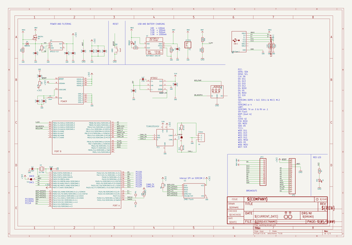
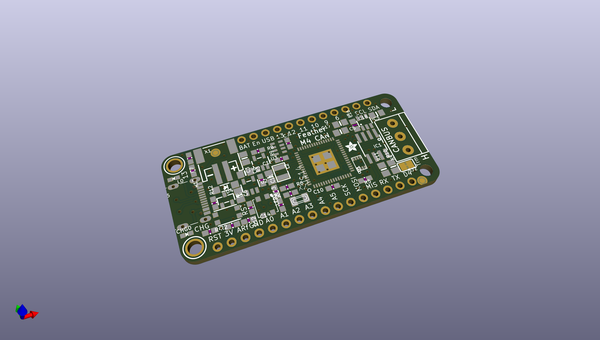
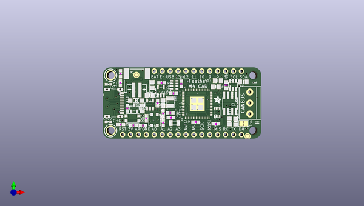
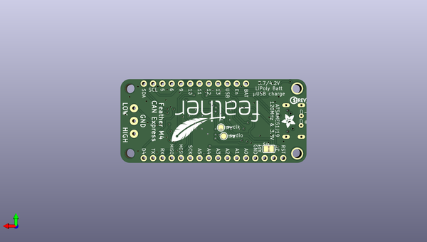

# adafruit_feather_m4_can_pcb
 
## summary 
* id: adafruit_adafruit_feather_m4_can_pcb_adafruit_feather_m4_express_can
* user: adafruit
* name: adafruit_feather_m4_can_pcb
* board: adafruit_feather_m4_express_can
* repo: https://github.com/adafruit/Adafruit-Feather-M4-CAN-PCB

* src_file_repo_sch: 
* src_file_repo_sch_link: https://github.com/adafruit/Adafruit-Feather-M4-CAN-PCB/tree/main/
* full details link: https://github.com/oomlout/oomlout_oomp_project_bot_v_2/tree/main/projects/adafruit_adafruit_feather_m4_can_pcb_adafruit_feather_m4_express_can/current_version/working  

## schematic  
  
[schematic (pdf)](working_schematic.pdf) 

## pcb  
 
  
  
  
[board (pdf)](working.pdf)  

## working_bom
| Id | Designator | Footprint | Quantity | Designation | Supplier and ref |  | None | 
| --- | --- | --- | --- | --- | --- | --- | --- | 
| 1 | C11,C12,C15,C14,C10,C7 | 0603-NO | 6 | 1uF |  |  | [''] | 
| 2 | X6 | USB_C_CUSB31-CFM2AX-01-X | 1 | USB Type C |  |  | [''] | 
| 3 | C13,C17,C5 | 0805-NO | 3 | 10uF |  |  | [''] | 
| 4 | R12,R13,R8 | 0603-NO | 3 | 5.1K |  |  | [''] | 
| 5 | X1 | JSTPH2_BATT | 1 | JSTPH |  |  | [''] | 
| 6 | U$35,U$34 | FIDUCIAL_1MM | 2 | FIDUCIAL_1MM |  |  | [''] | 
| 7 | U3 | SOT23-5 | 1 | MCP73831T-2ACI/OT |  |  | [''] | 
| 8 | R9 | RESPACK_4X0603_NO | 1 | 100K |  |  | [''] | 
| 9 | C6,C8,C3 | 0805-NO | 3 | 10µF |  |  | [''] | 
| 10 | R2,R7,R5,R4,R6,R3 | 0603-NO | 6 | 10K |  |  | [''] | 
| 11 | X2 | XTAL3215 | 1 | 32.768 |  |  | [''] | 
| 12 | U$32,U$31 | MOUNTINGHOLE_2.5_PLATED | 2 | MOUNTINGHOLE2.5 |  |  | [''] | 
| 13 | SW1 | BTN_KMR2_4.6X2.8 | 1 | KMR2 |  |  | [''] | 
| 14 | JP1 | 1X16_ROUND | 1 |  |  |  | [''] | 
| 15 | U$1 | ADAFRUIT_2.5MM | 1 |  |  |  | [''] | 
| 16 | @HOLE0,@HOLE1 |  | 2 |  |  |  | [''] | 
| 17 | CHG0 | CHIPLED_0603_NOOUTLINE | 1 | ORANGE |  |  | [''] | 
| 18 | C2,C4 | 0603-NO | 2 | 22pF |  |  | [''] | 
| 19 | SJ2,SJ1 | SOLDERJUMPER_CLOSEDWIRE | 2 |  |  |  | [''] | 
| 20 | U$14 | PQFN64-1 | 1 | ATSAMD51J |  |  | [''] | 
| 21 | JP3 | 1X12_ROUND | 1 |  |  |  | [''] | 
| 22 | C16 | _0805MP | 1 | 10uF |  |  | [''] | 
| 23 | U1 | USON8 | 1 | 2MB Flash |  |  | [''] | 
| 24 | L0 | CHIPLED_0603_NOOUTLINE | 1 | RED |  |  | [''] | 
| 25 | R11,R10 | 0805-NO | 2 | 60 ohm |  |  | [''] | 
| 26 | IC3 | SOT23-6 | 1 | AP3602 |  |  | [''] | 
| 27 | Q3 | SOT23-R | 1 | DMG341 |  |  | [''] | 
| 28 | LED1 | LED3535 | 1 | WS2812B3535 |  |  | [''] | 
| 29 | X4 | TERMBLOCK_1X3-3.5MM | 1 | 3.5mm |  |  | [''] | 
| 30 | U2 | SOT23-5@1 | 1 | AP2112-3.3 |  |  | [''] | 
| 31 | IC1 | SOIC8_150MIL | 1 | TCAN1051HGV |  |  | [''] | 
| 32 | D4 | SOD-123 | 1 | MBR540 |  |  | [''] | 
| 33 | L2 | INDUCTOR_1007 | 1 | 10uH |  |  | [''] | 
| 34 | C18 | 0805_10MGAP | 1 | 1uF |  |  | [''] | 
| 35 | D-1,D+1 | B1,27 | 2 | TPB1,27 |  |  | [''] | 
| 36 | U$12 | ADAFRUIT_3.5MM | 1 |  |  |  | [''] | 
| 37 | U$9 | FEATHERLOGO | 1 |  |  |  | [''] | 
| 38 | TP2,TP1 | TESTPOINT_ROUND_1.5MM | 2 |  |  |  | [''] | 
| 39 | U$13 | PCBFEAT-REV-040 | 1 |  |  |  | [''] | 

## bom_schematic
| Ref | Qnty | Value | Cmp name | Footprint | Description | Vendor | DNP | 
| --- | --- | --- | --- | --- | --- | --- | --- | 
| C2, C4 | 2 | 22pF | CAP_CERAMIC0603_NO | working:0603-NO |  |  |  | 
| C3, C6, C8 | 3 | 10µF | CAP_CERAMIC0805-NOOUTLINE | working:0805-NO |  |  |  | 
| C5, C13, C17 | 3 | 10uF | CAP_CERAMIC0805-NOOUTLINE | working:0805-NO |  |  |  | 
| C7, C10, C11, C12, C14, C15 | 6 | 1uF | CAP_CERAMIC0603_NO | working:0603-NO |  |  |  | 
| C16 | 1 | 10uF | CAP_CERAMIC_0805MP | working:_0805MP |  |  |  | 
| C18 | 1 | 1uF | CAP_CERAMIC0805_10MGAP | working:0805_10MGAP |  |  |  | 
| CHG0 | 1 | ORANGE | LED0603_NOOUTLINE | working:CHIPLED_0603_NOOUTLINE |  |  |  | 
| D4 | 1 | MBR540 | DIODE-SCHOTTKYSOD-123 | working:SOD-123 |  |  |  | 
| D+1 | 1 | TPB1,27 | TPB1,27 | working:B1,27 |  |  |  | 
| D-1 | 1 | TPB1,27 | TPB1,27 | working:B1,27 |  |  |  | 
| IC1 | 1 | TCAN1051HGV | CAN_TRANSCIEVER_TCAN1051V | working:SOIC8_150MIL |  |  |  | 
| IC3 | 1 | AP3602 | AP3602 | working:SOT23-6 |  |  |  | 
| JP1 | 1 | HEADER-1X16ROUND | HEADER-1X16ROUND | working:1X16_ROUND |  |  |  | 
| JP3 | 1 | HEADER-1X12 | HEADER-1X12 | working:1X12_ROUND |  |  |  | 
| L0 | 1 | RED | LED0603_NOOUTLINE | working:CHIPLED_0603_NOOUTLINE |  |  |  | 
| L2 | 1 | 10uH | INDUCTOR | working:INDUCTOR_1007 |  |  |  | 
| LED1 | 1 | WS2812B3535 | WS2812B3535 | working:LED3535 |  |  |  | 
| Q3 | 1 | DMG341 | MOSFET-P | working:SOT23-R |  |  |  | 
| R2, R3, R4, R5, R6, R7 | 6 | 10K | RESISTOR_0603_NOOUT | working:0603-NO |  |  |  | 
| R8, R12, R13 | 3 | 5.1K | RESISTOR_0603_NOOUT | working:0603-NO |  |  |  | 
| R9 | 1 | 100K | RESISTOR_4PACK_NO | working:RESPACK_4X0603_NO |  |  |  | 
| R10, R11 | 2 | 60 ohm | RESISTOR0805_NOOUTLINE | working:0805-NO |  |  |  | 
| SJ1 | 1 | SOLDERJUMPERCLOSED | SOLDERJUMPERCLOSED | working:SOLDERJUMPER_CLOSEDWIRE |  |  |  | 
| SJ2 | 1 | SOLDERJUMPER_CLOSED | SOLDERJUMPER_CLOSED | working:SOLDERJUMPER_CLOSEDWIRE |  |  |  | 
| SW1 | 1 | KMR2 | SWITCH_TACT_SMT4.6X2.8 | working:BTN_KMR2_4.6X2.8 |  |  |  | 
| TP1, TP2 | 2 | TESTPOINTROUND1.5MM | TESTPOINTROUND1.5MM | working:TESTPOINT_ROUND_1.5MM |  |  |  | 
| U1 | 1 | 2MB Flash | SPIFLASH_8PINUX | working:USON8 |  |  |  | 
| U2 | 1 | AP2112-3.3 | VREG_SOT23-5 | working:SOT23-5@1 |  |  |  | 
| U3 | 1 | MCP73831T-2ACI/OT | MCP73831/2 | working:SOT23-5 |  |  |  | 
| U$14 | 1 | ATSAMD51J | ATSAMD51J | working:PQFN64-1 |  |  |  | 
| U$31, U$32 | 2 | MOUNTINGHOLE2.5 | MOUNTINGHOLE2.5 | working:MOUNTINGHOLE_2.5_PLATED |  |  |  | 
| U$34, U$35 | 2 | FIDUCIAL_1MM | FIDUCIAL_1MM | working:FIDUCIAL_1MM |  |  |  | 
| X1 | 1 | JSTPH | CON_JST_PH_2PIN_BATT | working:JSTPH2_BATT |  |  |  | 
| X2 | 1 | 32.768 | XTAL-3.2X1.5 | working:XTAL3215 |  |  |  | 
| X4 | 1 | 3.5mm | TERMBLOCK_1X3 | working:TERMBLOCK_1X3-3.5MM |  |  |  | 
| X6 | 1 | USB Type C | USB_C | working:USB_C_CUSB31-CFM2AX-01-X |  |  |  | 

## mounting_holes
| x | y | package | value | ref | size | 
| --- | --- | --- | --- | --- | --- | 
| 0.0 | 17.78 | MOUNTINGHOLE_2.5_PLATED | MOUNTINGHOLE2.5 | U$31 | m3 | 
| 0.0 | 0.0 | MOUNTINGHOLE_2.5_PLATED | MOUNTINGHOLE2.5 | U$32 | m3 | 

