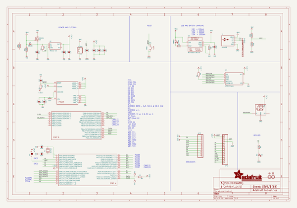
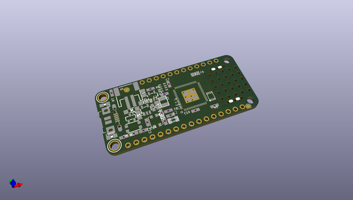
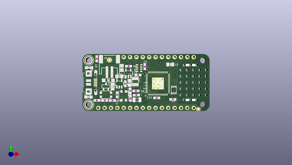
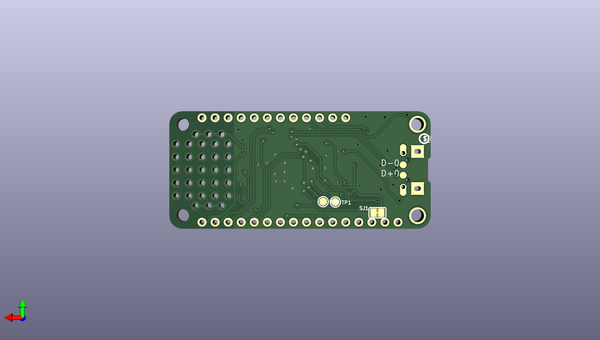

# adafruit_feather_m4_express_pcb
 
## summary 
* id: adafruit_adafruit_feather_m4_express_pcb_adafruit_feather_m4_express
* user: adafruit
* name: adafruit_feather_m4_express_pcb
* board: adafruit_feather_m4_express
* repo: https://github.com/adafruit/Adafruit-Feather-M4-Express-PCB

* src_file_repo_sch: 
* src_file_repo_sch_link: https://github.com/adafruit/Adafruit-Feather-M4-Express-PCB/tree/master/
* full details link: https://github.com/oomlout/oomlout_oomp_project_bot_v_2/tree/main/projects/adafruit_adafruit_feather_m4_express_pcb_adafruit_feather_m4_express/current_version/working  

## schematic  
  
[schematic (pdf)](working_schematic.pdf)  

## pcb  
 
  
  
  
[board (pdf)](working.pdf)  

## working_bom
| Id | Designator | Footprint | Quantity | Designation | Supplier and ref |  | None | 
| --- | --- | --- | --- | --- | --- | --- | --- | 
| 1 | JP3 | 1X12_ROUND | 1 |  |  |  | [''] | 
| 2 | C13,C5 | 0805-NO | 2 | 10uF |  |  | [''] | 
| 3 | C12,C15,C11,C10,C14,C7 | 0603-NO | 6 | 1uF |  |  | [''] | 
| 4 | C2,C4 | 0603-NO | 2 | 22pF |  |  | [''] | 
| 5 | R9 | RESPACK_4X0603_NO | 1 | 100K |  |  | [''] | 
| 6 | CHG0 | CHIPLED_0805_NOOUTLINE | 1 | ORANGE |  |  | [''] | 
| 7 | X1 | JSTPH2 | 1 | JSTPH |  |  | [''] | 
| 8 | X2 | XTAL3215 | 1 | 32.768 |  |  | [''] | 
| 9 | R8 | 0603-NO | 1 | 10K\ |  |  | [''] | 
| 10 | R6,R3,R5,R4 | 0603-NO | 4 | 10K |  |  | [''] | 
| 11 | @HOLE0,@HOLE1 |  | 2 |  |  |  | [''] | 
| 12 | R2 | 0603-NO | 1 | 1K |  |  | [''] | 
| 13 | Q3 | SOT23-R | 1 | DMG341 |  |  | [''] | 
| 14 | C8,C3,C6 | 0805-NO | 3 | 10µF |  |  | [''] | 
| 15 | U$32,U$31 | MOUNTINGHOLE_2.5_PLATED | 2 | MOUNTINGHOLE2.5 |  |  | [''] | 
| 16 | R7 | 0603-NO | 1 | 2.2K |  |  | [''] | 
| 17 | U3 | SOT23-5 | 1 | MCP73831T-2ACI/OT |  |  | [''] | 
| 18 | U$34,U$35 | FIDUCIAL_1MM | 2 | FIDUCIAL_1MM |  |  | [''] | 
| 19 | U1 | USON8 | 1 | 2MB Flash |  |  | [''] | 
| 20 | SW1 | BTN_KMR2_4.6X2.8 | 1 | KMR2 |  |  | [''] | 
| 21 | JP1 | 1X16_ROUND | 1 |  |  |  | [''] | 
| 22 | L2 | INDUCTOR_1007 | 1 | 10uH |  |  | [''] | 
| 23 | U2 | SOT23-5 | 1 | AP2112-3.3 |  |  | [''] | 
| 24 | L0 | CHIPLED_0805_NOOUTLINE | 1 | RED |  |  | [''] | 
| 25 | D4 | SOD-123 | 1 | MBR120 |  |  | [''] | 
| 26 | U$6 | FEATHERM4_TOP | 1 |  |  |  | [''] | 
| 27 | X3 | 4UCONN_20329_V2 | 1 | microUSB |  |  | [''] | 
| 28 | LED1 | LED3535 | 1 | WS2812B3535 |  |  | [''] | 
| 29 | U$14 | PQFN64-1 | 1 | ATSAMD51J |  |  | [''] | 
| 30 | D-0,D+0 | B1,27 | 2 | TPB1,27 |  |  | [''] | 
| 31 | TP2,TP1 | TESTPOINT_ROUND_1.5MM | 2 |  |  |  | [''] | 
| 32 | U$13 | PCBFEAT-REV-040 | 1 |  |  |  | [''] | 
| 33 | SJ1 | SOLDERJUMPER_CLOSEDWIRE | 1 |  |  |  | [''] | 
| 34 | U$5 | FEATHERM4_BOT | 1 |  |  |  | [''] | 

## bom_schematic
| Ref | Qnty | Value | Cmp name | Footprint | Description | Vendor | DNP | 
| --- | --- | --- | --- | --- | --- | --- | --- | 
| C2, C4 | 2 | 22pF | CAP_CERAMIC0603_NO | working:0603-NO |  |  |  | 
| C3, C6, C8 | 3 | 10µF | CAP_CERAMIC0805-NOOUTLINE | working:0805-NO |  |  |  | 
| C5, C13 | 2 | 10uF | CAP_CERAMIC0805-NOOUTLINE | working:0805-NO |  |  |  | 
| C7, C10, C11, C12, C14, C15 | 6 | 1uF | CAP_CERAMIC0603_NO | working:0603-NO |  |  |  | 
| CHG0 | 1 | ORANGE | LED0805_NOOUTLINE | working:CHIPLED_0805_NOOUTLINE |  |  |  | 
| D4 | 1 | MBR120 | DIODE-SCHOTTKYSOD-123 | working:SOD-123 |  |  |  | 
| D+0 | 1 | TPB1,27 | TPB1,27 | working:B1,27 |  |  |  | 
| D-0 | 1 | TPB1,27 | TPB1,27 | working:B1,27 |  |  |  | 
| JP1 | 1 | HEADER-1X16ROUND | HEADER-1X16ROUND | working:1X16_ROUND |  |  |  | 
| JP3 | 1 | HEADER-1X12 | HEADER-1X12 | working:1X12_ROUND |  |  |  | 
| L0 | 1 | RED | LED0805_NOOUTLINE | working:CHIPLED_0805_NOOUTLINE |  |  |  | 
| L2 | 1 | 10uH | INDUCTOR | working:INDUCTOR_1007 |  |  |  | 
| LED1 | 1 | WS2812B3535 | WS2812B3535 | working:LED3535 |  |  |  | 
| Q3 | 1 | DMG341 | MOSFET-P | working:SOT23-R |  |  |  | 
| R2 | 1 | 1K | RESISTOR_0603_NOOUT | working:0603-NO |  |  |  | 
| R3, R4, R5, R6 | 4 | 10K | RESISTOR_0603_NOOUT | working:0603-NO |  |  |  | 
| R7 | 1 | 2.2K | RESISTOR_0603_NOOUT | working:0603-NO |  |  |  | 
| R8 | 1 | 10K\ | RESISTOR_0603_NOOUT | working:0603-NO |  |  |  | 
| R9 | 1 | 100K | RESISTOR_4PACK_NO | working:RESPACK_4X0603_NO |  |  |  | 
| SJ1 | 1 | SOLDERJUMPERCLOSED | SOLDERJUMPERCLOSED | working:SOLDERJUMPER_CLOSEDWIRE |  |  |  | 
| SW1 | 1 | KMR2 | SWITCH_TACT_SMT4.6X2.8 | working:BTN_KMR2_4.6X2.8 |  |  |  | 
| TP1, TP2 | 2 | TESTPOINTROUND1.5MM | TESTPOINTROUND1.5MM | working:TESTPOINT_ROUND_1.5MM |  |  |  | 
| U1 | 1 | 2MB Flash | SPIFLASH_8PINUX | working:USON8 |  |  |  | 
| U2 | 1 | AP2112-3.3 | VREG_SOT23-5 | working:SOT23-5 |  |  |  | 
| U3 | 1 | MCP73831T-2ACI/OT | MCP73831/2 | working:SOT23-5 |  |  |  | 
| U$14 | 1 | ATSAMD51J | ATSAMD51J | working:PQFN64-1 |  |  |  | 
| U$31, U$32 | 2 | MOUNTINGHOLE2.5 | MOUNTINGHOLE2.5 | working:MOUNTINGHOLE_2.5_PLATED |  |  |  | 
| U$34, U$35 | 2 | FIDUCIAL_1MM | FIDUCIAL_1MM | working:FIDUCIAL_1MM |  |  |  | 
| X1 | 1 | JSTPH | CON_JST_PH_2PIN | working:JSTPH2 |  |  |  | 
| X2 | 1 | 32.768 | XTAL-3.2X1.5 | working:XTAL3215 |  |  |  | 
| X3 | 1 | microUSB | USB_MICRO_20329_V2 | working:4UCONN_20329_V2 |  |  |  | 

## mounting_holes
| x | y | package | value | ref | size | 
| --- | --- | --- | --- | --- | --- | 
| 0.0 | 17.78 | MOUNTINGHOLE_2.5_PLATED | MOUNTINGHOLE2.5 | U$31 | m3 | 
| 0.0 | 0.0 | MOUNTINGHOLE_2.5_PLATED | MOUNTINGHOLE2.5 | U$32 | m3 | 

