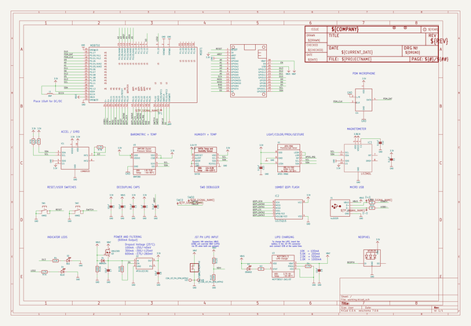

# adafruit_feather_nrf52840_sense_pcb
 
## summary 
* id: adafruit_adafruit_feather_nrf52840_sense_pcb_adafruit_feather_nrf52840_sense
* user: adafruit
* name: adafruit_feather_nrf52840_sense_pcb
* board: adafruit_feather_nrf52840_sense
* repo: https://github.com/adafruit/Adafruit-Feather-nRF52840-Sense-PCB

* src_file_repo_sch: 
* src_file_repo_sch_link: https://github.com/adafruit/Adafruit-Feather-nRF52840-Sense-PCB/tree/master/
* full details link: https://github.com/oomlout/oomlout_oomp_project_bot_v_2/tree/main/projects/adafruit_adafruit_feather_nrf52840_sense_pcb_adafruit_feather_nrf52840_sense/current_version/working  

## schematic  
  
[schematic (pdf)](working_schematic.pdf)  

## pcb  
 
  
  
  
[board (pdf)](working.pdf)  

## working_bom
| Id | Designator | Footprint | Quantity | Designation | Supplier and ref |  | None | 
| --- | --- | --- | --- | --- | --- | --- | --- | 
| 1 | R11,R10 | 0603-NO | 2 | 22 |  |  | [''] | 
| 2 | MDBT1 | MDBT50 | 1 | MDBT50 |  |  | [''] | 
| 3 | U3 | SOT23-5 | 1 | MCP73831T-2ACI/OT |  |  | [''] | 
| 4 | C7,C6,C5,C8,C9 | 0805-NO | 5 | 10uF |  |  | [''] | 
| 5 | U1 | APDS-9960 | 1 | APDS-9960 |  |  | [''] | 
| 6 | X2 | JSTPH2 | 1 | CON_JST_PH_2PIN_MTPH2 |  |  | [''] | 
| 7 | IC4 | SPK0415HM4H | 1 | MIC_PDM |  |  | [''] | 
| 8 | R1 | 0603-NO | 1 | 2.2K |  |  | [''] | 
| 9 | C10,C1,C3,C12,C13 | 0603-NO | 5 | 0.1uF |  |  | [''] | 
| 10 | D1 | SOD-123 | 1 | MBR054 |  |  | [''] | 
| 11 | R4 | 0603-NO | 1 | 4.7K |  |  | [''] | 
| 12 | D3 | CHIPLED_0805_NOOUTLINE | 1 | ORANGE |  |  | [''] | 
| 13 | L1 | _0805MP | 1 | DNP |  |  | [''] | 
| 14 | FID2,FID1 | FIDUCIAL_1MM | 2 | FIDUCIAL_1MM |  |  | [''] | 
| 15 | X1 | 4UCONN_20329_V2 | 1 | 4u20329 |  |  | [''] | 
| 16 | IC1 | LGA16_3X3MM | 1 | LSM6DS33 |  |  | [''] | 
| 17 | U$14 | FEATHERSENSE_TOP | 1 |  |  |  | [''] | 
| 18 | D2 | CHIPLED_0805_NOOUTLINE | 1 | RED |  |  | [''] | 
| 19 | C4 | 0603-NO | 1 | 1uF |  |  | [''] | 
| 20 | U5 | BMP280 | 1 | BMP280 |  |  | [''] | 
| 21 | U4 | SHT3X | 1 | SHT30 |  |  | [''] | 
| 22 | D4 | CHIPLED_0603_NOOUTLINE | 1 | BLUE |  |  | [''] | 
| 23 | SW1,SW2 | BTN_KMR2_4.6X2.8 | 2 | KMR2 |  |  | [''] | 
| 24 | LED1 | LED3535 | 1 | WS2812B3535 |  |  | [''] | 
| 25 | R7 | RESPACK_4X0603 | 1 | 4.7K |  |  | [''] | 
| 26 | Q3 | SOT23-R | 1 | DMG2305 |  |  | [''] | 
| 27 | U2 | SOT23-5 | 1 | AP2112(3.3V) |  |  | [''] | 
| 28 | R3 | 0603-NO | 1 | 1K |  |  | [''] | 
| 29 | IC3 | LGA12_2X2MM | 1 | LIS3MDL |  |  | [''] | 
| 30 | MS1 | FEATHERWING_NODIM | 1 | FEATHERWING_NODIM |  |  | [''] | 
| 31 | IC2 | USON8 | 1 | GD25Q16 |  |  | [''] | 
| 32 | R12 | RESPACK_4X0603 | 1 | 100K |  |  | [''] | 
| 33 | TP1,D-0,D+0 | TP10R | 3 | TPTP10R |  |  | [''] | 
| 34 | SWC0,SWD0 | TP12R | 2 | TPTP12R |  |  | [''] | 
| 35 | U$75 | FEATHERSENSE_BOT | 1 |  |  |  | [''] | 
| 36 | U$10 | PCBFEAT-REV-056 | 1 |  |  |  | [''] | 

## bom_schematic
| Ref | Qnty | Value | Cmp name | Footprint | Description | Vendor | DNP | 
| --- | --- | --- | --- | --- | --- | --- | --- | 
| C1, C3, C10, C12, C13 | 5 | 0.1uF | CAP_CERAMIC0603_NO | working:0603-NO |  |  |  | 
| C4 | 1 | 1uF | CAP_CERAMIC0603_NO | working:0603-NO |  |  |  | 
| C5, C6, C7, C8, C9 | 5 | 10uF | CAP_CERAMIC0805-NOOUTLINE | working:0805-NO |  |  |  | 
| D1 | 1 | MBR054 | DIODE-SCHOTTKYSOD-123 | working:SOD-123 |  |  |  | 
| D2 | 1 | RED | LED0805_NOOUTLINE | working:CHIPLED_0805_NOOUTLINE |  |  |  | 
| D3 | 1 | ORANGE | LED0805_NOOUTLINE | working:CHIPLED_0805_NOOUTLINE |  |  |  | 
| D4 | 1 | BLUE | LED0603_NOOUTLINE | working:CHIPLED_0603_NOOUTLINE |  |  |  | 
| D+0 | 1 | TPTP10R | TPTP10R | working:TP10R |  |  |  | 
| D-0 | 1 | TPTP10R | TPTP10R | working:TP10R |  |  |  | 
| FID1, FID2 | 2 | FIDUCIAL_1MM | FIDUCIAL_1MM | working:FIDUCIAL_1MM |  |  |  | 
| IC1 | 1 | LSM6DS33 | LSM6DS33 | working:LGA16_3X3MM |  |  |  | 
| IC2 | 1 | GD25Q16 | SPIFLASH_8PINUX | working:USON8 |  |  |  | 
| IC3 | 1 | LIS3MDL | LIS3MDL | working:LGA12_2X2MM |  |  |  | 
| IC4 | 1 | MIC_PDM_SPK0415 | MIC_PDM_SPK0415 | working:SPK0415HM4H |  |  |  | 
| L1 | 1 | DNP | INDUCTOR_0805MP | working:_0805MP |  |  |  | 
| LED1 | 1 | WS2812B3535 | WS2812B3535 | working:LED3535 |  |  |  | 
| MDBT1 | 1 | MDBT50 | MDBT50 | working:MDBT50 |  |  |  | 
| MS1 | 1 | FEATHERWING_NODIM | FEATHERWING_NODIM | working:FEATHERWING_NODIM |  |  |  | 
| Q3 | 1 | DMG2305 | MOSFET-P | working:SOT23-R |  |  |  | 
| R1 | 1 | 2.2K | RESISTOR_0603_NOOUT | working:0603-NO |  |  |  | 
| R3 | 1 | 1K | RESISTOR_0603_NOOUT | working:0603-NO |  |  |  | 
| R4 | 1 | 4.7K | RESISTOR_0603_NOOUT | working:0603-NO |  |  |  | 
| R7 | 1 | 4.7K | RESISTOR_4PACK | working:RESPACK_4X0603 |  |  |  | 
| R10, R11 | 2 | 22 | RESISTOR_0603_NOOUT | working:0603-NO |  |  |  | 
| R12 | 1 | 100K | RESISTOR_4PACK | working:RESPACK_4X0603 |  |  |  | 
| SW1, SW2 | 2 | KMR2 | SWITCH_TACT_SMT4.6X2.8 | working:BTN_KMR2_4.6X2.8 |  |  |  | 
| SWC0 | 1 | TPTP12R | TPTP12R | working:TP12R |  |  |  | 
| SWD0 | 1 | TPTP12R | TPTP12R | working:TP12R |  |  |  | 
| TP1 | 1 | TPTP10R | TPTP10R | working:TP10R |  |  |  | 
| U1 | 1 | APDS-9960 | APDS-9960 | working:APDS-9960 |  |  |  | 
| U2 | 1 | AP2112(3.3V) | VREG_SOT23-5 | working:SOT23-5 |  |  |  | 
| U3 | 1 | MCP73831T-2ACI/OT | MCP73831/2 | working:SOT23-5 |  |  |  | 
| U4 | 1 | SHT30 | SHT3X | working:SHT3X |  |  |  | 
| U5 | 1 | BMP280 | BMP280 | working:BMP280 |  |  |  | 
| X1 | 1 | 4u20329 | USB_MICRO_20329_V2 | working:4UCONN_20329_V2 |  |  |  | 
| X2 | 1 | CON_JST_PH_2PIN_MTPH2 | CON_JST_PH_2PIN_MTPH2 | working:JSTPH2 |  |  |  | 

