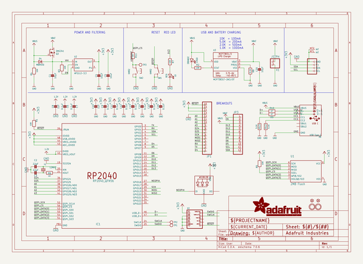
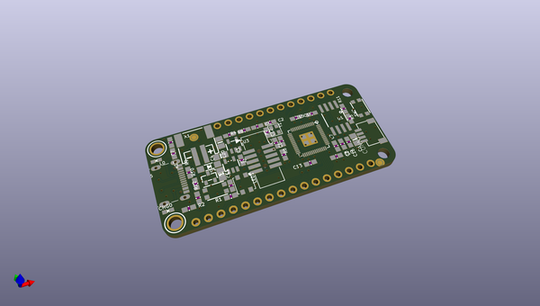
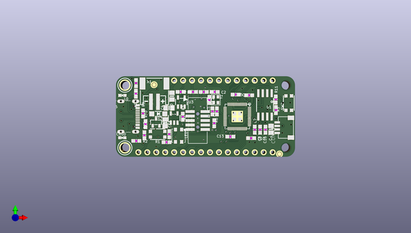
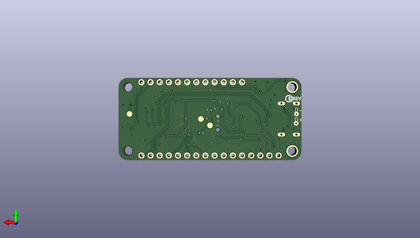

# adafruit_feather_rp2040_pcb
 
## summary 
* id: adafruit_adafruit_feather_rp2040_pcb_adafruit_feather_rp2040_rev_b
* user: adafruit
* name: adafruit_feather_rp2040_pcb
* board: adafruit_feather_rp2040_rev_b
* repo: https://github.com/adafruit/Adafruit-Feather-RP2040-PCB

* src_file_repo_sch: 
* src_file_repo_sch_link: https://github.com/adafruit/Adafruit-Feather-RP2040-PCB/tree/main/
* full details link: https://github.com/oomlout/oomlout_oomp_project_bot_v_2/tree/main/projects/adafruit_adafruit_feather_rp2040_pcb_adafruit_feather_rp2040_rev_b/current_version/working  

## schematic  
  
[schematic (pdf)](working_schematic.pdf) 

## pcb  
 
  
  
  
[board (pdf)](working.pdf)  

## working_bom
| Id | Designator | Footprint | Quantity | Designation | Supplier and ref |  | None | 
| --- | --- | --- | --- | --- | --- | --- | --- | 
| 1 | C5 | 0805-NO | 1 | 10uF |  |  | [''] | 
| 2 | C6,C9,C15,C11,C14,C13,C12,C7,C16 | 0603-NO | 9 | 0.1uF |  |  | [''] | 
| 3 | CONN1 | JST_SH4 | 1 | STEMMA_I2C_QT |  |  | [''] | 
| 4 | JP1 | 1X16_ROUND | 1 |  |  |  | [''] | 
| 5 | Y1 | CRYSTAL_2.5X2 | 1 | 12MHZ |  |  | [''] | 
| 6 | X2 | 2X05_1.27MM_BOX_POSTS | 1 |  |  |  | [''] | 
| 7 | R5,R1,R2,R4,R3,R7 | 0603-NO | 6 | 10K |  |  | [''] | 
| 8 | R8,R12,R13 | 0603-NO | 3 | 5.1K |  |  | [''] | 
| 9 | U2 | SOT23-5@1 | 1 | AP2112-3.3 |  |  | [''] | 
| 10 | X6 | USB_C_CUSB31-CFM2AX-01-X | 1 | USB Type C |  |  | [''] | 
| 11 | JP3 | 1X12_ROUND | 1 |  |  |  | [''] | 
| 12 | U1 | SOIC8_208MIL | 1 | 2MB Flash |  |  | [''] | 
| 13 | U$31,U$32 | MOUNTINGHOLE_2.5_PLATED | 2 | MOUNTINGHOLE2.5 |  |  | [''] | 
| 14 | Q3 | SOT23-R | 1 | DMG341 |  |  | [''] | 
| 15 | C20,C1,C4 | 0805-NO | 3 | 10µF |  |  | [''] | 
| 16 | U$43 | RP2040_TOP | 1 |  |  |  | [''] | 
| 17 | R10,R9 | 0603-NO | 2 | 27 |  |  | [''] | 
| 18 | R11,R6 | 0603-NO | 2 | 1K |  |  | [''] | 
| 19 | @HOLE0,@HOLE1 |  | 2 |  |  |  | [''] | 
| 20 | SW2,SW1 | BTN_KMR2_4.6X2.8 | 2 | KMR2 |  |  | [''] | 
| 21 | C3,C2 | 0603-NO | 2 | 22pF |  |  | [''] | 
| 22 | D4 | SOD-123 | 1 | MBR540 |  |  | [''] | 
| 23 | U$35,U$34 | FIDUCIAL_1MM | 2 | FIDUCIAL_1MM |  |  | [''] | 
| 24 | LED1 | LED3535 | 1 | WS2812B3535 |  |  | [''] | 
| 25 | C10,C8 | 0603-NO | 2 | 1uF |  |  | [''] | 
| 26 | U3 | SOT23-5 | 1 | MCP73831T-2ACI/OT |  |  | [''] | 
| 27 | IC1 | QFN56_7MM_REDUCEDEPAD | 1 | RP2040_QFN56 |  |  | [''] | 
| 28 | L0 | CHIPLED_0603_NOOUTLINE | 1 | RED |  |  | [''] | 
| 29 | CHG0 | CHIPLED_0603_NOOUTLINE | 1 | ORANGE |  |  | [''] | 
| 30 | X1 | JSTPH2_BATT | 1 | JSTPH |  |  | [''] | 
| 31 | U$1 | RP2040_BOT | 1 |  |  |  | [''] | 
| 32 | TP1,TP2,TP3 | TESTPOINT_ROUND_1.5MM_NO | 3 |  |  |  | [''] | 
| 33 | D+1,D-1 | B1,27 | 2 | TPB1,27 |  |  | [''] | 
| 34 | U$13 | PCBFEAT-REV-040 | 1 |  |  |  | [''] | 

## bom_schematic
| Ref | Qnty | Value | Cmp name | Footprint | Description | Vendor | DNP | 
| --- | --- | --- | --- | --- | --- | --- | --- | 
| C1, C4, C20 | 3 | 10µF | CAP_CERAMIC0805-NOOUTLINE | working:0805-NO |  |  |  | 
| C2, C3 | 2 | 22pF | CAP_CERAMIC0603_NO | working:0603-NO |  |  |  | 
| C5 | 1 | 10uF | CAP_CERAMIC0805-NOOUTLINE | working:0805-NO |  |  |  | 
| C6, C7, C9, C11, C12, C13, C14, C15, C16 | 9 | 0.1uF | CAP_CERAMIC0603_NO | working:0603-NO |  |  |  | 
| C8, C10 | 2 | 1uF | CAP_CERAMIC0603_NO | working:0603-NO |  |  |  | 
| CHG0 | 1 | ORANGE | LED0603_NOOUTLINE | working:CHIPLED_0603_NOOUTLINE |  |  |  | 
| CONN1 | 1 | STEMMA_I2C_QT | STEMMA_I2C_QT | working:JST_SH4 |  |  |  | 
| D4 | 1 | MBR540 | DIODE-SCHOTTKYSOD-123 | working:SOD-123 |  |  |  | 
| D+1 | 1 | TPB1,27 | TPB1,27 | working:B1,27 |  |  |  | 
| D-1 | 1 | TPB1,27 | TPB1,27 | working:B1,27 |  |  |  | 
| IC1 | 1 | RP2040_QFN56 | RP2040_QFN56 | working:QFN56_7MM_REDUCEDEPAD |  |  |  | 
| JP1 | 1 | HEADER-1X16ROUND | HEADER-1X16ROUND | working:1X16_ROUND |  |  |  | 
| JP3 | 1 | HEADER-1X12 | HEADER-1X12 | working:1X12_ROUND |  |  |  | 
| L0 | 1 | RED | LED0603_NOOUTLINE | working:CHIPLED_0603_NOOUTLINE |  |  |  | 
| LED1 | 1 | WS2812B3535 | WS2812B3535 | working:LED3535 |  |  |  | 
| Q3 | 1 | DMG341 | MOSFET-P | working:SOT23-R |  |  |  | 
| R1, R2, R3, R4, R5, R7 | 6 | 10K | RESISTOR_0603_NOOUT | working:0603-NO |  |  |  | 
| R6, R11 | 2 | 1K | RESISTOR_0603_NOOUT | working:0603-NO |  |  |  | 
| R8, R12, R13 | 3 | 5.1K | RESISTOR_0603_NOOUT | working:0603-NO |  |  |  | 
| R9, R10 | 2 | 27 | RESISTOR_0603_NOOUT | working:0603-NO |  |  |  | 
| SW1, SW2 | 2 | KMR2 | SWITCH_TACT_SMT4.6X2.8 | working:BTN_KMR2_4.6X2.8 |  |  |  | 
| TP1, TP2, TP3 | 3 | TESTPOINTROUND1.5MMNO | TESTPOINTROUND1.5MMNO | working:TESTPOINT_ROUND_1.5MM_NO |  |  |  | 
| U1 | 1 | 2MB Flash | SPIFLASH_8PIN208MIL | working:SOIC8_208MIL |  |  |  | 
| U2 | 1 | AP2112-3.3 | VREG_SOT23-5 | working:SOT23-5@1 |  |  |  | 
| U3 | 1 | MCP73831T-2ACI/OT | MCP73831/2 | working:SOT23-5 |  |  |  | 
| U$31, U$32 | 2 | MOUNTINGHOLE2.5 | MOUNTINGHOLE2.5 | working:MOUNTINGHOLE_2.5_PLATED |  |  |  | 
| U$34, U$35 | 2 | FIDUCIAL_1MM | FIDUCIAL_1MM | working:FIDUCIAL_1MM |  |  |  | 
| X1 | 1 | JSTPH | CON_JST_PH_2PIN_BATT | working:JSTPH2_BATT |  |  |  | 
| X2 | 1 | JTAG-CORTEXBOXPOSTS | JTAG-CORTEXBOXPOSTS | working:2X05_1.27MM_BOX_POSTS |  |  |  | 
| X6 | 1 | USB Type C | USB_C | working:USB_C_CUSB31-CFM2AX-01-X |  |  |  | 
| Y1 | 1 | 12MHZ | CRYSTAL2.5X2.0 | working:CRYSTAL_2.5X2 |  |  |  | 

## mounting_holes
| x | y | package | value | ref | size | 
| --- | --- | --- | --- | --- | --- | 
| 0.0 | 17.78 | MOUNTINGHOLE_2.5_PLATED | MOUNTINGHOLE2.5 | U$31 | m3 | 
| 0.0 | 0.0 | MOUNTINGHOLE_2.5_PLATED | MOUNTINGHOLE2.5 | U$32 | m3 | 

