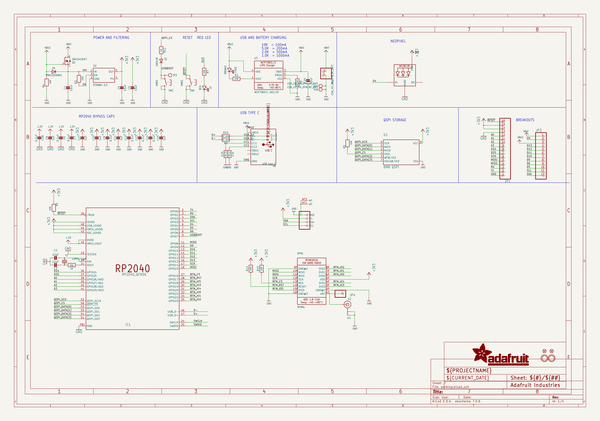
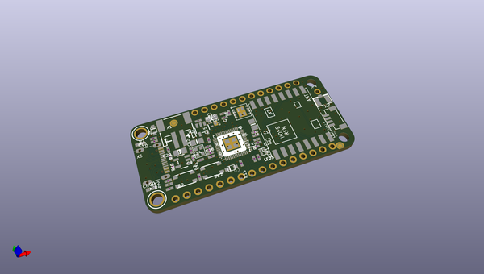
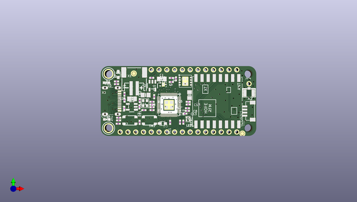
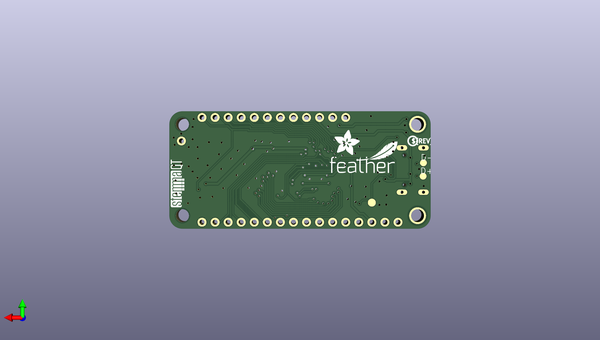

# adafruit_feather_rp2040_rfm_pcb
 
## summary 
* id: adafruit_adafruit_feather_rp2040_rfm_pcb_adafruit_feather_rp2040_rfm
* user: adafruit
* name: adafruit_feather_rp2040_rfm_pcb
* board: adafruit_feather_rp2040_rfm
* repo: https://github.com/adafruit/Adafruit-Feather-RP2040-RFM-PCB

* src_file_repo_sch: 
* src_file_repo_sch_link: https://github.com/adafruit/Adafruit-Feather-RP2040-RFM-PCB/tree/main/
* full details link: https://github.com/oomlout/oomlout_oomp_project_bot_v_2/tree/main/projects/adafruit_adafruit_feather_rp2040_rfm_pcb_adafruit_feather_rp2040_rfm/current_version/working  

## schematic  
  
[schematic (pdf)](working_schematic.pdf) 

## pcb  
 
  
  
  
[board (pdf)](working.pdf)  

## working_bom
| Id | Designator | Footprint | Quantity | Designation | Supplier and ref |  | None | 
| --- | --- | --- | --- | --- | --- | --- | --- | 
| 1 | PLABEL18 | PLABEL18 | 1 |  |  |  | [''] | 
| 2 | C13,C9,C12,C6,C18,C7,C14 | _0402NO | 7 | 0.1uF |  |  | [''] | 
| 3 | Y1 | CRYSTAL_2.5X2 | 1 | 12MHz/12pF |  |  | [''] | 
| 4 | PLABEL19 | PLABEL19 | 1 |  |  |  | [''] | 
| 5 | L0 | CHIPLED_0603_NOOUTLINE | 1 | RED |  |  | [''] | 
| 6 | R11,R6 | _0402NO | 2 | 1K |  |  | [''] | 
| 7 | CHG0 | CHIPLED_0603_NOOUTLINE | 1 | ORANGE |  |  | [''] | 
| 8 | U1 | USON8_4X4 | 1 | 8MB QSPI |  |  | [''] | 
| 9 | PLABEL8 | PLABEL8 | 1 |  |  |  | [''] | 
| 10 | LED1 | SK6805_1515 | 1 | WS2812B_SK6805_1515 |  |  | [''] | 
| 11 | PLABEL2 | PLABEL2 | 1 |  |  |  | [''] | 
| 12 | R14,R15,R3,R2,R4,R7,R1,R5 | _0402NO | 8 | 10K |  |  | [''] | 
| 13 | PLABEL7 | PLABEL7 | 1 |  |  |  | [''] | 
| 14 | PLABEL4 | PLABEL4 | 1 |  |  |  | [''] | 
| 15 | R12,R13,R8 | _0402NO | 3 | 5.1K |  |  | [''] | 
| 16 | U2 | SOT23-5 | 1 | RT9080-3.3 |  |  | [''] | 
| 17 | PLABEL0 | PLABEL0 | 1 |  |  |  | [''] | 
| 18 | X1 | JSTPH2_BATT | 1 | JSTPH |  |  | [''] | 
| 19 | @HOLE0,@HOLE1 |  | 2 |  |  |  | [''] | 
| 20 | SW2,SW1 | BTN_RKB2_4.6X2.8 | 2 | KMR2 |  |  | [''] | 
| 21 | D4 | SOD-323F | 1 | PMEG2020AEA |  |  | [''] | 
| 22 | X6 | USB_C_CUSB31-CFM2AX-01-X | 1 | USB Type C |  |  | [''] | 
| 23 | C4,C20,C1,C5 | 0805-NO | 4 | 10uF |  |  | [''] | 
| 24 | U$31,U$32 | MOUNTINGHOLE_2.5_PLATED | 2 | MOUNTINGHOLE2.5 |  |  | [''] | 
| 25 | U3 | SOT23-5 | 1 | MCP73831T-2ACI/OT |  |  | [''] | 
| 26 | PLABEL16 | PLABEL16 | 1 |  |  |  | [''] | 
| 27 | PLABEL1 | PLABEL1 | 1 |  |  |  | [''] | 
| 28 | C8,C10,C15,C11,C17 | _0402NO | 5 | 1uF |  |  | [''] | 
| 29 | PLABEL5 | PLABEL5 | 1 |  |  |  | [''] | 
| 30 | PLABEL21 | PLABEL21 | 1 |  |  |  | [''] | 
| 31 | U$34,U$35 | FIDUCIAL_1MM | 2 | FIDUCIAL_1MM |  |  | [''] | 
| 32 | JP3 | 1X12_ROUND | 1 |  |  |  | [''] | 
| 33 | PLABEL22 | PLABEL22 | 1 |  |  |  | [''] | 
| 34 | PLABEL11 | PLABEL11 | 1 |  |  |  | [''] | 
| 35 | C3,C2 | _0402NO | 2 | 22pF |  |  | [''] | 
| 36 | PLABEL3 | PLABEL3 | 1 |  |  |  | [''] | 
| 37 | PLABEL6 | PLABEL6 | 1 |  |  |  | [''] | 
| 38 | PLABEL14 | PLABEL14 | 1 |  |  |  | [''] | 
| 39 | RFM1 | RFMHCW_SMT | 1 | RFM9x |  |  | [''] | 
| 40 | X2 | U.FL | 1 | uFL |  |  | [''] | 
| 41 | R10,R9 | _0402NO | 2 | 22 ohm |  |  | [''] | 
| 42 | JP1 | 1X16_ROUND | 1 |  |  |  | [''] | 
| 43 | PLABEL17 | PLABEL17 | 1 |  |  |  | [''] | 
| 44 | Q3 | DFN2015-3 | 1 | DMG3415UFY |  |  | [''] | 
| 45 | CONN1 | JST_SH4_RA | 1 | STEMMA_I2C_QTRA |  |  | [''] | 
| 46 | PLABEL12 | PLABEL12 | 1 |  |  |  | [''] | 
| 47 | PLABEL15 | PLABEL15 | 1 |  |  |  | [''] | 
| 48 | PLABEL20 | PLABEL20 | 1 |  |  |  | [''] | 
| 49 | PLABEL10 | PLABEL10 | 1 |  |  |  | [''] | 
| 50 | PLABEL9 | PLABEL9 | 1 |  |  |  | [''] | 
| 51 | PLABEL13 | PLABEL13 | 1 |  |  |  | [''] | 
| 52 | D3 | SOD-323F | 1 | 1N4148 |  |  | [''] | 
| 53 | JP4 | 1X01_ROUND | 1 |  |  |  | [''] | 
| 54 | IC1 | QFN56_7MM_REDUCEDEPAD | 1 | RP2040_QFN56 |  |  | [''] | 
| 55 | PLABEL25 | PLABEL25 | 1 |  |  |  | [''] | 
| 56 | PLABEL35 | PLABEL35 | 1 |  |  |  | [''] | 
| 57 | PLABEL53 | PLABEL53 | 1 |  |  |  | [''] | 
| 58 | PLABEL40 | PLABEL40 | 1 |  |  |  | [''] | 
| 59 | PLABEL45 | PLABEL45 | 1 |  |  |  | [''] | 
| 60 | U$46 | STEMMAQT | 1 |  |  |  | [''] | 
| 61 | U$47 | FEATHERLOGO_SMALL | 1 |  |  |  | [''] | 
| 62 | PLABEL47 | PLABEL47 | 1 |  |  |  | [''] | 
| 63 | PLABEL24,PLABEL54 | PLABEL24 | 2 |  |  |  | [''] | 
| 64 | PLABEL46 | PLABEL46 | 1 |  |  |  | [''] | 
| 65 | PLABEL33 | PLABEL33 | 1 |  |  |  | [''] | 
| 66 | PLABEL52 | PLABEL52 | 1 |  |  |  | [''] | 
| 67 | PLABEL49 | PLABEL49 | 1 |  |  |  | [''] | 
| 68 | PLABEL27 | PLABEL27 | 1 |  |  |  | [''] | 
| 69 | PLABEL540 | PLABEL540 | 1 |  |  |  | [''] | 
| 70 | PLABEL32 | PLABEL32 | 1 |  |  |  | [''] | 
| 71 | PLABEL30 | PLABEL30 | 1 |  |  |  | [''] | 
| 72 | PLABEL38 | PLABEL38 | 1 |  |  |  | [''] | 
| 73 | PLABEL41 | PLABEL41 | 1 |  |  |  | [''] | 
| 74 | PLABEL44 | PLABEL44 | 1 |  |  |  | [''] | 
| 75 | PLABEL34 | PLABEL34 | 1 |  |  |  | [''] | 
| 76 | PLABEL29 | PLABEL29 | 1 |  |  |  | [''] | 
| 77 | PLABEL51 | PLABEL51 | 1 |  |  |  | [''] | 
| 78 | PLABEL36 | PLABEL36 | 1 |  |  |  | [''] | 
| 79 | PLABEL42 | PLABEL42 | 1 |  |  |  | [''] | 
| 80 | PLABEL39 | PLABEL39 | 1 |  |  |  | [''] | 
| 81 | PLABEL43 | PLABEL43 | 1 |  |  |  | [''] | 
| 82 | U$13 | PCBFEAT-REV-040 | 1 |  |  |  | [''] | 
| 83 | U$45 | ADAFRUIT_5MM | 1 |  |  |  | [''] | 
| 84 | PLABEL31 | PLABEL31 | 1 |  |  |  | [''] | 
| 85 | PLABEL26 | PLABEL26 | 1 |  |  |  | [''] | 
| 86 | D-1,D+1 | B1,27 | 2 | TPB1,27 |  |  | [''] | 
| 87 | PLABEL28 | PLABEL28 | 1 |  |  |  | [''] | 
| 88 | PLABEL48 | PLABEL48 | 1 |  |  |  | [''] | 
| 89 | PLABEL37 | PLABEL37 | 1 |  |  |  | [''] | 
| 90 | TP3 | TESTPOINT_ROUND_1.5MM_NO | 1 |  |  |  | [''] | 
| 91 | PLABEL23 | PLABEL23 | 1 |  |  |  | [''] | 

## bom_schematic
| Ref | Qnty | Value | Cmp name | Footprint | Description | Vendor | DNP | 
| --- | --- | --- | --- | --- | --- | --- | --- | 
| C1, C4, C5, C20 | 4 | 10uF | CAP_CERAMIC0805-NOOUTLINE | working:0805-NO |  |  |  | 
| C2, C3 | 2 | 22pF | CAP_CERAMIC_0402NO | working:_0402NO |  |  |  | 
| C6, C7, C9, C12, C13, C14, C18 | 7 | 0.1uF | CAP_CERAMIC_0402NO | working:_0402NO |  |  |  | 
| C8, C10, C11, C15, C17 | 5 | 1uF | CAP_CERAMIC_0402NO | working:_0402NO |  |  |  | 
| CHG0 | 1 | ORANGE | LED0603_NOOUTLINE | working:CHIPLED_0603_NOOUTLINE |  |  |  | 
| CONN1 | 1 | STEMMA_I2C_QTRA | STEMMA_I2C_QTRA | working:JST_SH4_RA |  |  |  | 
| D3 | 1 | 1N4148 | DIODESOD-323F | working:SOD-323F |  |  |  | 
| D4 | 1 | PMEG2020AEA | DIODESOD-323F | working:SOD-323F |  |  |  | 
| D+1 | 1 | TPB1,27 | TPB1,27 | working:B1,27 |  |  |  | 
| D-1 | 1 | TPB1,27 | TPB1,27 | working:B1,27 |  |  |  | 
| IC1 | 1 | RP2040_QFN56 | RP2040_QFN56 | working:QFN56_7MM_REDUCEDEPAD |  |  |  | 
| JP1 | 1 | HEADER-1X16ROUND | HEADER-1X16ROUND | working:1X16_ROUND |  |  |  | 
| JP3 | 1 | HEADER-1X12 | HEADER-1X12 | working:1X12_ROUND |  |  |  | 
| JP4 | 1 | HEADER-1X1ROUND | HEADER-1X1ROUND | working:1X01_ROUND |  |  |  | 
| L0 | 1 | RED | LED0603_NOOUTLINE | working:CHIPLED_0603_NOOUTLINE |  |  |  | 
| LED1 | 1 | WS2812B_SK6805_1515 | WS2812B_SK6805_1515 | working:SK6805_1515 |  |  |  | 
| Q3 | 1 | DMG3415UFY | MOSFET-P_DFN2015 | working:DFN2015-3 |  |  |  | 
| R1, R2, R3, R4, R5, R7, R14, R15 | 8 | 10K | RESISTOR_0402NO | working:_0402NO |  |  |  | 
| R6, R11 | 2 | 1K | RESISTOR_0402NO | working:_0402NO |  |  |  | 
| R8, R12, R13 | 3 | 5.1K | RESISTOR_0402NO | working:_0402NO |  |  |  | 
| R9, R10 | 2 | 22 ohm | RESISTOR_0402NO | working:_0402NO |  |  |  | 
| RFM1 | 1 | RFM9x | RFM69HCW_SMT | working:RFMHCW_SMT |  |  |  | 
| SW1, SW2 | 2 | KMR2 | SWITCH_TACT_SMT_RKB2 | working:BTN_RKB2_4.6X2.8 |  |  |  | 
| TP3 | 1 | TESTPOINTROUND1.5MMNO | TESTPOINTROUND1.5MMNO | working:TESTPOINT_ROUND_1.5MM_NO |  |  |  | 
| U1 | 1 | 8MB QSPI | SPIFLASH_8PIN_4X4 | working:USON8_4X4 |  |  |  | 
| U2 | 1 | RT9080-3.3 | VREG_SOT23-5 | working:SOT23-5 |  |  |  | 
| U3 | 1 | MCP73831T-2ACI/OT | MCP73831/2 | working:SOT23-5 |  |  |  | 
| U$31, U$32 | 2 | MOUNTINGHOLE2.5 | MOUNTINGHOLE2.5 | working:MOUNTINGHOLE_2.5_PLATED |  |  |  | 
| U$34, U$35 | 2 | FIDUCIAL_1MM | FIDUCIAL_1MM | working:FIDUCIAL_1MM |  |  |  | 
| X1 | 1 | CON_JST_PH_2PIN_MT_BATT | CON_JST_PH_2PIN_MT_BATT | working:JSTPH2_BATT |  |  |  | 
| X2 | 1 | uFL | ANTENNA_U.FL | working:U.FL |  |  |  | 
| X6 | 1 | USB Type C | USB_C | working:USB_C_CUSB31-CFM2AX-01-X |  |  |  | 
| Y1 | 1 | 12MHz/12pF | CRYSTAL2.5X2.0 | working:CRYSTAL_2.5X2 |  |  |  | 

## mounting_holes
| x | y | package | value | ref | size | 
| --- | --- | --- | --- | --- | --- | 
| 0.0 | 17.78 | MOUNTINGHOLE_2.5_PLATED | MOUNTINGHOLE2.5 | U$31 | m3 | 
| 0.0 | 0.0 | MOUNTINGHOLE_2.5_PLATED | MOUNTINGHOLE2.5 | U$32 | m3 | 

