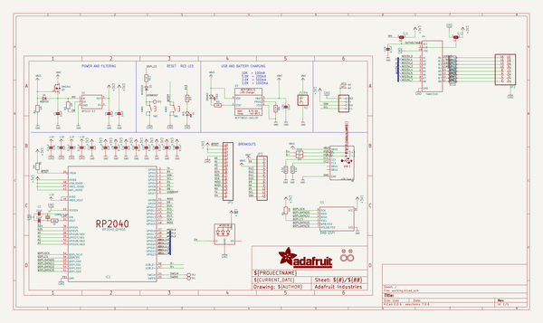
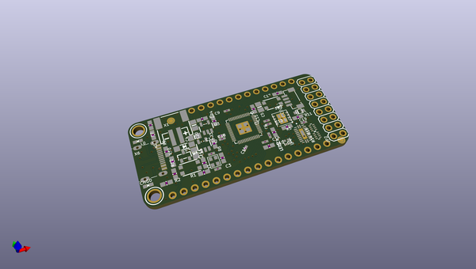
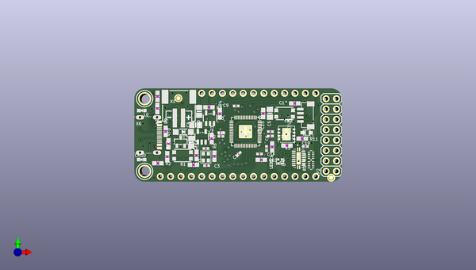
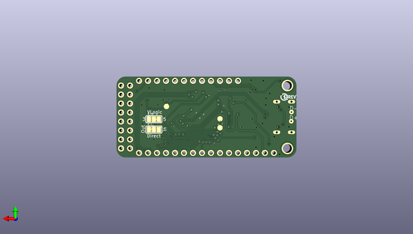

# adafruit_feather_rp2040_scorpio_pcb
 
## summary 
* id: adafruit_adafruit_feather_rp2040_scorpio_pcb_adafruit_feather_rp2040_scorpio
* user: adafruit
* name: adafruit_feather_rp2040_scorpio_pcb
* board: adafruit_feather_rp2040_scorpio
* repo: https://github.com/adafruit/Adafruit-Feather-RP2040-SCORPIO-PCB

* src_file_repo_sch: 
* src_file_repo_sch_link: https://github.com/adafruit/Adafruit-Feather-RP2040-SCORPIO-PCB/tree/main/
* full details link: https://github.com/oomlout/oomlout_oomp_project_bot_v_2/tree/main/projects/adafruit_adafruit_feather_rp2040_scorpio_pcb_adafruit_feather_rp2040_scorpio/current_version/working  

## schematic  
  
[schematic (pdf)](working_schematic.pdf) 

## pcb  
 
  
  
  
[board (pdf)](working.pdf)  

## working_bom
| Id | Designator | Footprint | Quantity | Designation | Supplier and ref |  | None | 
| --- | --- | --- | --- | --- | --- | --- | --- | 
| 1 | R5,R3,R7,R2,R1,R4 | 0603-NO | 6 | 10K |  |  | [''] | 
| 2 | C7,C14,C18,C19,C6,C12,C16,C13,C9 | _0402NO | 9 | 0.1uF |  |  | [''] | 
| 3 | U2 | SOT23-5 | 1 | AP2112-3.3 |  |  | [''] | 
| 4 | U3 | SOT23-5 | 1 | MCP73831T-2ACI/OT |  |  | [''] | 
| 5 | Q3 | SOT23-R | 1 | DMG341 |  |  | [''] | 
| 6 | C1,C4,C20,C5 | 0805-NO | 4 | 10uF |  |  | [''] | 
| 7 | R9,R10 | 0603-NO | 2 | 27 |  |  | [''] | 
| 8 | R14,R15 | RESPACK_4X0402 | 2 | 100 Pack |  |  | [''] | 
| 9 | JP1 | 1X16_ROUND | 1 |  |  |  | [''] | 
| 10 | L0 | CHIPLED_0603_NOOUTLINE | 1 | RED |  |  | [''] | 
| 11 | U$12 | SCORPIO_TOP | 1 |  |  |  | [''] | 
| 12 | C10,C8,C17,C11,C15 | 0603-NO | 5 | 1uF |  |  | [''] | 
| 13 | JP2 | 2X08 | 1 |  |  |  | [''] | 
| 14 | D4 | SOD-123 | 1 | MBR540 |  |  | [''] | 
| 15 | R6,R11 | 0603-NO | 2 | 1K |  |  | [''] | 
| 16 | IC1 | QFN56_7MM_REDUCEDEPAD | 1 | RP2040_QFN56 |  |  | [''] | 
| 17 | Y1 | CRYSTAL_2.5X2 | 1 | 12MHz/12pF |  |  | [''] | 
| 18 | U$31,U$32 | MOUNTINGHOLE_2.5_PLATED | 2 | MOUNTINGHOLE2.5 |  |  | [''] | 
| 19 | U$34,U$35 | FIDUCIAL_1MM | 2 | FIDUCIAL_1MM |  |  | [''] | 
| 20 | SW2,SW1 | BTN_KMR2_4.6X2.8 | 2 | KMR2 |  |  | [''] | 
| 21 | U1 | USON8_4X4 | 1 | 8MB QSPI |  |  | [''] | 
| 22 | R12,R13,R8 | 0603-NO | 3 | 5.1K |  |  | [''] | 
| 23 | C3,C2 | _0402NO | 2 | 22pF |  |  | [''] | 
| 24 | JP3 | 1X12_ROUND | 1 |  |  |  | [''] | 
| 25 | LED1 | SK6805_1515 | 1 | WS2812B_SK6805_1515 |  |  | [''] | 
| 26 | D3 | SOD-323F | 1 | NSR0320 |  |  | [''] | 
| 27 | U4 | 20-DHVQFN | 1 | 74AHCT245 |  |  | [''] | 
| 28 | X1 | JSTPH2_BATT | 1 | JSTPH |  |  | [''] | 
| 29 | CONN1 | JST_SH4_RA | 1 | STEMMA_I2C_QTRA |  |  | [''] | 
| 30 | X6 | USB_C_CUSB31-CFM2AX-01-X | 1 | USB Type C |  |  | [''] | 
| 31 | CHG0 | CHIPLED_0603_NOOUTLINE | 1 | ORANGE |  |  | [''] | 
| 32 | D+1,D-1 | B1,27 | 2 | TPB1,27 |  |  | [''] | 
| 33 | U$28 | SCORPIO_BOT | 1 |  |  |  | [''] | 
| 34 | SJ1,SJ2 | SOLDERJUMPER_2WAY_OPEN_NOPASTE | 2 |  |  |  | [''] | 
| 35 | U$13 | PCBFEAT-REV-040 | 1 |  |  |  | [''] | 
| 36 | TP1,TP3,TP2 | TESTPOINT_ROUND_1.5MM_NO | 3 |  |  |  | [''] | 

## bom_schematic
| Ref | Qnty | Value | Cmp name | Footprint | Description | Vendor | DNP | 
| --- | --- | --- | --- | --- | --- | --- | --- | 
| C1, C4, C5, C20 | 4 | 10uF | CAP_CERAMIC0805-NOOUTLINE | working:0805-NO |  |  |  | 
| C2, C3 | 2 | 22pF | CAP_CERAMIC_0402NO | working:_0402NO |  |  |  | 
| C6, C7, C9, C12, C13, C14, C16, C18, C19 | 9 | 0.1uF | CAP_CERAMIC_0402NO | working:_0402NO |  |  |  | 
| C8, C10, C11, C15, C17 | 5 | 1uF | CAP_CERAMIC0603_NO | working:0603-NO |  |  |  | 
| CHG0 | 1 | ORANGE | LED0603_NOOUTLINE | working:CHIPLED_0603_NOOUTLINE |  |  |  | 
| CONN1 | 1 | STEMMA_I2C_QTRA | STEMMA_I2C_QTRA | working:JST_SH4_RA |  |  |  | 
| D3 | 1 | NSR0320 | DIODESOD-323F | working:SOD-323F |  |  |  | 
| D4 | 1 | MBR540 | DIODE-SCHOTTKYSOD-123 | working:SOD-123 |  |  |  | 
| D+1 | 1 | TPB1,27 | TPB1,27 | working:B1,27 |  |  |  | 
| D-1 | 1 | TPB1,27 | TPB1,27 | working:B1,27 |  |  |  | 
| IC1 | 1 | RP2040_QFN56 | RP2040_QFN56 | working:QFN56_7MM_REDUCEDEPAD |  |  |  | 
| JP1 | 1 | HEADER-1X16ROUND | HEADER-1X16ROUND | working:1X16_ROUND |  |  |  | 
| JP2 | 1 | HEADER-2X8 | HEADER-2X8 | working:2X08 |  |  |  | 
| JP3 | 1 | HEADER-1X12 | HEADER-1X12 | working:1X12_ROUND |  |  |  | 
| L0 | 1 | RED | LED0603_NOOUTLINE | working:CHIPLED_0603_NOOUTLINE |  |  |  | 
| LED1 | 1 | WS2812B_SK6805_1515 | WS2812B_SK6805_1515 | working:SK6805_1515 |  |  |  | 
| Q3 | 1 | DMG341 | MOSFET-P | working:SOT23-R |  |  |  | 
| R1, R2, R3, R4, R5, R7 | 6 | 10K | RESISTOR_0603_NOOUT | working:0603-NO |  |  |  | 
| R6, R11 | 2 | 1K | RESISTOR_0603_NOOUT | working:0603-NO |  |  |  | 
| R8, R12, R13 | 3 | 5.1K | RESISTOR_0603_NOOUT | working:0603-NO |  |  |  | 
| R9, R10 | 2 | 27 | RESISTOR_0603_NOOUT | working:0603-NO |  |  |  | 
| R14, R15 | 2 | 100 Pack | RESISTOR_4PACK_0804 | working:RESPACK_4X0402 |  |  |  | 
| SJ1, SJ2 | 2 | SOLDERJUMPER_2WAY | SOLDERJUMPER_2WAY | working:SOLDERJUMPER_2WAY_OPEN_NOPASTE |  |  |  | 
| SW1, SW2 | 2 | KMR2 | SWITCH_TACT_SMT4.6X2.8 | working:BTN_KMR2_4.6X2.8 |  |  |  | 
| TP1, TP2, TP3 | 3 | TESTPOINTROUND1.5MMNO | TESTPOINTROUND1.5MMNO | working:TESTPOINT_ROUND_1.5MM_NO |  |  |  | 
| U1 | 1 | 8MB QSPI | SPIFLASH_8PIN_4X4 | working:USON8_4X4 |  |  |  | 
| U2 | 1 | AP2112-3.3 | VREG_SOT23-5 | working:SOT23-5 |  |  |  | 
| U3 | 1 | MCP73831T-2ACI/OT | MCP73831/2 | working:SOT23-5 |  |  |  | 
| U4 | 1 | 74AHCT245 | 74LCX245_QFN20 | working:20-DHVQFN |  |  |  | 
| U$31, U$32 | 2 | MOUNTINGHOLE2.5 | MOUNTINGHOLE2.5 | working:MOUNTINGHOLE_2.5_PLATED |  |  |  | 
| U$34, U$35 | 2 | FIDUCIAL_1MM | FIDUCIAL_1MM | working:FIDUCIAL_1MM |  |  |  | 
| X1 | 1 | JSTPH | CON_JST_PH_2PIN_BATT | working:JSTPH2_BATT |  |  |  | 
| X6 | 1 | USB Type C | USB_C | working:USB_C_CUSB31-CFM2AX-01-X |  |  |  | 
| Y1 | 1 | 12MHz/12pF | CRYSTAL2.5X2.0 | working:CRYSTAL_2.5X2 |  |  |  | 

## mounting_holes
| x | y | package | value | ref | size | 
| --- | --- | --- | --- | --- | --- | 
| 0.0 | 17.78 | MOUNTINGHOLE_2.5_PLATED | MOUNTINGHOLE2.5 | U$31 | m3 | 
| 0.0 | 0.0 | MOUNTINGHOLE_2.5_PLATED | MOUNTINGHOLE2.5 | U$32 | m3 | 

