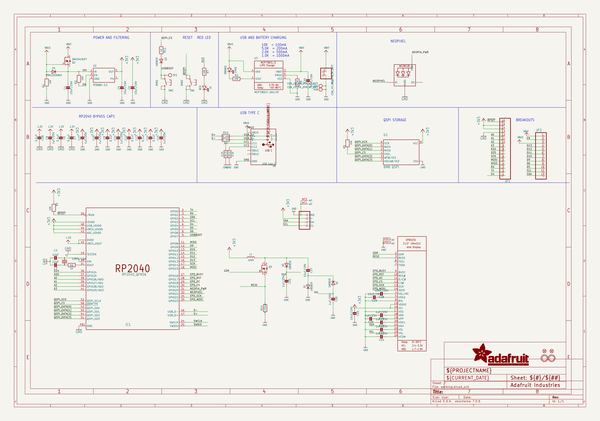
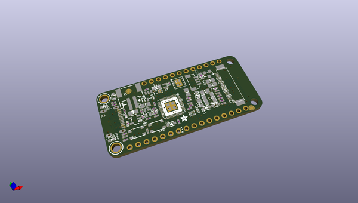
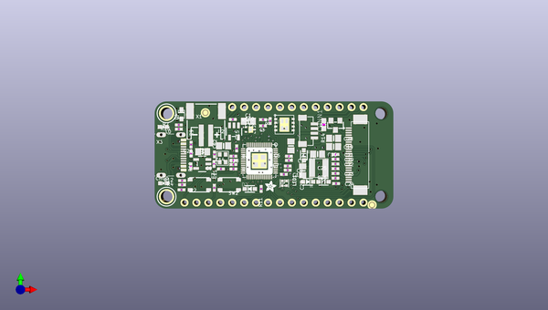
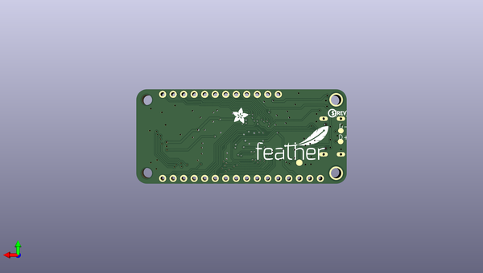

# adafruit_feather_rp2040_thinkink
 
## summary 
* id: adafruit_adafruit_feather_rp2040_thinkink_adafruit_feather_rp2040_thinkink
* user: adafruit
* name: adafruit_feather_rp2040_thinkink
* board: adafruit_feather_rp2040_thinkink
* repo: https://github.com/adafruit/Adafruit-Feather-RP2040-ThinkInk

* src_file_repo_sch: 
* src_file_repo_sch_link: https://github.com/adafruit/Adafruit-Feather-RP2040-ThinkInk/tree/main/
* full details link: https://github.com/oomlout/oomlout_oomp_project_bot_v_2/tree/main/projects/adafruit_adafruit_feather_rp2040_thinkink_adafruit_feather_rp2040_thinkink/current_version/working  

## schematic  
  
[schematic (pdf)](working_schematic.pdf)  

## pcb  
 
  
  
  
[board (pdf)](working.pdf)  

## working_bom
| Id | Designator | Footprint | Quantity | Designation | Supplier and ref |  | None | 
| --- | --- | --- | --- | --- | --- | --- | --- | 
| 1 | C11,C10,C21,C25,C24,C29,C26,C23,C8,C17,C22,C15 | _0402NO | 12 | 1uF/25V |  |  | [''] | 
| 2 | D3,D2,D5,D1 | SOD-323_MINI | 4 | 1N5819 |  |  | [''] | 
| 3 | C27,C1,C4,C20,C19,C28,C5,C16 | 0805-NO | 8 | 10uF/16V |  |  | [''] | 
| 4 | PLABEL20 | PLABEL20 | 1 |  |  |  | [''] | 
| 5 | PLABEL33 | PLABEL33 | 1 |  |  |  | [''] | 
| 6 | R13,R8,R12 | _0402NO | 3 | 5.1K |  |  | [''] | 
| 7 | PLABEL25 | PLABEL25 | 1 |  |  |  | [''] | 
| 8 | R4,R1,R5,R2,R7,R3 | _0402NO | 6 | 10K |  |  | [''] | 
| 9 | U$31,U$32 | MOUNTINGHOLE_2.5_PLATED | 2 | MOUNTINGHOLE2.5 |  |  | [''] | 
| 10 | C18,C7,C13,C12,C9,C14,C6 | _0402NO | 7 | 0.1uF |  |  | [''] | 
| 11 | PLABEL14 | PLABEL14 | 1 |  |  |  | [''] | 
| 12 | PLABEL23 | PLABEL23 | 1 |  |  |  | [''] | 
| 13 | R10,R9 | _0402NO | 2 | 22 ohm |  |  | [''] | 
| 14 | PLABEL6 | PLABEL6 | 1 |  |  |  | [''] | 
| 15 | SW1,SW2 | BTN_RKB2_4.6X2.8 | 2 | RKB2 |  |  | [''] | 
| 16 | L0 | CHIPLED_0603_NOOUTLINE | 1 | RED |  |  | [''] | 
| 17 | PLABEL29 | PLABEL29 | 1 |  |  |  | [''] | 
| 18 | PLABEL4 | PLABEL4 | 1 |  |  |  | [''] | 
| 19 | PLABEL16 | PLABEL16 | 1 |  |  |  | [''] | 
| 20 | @HOLE0,@HOLE1 |  | 2 |  |  |  | [''] | 
| 21 | PLABEL8 | PLABEL8 | 1 |  |  |  | [''] | 
| 22 | R14 | 0603-NO | 1 | 0.47ohm |  |  | [''] | 
| 23 | PLABEL11 | PLABEL11 | 1 |  |  |  | [''] | 
| 24 | Q5 | SOT23-WIDE | 1 | IRLML0100 |  |  | [''] | 
| 25 | U$28 | ADAFRUIT_2.5MM | 1 |  |  |  | [''] | 
| 26 | PLABEL13 | PLABEL13 | 1 |  |  |  | [''] | 
| 27 | JP1 | 1X16_ROUND | 1 |  |  |  | [''] | 
| 28 | C3,C2 | _0402NO | 2 | 22pF |  |  | [''] | 
| 29 | X1 | JSTPH2_BATT | 1 | JSTPH |  |  | [''] | 
| 30 | PLABEL19 | PLABEL19 | 1 |  |  |  | [''] | 
| 31 | PLABEL0 | PLABEL0 | 1 |  |  |  | [''] | 
| 32 | PLABEL26 | PLABEL26 | 1 |  |  |  | [''] | 
| 33 | PLABEL18 | PLABEL18 | 1 |  |  |  | [''] | 
| 34 | PLABEL7 | PLABEL7 | 1 |  |  |  | [''] | 
| 35 | PLABEL27 | PLABEL27 | 1 |  |  |  | [''] | 
| 36 | U3 | SOT23-5 | 1 | MCP73831T-2ACI/OT |  |  | [''] | 
| 37 | CONN1 | JST_SH4_RA | 1 | STEMMA_I2C_QTRA |  |  | [''] | 
| 38 | PLABEL21 | PLABEL21 | 1 |  |  |  | [''] | 
| 39 | PLABEL12 | PLABEL12 | 1 |  |  |  | [''] | 
| 40 | PLABEL5 | PLABEL5 | 1 |  |  |  | [''] | 
| 41 | X6 | USB_C_CUSB31-CFM2AX-01-X | 1 | USB Type C |  |  | [''] | 
| 42 | CHG0 | CHIPLED_0603_NOOUTLINE | 1 | ORANGE |  |  | [''] | 
| 43 | EINK2 | EINK_24PIN | 1 | EINK_24PIN_CONNECTOR |  |  | [''] | 
| 44 | PLABEL9 | PLABEL9 | 1 |  |  |  | [''] | 
| 45 | PLABEL32 | PLABEL32 | 1 |  |  |  | [''] | 
| 46 | PLABEL3 | PLABEL3 | 1 |  |  |  | [''] | 
| 47 | Y1 | CRYSTAL_2.5X2 | 1 | 12MHz/12pF |  |  | [''] | 
| 48 | IC1 | QFN56_7MM_REDUCEDEPAD | 1 | RP2040_QFN56 |  |  | [''] | 
| 49 | U$35,U$34 | FIDUCIAL_1MM | 2 | FIDUCIAL_1MM |  |  | [''] | 
| 50 | PLABEL15 | PLABEL15 | 1 |  |  |  | [''] | 
| 51 | Q3 | DFN2015-3 | 1 | DMG3415UFY |  |  | [''] | 
| 52 | PLABEL10 | PLABEL10 | 1 |  |  |  | [''] | 
| 53 | LED1 | SK6805_1515 | 1 | WS2812B_SK6805_1515 |  |  | [''] | 
| 54 | JP3 | 1X12_ROUND | 1 |  |  |  | [''] | 
| 55 | PLABEL2 | PLABEL2 | 1 |  |  |  | [''] | 
| 56 | U1 | USON8_4X4 | 1 | 8MB QSPI |  |  | [''] | 
| 57 | R11,R6 | _0402NO | 2 | 1K |  |  | [''] | 
| 58 | U2 | SOT23-5 | 1 | RT9080-3.3 |  |  | [''] | 
| 59 | PLABEL30 | PLABEL30 | 1 |  |  |  | [''] | 
| 60 | D4 | SOD-323F | 1 | PMEG2020AEA |  |  | [''] | 
| 61 | L1 | INDUCTOR_4X4MM_NR401 | 1 | 10uH |  |  | [''] | 
| 62 | PLABEL34 | PLABEL34 | 1 |  |  |  | [''] | 
| 63 | PLABEL22 | PLABEL22 | 1 |  |  |  | [''] | 
| 64 | PLABEL31 | PLABEL31 | 1 |  |  |  | [''] | 
| 65 | PLABEL28 | PLABEL28 | 1 |  |  |  | [''] | 
| 66 | PLABEL24 | PLABEL24 | 1 |  |  |  | [''] | 
| 67 | PLABEL1 | PLABEL1 | 1 |  |  |  | [''] | 
| 68 | PLABEL17 | PLABEL17 | 1 |  |  |  | [''] | 
| 69 | PLABEL47 | PLABEL47 | 1 |  |  |  | [''] | 
| 70 | PLABEL48 | PLABEL48 | 1 |  |  |  | [''] | 
| 71 | PLABEL61 | PLABEL61 | 1 |  |  |  | [''] | 
| 72 | PLABEL53 | PLABEL53 | 1 |  |  |  | [''] | 
| 73 | PLABEL44 | PLABEL44 | 1 |  |  |  | [''] | 
| 74 | D-1,D+1 | B1,27 | 2 | TPB1,27 |  |  | [''] | 
| 75 | PLABEL57 | PLABEL57 | 1 |  |  |  | [''] | 
| 76 | PLABEL41 | PLABEL41 | 1 |  |  |  | [''] | 
| 77 | PLABEL40 | PLABEL40 | 1 |  |  |  | [''] | 
| 78 | PLABEL43 | PLABEL43 | 1 |  |  |  | [''] | 
| 79 | PLABEL49 | PLABEL49 | 1 |  |  |  | [''] | 
| 80 | PLABEL63 | PLABEL63 | 1 |  |  |  | [''] | 
| 81 | PLABEL45 | PLABEL45 | 1 |  |  |  | [''] | 
| 82 | PLABEL62 | PLABEL62 | 1 |  |  |  | [''] | 
| 83 | U$42 | ADAFRUIT_3.5MM | 1 |  |  |  | [''] | 
| 84 | PLABEL42 | PLABEL42 | 1 |  |  |  | [''] | 
| 85 | PLABEL56 | PLABEL56 | 1 |  |  |  | [''] | 
| 86 | PLABEL52 | PLABEL52 | 1 |  |  |  | [''] | 
| 87 | PLABEL66 | PLABEL66 | 1 |  |  |  | [''] | 
| 88 | PLABEL39 | PLABEL39 | 1 |  |  |  | [''] | 
| 89 | U$13 | PCBFEAT-REV-040 | 1 |  |  |  | [''] | 
| 90 | U$46 | FEATHERLOGO_MED | 1 |  |  |  | [''] | 
| 91 | PLABEL37 | PLABEL37 | 1 |  |  |  | [''] | 
| 92 | PLABEL64 | PLABEL64 | 1 |  |  |  | [''] | 
| 93 | PLABEL59 | PLABEL59 | 1 |  |  |  | [''] | 
| 94 | PLABEL54 | PLABEL54 | 1 |  |  |  | [''] | 
| 95 | PLABEL36 | PLABEL36 | 1 |  |  |  | [''] | 
| 96 | PLABEL46 | PLABEL46 | 1 |  |  |  | [''] | 
| 97 | PLABEL51 | PLABEL51 | 1 |  |  |  | [''] | 
| 98 | TP3 | TESTPOINT_ROUND_1.5MM_NO | 1 |  |  |  | [''] | 
| 99 | PLABEL60 | PLABEL60 | 1 |  |  |  | [''] | 
| 100 | PLABEL50 | PLABEL50 | 1 |  |  |  | [''] | 
| 101 | PLABEL58 | PLABEL58 | 1 |  |  |  | [''] | 
| 102 | PLABEL35 | PLABEL35 | 1 |  |  |  | [''] | 
| 103 | PLABEL65 | PLABEL65 | 1 |  |  |  | [''] | 
| 104 | PLABEL55 | PLABEL55 | 1 |  |  |  | [''] | 
| 105 | PLABEL38 | PLABEL38 | 1 |  |  |  | [''] | 

## bom_schematic
| Ref | Qnty | Value | Cmp name | Footprint | Description | Vendor | DNP | 
| --- | --- | --- | --- | --- | --- | --- | --- | 
| C1, C4, C5, C16, C19, C20, C27, C28 | 8 | 10uF/16V | CAP_CERAMIC0805-NOOUTLINE | working:0805-NO |  |  |  | 
| C2, C3 | 2 | 22pF | CAP_CERAMIC_0402NO | working:_0402NO |  |  |  | 
| C6, C7, C9, C12, C13, C14, C18 | 7 | 0.1uF | CAP_CERAMIC_0402NO | working:_0402NO |  |  |  | 
| C8, C10, C11, C15, C17, C21, C22, C23, C24, C25, C26, C29 | 12 | 1uF/25V | CAP_CERAMIC_0402NO | working:_0402NO |  |  |  | 
| CHG0 | 1 | ORANGE | LED0603_NOOUTLINE | working:CHIPLED_0603_NOOUTLINE |  |  |  | 
| CONN1 | 1 | STEMMA_I2C_QTRA | STEMMA_I2C_QTRA | working:JST_SH4_RA |  |  |  | 
| D1, D2, D3, D5 | 4 | 1N5819 | DIODE_SOD323MINI | working:SOD-323_MINI |  |  |  | 
| D4 | 1 | PMEG2020AEA | DIODESOD-323F | working:SOD-323F |  |  |  | 
| D+1 | 1 | TPB1,27 | TPB1,27 | working:B1,27 |  |  |  | 
| D-1 | 1 | TPB1,27 | TPB1,27 | working:B1,27 |  |  |  | 
| EINK2 | 1 | EINK_24PIN_CONNECTOR | EINK_24PIN_CONNECTOR | working:EINK_24PIN |  |  |  | 
| IC1 | 1 | RP2040_QFN56 | RP2040_QFN56 | working:QFN56_7MM_REDUCEDEPAD |  |  |  | 
| JP1 | 1 | HEADER-1X16ROUND | HEADER-1X16ROUND | working:1X16_ROUND |  |  |  | 
| JP3 | 1 | HEADER-1X12 | HEADER-1X12 | working:1X12_ROUND |  |  |  | 
| L0 | 1 | RED | LED0603_NOOUTLINE | working:CHIPLED_0603_NOOUTLINE |  |  |  | 
| L1 | 1 | 10uH | INDUCTORNR401 | working:INDUCTOR_4X4MM_NR401 |  |  |  | 
| LED1 | 1 | WS2812B_SK6805_1515 | WS2812B_SK6805_1515 | working:SK6805_1515 |  |  |  | 
| Q3 | 1 | DMG3415UFY | MOSFET-P_DFN2015 | working:DFN2015-3 |  |  |  | 
| Q5 | 1 | IRLML0100 | MOSFET-NWIDE | working:SOT23-WIDE |  |  |  | 
| R1, R2, R3, R4, R5, R7 | 6 | 10K | RESISTOR_0402NO | working:_0402NO |  |  |  | 
| R6, R11 | 2 | 1K | RESISTOR_0402NO | working:_0402NO |  |  |  | 
| R8, R12, R13 | 3 | 5.1K | RESISTOR_0402NO | working:_0402NO |  |  |  | 
| R9, R10 | 2 | 22 ohm | RESISTOR_0402NO | working:_0402NO |  |  |  | 
| R14 | 1 | 0.47ohm | RESISTOR_0603_NOOUT | working:0603-NO |  |  |  | 
| SW1, SW2 | 2 | RKB2 | SWITCH_TACT_SMT_RKB2 | working:BTN_RKB2_4.6X2.8 |  |  |  | 
| TP3 | 1 | TESTPOINTROUND1.5MMNO | TESTPOINTROUND1.5MMNO | working:TESTPOINT_ROUND_1.5MM_NO |  |  |  | 
| U1 | 1 | 8MB QSPI | SPIFLASH_8PIN_4X4 | working:USON8_4X4 |  |  |  | 
| U2 | 1 | RT9080-3.3 | VREG_SOT23-5 | working:SOT23-5 |  |  |  | 
| U3 | 1 | MCP73831T-2ACI/OT | MCP73831/2 | working:SOT23-5 |  |  |  | 
| U$31, U$32 | 2 | MOUNTINGHOLE2.5 | MOUNTINGHOLE2.5 | working:MOUNTINGHOLE_2.5_PLATED |  |  |  | 
| U$34, U$35 | 2 | FIDUCIAL_1MM | FIDUCIAL_1MM | working:FIDUCIAL_1MM |  |  |  | 
| X1 | 1 | CON_JST_PH_2PIN_MT_BATT | CON_JST_PH_2PIN_MT_BATT | working:JSTPH2_BATT |  |  |  | 
| X6 | 1 | USB Type C | USB_C | working:USB_C_CUSB31-CFM2AX-01-X |  |  |  | 
| Y1 | 1 | 12MHz/12pF | CRYSTAL2.5X2.0 | working:CRYSTAL_2.5X2 |  |  |  | 

## mounting_holes
| x | y | package | value | ref | size | 
| --- | --- | --- | --- | --- | --- | 
| 0.0 | 17.78 | MOUNTINGHOLE_2.5_PLATE | MOUNTINGHOLE2.5 | U$31 | m3 | 
| 0.0 | 0.0 | MOUNTINGHOLE_2.5_PLATE | MOUNTINGHOLE2.5 | U$32 | m3 | 

