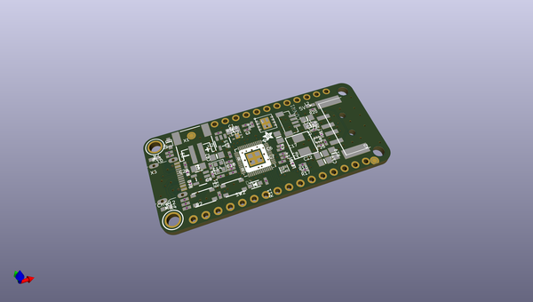
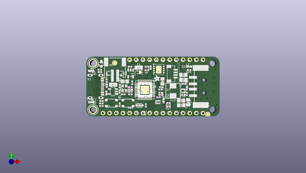
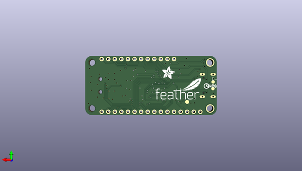

# adafruit_feather_rp2040_usb_host_pcb
 
## summary 
* id: adafruit_adafruit_feather_rp2040_usb_host_pcb_adafruit_feather_rp2040_usb_host
* user: adafruit
* name: adafruit_feather_rp2040_usb_host_pcb
* board: adafruit_feather_rp2040_usb_host
* repo: https://github.com/adafruit/Adafruit-Feather-RP2040-USB-Host-PCB

* src_file_repo_sch: 
* src_file_repo_sch_link: https://github.com/adafruit/Adafruit-Feather-RP2040-USB-Host-PCB/tree/main/
* full details link: https://github.com/oomlout/oomlout_oomp_project_bot_v_2/tree/main/projects/adafruit_adafruit_feather_rp2040_usb_host_pcb_adafruit_feather_rp2040_usb_host/current_version/working  

## schematic  
  
[schematic (pdf)](working_schematic.pdf) 

## pcb  
 
  
  
  
[board (pdf)](working.pdf)  

## working_bom
| Id | Designator | Footprint | Quantity | Designation | Supplier and ref |  | None | 
| --- | --- | --- | --- | --- | --- | --- | --- | 
| 1 | U$35,U$34 | FIDUCIAL_1MM | 2 | FIDUCIAL_1MM |  |  | [''] | 
| 2 | PLABEL17 | PLABEL17 | 1 |  |  |  | [''] | 
| 3 | PLABEL11 | PLABEL11 | 1 |  |  |  | [''] | 
| 4 | PLABEL1 | PLABEL1 | 1 |  |  |  | [''] | 
| 5 | C21,C19,C22 | 0805-NO | 3 | 22uF |  |  | [''] | 
| 6 | C8,C15,C10,C17,C11 | _0402NO | 5 | 1uF/25V |  |  | [''] | 
| 7 | L2 | CHIPLED_0603_NOOUTLINE | 1 | GREEN |  |  | [''] | 
| 8 | PLABEL9 | PLABEL9 | 1 |  |  |  | [''] | 
| 9 | C9,C6,C27,C14,C18,C26,C7,C12,C13 | _0402NO | 9 | 0.1uF |  |  | [''] | 
| 10 | LED1 | SK6805_1515 | 1 | WS2812B_SK6805_1515 |  |  | [''] | 
| 11 | C3,C2 | _0402NO | 2 | 22pF |  |  | [''] | 
| 12 | PLABEL19 | PLABEL19 | 1 |  |  |  | [''] | 
| 13 | PLABEL0 | PLABEL0 | 1 |  |  |  | [''] | 
| 14 | U3 | SOT23-5 | 1 | MCP73831T-2ACI/OT |  |  | [''] | 
| 15 | PLABEL5 | PLABEL5 | 1 |  |  |  | [''] | 
| 16 | R8,R12,R13 | _0402NO | 3 | 5.1K |  |  | [''] | 
| 17 | PLABEL16 | PLABEL16 | 1 |  |  |  | [''] | 
| 18 | Y1 | CRYSTAL_2.5X2 | 1 | 12MHz/12pF |  |  | [''] | 
| 19 | R11,R6 | _0402NO | 2 | 1K |  |  | [''] | 
| 20 | PLABEL14 | PLABEL14 | 1 |  |  |  | [''] | 
| 21 | PLABEL15 | PLABEL15 | 1 |  |  |  | [''] | 
| 22 | PLABEL22 | PLABEL22 | 1 |  |  |  | [''] | 
| 23 | R19 | 0805-NO | 1 | FUSE |  |  | [''] | 
| 24 | R20,R5,R3,R1,R7,R4,R2 | _0402NO | 7 | 10K |  |  | [''] | 
| 25 | U1 | USON8_4X4 | 1 | 8MB QSPI |  |  | [''] | 
| 26 | X2 | USB_HOST-SMT | 1 | USB A |  |  | [''] | 
| 27 | PLABEL7 | PLABEL7 | 1 |  |  |  | [''] | 
| 28 | R17,R10,R18,R9 | _0402NO | 4 | 22 ohm |  |  | [''] | 
| 29 | X1 | JSTPH2_BATT | 1 | JSTPH |  |  | [''] | 
| 30 | PLABEL30 | PLABEL30 | 1 |  |  |  | [''] | 
| 31 | SW2,SW1 | BTN_RKB2_4.6X2.8 | 2 | RKB2 |  |  | [''] | 
| 32 | PLABEL13 | PLABEL13 | 1 |  |  |  | [''] | 
| 33 | Q3 | DFN2015-3 | 1 | DMG3415UFY |  |  | [''] | 
| 34 | R14,R16 | _0402NO | 2 | 100K |  |  | [''] | 
| 35 | PLABEL27 | PLABEL27 | 1 |  |  |  | [''] | 
| 36 | CONN1 | JST_SH4_RA | 1 | STEMMA_I2C_QTRA |  |  | [''] | 
| 37 | PLABEL3 | PLABEL3 | 1 |  |  |  | [''] | 
| 38 | PLABEL29 | PLABEL29 | 1 |  |  |  | [''] | 
| 39 | PLABEL18 | PLABEL18 | 1 |  |  |  | [''] | 
| 40 | PLABEL21 | PLABEL21 | 1 |  |  |  | [''] | 
| 41 | U$43 | ADAFRUIT_2.5MM | 1 |  |  |  | [''] | 
| 42 | PLABEL8 | PLABEL8 | 1 |  |  |  | [''] | 
| 43 | U$32,U$31 | MOUNTINGHOLE_2.5_PLATED | 2 | MOUNTINGHOLE2.5 |  |  | [''] | 
| 44 | L1 | INDUCTOR_5045_SMALLTABS | 1 | 1uH |  |  | [''] | 
| 45 | @HOLE0,@HOLE1 |  | 2 |  |  |  | [''] | 
| 46 | L0 | CHIPLED_0603_NOOUTLINE | 1 | RED |  |  | [''] | 
| 47 | PLABEL12 | PLABEL12 | 1 |  |  |  | [''] | 
| 48 | CHG0 | CHIPLED_0603_NOOUTLINE | 1 | ORANGE |  |  | [''] | 
| 49 | C1,C28,C5,C4,C20 | 0805-NO | 5 | 10uF/16V |  |  | [''] | 
| 50 | PLABEL31 | PLABEL31 | 1 |  |  |  | [''] | 
| 51 | D4 | SOD-323F | 1 | PMEG2020AEA |  |  | [''] | 
| 52 | U2 | SOT23-5 | 1 | RT9080-3.3 |  |  | [''] | 
| 53 | R15 | _0402NO | 1 | 732K |  |  | [''] | 
| 54 | PLABEL4 | PLABEL4 | 1 |  |  |  | [''] | 
| 55 | IC1 | QFN56_7MM_REDUCEDEPAD | 1 | RP2040_QFN56 |  |  | [''] | 
| 56 | PLABEL23 | PLABEL23 | 1 |  |  |  | [''] | 
| 57 | PLABEL28 | PLABEL28 | 1 |  |  |  | [''] | 
| 58 | PLABEL24 | PLABEL24 | 1 |  |  |  | [''] | 
| 59 | IC2 | SOT563 | 1 | TPS61023 |  |  | [''] | 
| 60 | PLABEL6 | PLABEL6 | 1 |  |  |  | [''] | 
| 61 | JP3 | 1X12_ROUND | 1 |  |  |  | [''] | 
| 62 | PLABEL25 | PLABEL25 | 1 |  |  |  | [''] | 
| 63 | PLABEL26 | PLABEL26 | 1 |  |  |  | [''] | 
| 64 | PLABEL2 | PLABEL2 | 1 |  |  |  | [''] | 
| 65 | PLABEL10 | PLABEL10 | 1 |  |  |  | [''] | 
| 66 | JP1 | 1X16_ROUND | 1 |  |  |  | [''] | 
| 67 | X6 | USB_C_CUSB31-CFM2AX-01-X | 1 | USB Type C |  |  | [''] | 
| 68 | PLABEL20 | PLABEL20 | 1 |  |  |  | [''] | 
| 69 | D3 | SOD-323_MINI | 1 | 1N5819 |  |  | [''] | 
| 70 | PLABEL37 | PLABEL37 | 1 |  |  |  | [''] | 
| 71 | U$13 | PCBFEAT-REV-040 | 1 |  |  |  | [''] | 
| 72 | TP3 | TESTPOINT_ROUND_1.5MM_NO | 1 |  |  |  | [''] | 
| 73 | PLABEL36 | PLABEL36 | 1 |  |  |  | [''] | 
| 74 | PLABEL55 | PLABEL55 | 1 |  |  |  | [''] | 
| 75 | PLABEL54 | PLABEL54 | 1 |  |  |  | [''] | 
| 76 | PLABEL33 | PLABEL33 | 1 |  |  |  | [''] | 
| 77 | PLABEL34 | PLABEL34 | 1 |  |  |  | [''] | 
| 78 | PLABEL49 | PLABEL49 | 1 |  |  |  | [''] | 
| 79 | D+1,D-1 | B1,27 | 2 | TPB1,27 |  |  | [''] | 
| 80 | PLABEL45 | PLABEL45 | 1 |  |  |  | [''] | 
| 81 | PLABEL51 | PLABEL51 | 1 |  |  |  | [''] | 
| 82 | PLABEL50 | PLABEL50 | 1 |  |  |  | [''] | 
| 83 | PLABEL52 | PLABEL52 | 1 |  |  |  | [''] | 
| 84 | PLABEL39 | PLABEL39 | 1 |  |  |  | [''] | 
| 85 | PLABEL47 | PLABEL47 | 1 |  |  |  | [''] | 
| 86 | PLABEL40 | PLABEL40 | 1 |  |  |  | [''] | 
| 87 | PLABEL41 | PLABEL41 | 1 |  |  |  | [''] | 
| 88 | U$47 | ADAFRUIT_5MM | 1 |  |  |  | [''] | 
| 89 | PLABEL59 | PLABEL59 | 1 |  |  |  | [''] | 
| 90 | PLABEL38 | PLABEL38 | 1 |  |  |  | [''] | 
| 91 | PLABEL56 | PLABEL56 | 1 |  |  |  | [''] | 
| 92 | PLABEL35 | PLABEL35 | 1 |  |  |  | [''] | 
| 93 | PLABEL46 | PLABEL46 | 1 |  |  |  | [''] | 
| 94 | PLABEL57 | PLABEL57 | 1 |  |  |  | [''] | 
| 95 | PLABEL61 | PLABEL61 | 1 |  |  |  | [''] | 
| 96 | PLABEL53 | PLABEL53 | 1 |  |  |  | [''] | 
| 97 | PLABEL42 | PLABEL42 | 1 |  |  |  | [''] | 
| 98 | PLABEL48 | PLABEL48 | 1 |  |  |  | [''] | 
| 99 | PLABEL44 | PLABEL44 | 1 |  |  |  | [''] | 
| 100 | PLABEL43 | PLABEL43 | 1 |  |  |  | [''] | 
| 101 | U$46 | FEATHERLOGO_MED | 1 |  |  |  | [''] | 
| 102 | PLABEL60 | PLABEL60 | 1 |  |  |  | [''] | 
| 103 | PLABEL62 | PLABEL62 | 1 |  |  |  | [''] | 
| 104 | PLABEL32 | PLABEL32 | 1 |  |  |  | [''] | 
| 105 | PLABEL58 | PLABEL58 | 1 |  |  |  | [''] | 

## bom_schematic
no data

## mounting_holes
| x | y | package | value | ref | size | 
| --- | --- | --- | --- | --- | --- | 
| 0.0 | 17.78 | MOUNTINGHOLE_2.5_PLATED | MOUNTINGHOLE2.5 | U$31 | m3 | 
| 0.0 | 0.0 | MOUNTINGHOLE_2.5_PLATED | MOUNTINGHOLE2.5 | U$32 | m3 | 

