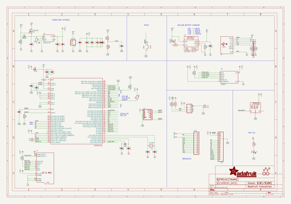
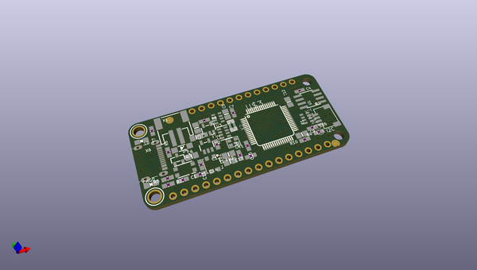
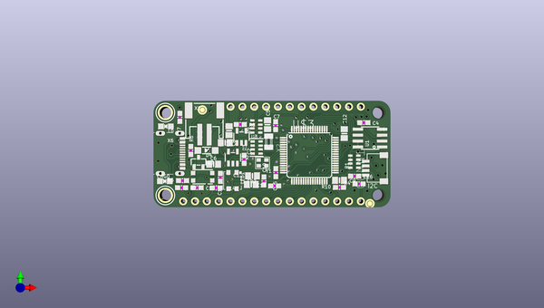
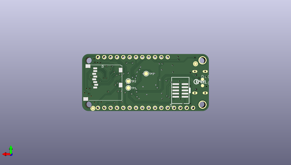

# adafruit_feather_stm32f405_express_pcb
 
## summary 
* id: adafruit_adafruit_feather_stm32f405_express_pcb_adafruit_feather_stm32f405_express
* user: adafruit
* name: adafruit_feather_stm32f405_express_pcb
* board: adafruit_feather_stm32f405_express
* repo: https://github.com/adafruit/Adafruit-Feather-STM32F405-Express-PCB

* src_file_repo_sch: 
* src_file_repo_sch_link: https://github.com/adafruit/Adafruit-Feather-STM32F405-Express-PCB/tree/master/
* full details link: https://github.com/oomlout/oomlout_oomp_project_bot_v_2/tree/main/projects/adafruit_adafruit_feather_stm32f405_express_pcb_adafruit_feather_stm32f405_express/current_version/working  

## schematic  
  
[schematic (pdf)](working_schematic.pdf) 

## pcb  
 
  
  
  
[board (pdf)](working.pdf)  

## working_bom
| Id | Designator | Footprint | Quantity | Designation | Supplier and ref |  | None | 
| --- | --- | --- | --- | --- | --- | --- | --- | 
| 1 | C5 | 0805-NO | 1 | 10uF |  |  | [''] | 
| 2 | R2 | 0603-NO | 1 | 1K |  |  | [''] | 
| 3 | C12,C13,C3,C9,C8,C6 | 0805-NO | 6 | 10µF |  |  | [''] | 
| 4 | L0 | CHIPLED_0805_NOOUTLINE | 1 | RED |  |  | [''] | 
| 5 | C7,C16,C11,C10,C4,C14,C17 | 0603-NO | 7 | 1uF |  |  | [''] | 
| 6 | SW1 | BTN_KMR2_4.6X2.8 | 1 | KMR2 |  |  | [''] | 
| 7 | R5,R8,R6 | 0603-NO | 3 | 5.1K |  |  | [''] | 
| 8 | U1 | SOIC8_150MIL | 1 | 25Q16 |  |  | [''] | 
| 9 | X1 | JSTPH2 | 1 | JSTPH |  |  | [''] | 
| 10 | U$24 | FEATHER_STM32F405_TOP | 1 |  |  |  | [''] | 
| 11 | U2 | SOT23-5 | 1 | AP2112-3.3 |  |  | [''] | 
| 12 | FB2 | 0805-NO | 1 | ferrite |  |  | [''] | 
| 13 | U$32,U$31 | MOUNTINGHOLE_2.5_PLATED | 2 | MOUNTINGHOLE2.5 |  |  | [''] | 
| 14 | Q3 | SOT23-R | 1 | DMG3405 |  |  | [''] | 
| 15 | U$35,U$34,U$37,U$5 | FIDUCIAL_1MM | 4 | FIDUCIAL_1MM |  |  | [''] | 
| 16 | R7 | 0603-NO | 1 | 2.2K |  |  | [''] | 
| 17 | X6 | USB_C_CUSB31-CFM2AX-01-X | 1 |  |  |  | [''] | 
| 18 | JP1 | 1X16_ROUND | 1 |  |  |  | [''] | 
| 19 | R3 | 0603-NO | 1 | 10K |  |  | [''] | 
| 20 | C15,C1 | 0603-NO | 2 | 0.1uF |  |  | [''] | 
| 21 | C2 | RESPACK_4X0603 | 1 | 22pF |  |  | [''] | 
| 22 | JP3 | 1X12_ROUND | 1 |  |  |  | [''] | 
| 23 | CHG0 | CHIPLED_0805_NOOUTLINE | 1 | ORANGE |  |  | [''] | 
| 24 | R4,R10 | 0603-NO | 2 | 100K |  |  | [''] | 
| 25 | Y1 | CRYSTAL_2.5X2 | 1 | 12mhz |  |  | [''] | 
| 26 | CONN1 | JST_SH4 | 1 | STEMMA_I2C_QT |  |  | [''] | 
| 27 | U$3 | TQFP64 | 1 | STM32F405R |  |  | [''] | 
| 28 | R1 | RESPACK_4X0603_NO | 1 | 10K |  |  | [''] | 
| 29 | @HOLE1,@HOLE0 |  | 2 |  |  |  | [''] | 
| 30 | LED1 | LED3535 | 1 | WS2812B3535 |  |  | [''] | 
| 31 | X2 | XTAL3215 | 1 | 32.768 |  |  | [''] | 
| 32 | R9 | RESPACK_4X0603_NO | 1 | 100K |  |  | [''] | 
| 33 | U3 | SOT23-5 | 1 | MCP73831T-2ACI/OT |  |  | [''] | 
| 34 | D4 | SOD-123 | 1 | MBR054 |  |  | [''] | 
| 35 | D+0,D-0 | B1,27 | 2 | TPB1,27 |  |  | [''] | 
| 36 | X5 | MICROSD | 1 |  |  |  | [''] | 
| 37 | TP1,TP3,TP2 | TESTPOINT_ROUND_1.5MM | 3 |  |  |  | [''] | 
| 38 | U$13 | PCBFEAT-REV-040 | 1 |  |  |  | [''] | 
| 39 | U$40 | FEATHER_STM32F405_BOT | 1 |  |  |  | [''] | 
| 40 | X3 | 2X05_1.27MM_SMT | 1 |  |  |  | [''] | 

## bom_schematic
| Ref | Qnty | Value | Cmp name | Footprint | Description | Vendor | DNP | 
| --- | --- | --- | --- | --- | --- | --- | --- | 
| C1, C15 | 2 | 0.1uF | CAP_CERAMIC0603_NO | working:0603-NO |  |  |  | 
| C2 | 1 | 22pF | CAP_4PACK1206 | working:RESPACK_4X0603 |  |  |  | 
| C3, C6, C8, C9, C12, C13 | 6 | 10µF | CAP_CERAMIC0805-NOOUTLINE | working:0805-NO |  |  |  | 
| C4, C7, C10, C11, C14, C16, C17 | 7 | 1uF | CAP_CERAMIC0603_NO | working:0603-NO |  |  |  | 
| C5 | 1 | 10uF | CAP_CERAMIC0805-NOOUTLINE | working:0805-NO |  |  |  | 
| CHG0 | 1 | ORANGE | LED0805_NOOUTLINE | working:CHIPLED_0805_NOOUTLINE |  |  |  | 
| CONN1 | 1 | STEMMA_I2C_QT | STEMMA_I2C_QT | working:JST_SH4 |  |  |  | 
| D4 | 1 | MBR054 | DIODE-SCHOTTKYSOD-123 | working:SOD-123 |  |  |  | 
| D+0 | 1 | TPB1,27 | TPB1,27 | working:B1,27 |  |  |  | 
| D-0 | 1 | TPB1,27 | TPB1,27 | working:B1,27 |  |  |  | 
| FB2 | 1 | ferrite | FERRITE-0805NO | working:0805-NO |  |  |  | 
| JP1 | 1 | HEADER-1X16ROUND | HEADER-1X16ROUND | working:1X16_ROUND |  |  |  | 
| JP3 | 1 | HEADER-1X12 | HEADER-1X12 | working:1X12_ROUND |  |  |  | 
| L0 | 1 | RED | LED0805_NOOUTLINE | working:CHIPLED_0805_NOOUTLINE |  |  |  | 
| LED1 | 1 | WS2812B3535 | WS2812B3535 | working:LED3535 |  |  |  | 
| Q3 | 1 | DMG3405 | MOSFET-P | working:SOT23-R |  |  |  | 
| R1 | 1 | 10K | RESISTOR_4PACK_NO | working:RESPACK_4X0603_NO |  |  |  | 
| R2 | 1 | 1K | RESISTOR_0603_NOOUT | working:0603-NO |  |  |  | 
| R3 | 1 | 10K | RESISTOR_0603_NOOUT | working:0603-NO |  |  |  | 
| R4, R10 | 2 | 100K | RESISTOR_0603_NOOUT | working:0603-NO |  |  |  | 
| R5, R6, R8 | 3 | 5.1K | RESISTOR_0603_NOOUT | working:0603-NO |  |  |  | 
| R7 | 1 | 2.2K | RESISTOR_0603_NOOUT | working:0603-NO |  |  |  | 
| R9 | 1 | 100K | RESISTOR_4PACK_NO | working:RESPACK_4X0603_NO |  |  |  | 
| SW1 | 1 | KMR2 | SWITCH_TACT_SMT4.6X2.8 | working:BTN_KMR2_4.6X2.8 |  |  |  | 
| TP1, TP2, TP3 | 3 | TESTPOINTROUND1.5MM | TESTPOINTROUND1.5MM | working:TESTPOINT_ROUND_1.5MM |  |  |  | 
| U1 | 1 | 25Q16 | SPIFLASH_8PIN | working:SOIC8_150MIL |  |  |  | 
| U2 | 1 | AP2112-3.3 | VREG_SOT23-5 | working:SOT23-5 |  |  |  | 
| U3 | 1 | MCP73831T-2ACI/OT | MCP73831/2 | working:SOT23-5 |  |  |  | 
| U$3 | 1 | STM32F405R | STM32F405R | working:TQFP64 |  |  |  | 
| U$5, U$34, U$35, U$37 | 4 | FIDUCIAL_1MM | FIDUCIAL_1MM | working:FIDUCIAL_1MM |  |  |  | 
| U$31, U$32 | 2 | MOUNTINGHOLE2.5 | MOUNTINGHOLE2.5 | working:MOUNTINGHOLE_2.5_PLATED |  |  |  | 
| X1 | 1 | JSTPH | CON_JST_PH_2PIN | working:JSTPH2 |  |  |  | 
| X2 | 1 | 32.768 | XTAL-3.2X1.5 | working:XTAL3215 |  |  |  | 
| X3 | 1 | JTAG-CORTEX | JTAG-CORTEX | working:2X05_1.27MM_SMT |  |  |  | 
| X5 | 1 | MICROSD | MICROSD | working:MICROSD |  |  |  | 
| X6 | 1 | USB_C | USB_C | working:USB_C_CUSB31-CFM2AX-01-X |  |  |  | 
| Y1 | 1 | 12mhz | CRYSTAL2.5X2.0 | working:CRYSTAL_2.5X2 |  |  |  | 

## mounting_holes
| x | y | package | value | ref | size | 
| --- | --- | --- | --- | --- | --- | 
| 0.0 | 17.78 | MOUNTINGHOLE_2.5_PLATED | MOUNTINGHOLE2.5 | U$31 | m3 | 
| 0.0 | 0.0 | MOUNTINGHOLE_2.5_PLATED | MOUNTINGHOLE2.5 | U$32 | m3 | 

